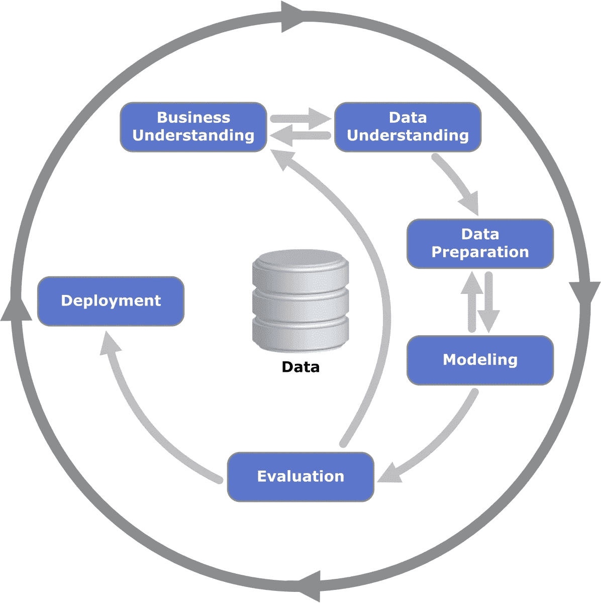

# 数据科学、国际象棋和建模

> 原文：<https://towardsdatascience.com/the-data-science-overlap-with-chess-mental-modeling-9238103843e9?source=collection_archive---------45----------------------->

## 国际象棋如何提高你的数据科学技能

乔治·霍丹的照片，[公共领域](https://www.publicdomainpictures.net/en/view-image.php?image=44722&picture=chess-king)

象棋和数据科学有很多共同点。一些看似表面的相似之处包括冒名顶替综合症和面对压倒性的复杂性和优柔寡断时的无能为力感，所有这些都是在时间紧缩的基础上发生的。

但是，如果我们更仔细地观察，这些直接的相似性掩盖了领域之间真正更深层次的相似性。这些类型的体验通常不来自轻松的爱好:沮丧、复杂、绝望、狂喜、困惑、骄傲和理解是一种追求的标志，这种追求在活动期间及以后全心全意地消耗练习者，而专门研究象棋或数据科学的一生和书籍展示了属于这两者的体验强度。

当然，我们所谓的“数据科学”在历史上一直是简单的旧统计数据，尽管不可否认没有*机器学习*或*深度学习、*的狂热，但经验丰富的数据科学家都非常清楚，通常 A/B 测试或双样本假设测试可以提供比神经网络更多的价值和可理解的洞察力。

这是一个进入国际象棋和数据科学之间的主要基本相似之处的好切入点，即在任一类别中，**经验、模式识别和直觉都是成功的驱动因素**。众所周知，国际象棋大师尤其成功，因为他们通过漫长而密集的经历获得了深刻的模式识别。虽然模式识别的确切解释方面还不清楚(因为只有几十年经验的年轻大师可以战胜有一生经验的老大师)，但很明显，国际象棋比它最初看起来更具贝叶斯性，特别是在围绕国际象棋技能的错误算法态度的背景下。

# 象棋背后的主要技巧

关于国际象棋大师思维的精彩讨论[可以在这里找到](https://www.chess.com/forum/view/chess-players/the-thinking-process-of-a-grandmaster)。虽然模式识别是一个总的主题，但讨论的主要焦点是关于特级大师本身的思维过程。促使一名巅峰状态的特级大师在比赛期间每天燃烧高达 6000 卡路里的典型想法和观察结果是什么？

> 斯坦福大学研究灵长类动物压力的罗伯特·萨波尔斯基(Robert Sapolsky)表示，一名国际象棋选手在比赛中每天可以燃烧高达 6000 卡路里的热量，是普通人一天消耗量的三倍。根据重大比赛之前、之中和之后的呼吸频率(在比赛期间增加两倍)、血压(升高)和肌肉收缩，萨波尔斯基认为，大师对国际象棋的压力反应与精英运动员的经历相当。- [艾西瓦娅·库马尔](https://www.espn.com/espn/story/_/id/27593253/why-grandmasters-magnus-carlsen-fabiano-caruana-lose-weight-playing-chess)

答案是**没有深入的算法思维**。有一种神话认为，国际象棋大师是人类计算机，不知何故能够多线程处理，并以远高于其他人类的规模处理超人的精神排列。

即使是超级计算机也没有解决象棋问题，因为可能的象棋游戏数量的下限是由 10 个⁰描述的，这是象棋的博弈树复杂性，也称为[香农数](https://en.wikipedia.org/wiki/Shannon_number)。就排列处理而言，即使是展望未来的 6 或 7 步棋，对国际象棋大师来说也和新手一样困难。

更确切地说，大家一致认为，大师们在发现威胁、总结立场并将其保存在长期记忆中，以及识别来自这些状态的必然路线方面要快得多。

虽然这似乎意味着大师们看到了“更多的未来”，但一旦棋盘上的棋子减少到两个国王和棋子接近皇后晋级，新手同样可以在 4 或 5 步内看到将死。不同之处在于，大师们可以处理更多的复杂性，理解噪音中最重要的信息，并识别他们面前相对较少(通常是被迫的)的选项，有效地将可能的排列减少到一个小得惊人的决策树。重要的一点是，他们并不是更好的排列处理器:他们只是更有能力将复杂的状态简化为不太复杂的状态，然后根据之前对游戏状态和模式识别的经验以及对状态的最高心理表征来做出决定。

据推测，加里·卡斯帕罗夫可以记住“他在过去 6 个月中下的所有棋”，而芒努斯·卡尔森则可以记住 10，000 盘棋，比尔·沃尔的一篇文章似乎证实了长期记忆在国际象棋中的解释意义。

这些与数据科学有什么关系？

**因为在数据科学中，这个过程的大部分被称为建模**！STEM 的词汇通常是有限的，因为它是有用的，虽然*建模*与*统计*模型有特定的内涵，但建模的过程几乎是相同的。

虽然我们经常想到 Python 中的线性回归或随机森林模型，使用 sklearn 和 fit 在一组 numpy 数组上构建，但基于上下文的特征工程、对数转换、清理和输入空值以及可视化数据以更深入地理解数据的实际过程都利用了相同的技能，出于相同的目的，就像一位大师盯着棋盘一个小时燃烧卡路里一样:**以改进预测并在直观的层面上获得对数据的更大范围的理解**。这种更大范围的知识通常被称为“领域知识”或“业务理解”，或科学背景下的理论理解，并符合数据挖掘的跨行业标准流程，或 CRISP-DM:

Kenneth Jensen 的 CRISP-DM，[知识共享](https://en.wikipedia.org/wiki/File:CRISP-DM_Process_Diagram.png)

除此之外，在国际象棋中，我们可能会将这第一步描述为“游戏状态理解”，对颜色的深入而直观的理解——分别接近将死，或**优势，**，这可以通过[平均厘泊损失](https://lichess.org/faq#acpl)或计算机确定的游戏强度来粗略衡量。CRISP-DM 中的“部署”步骤类似于实际的国际象棋移动。

虽然*统计建模*忽略了国际象棋大师思维过程的内涵，但步骤的意图和流程惊人地相似，特别是建模的“适应”和“预测”步骤如何等同于大师们广为人知的“向前看 20 步”类型的算法处理，而事实上，大部分真正的技能来自长期记忆、模式识别、对问题的上下文理解以及思维建模的最高敏捷性和精确度。

我相信对于一个有抱负的数据科学家来说，国际象棋可以是一个有价值的时间应用，因为它不仅对个人有益，而且丰富了数据科学家的技能。

而且，很好玩。感谢阅读！