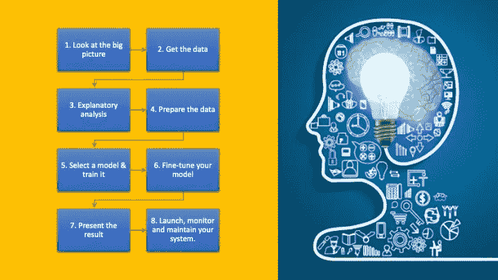
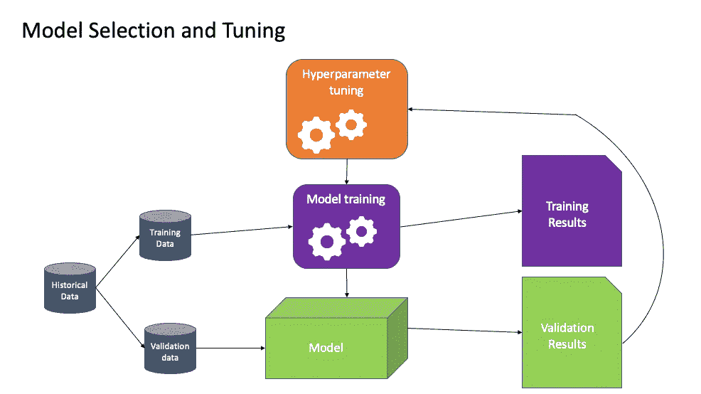

# 数据科学流程—成功项目的 8 个步骤

> 原文：<https://towardsdatascience.com/the-data-science-process-8-steps-to-a-successful-project-84891a18004?source=collection_archive---------15----------------------->

当谈到数据科学项目时，对于完成数据科学项目的必要步骤有一种不清楚的感觉。在本文中，我将讨论每个数据科学家需要经历的 8 个主要步骤。我第一次从事数据科学项目时，对完成一个完整的分析需要什么没有清晰的认识。我希望这篇文章能让那些刚接触数据科学并希望有一个循序渐进的项目计划的人生活得更轻松。对于那些更有经验的人来说，我很想在评论区听到你对数据科学项目的最佳方法的想法。你会做些不同的事情吗？

# 8 个主要步骤

作者图片

拿起你最喜欢的热饮，让我们开始吧。我将指导你完成每一步，让你尽可能简单地从头到尾理解项目生命周期的每一部分。

# **1。看大图**

由[玛丽·莱扎瓦](https://unsplash.com/@marilezhava?utm_source=unsplash&utm_medium=referral&utm_content=creditCopyText)在 [Unsplash](https://unsplash.com/s/photos/loop?utm_source=unsplash&utm_medium=referral&utm_content=creditCopyText) 上拍摄的照片

许多人认为第一步是马上获得数据。然而，在我们到达那个阶段之前，我们首先需要对我们真正想要解决的问题有一个清晰的认识。你应该经常问你自己和你老板的第一个问题是我们实际上想要解决什么问题，这个项目的目标到底是什么。我们需要问自己，这个项目的最终接受者将如何使用和利用我们的项目。在你继续下一步之前，这是一个非常关键的问题。问自己这个问题的重要性不可低估。询问我们项目的原因和目的将引导您回答以下问题:

*   我该如何解决这个问题。
*   我要选择什么算法。
*   为了评估我的模型，我需要什么样的绩效评估？
*   我应该付出多少努力来修改和调整我的模型，使其性能更好。

假设我们正在做一个项目，其主要目标是创建一个模型来估计某个特定城市的房价。让我们以加州圣何塞为例，因为那里的价格高得离谱。一旦你收集了所有的信息，并且清楚地理解了你的任务，就到了设计你的系统的时候了。

问问你自己，我将如何设计我正在处理的问题。是有监督的，无监督的，还是强化学习？问题有没有可能是分类问题，回归任务或者别的什么？我应该使用什么技巧。我不打算解释上述每种学习技巧的含义，但是你应该知道它们，我强烈建议你查看这个链接，这样你就能更好地理解它们的区别。

 [## 什么是机器学习:关于监督，无监督，半监督和…

### 一篇关于什么是机器学习的短文:监督、非监督、半监督和强化学习

towardsdatascience.com](/what-is-machine-learning-a-short-note-on-supervised-unsupervised-semi-supervised-and-aed1573ae9bb) 

在我们的例子中，我们正在处理一个典型的回归任务，因为我们试图预测一个值。我们可以使用多种功能吗？如果是这样的话，我们的任务将是一个多元回归问题，如果你有更多关于圣何塞住房市场的信息，你可以确定它是否受到监管。

接下来，我们需要选择一个性能指标。回归问题的典型性能度量是均方根误差(RMSE)。当您将实际值与预测值进行比较时，RMSE 会让您了解模型的误差有多大。之后，与你的团队和老板一起检查假设是一个好的实践和习惯，以确保每个人都在同一页上，以避免未来的沟通失误。

# 2.获取数据

米卡·鲍梅斯特在 [Unsplash](https://unsplash.com/s/photos/csv?utm_source=unsplash&utm_medium=referral&utm_content=creditCopyText) 上的照片

现在是时候找到解决问题所需的数据集了。你如何为你的问题收集数据？当然，这取决于项目。

*   日志、数据库:如果你幸运的话，一些公司已经在一些数据库中收集数据。如今，您可能面临的不同类型的数据库通常是 PostgreSQL、Oracle 或 MongoDB。所以一定要了解你的 MySQL，PostgreSQL 或者 MongoDB。
*   网络报废:你的公司可能没有数据库。我建议你做的下一件事是从网上搜索和收集你的数据。我推荐使用的一个网络抓取工具是 BeautifulSoup。如果您还没有听说过这个工具，我强烈推荐这篇文章来更好地了解它。

 [## 用 Python 用美汤刮网

### 用 Python 在五分钟内学会网络抓取

medium.com](https://medium.com/technofunnel/web-scraping-with-python-using-beautifulsoup-76b710e3e92f) 

*   数据 Api:接下来，如果您没有上述任何一项，您会发现自己处于这样一种情况，企业拥有您正在寻找的数据。为了获得这些数据，你需要注册，很可能还要付费。一旦你找到了那个业务，你将被要求进行一个 API 调用。
*   公共数据集:最后但并非最不重要的是，总是有使用公共数据集的传统方式，如 Kaggle，UCI 机器学习等。

一旦你花了几个小时和几天来完成你的数据集，是时候进入下一步了。

# 3.探索性分析

照片由 [Pexels](https://www.pexels.com/photo/chart-close-up-data-desk-590022/?utm_content=attributionCopyText&utm_medium=referral&utm_source=pexels) 的 [Lukas](https://www.pexels.com/@goumbik?utm_content=attributionCopyText&utm_medium=referral&utm_source=pexels) 拍摄

是时候挖掘你的数据，并使之有意义了。在这个阶段，你应该了解你的日期设置。发现一些有趣的见解或观察，并将你的发现可视化。对于这一步，我强烈建议你熟悉熊猫。在我看来，Pandas 是操纵和探索您的数据的最佳工具。如果我们回头看看我们的房价例子，我会注意我认为相关的数据集的不同特征。首先使用 pandas，确保将您的数据转换为 Pandas 数据框。您可以使用 describe()方法，该方法给出每个数字属性的摘要。此外，我会使用 Matplotlib 来可视化你的情节。在 python 中如何使用它非常简单。对于我们的例子，我将为每个数值绘制直方图，以便更好地理解分布。寻找不同变量的相关性，以更好地了解哪些变量与你的目标值更相关。这些只是我给你的一些想法，让你更好地理解这一步是怎么回事。在一天结束时，您希望在继续工作并开始处理数据之前对数据有一个很好的了解。

# 4.数据清理

JESHOOTS.COM 在 [Unsplash](https://unsplash.com/s/photos/cleaning?utm_source=unsplash&utm_medium=referral&utm_content=creditCopyText) 上[拍照](https://unsplash.com/@jeshoots?utm_source=unsplash&utm_medium=referral&utm_content=creditCopyText)

我们首先着眼于大局，定义我们的问题，找到我们的数据集，探索我们的数据，并希望找到一些有趣的观察结果。现在是时候把手弄脏，为一个机器学习算法清理数据了。根据福布斯杂志，数据科学家花 60%的时间清理和准备他们的数据。这绝对是数据科学项目生命周期中最耗时的部分。

 [## 调查显示，清理大数据:最耗时、最不愉快的数据科学任务

### 数据科学家的一项新调查发现，他们把大部分时间花在按摩上，而不是挖掘数据或为数据建模…

www.forbes.com](https://www.forbes.com/sites/gilpress/2016/03/23/data-preparation-most-time-consuming-least-enjoyable-data-science-task-survey-says/#30ace12e6f63) 

那么这一步需要什么呢？这些步骤是为了让我们“清理”和过滤数据，以最适合我们的方式将数据传递给机器学习算法。一位早期的 IBM 程序员兼讲师 George Fuechsel 曾经说过:

> “垃圾进，垃圾出”(GIGO)

上面的引用完全有道理。如果数据不重要并且没有经过过滤，那么你的项目结果将变得毫无意义。准备数据的最好方法是编写函数，而不是手动编写。这有几个原因:

*   使您将来可以更容易地在新的数据集上重现转换。
*   随着您从事更多的项目，您将逐渐构建一个数据清理函数库，这对您将来会非常方便。
*   您也可以在实时系统中使用这些功能。在将数据输入算法之前，你要对其进行转换。
*   拥有不同的转换函数可以让你更加灵活。您可以尝试不同的转换，看看哪些组合最适合您的项目。

在现实世界中，你将会处理超级混乱的数据集。你会有缺失的价值观，你必须找到一个解决方案来处理这种情况。对于缺失值，您有三种选择:

*   去掉整列。
*   摆脱那一排。
*   将这些值设置为某个值(零、中值、平均值等)。)

此外，您可能需要拆分、合并和提取列。你甚至可能不得不分割你的数据。回到我们的多元线性回归示例，我们尝试预测圣何塞的房价，我会考虑将我的数据分成测试集和训练集。您可能还需要转换数据。例如，特征缩放是最重要的变换之一。如果数据的数字属性具有不同的比例，模型将无法很好地运行。这些只是你在这一步会遇到的一些例子。不一定是最享受的部分，但却是非常重要的一步。永远记住。*“垃圾进，垃圾出”。*

在我进入下一步之前。步骤 3 (ExploratoryAnalysis)和步骤 4(数据清理)有时会同时进行。您可以首先开始清理数据，然后进行分析以找到一些见解。您可以找到一些东西，理解它，如果有必要，您可能会决定清理它并继续探索数据。说到第 3 步和第 4 步，没有固定的顺序。

# 5.选择一个模型并训练它

作者图片

这是真正的乐趣开始和奇迹发生的阶段。到目前为止，我们已经完成了所有实质性的工作。您已经定义了问题，收集了数据，分析并清理了问题。现在，您可以选择并训练一个机器学习模型了。

现在回到我们的圣何塞房价模型的例子。在第一步中，我们定义了我们的问题，并得出结论，我们将处理一个回归模型，因为我们将预测一个数值。我们还说过，回归问题的典型性能度量是均方根误差(RMSE)。您应该使用 Python 或 R 来选择模型。如果你使用 python，你一定要学习如何使用 Scikit-Learn，这是一个免费的 Python 机器学习库。如果你有兴趣了解这个库的更多信息，我强烈推荐你查看下面的链接。

 [## Scikit Learn 初学者指南—在逻辑回归中实施 Scikit Learn

### Scikit Learn 上的这篇博客将通过一个用例向您概述这个 Python 机器学习库。

medium.com](https://medium.com/edureka/scikit-learn-machine-learning-7a2d92e4dd07) 

对于那些使用 R 的人，你可以使用名为 Caret 的库。

 [## 插入符号包

### 软件包(分类和回归训练的缩写)是一组功能，试图简化分类和回归训练

topepo.github.io](https://topepo.github.io/caret/) 

当您开始选择模型时，首先使用训练集训练您的特定模型，并使用您的性能指标评估它的表现。假设你的模型表现不好，你对分数不满意。你认为你下一步应该做什么？你可以继续尝试使用交叉验证来训练你的模型。在交叉验证中，您只需将训练集分成一个较小的训练集和一个验证集。之后，在较小的训练集上训练您的模型，并根据验证集对它们进行评估。有道理？实现起来并不困难，而且可以很快完成。在 Scikit Learn 中，您必须使用 train_test_split 函数。接下来，如果你使用了交叉验证，仍然对你的评估分数不满意，我会继续尝试另一个模型。您已经尝试了回归模型(使用和不使用交叉验证)，现在您可以继续尝试决策树模型或随机 forrest 回归模型。不管你用什么模型，你都要遵循同样的步骤。你训练你的模型并评估它。

# 6 微调你的模型

照片由[数码 Buggu](https://www.pexels.com/@digitalbuggu?utm_content=attributionCopyText&utm_medium=referral&utm_source=pexels) 从 [Pexels](https://www.pexels.com/photo/colorful-toothed-wheels-171198/?utm_content=attributionCopyText&utm_medium=referral&utm_source=pexels) 拍摄

在使用训练集训练您的不同模型并对它们进行评估之后，您现在有了一个您认为可能是您最终选择的模型的简短列表。假设您有线性回归模型、决策树模型和随机森林模型作为候选模型。你现在需要对它们进行微调，并对它们中的每一个给予额外的关注。微调我们模型的一种方法是手动调整超参数，直到找到最佳组合。检查每个可能的组合可能会非常耗时。谢天谢地，有图书馆为你做这项工作。这种类型的微调技术被称为网格搜索，Scikit Learn 具有网格搜索功能，可以为您完成这项工作。您可以在 RandomForestRegressor 模型上应用此函数，它将返回最佳组合。另一种微调技术叫做随机搜索。在这种微调技术中，这种技术不是尝试每一种可能的组合，而是通过在每次迭代中为每个超参数选择一个随机值来评估给定数量的随机组合。还有许多其他的微调技术，每种技术都有其优缺点，所以您应该研究一下，看看哪种技术更适合您的系统。在对你的模型进行一段时间的调整后，你应该有一个表现良好的模型，你应该在测试集上对它进行评估。

# 7 展示结果

凯文·Ku 在 [Unsplash](https://unsplash.com/s/photos/machine-learning?utm_source=unsplash&utm_medium=referral&utm_content=creditCopyText) 上的照片

你已经完成了所有的艰苦工作，你终于到了最重要的阶段。对于数据科学家来说，能够以一种有效且简单的方式向技术或非技术受众展示他们的结果并解释他们的数据是至关重要的。还记得您定义问题的项目生命周期的第一步吗？在这个阶段，你要回答这个商业问题。在展示您的解决方案时，您应该关注以下几点:

*   你学到了什么？
*   哪些有效，哪些无效？
*   做了哪些假设？
*   你的系统的局限性是什么？
*   你的最终建议是什么？

你应该以一种专业的方式记录每一件事，并有清晰的视觉效果，这样观众就容易理解。

# 8 启动监视器并维护您的系统

照片由来自 [Pexels](https://www.pexels.com/photo/black-and-white-business-chart-computer-241544/?utm_content=attributionCopyText&utm_medium=referral&utm_source=pexels) 的 [Lorenzo](https://www.pexels.com/@lorenzocafaro?utm_content=attributionCopyText&utm_medium=referral&utm_source=pexels) 拍摄

我们正处于项目的最后阶段。你粉碎了演示，你得到了批准推出！在这个阶段，您需要编写测试来确保您的系统运行良好。您还需要添加监控代码来检查您的系统如何实时运行。最后但并非最不重要的是，您要确保使用新数据定期训练您的模型。与其手动训练，我建议你尽可能自动化这个过程。如果你不经常训练它，随着时间的推移，你的模型可能表现不好。

# **结论**

我希望这篇文章能让您对数据科学项目的生命周期有一个很好的了解。如上所述，步骤 3(探索性分析)和步骤 4(数据清理)有时会同时进行，并且没有固定的顺序。我在下面再次写下这些步骤，这样你就可以通读它们，让它们真正深入人心，这样下次你就有一个好主意，知道从哪里开始，目标是什么。

*   看大局。
*   获取数据。
*   探索性分析。
*   数据清理。
*   选择一个模型并训练它。
*   微调你的模型。
*   呈现结果。
*   启动监视器并维护您的系统。

请在下面的评论区告诉我你的想法。你会做一些不同的事情，尝试不同的方法吗？您能先关注探索性分析部分(步骤 3)，然后进入数据清理(步骤 4)部分吗？对于那些希望看到我按照这些步骤进行的项目的人，请查看我的最后一个项目，并一直向下滚动到第 4 部分。

 [## 使用时间序列分析(ARIMA 模型)预测 Covid19 死亡人数

### 执行摘要:

medium.com](https://medium.com/the-innovation/predicting-number-of-covid19-deaths-using-time-series-analysis-arima-model-4ad92c48b3ae) 

我希望你喜欢这篇文章，并学到一些新的东西。如果你喜欢它，如果你能在推特或脸书上分享它，我会非常感激。谢谢，下次再见！:)

 [## 纳维德·马辛奇作品集

### 我是 Navid Mashinchi，是加利福尼亚州萨克拉门托的一名数据科学家。我一直在分析领域工作…

www.navidma.com](https://www.navidma.com/)