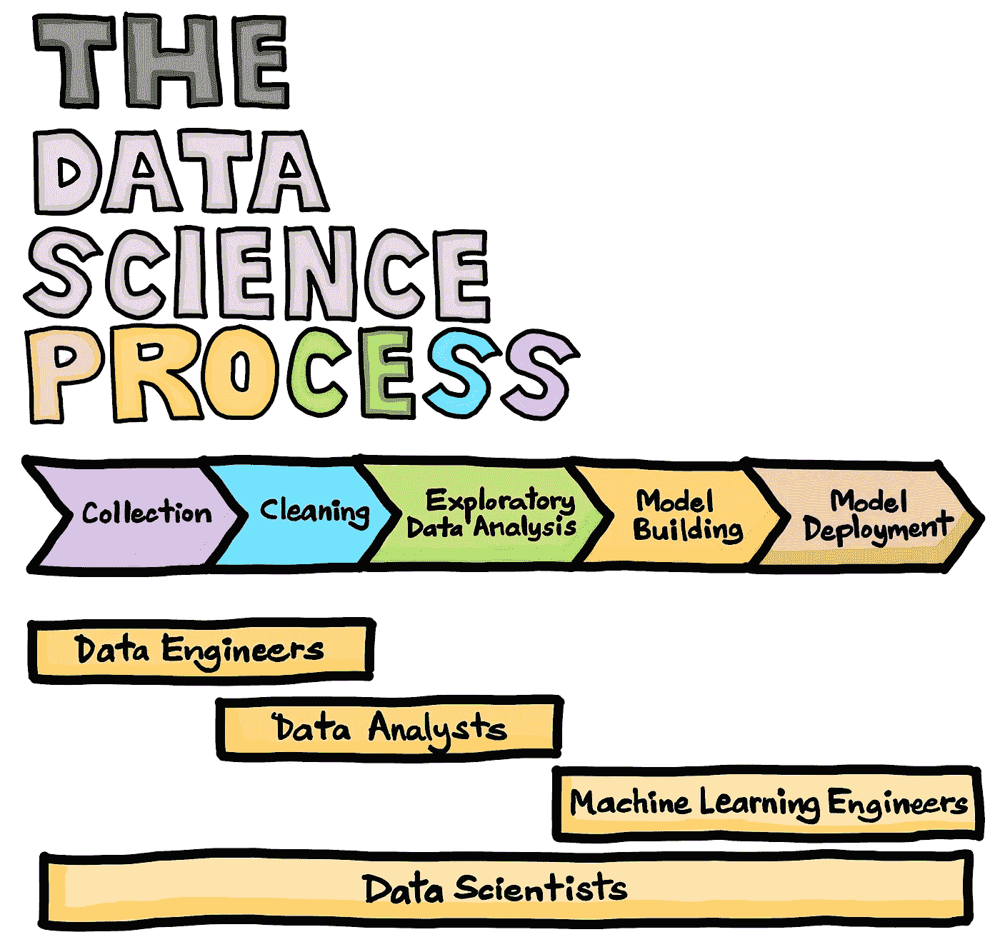
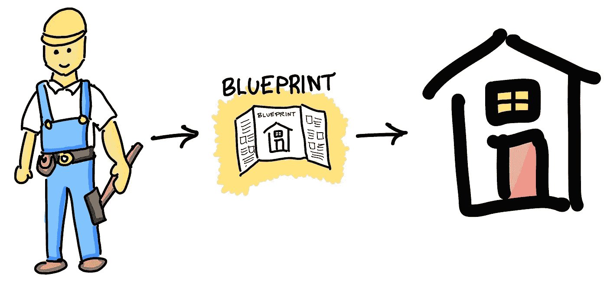
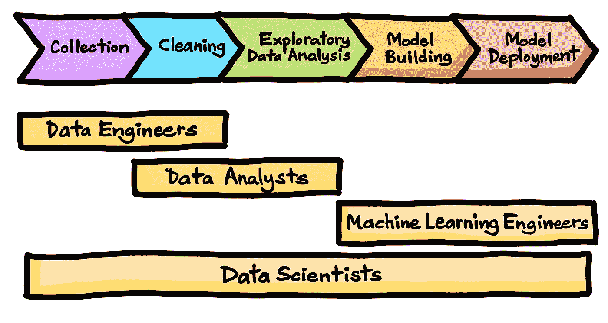
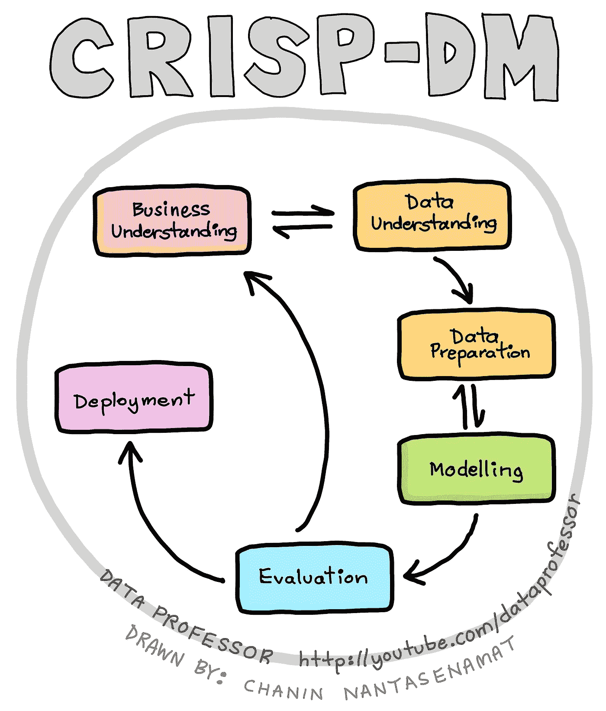
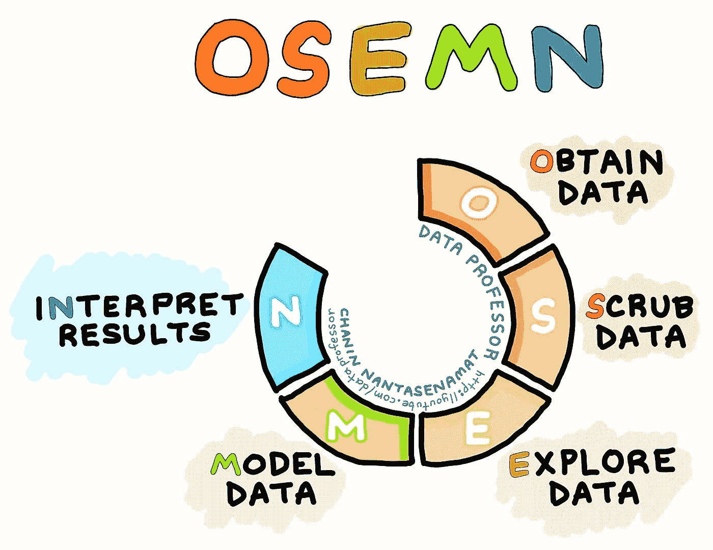

# 数据科学过程

> 原文：<https://towardsdatascience.com/the-data-science-process-a19eb7ebc41b?source=collection_archive---------5----------------------->

**数据科学生命周期。**(由 Chanin Nantasenamat 与 Ken Jee 合作绘制)

## [数据科学](https://medium.com/tag/data-science)

## 数据科学中标准程序的可视化指南

L 假设你有一个要解决的数据问题，你希望从给你的数据中产生独特的见解。所以问题是，你到底要怎么做才能把一个数据问题转化成完整的问题，并产生数据驱动的洞察力？最重要的是，你从哪里开始？

让我们在这里打个比方，在建造房子或建筑物时，所使用的指导性信息就是蓝图。那么这些蓝图中包含了什么样的信息呢？与建筑基础设施、每个房间的布局和确切尺寸、水管和电线的位置等相关的信息。

从我们之前停止的地方继续，那么当出现数据问题时，我们从哪里开始呢？这就是*数据科学流程*的用武之地。正如将在本文后面的章节中讨论的，数据科学过程提供了一种处理数据问题的系统方法。通过遵循这些推荐的指南，您将能够在处理数据科学项目时利用可靠的工作流。所以事不宜迟，我们开始吧！

# 数据科学生命周期

*数据科学生命周期*主要由数据收集、数据清理、探索性数据分析、模型构建和模型部署组成。有关更多信息，请查看 [Ken Jee](https://www.youtube.com/channel/UCiT9RITQ9PW6BhXK0y2jaeg) 关于 [*不同数据科学角色的精彩视频(由数据科学家讲解)*](https://www.youtube.com/watch?v=BZFfNwj7JhE) 。此生命周期的摘要信息图如下所示:

**数据科学生命周期。**(由 Chanin Nantasenamat 与 Ken Jee 合作绘制)

CRISP-DM 和 OSEMN 很好地描述了从数据中提取洞察力的流程或工作流。应该注意的是，两者都包含了基本相同的核心概念，而每个框架都是在不同的时间发布的。特别是，CRISP-DM 是在数据挖掘开始流行的时候(1996 年)发布的，当时缺少一个以健壮的方式执行数据挖掘任务的标准协议。14 年后(2010 年)，OSEMN 框架出台，它总结了数据科学家的主要任务。

就我个人而言，我在 2004 年开始了自己的数据世界之旅，当时这个领域被称为数据挖掘。当时的重点是将数据转化为知识，另一个常用术语也指数据挖掘，即数据中的*知识发现*。

多年来，该领域已经成熟并发展到包含其他技能组合，这最终导致了术语*数据科学*的诞生，它不仅仅是构建模型，还包含其他技术和软技能组合。之前，我绘制了一个信息图，总结了数据科学的 8 项基本技能，如下所示。此外，请查看随附的 YouTube 视频 [*如何成为数据科学家(所需的学习路径和技能)*](https://www.youtube.com/watch?v=jhImgx8I8oI) 。

**数据科学的 8 项技能。**(由 Chanin Nantasenamat 绘制)

# CRISP-DM

缩写 CRISP-DM 代表用于数据挖掘的跨行业标准过程，并且 CRISP-DM 在 1996 年被引入，以努力标准化数据挖掘(也称为数据中的知识发现)的过程，使得它可以作为可以在各种行业中采用和应用的标准和可靠的工作流。这种标准流程可以作为一种*【最佳实践】*来使用，它有很多好处。

除了提供在执行数据挖掘项目时可以遵循的可靠和一致的过程之外，它还会给希望在他们的组织中采用数据挖掘的客户和利益相关者注入信心。

应该指出的是，早在 1996 年，数据挖掘刚刚开始获得主流关注，处于早期阶段，制定标准流程将有助于为早期采用者奠定坚实的基础。Wirth 和 Hipp (2000 年)的文章提供了 CRISP-DM 更深入的历史研究。

**根据 CRISP-DM 框架执行数据挖掘的标准流程。**(由 Chanin Nantasenamat 绘制)

**CRISP-DM 框架**由 6 个主要步骤组成:

1.  ***业务理解***——这需要从业务的角度理解项目的目标和需求。这种业务观点被用于通过使用数据挖掘来找出要解决的业务问题。
2.  ***数据理解*** —这个阶段让我们熟悉数据，这包括执行探索性的数据分析。这种初始数据探索可以允许我们找出哪些数据子集用于进一步建模，以及帮助生成要探索的假设。
3.  ***数据准备*** —这可以被认为是数据挖掘过程中最耗时的阶段，因为它涉及到严格的数据清理和预处理以及丢失数据的处理。
4.  ***建模*** —预处理后的数据用于建模，其中学习算法用于执行多元分析。
5.  **如果认为合适，可能需要再次执行一些步骤。冲洗并重复。一旦认为结果和流程令人满意，我们就可以开始部署了。此外，在这个评估阶段，一些发现可能会激发新的项目想法来探索。**

# **OSEMN**

**在 2010 年数据学家博客上的一篇文章*中，希拉里·梅森和克里斯·维金斯介绍了 OSEMN 框架，该框架基本上构成了数据科学家通常执行的一般工作流程的分类，如下图所示。2012 年后不久，达文波特和帕蒂尔在《哈佛商业评论》上发表了他们的标志性文章 [*【数据科学家:21 世纪最性感的工作】*](https://hbr.org/2012/10/data-scientist-the-sexiest-job-of-the-21st-century) ，这引起了人们对新兴数据科学领域的更多关注。***

******

*****Mason 和 Higgins (2000)在 5 个步骤中描述的数据科学流程称为 OSEMN 框架。**(由 Chanin Nantasenamat 绘制)***

*****OSEMN 框架**由 5 个主要步骤组成，可总结如下:***

1.  ******获取数据*** —数据构成了数据科学过程的必要条件，数据可以来自预先存在的数据或新获取的数据(来自调查)、新查询的数据(来自数据库或 API)、从互联网下载的数据(例如从 GitHub 等云上可用的存储库)或提取的数据***
2.  ******清理数据*** —清理数据本质上是数据清理，这一阶段被认为是最耗时的，因为它涉及处理丢失的数据，并对其进行预处理以尽可能无错误和一致。***
3.  *****这需要使用描述性统计和数据可视化。*****
4.  ******模型数据*** —在这里，我们利用机器学习算法来努力理解数据并获得对数据驱动的决策至关重要的有用见解。***
5.  ******解释结果*** —这可能是最重要的阶段之一，但也是最没有技术含量的阶段，因为它涉及到通过弄清楚如何简化和总结所有模型构建的结果来实际理解数据。这需要得出有意义的结论，并使可行的见解合理化，这将从本质上允许我们找出下一步的行动路线。例如，影响分类标签的最重要的特征是什么( **Y** 变量)。***

# ***结论***

***总之，我们通过向您展示高度简化的数据科学生命周期以及广受欢迎的 CRISP-DM 和 OSEMN 框架，介绍了数据科学流程。这些框架提供了从端到端处理数据科学项目的高级指导，其中所有内容都包含数据汇编、预处理、探索、建模、评估、解释和部署的相同核心概念。应当注意，这些过程中的流程不是线性的，并且在实践中，流程可以是非线性的，并且可以重复，直到满足令人满意的条件。***

## ***订阅我的邮件列表，获取我在数据科学方面的最佳更新(偶尔还有免费赠品)!***

# ***关于我***

***我是泰国一所研究型大学的生物信息学副教授和数据挖掘和生物医学信息学负责人。在我下班后的时间里，我是一名 YouTuber(又名[数据教授](http://bit.ly/dataprofessor/))制作关于数据科学的在线视频。在我制作的所有教程视频中，我也在 GitHub 上分享 Jupyter 笔记本([数据教授 GitHub 页面](https://github.com/dataprofessor/))。***

*** [## 数据教授

### 数据科学、机器学习、生物信息学、研究和教学是我的激情所在。数据教授 YouTube…

www.youtube.com](https://www.youtube.com/dataprofessor?sub_confirmation=1) 

## 在社交网络上与我联系

✅YouTube:[http://youtube.com/dataprofessor/](http://youtube.com/dataprofessor/)
♇网站:[http://dataprofessor.org/](https://www.youtube.com/redirect?redir_token=w4MajL6v6Oi_kOAZNbMprRRJrvJ8MTU5MjI5NjQzN0AxNTkyMjEwMDM3&q=http%3A%2F%2Fdataprofessor.org%2F&event=video_description&v=ZZ4B0QUHuNc)(在建)
♇LinkedIn:[https://www.linkedin.com/company/dataprofessor/](https://www.linkedin.com/company/dataprofessor/)
♇Twitter:[https://twitter.com/thedataprof](https://twitter.com/thedataprof)
♇Facebook:[http://facebook.com/dataprofessor/](https://www.youtube.com/redirect?redir_token=w4MajL6v6Oi_kOAZNbMprRRJrvJ8MTU5MjI5NjQzN0AxNTkyMjEwMDM3&q=http%3A%2F%2Ffacebook.com%2Fdataprofessor%2F&event=video_description&v=ZZ4B0QUHuNc)
♇github:[https://github.com/dataprofessor/](https://github.com/dataprofessor/)
♇insta gram:***