# 从业者逻辑回归理论

> 原文：<https://towardsdatascience.com/the-data-scientists-field-guide-to-logistic-regression-part-1-intuition-97084b11bd68?source=collection_archive---------20----------------------->

## 数据科学家的关键应用直觉

图片由 geralt / Pixabay 提供

这些是我为数据科学从业者量身定制的关于逻辑回归理论的综合笔记。我解释何时以及为何使用逻辑回归、关键数学理论，以及如何为利益相关者解释模型输出和系数估计。

## 目录

*   **1)什么是逻辑回归？**
*   **2)什么时候应该使用逻辑回归？**
*   **3)我们为什么要使用逻辑回归？**
*   **4)关键的数学直觉**
*   **5)作为 GLM 的逻辑回归**
*   **6)模型假设**

# 1.什么是逻辑回归？

逻辑回归是线性回归模型的一种转换，它允许我们**对二元变量进行概率建模。**它也称为使用 logit-link 的广义线性模型。

# 2.什么时候应该使用逻辑回归？

**当您想要对二进制数据建模时:**逻辑回归是这个用例的首选模型。它模拟了观察值取这两个值之一的概率。(注:模型只预测一个概率，不预测类别。您对决策阈值的选择取决于用例。)

**当你需要类别概率预测时:**而不是像支持向量机那样只需要类别预测。这使您可以衡量模型预测的可信度，并可以调整分类决策阈值。

**当您需要一个可解释的模型时:**当您需要能够解释每个预测因子的影响时，逻辑回归是一个理想的候选模型。预测器的系数通过比值比量化每个要素对模型预测的影响。

**当决策边界是平滑的线性时:**逻辑回归在两个类之间画出平滑的线性决策边界。因此，如果您的类是[线性可分离的](https://aishack.in/tutorials/linear-separability/)(您可以使用 *n - 1* 维来分离 n 维空间中的点)，逻辑回归将执行得非常好。您还可以使用线性支持向量机测试线性可分性。

## **何时不使用逻辑回归**

*   **当你的数据不是线性可分的:**如果你认为是这种情况，可以考虑使用复杂核的支持向量机或者基于树的方法进行分类。
*   **当你的目标主要是绩效时:**逻辑回归是一个相对简单的模型，与更复杂的模型相比，通常表现不佳。如果您的目标主要是预测准确性而不是模型解释，增强树或神经网络可能是更好的选择。

# 3.为什么我们要使用逻辑回归？

我们使用逻辑回归，因为线性回归不适合模拟二元结果。这里有两个原因:

1.  线性模型做出无限的连续预测。在二元分类中，**我们感兴趣的是一个结果发生的概率，所以我们希望预测的范围在 0 和 1 之间。**
2.  用线性模型预测二元结果违反了正态残差的假设，扭曲了对回归系数的推断。

这就是逻辑回归被开发的原因。

# 4.关键数学直觉

## 标准逻辑函数(或 sigmoid 函数)

设 *z* 为定义域为(-∞，∞)的任意连续值。如果你把 *z* 代入 sigmoid 函数，比如

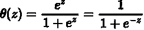

输出的一个很好的特性是它总是在 0 和 1 之间。

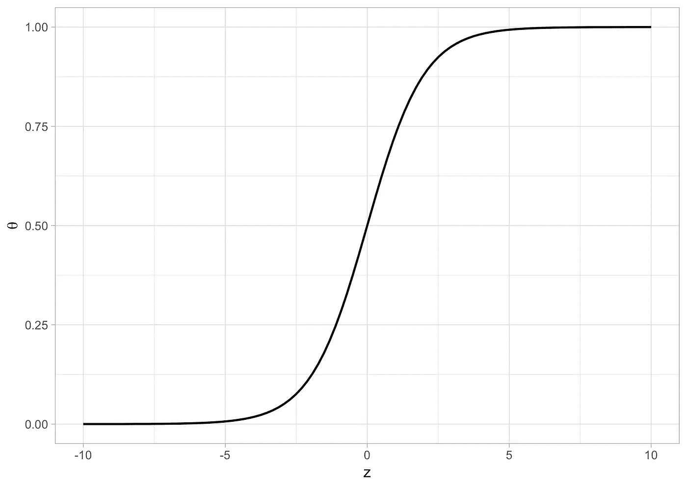

sigmoid 函数图

下面是 *θ* ( *z* )的一些性质:

1.  当 *z =* 0， *θ* = .5 时

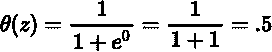

2.当 *z* 很大时， *θ* 约为 1

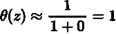

3.当 z 非常小/负时， *θ* 约为 0

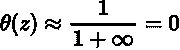

我们可以使用 sigmoid 函数将一个连续的、无界的输出 *z* 转换成一个十进制数 *θ* ∈ (0，1)，这样有利于表示概率。

## 使用 sigmoid 函数将线性回归输出转换为逻辑回归输出

从线性回归到逻辑回归，你可以替换 OLS 输出

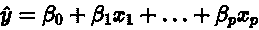

对于 *z* 像这样:

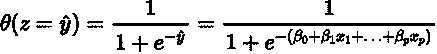

该函数将 OLS 输出重新解释为概率。上面的公式表示逻辑回归模型的输出。

## 逻辑回归的数学性质

我们将通过分离出 *y* 项来研究上面的等式。我们从一些基本的代数开始

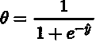

到

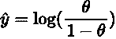

我们可以对上面的 *y* 项的定义进行替换，给出如下:

通过对这个等式的两边求幂，我们还得到下面的等式

**需要了解的术语:**

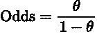

**比值比**指定的比值比被定义为成功的概率与失败的概率之比。这是表示概率的另一种方式，也是解释逻辑回归系数的关键。

比值比为 1 意味着成功的概率等于失败的概率。优势比为 2 意味着成功的概率是失败概率的两倍。0.5 的优势比意味着失败的概率是成功的概率的两倍。

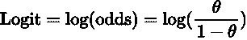

logit 也被称为几率对数。它将概率从(0，1)映射到连续值(-∞，∞)。通过这样做，[它在自变量和伯努利分布之间建立了联系。](/logit-of-logistic-regression-understanding-the-fundamentals-f384152a33d1)

**对这些术语的两个重要观察**

1.  在逻辑回归中，**logit 必须与自变量**的 **线性相关** [**。这由等式 A 得出，其中左侧是 ***x*** 的线性组合。这类似于 OLS 的假设，即 y 与*x 线性相关***](https://datascience.stackexchange.com/questions/12274/what-does-linear-in-parameters-mean)
2.  *如果你把一个自变量 *x_i* 增加 1，**你的胜算增长一倍 *exp(β_i)*** 。这是根据等式 b 得出的。*

***点(2)** 从下面的代数中得出:*

*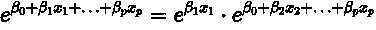*

*假设我们要将 *x_i* 增加 1:*

*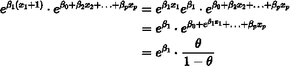*

*那么成功的几率增加**倍 *exp(β_i)* 。***

*重申一下，**在逻辑回归**中， *x_i* 的一个单位变化导致赔率的 exp( *β_i)* 变化。类似地， *x_i* 的一个单位变化导致线性回归中**y 的 *β_i* 变化。***

# *5.作为 GLM 的逻辑回归*

*GLM 的三个部件[是:](https://online.stat.psu.edu/stat504/node/216/)*

*   ***随机成分:**结果变量的概率分布 **Y***
*   ***系统组件:**指定参数 ***η*** 为自变量的线性组合***xβ***:***η*=*xβ****
*   ***链接函数:**一个函数 ***g*** 连接(链接)随机的和系统的组件——具体来说，它链接**E(Y)=*μ*到 ***η*** 如下: **g(μ) = η*****

*在广义线性模型中，逻辑回归中的 Y 遵循二项式分布。在逻辑回归中，链接函数是一个 logit 函数，所以*

*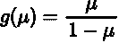*

*和*

*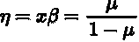*

*这里， *μ* 表示一次试验的二项随机变量的平均值，这是一个伯努利分布。因此 *μ* 就是成功的概率。*

*逻辑回归的随机成分是伯努利随机变量。我强烈推荐你去看看这篇关于 GLM 概念的报道。*

# *6.逻辑回归的假设*

*   ***因变量是二元的:**如果这不是真的，那么逻辑回归输出不适用。*
*   *【logit 和自变量之间的线性:这是从等式 A 得出的——如果不满足这个条件，逻辑回归是无效的。*
*   ***无多重共线性:**多重共线性会扭曲回归系数的统计显著性检验。*
*   ***大样本量:**这更多的是一个经验法则。*

*这里的一个好处是你的数据有一个平衡的类的数量。*

## *不适用于逻辑回归的 OLS 假设*

*   ***因变量和自变量之间的线性***
*   ***正常残差***
*   ***同质性***

**感谢阅读。有想法或反馈？下面评论！**