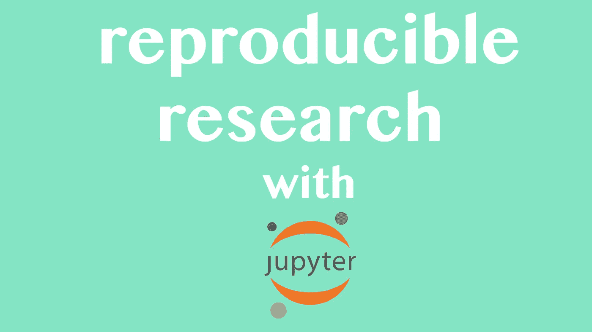

# 数据科学家可重复研究指南

> 原文：<https://towardsdatascience.com/the-data-scientists-guide-to-reproducible-research-ea1a512be3e5?source=collection_archive---------55----------------------->

## 你的假设还是假设！

可生产性研究是科学方法的一个非常重要的元素，但却经常被忽视。无论在给定的时间里，再现性看起来多么微小，它实际上是影响你在任何应用科学领域的研究的最重要的因素之一。这种影响只能通过数据科学来进一步说明，因为一般化的数据经常会导致误导性的结论和错误的理论，弊大于利。

不管你的发现有多突破性；你可能会发现穿聚酯纤维与患绝症直接相关，甚至发现癌症的治疗方法，或者

> 新冠肺炎疫苗。

事实是，如果你设计了一个本质上不可重复的实验，那么你就破坏了从这个实验中获得的观察结果的可靠性。幸运的是，有了科学家(更有甚者是数据科学家)手中掌握的先进技术，让你的研究变得可重复和为人所知比以往任何时候都要容易。

# 笔记本礼仪

Jupyter-Notebook 很可能是最伟大的软件之一，因为它易于计算和复制。对于那些还没有使用 Jupyter-Notebook 的人来说，该软件允许你访问一个运行虚拟内核的服务器，从你的网络浏览器执行单元级代码。这不仅对那些可能在项目上互换工作的大量科学同行来说非常方便，而且在受控的代码爆发中向模仿思想和想法迈出了勇敢的一步，以供其他科学家审查。

我们不要忘记，科学过程中另一个极其重要的步骤是同行评议。人类天生就有偏见。不幸的是，在有数据的地方，也有可能扭曲所述数据，以表现科学家可能有的潜在偏见，不管科学家是否意识到这种情况的发生。老实说，我们都进行了一项测试，我们非常兴奋，不得不做一个大转变…

> 接受空值。

我当然能理解为什么接受空值会令人沮丧。虽然接受零意味着你的科学想法没有通过测试，这是肯定的，但接受零仍然推动科学向前发展，因为现在我们知道，至少在一个场合，它在统计上是不准确的。因此，尽管很难不歪曲研究，但不管你的研究方向如何，这肯定是值得骄傲的事情。

虽然 Jupyter-notebook 是一个非常方便的工具，它肯定会使科学计算尽可能辉煌，但你仍然可以在可重复性上自掘坟墓。因为没有正确地列出你的笔记本。这可以从简单有效地注释你的代码到在 markdown 中写出完整的段落来解释你的想法和科学过程。这显然非常重要，但它可能并不像你认为的那样重要。

无论经验、时间或实践如何，所有人都容易出错。有了同行评议和互联网的力量，你可能忽略的任何错误、数学失误或简单的事情都可以很快被你的同行评估，并有可能完全改变你的研究范围。最重要的是，你的研究可以反过来激励你的科学家同事参与类似的研究，进一步发展你的假设和其他类似的假设。

虽然我当然不喜欢谈论你在某些情况下绝对必须做的事情，但我认为在笔记本之类的东西上工作时，解释你的思路是非常重要的。我个人也喜欢用大标题、段落、结论和推论来分割我的观察。如果你想更进一步，你甚至可以为你的笔记本创建一个目录。如果您有一个包含多个部分的很长的笔记本，这尤其有用。

# 数据

当然，可重复研究的绝对催化剂是数据。

*   你的数据来自哪里？
*   它的来源可靠吗？
*   你的数据是开源的吗？
*   您的同行可以在哪里访问您的数据？
*   你的数据是如何获得的，这种方法可重复吗？

所有这些问题都很容易影响到你的分析性观察是否会被你的同行群体所考虑。数据源很重要，在大多数情况下，理想情况下这些数据源是主要的；意思是与观察直接相关。

虽然让每个人都有一个开放数据政策并分享他们的发现是不可行的，但至少这些发现应该是可重复的和准确的。很难找到不是自己收集的准确数据源，这就是为什么我总是建议从政府那里收集公共资源数据，政府有法律责任将他们的大部分数据发布到公共领域，或者你总是可以从像大学这样的可信来源获得数据。

# 适合这项工作的工具

你工作中的一个巨大的绊脚石可能是在错误的工作中使用了错误的工具。这可能会导致你的研究中潜在的不准确性，这也是为什么研究通常要接受同行评审的原因。这些错误并不一定很难犯，考虑到这一点，我认为避免在工作中使用错误的工具是一个更好的主意。例如，我不想用 t 分布来执行二进制符号测试。这将使测试无用，并产生非常误导性的结果。相反，对于二进制数字，我会使用更适合这种情况的分布，比如二项式分布。

# 结论

虽然许多科学家可能会对可重复研究的概念耸耸肩，但这是一个非常必要的概念。如果研究不容易被复制，那么研究通常会失败。随着现代计算和互联网的力量，可以轻松重复的研究的力量变得更加明显。此外，研究比以往任何时候都更主流，这意味着你的研究往往需要更可信，因为它的范围。幸运的是，在很多情况下，在笔记本和数据组织上做一点额外的工作，可以让你的发现比其他情况下更有结论性和扩展性。