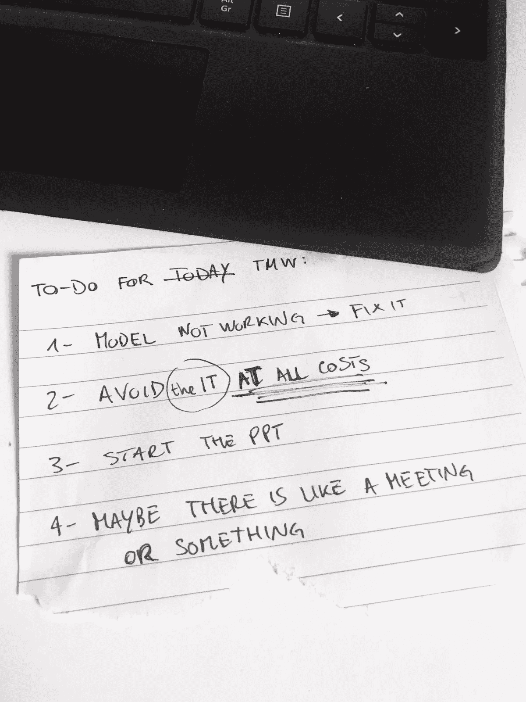
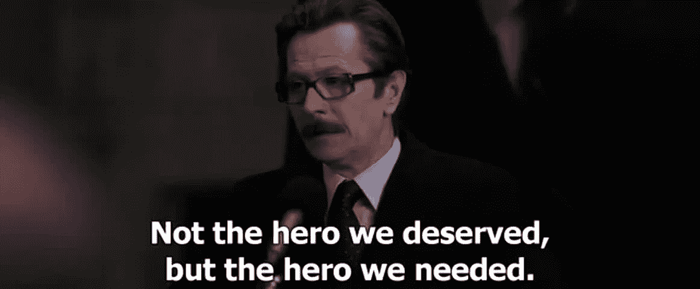

# 数据科学家的故事

> 原文：<https://towardsdatascience.com/the-data-scientists-tale-353237220fe5?source=collection_archive---------16----------------------->

## 我们都经历过，对吧？

## 醒醒

现在是早上 7 点，闹钟响了。再睡 5 分钟，好的，10 分钟。我早上 8 点重新睁开眼睛，该死！太晚了，我没有时间吃早餐。为什么我这么累？昨晚我开始试验一种新的聚类算法，并且…熬夜到凌晨 2 点…我明白了！编码就像毒品:你说你可以随时停止，但你最终却在键盘上睡着了。

Marcel Friedrich 在 [Unsplash](https://unsplash.com?utm_source=medium&utm_medium=referral) 上拍摄的照片

## 在工作

我打破了所有的物理定律，设法在 9:20 前赶到了办公室。我迟到了 20 分钟，但是，即使在大公司，这仍然是一个数据科学部门，所以他们不应该关心。当我走进办公室时，经理直直地看着我:他知道我迟到了，但他什么也不说，因为我们需要推广弹性工作时间。他知道我意识到了这一点，但我也知道如果我逼得太紧，他会暂停整个办公室的弹性时间表，把我当成替罪羊，他也知道这一点。我无视这种墨西哥僵局，去坐在我的办公桌前。

我继续和我的团队进行常规的站立会议。“*我们迟到了*”、“*交货是今天*”、“*数据很乱*”、“*模型预测只有零*”……我已经听过很多次了，在这一点上，如果没有它，开始新的一天会很奇怪。我的团队中超级焦虑的成员盯着我，好像我有所有这些问题的解决方案，而我唯一知道的是，站着开会应该是非法的。

我喝了足够杀死一头小象的咖啡，因为我在吉拉积压的工作中想起了我今天要做的事情:

1.  模型微调
2.  与 IT 部门一起定义部署参数
3.  完成 PowerPoint 演示
4.  在高层会议上分发项目成果

然后我看了看我昨天创建的真正的任务列表:

我承认，像往常一样，我的日常活动包括

*   实际数据科学的 20%
*   60%无聊的项目管理工作
*   一个泊松实验，它可以随机地把别人的问题分配给我，这些问题需要被分类，以便我能够继续前进。

来源: [Giphy](https://giphy.com/gifs/real-hard-battlefield-5hc2bkC60heU)

## 数据科学的东西

出于明显的原因，我首先处理建模问题。这是一个简单的分类模型，昨天我离开时它还工作得很好，但现在评估指标都乱了，那么一夜之间到底有什么可以改变呢？

好吧，让我们言归正传:戴上耳机，大声放音乐，把自己与世界隔绝开来，只有我和一个需要解决的问题……我进入状态了。

来源: [Giphy](https://giphy.com/gifs/xonOzxf2M8hNu)

看代码，发现一个 bug，修复它。那这个呢？擦掉重写更好。继续，这里有一个我从未见过的问题，不需要与其他人类互动， *Stackoverflow* 是我唯一需要的朋友。我刚刚学到了一些新东西。是的，这就是我做我所做的事情的原因，我热爱我的工作:当你面对一个从未见过的问题并学习如何解决它时的自豪感和力量，就像我可以解决任何问题一样，只是把它带来。

我完成了，只是做了很多工作，但现在一切都应该工作顺利-

来源:[吉菲](https://giphy.com/gifs/i4OfVOFke0jxm)

愚蠢的代码，你这个没用的 ***！#@$% &*** ，你敢小觑我。显然，为此我必须去超级赛亚人。第二轮:

资料来源: [Giphy](https://giphy.com/gifs/xonOzxf2M8hNu)

明白了，问题不在模型，而在数据。是的，是数据！…天哪，是数据！来自一个完全不同的公司单位的数字，我对此完全没有控制权。没问题，我所要做的就是把情况报告给我的经理，他会和那个部门的人一起解决这个问题。

> 我:“……原来如此。你知道该跟谁谈这件事了吗？”
> 
> 经理:

> 我:“要不要我帮你想出合适的联系对象？”
> 
> 经理:

> 我:“我得自己做，不是吗？”

## 电梯推销术

当我在考虑是打电话给那个部门的人还是亲自去那里时，我电脑上的 Skype 响了:就是它。一看我真正的待办事项清单，我突然知道该做什么了…我要亲自和那个部门谈谈，因此我现在不能回答 Skype。

当我试图描绘出这家公司我从未见过的一面会是什么样子时，我发现自己和一个不知道是哪个部门的人一起坐在电梯里，希望我们不要谈这个话题。我太天真了…

> 同事 X:“哇，你是大数据科学家之一？”
> 
> 我:“是啊，你好。实际上，它只是数据科学家”
> 
> 同事 X:“我明白了，所以你像个天才？”
> 
> 我:“我真的不是”
> 
> 同事 X:“你会做网站吗？”
> 
> 我:“那其实不是我的……”
> 
> 同事 X:“我有一个从未告诉过任何人的应用程序的想法:基本上是预测人们会有多喜欢一个尚未发明的产品的东西。你能做到吗？
> 
> 我:“你有数据吗？”
> 
> 同事 X:“没有”
> 
> 我:“那不行，我做不到”
> 
> 同事 X:“得了吧，别谦虚了，你们做的那些终结者的东西，太酷了。但是你需要小心，否则机器人很快就会取代我们的工作”
> 
> 我回想起上周我的神经网络无法区分猫和狗:“好的，我们试试”

## 非数据科学的东西

在另一个部门走来走去感觉就像魔多的佛罗多:为什么每个人都在看着我？总之，在像迷失的灵魂一样四处游荡了一会儿后，我找到了我一直在寻找的办公室:“客户服务部”。一位女士过来迎接我，并带我去吃了一份甜点自助餐，桌子上有一条横幅，上面写着:“*退休快乐，伯尼*”。显然她以为我是去参加派对的，所以我嘴里塞满了巧克力蛋糕，解释说我是来处理数据的。我被指向一个正在快乐地庆祝派对的家伙，我像个情绪杀手一样打断他，向他解释我的问题。

> 我:“你了解情况吗？您从客户那里收集的数据有问题”
> 
> 他:“是啊，你可能是对的”
> 
> 我:“嗯，你要修吗？”
> 
> 他:“没有”
> 
> 我:“为什么不呢？”
> 
> 他:“因为我是伯尼！”
> 
> 我:“哦…”
> 
> Berny:“如果你愿意，我今天可以开一个问题，这样下周我们的外部顾问会处理好门票，几个测试，你会在 10 天左右在网上看到它”
> 
> 我:“但是我今天需要它”
> 
> 伯尼指着他的桌子:“那随你便”

是的，我不是网页开发专家，我只掌握了 HTML 的基础，但是…为什么不呢？在我脑子里重复了三个小时“这到底是什么？”我开始了解全局。

来源:[吉菲](https://giphy.com/gifs/xonOzxf2M8hNu)

找到了错误，并且…修复了！再见，伯尼，见到你真是太高兴了，我要带走一些你的巧克力蛋糕。

当我回到办公室时，我注意到有一个模糊的存在在我的办公桌前等着我:就是它。他们在这里告诉我，为了将我们的机器学习模型部署到生产集群中，我需要用 Java 全部重写。

> 我:“伙计们，伙计们，伙计们…要不要来杯咖啡和一些巧克力蛋糕？”

我花了一个小时向它解释 Python 和现代机器学习的奇妙之处，直到它们允许我有所怀疑。子弹躲开了！在离开之前，其中一个人说了一些奇怪的话，比如“*祝你以后会见大老板好运*”。他是什么意思？让我快速看一下我真正的待办事项清单…哦！

以音速打开 Power Point，回想起小时候想当画家。

来源: [Giphy](https://giphy.com/gifs/painting-the-aristocats-11ciIZ4lYbZ5Xq)

会议开始 30 分钟后，我正在向我的经理展示我的艺术作品，我认为这是检查我是否可以避免它的正确时间，因为迄今为止还没有人明确说过我必须做演讲。

> 我:“你已经知道谁会在会上发言了吗？”
> 
> 经理:

> 我:“是我吧？”

## 介绍会；展示会

经理和我在大会议室前面，当我把衬衫塞进牛仔裤时，他穿得很时髦。这是我所能接受的最正式的说法，因为我相信，即使你穿着西装说，废话仍然是废话，但可能这个世界并不是这样工作的。

我们和一些人坐在这张桌子旁，他们在生活中显然有着和我不同的问题，最重要的是，他们都在等着我说话。

来源: [Giphy](https://giphy.com/gifs/season-9-the-simpsons-9x22-3o6MbiSDt6PKFUyrlK)

我已经就项目、数据、模型、问题谈了 10 分钟，他们看起来比我在 SQL 讲座中还要无聊。强硬的人群。在会议结束前几秒钟，我的经理宣布，该项目一旦部署，肯定会使*$ $*。观众喜欢这一点，并满意地离开房间。

我想说的是，*$ $*实际上只是对最好情况的估计，不是更可能的基本情况，也不是更保守的最坏情况。我想说的是，这极大地提高了利益相关者的期望，这是永远无法实现的。我想说的是，我知道如果我们不承诺高数字，他们就不会分配预算来部署机器学习项目，但这就是为什么数据科学陷入了炒作和失望的循环中，我们作为数据科学家应该改变这种情况。我还没来得及说一句话，我的经理就像往常一样让我闭嘴，我知道我们将不得不更加努力地工作，以某种方式达到预期。

我疲惫地望着这座巨大建筑的窗外，看着夕阳西下。多好的一天啊:我修复了我的模型，解决了别人的问题，改变了关于编程语言的公司政策，精心制作了一个像样的演示文稿，和“贵宾”们呆了几分钟。我是英雄！

我真的很累。

摘自《黑暗骑士崛起》，2012 年(鸣谢:华纳兄弟影业)

## 下班后

我回家正好赶上吃晚饭，但今晚将会有所不同:我可以放松，做些好吃的，看网飞，看我父母去年圣诞节送给我的小说，最重要的是，我可以及时入睡，明天一早醒来，开始新的一天。

我关掉厨房的灯，刷牙，关掉我的笔记本电脑。习惯性地，我开始关闭今天的浏览器标签…哦，等等，昨晚的笔记本仍然是打开的，也许现在我会用一行 for-loop 来修改这段代码:太好了！如果我改变这些参数，会发生什么？错误！什么？我需要了解为什么…调试模式被激活。

凌晨 2 点:

Marcel Friedrich 在 [Unsplash](https://unsplash.com?utm_source=medium&utm_medium=referral) 上拍摄的照片

我希望你喜欢它！如有问题和反馈，或者只是分享您感兴趣的项目和故事，请随时联系我。

> 👉[我们来连线](https://linktr.ee/maurodp)👈