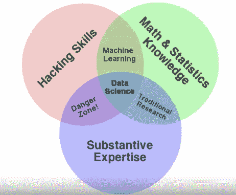

# 数据科学简介

> 原文：<https://towardsdatascience.com/the-data-scientists-toolbox-part-1-c214adcc859f?source=collection_archive---------24----------------------->

## 约翰·霍普斯金 DS 专业化系列

## 数据科学、大数据、数据和数据科学过程。


由 [Unsplash](https://unsplash.com?utm_source=medium&utm_medium=referral) 上 [Greg Rakozy](https://unsplash.com/@grakozy?utm_source=medium&utm_medium=referral) 拍摄的照片

```
[Full series](https://towardsdatascience.com/tagged/ds-toolbox)[**Part 1**](/the-data-scientists-toolbox-part-1-c214adcc859f?source=---------4----------------------------) - What is Data Science, Big data and the Data Science process[**Part 2**](/how-to-learn-r-for-data-science-3a7c8326f969) - The origin of R, why use R, R vs Python and resources to learn[**Part 3**](/a-crash-course-on-version-control-and-git-github-5d04e7933070) - Version Control, Git & GitHub and best practices for sharing code.[**Part 4**](/the-six-types-of-data-analysis-75517ba7ea61) - The 6 types of Data Analysis[**Part 5**](/designing-experiments-in-data-science-23360d2ddf84) - The ability to design experiments to answer your Ds questions[**Part 6**](/what-is-a-p-value-2cd0b1898e6f) - P-value & P-hacking[**Part 7**](/big-data-its-benefits-challenges-and-future-6fddd69ab927) - Big Data, it's benefits, challenges, and future
```

*本系列基于约翰·霍普斯金大学在 Coursera 上提供的* [*数据科学专业*](https://www.coursera.org/specializations/jhu-data-science) *。本系列中的文章是基于课程的笔记，以及出于我自己学习目的的额外研究和主题。第一门课，* [*数据科学家工具箱*](https://www.coursera.org/learn/data-scientists-tools) *，笔记会分成 7 个部分。关于这个系列的注释还可以在这里找到*[](http://sux13.github.io/DataScienceSpCourseNotes/)**。**

# *介绍*

*科学家有能力在海量数据中发现模式和洞见，就像天文学家用望远镜向外太空望去，在数十亿颗恒星和其他星系中发现新的行星、星系和黑洞。数据科学从根本上来说就像科学一样，通过结合不同的领域，即数学、计算机科学、哲学等，来回答关于世界的问题。，以及独特的方法和新技术，以扩大和提高我们的能力，以回答他们。*

*无论您是数据科学的新手，还是在职数据科学家，回到数据科学的核心主题总是有好处的。我们很容易被新工具或单调的工作分心，忘记数据科学的主要概念和它创造的惊人可能性。因此，本文可以作为数据科学的介绍，也可以作为数据科学的复习。尽管如此，我希望你能从中学到一些东西，并享受阅读的乐趣。*

# *什么是数据科学？*

*从广义上讲，[数据科学](https://en.wikipedia.org/wiki/Data_science)是关于**利用** **数据回答问题**。为了回答这些问题，数据科学家综合运用了多种技能，包括统计学、数学、计算机科学、数据辩论、清理、可视化、分析等。*

*基于*《经济学人》特刊*的报道:*

> *数据科学家被广泛定义为结合软件程序员、统计学家和讲故事者/艺术家的技能来挖掘隐藏在海量数据下的金块的人。*

*正是对所有这些技能的掌握，让数据科学家在这个大数据时代变得有价值。更重要的是，数据科学之所以至关重要，是因为它能够**从数字和图形中形成联系**，并将它们转化为**见解**，从而帮助做出基于事实的更快决策，这在这个快节奏的世界中至关重要。就像一台把简单的碳变成珍贵钻石的机器一样，公司和企业现在能够以多种方式利用数据，而数据本身是没有用的。*

*除了以盈利和扩张为目的装备数据科学家的商业之外，数据科学(预测和推理)也有无数的用途，通过**预测和推理**为社会做出贡献，并通过美丽的**数据可视化**讲述故事——例如预测疾病、自然灾害或犯罪，以及可视化新冠肺炎数据的最新更新，由于气候变化的影响而导致的全球气温缓慢上升，或者全球范围内贫困或饥饿的逐渐减少。*

# *数据科学文氏图*

**

*演职员表:[德鲁·康威](http://drewconway.com/zia/2013/3/26/the-data-science-venn-diagram)*

*根据著名的 Drew Conway 的数据科学维恩图，数据科学可以等同于:*

> *黑客技能+数学和统计知识+实质性专业知识*

***实质性专业知识** =提出正确的问题并很好地阐述问题*

***黑客技能** =提取和挖掘数据，清洗和格式化数据，可视化和分析数据，编写简洁的机器学习和深度学习代码，利用工具和包。*

***数学和统计** =用于执行分析和使用统计学习技术将信息转化为有用信息(预测和推断)并做出决策的基础知识*

# *为什么现在数据科学是一个东西？*

*数据科学实际上有很长的历史，可以追溯到 60 年代。但是它现在如此受欢迎的原因是(1)首先，根据摩尔定律，由于数据(大数据)的指数增长(T19)，以及(2)由于创新和技术进步，廉价计算的兴起。*

*这两个原因都是创建丰富数据的典型环境以及用于分析数据的工具的完美成分，同时升级计算机基础设施(内存、处理器、软件等)。我们今天所能做的，有了基础设施和超级计算机，在当时是虚构的，我们每天都在取得突破和突破障碍*

*数据科学与大数据密切相关，因为数据越多，分析得出的结论就越准确。*

# *什么是大数据？*

*如果不引入大数据的概念，对数据科学的解释是不完整的。*

*根据[牛津语言](https://languages.oup.com/google-dictionary-en/)，大数据被定义为:*

> ***非常大的数据集**，可以通过**进行计算分析**，揭示**模式、趋势和关联**，尤其是与人类行为和互动相关的。*

*换句话说，大数据被简单地定义为大量的数据集合。*

## *大数据的 3 个 Vs*

*大数据有 3 个特征，也称为大数据的 3v，可以帮助您更好地理解这个术语。*

***1。体积***

*   *生成和存储的数据量。它的大小决定了价值和潜在洞察力，并将数据集归类为大数据。*

***2。品种***

*   *结构化或非结构化形式的数据的类型和性质；定性或定量，即图像、文本、音频、视频等。*

***3。速度***

*   *数据生成和处理的速度。大数据通常是实时生成的，例如全球每天观看的 YouTube 视频或全球新冠肺炎病例的数量。*

*现在，您对什么是数据科学和大数据有了一个简单的概念，让我们回到基础上来，分析一下数据(所有魔法的核心成分)到底是什么。*

# *什么是数据？*

*数据是数据科学流程的组成部分，通过了解什么是数据，可以帮助您提高效率并理解数据科学的意义。*

*1.根据[剑桥英语词典](https://dictionary.cambridge.org/dictionary/english/data):*

> *信息，尤指事实或数字，被收集起来以供检查、考虑并用于帮助决策。*

*2.根据[维基百科](https://en.wikipedia.org/wiki/Data)*

> **一组定性或定量变量的值。**

*根据维基百科的定义，数据可以分解为术语**集合**、**变量**、**定性**和**定量。***

***设置***

*   *从中提取数据的总体*

***变数***

*   *输入变量(X，预测值，独立变量)*
*   *输出变量(Y，响应，因变量)*

***定量***

*   *关于数量的信息(可以计数和测量)*
*   *年龄、身高、体重、病例数等。*

***定性***

*   *描述性变量(可观察但不可测量)*
*   *肤色、血型、是否感染、地址等。*

## *例子*

*以新冠肺炎疫情为例，假设我们想用一个简单的散点图来显示美国确诊病例的数量，*

*   ***设定**——美国的确诊病例。*
*   ***独立** **变量，X -** 时间(天)*
*   ***因变量，Y -** 确认的数量*
*   *X 和 Y 都是**定量**变量*

*绘图的结果也可以用来描述 X 和 Y 之间的关系，可以是正相关，也可以是负相关。随着统计学习技术的使用，诸如线性回归之类的算法可以用于建立用于预测和推断目的的模型。*

## *数据杂乱且不完美*

*随着您在数据科学领域的进步，您将认识到数据是杂乱的和非结构化的，需要技能、耐心和时间来清理数据和构建数据，以便随时可以使用。以图像数据为例，如果您要建立一个面部识别模型来检测面部，输入图像可能会很暗、有纹理或模糊等。这些杂乱的图像数据可能很难处理。另一个方面是缺失数据，从现实世界中挖掘或收集的数据经常会受到缺失信息的攻击，可以采用几种技术来处理它们。*

## *数据来源*

*数据来自许多地方，尤其是在智能手机使用量因社交媒体以及网飞和 Spotify 等流媒体服务的兴起而大幅增加的这个时期。数据可以分为**内部数据和**外部数据，其中内部数据是企业内部生成的信息，如财务数据，外部数据是来自客户、使用分析等的信息。好的数据通常也很难找到，在大多数情况下，你必须从互联网上挖掘数据来进行分析，并且需要大量的清理才能使其有用。*

## *数据是次要的*

*数据科学家应该遵守的最重要的规则是在寻找数据之前总是先问问题。正如科学方法始于假设一样，数据科学始于对解决手头问题至关重要的问题。*

*正如爱因斯坦所说:*

> *“如果我有一个小时的时间来解决一个问题，而我的生命取决于这个问题的解决方案，我会在前 55 分钟确定要问的合适的**问题**…因为一旦我知道了合适的**问题**，我就可以在不到 5 分钟的时间内解决这个问题。”*

# *数据科学过程*

*与科学方法类似，数据科学有一个将数据转化为见解的过程。*

*该过程可简要总结如下。*

*数据科学从(1) **产生问题**开始，这有助于你很好地理解问题，在问题得到很好的阐述之后，是时候(2) **使用数据科学技术从相关来源收集数据**。收集完数据后，就该(3) **清理数据**，对数据进行格式化，为下一步做准备，也就是(4) **分析和探索**，用统计方法发现隐藏的模式和关系。在这之后是(5) **建模**，其中机器学习模型被构建用于预测和推断。最后，结果(5) **被传达**以通知其他人并用于决策。*

## *总结一下:*

1.  *提出问题*
2.  *数据收集*
3.  *数据清理*
4.  *数据分析和探索*
5.  *数据建模*
6.  *交流结果*

# *数据科学家是做什么的？*

*数据科学家在众多领域都有深远的应用。但是，为了让人们了解数据科学如何为社会做出贡献，让我们来看看[Nate Silver](https://twitter.com/NateSilver538?s=20),[FiveThirtyEight](https://fivethirtyeight.com/)的创始人兼主编，他使用统计分析来传达引人注目的故事和主题，主要涉及选举、政治、体育、科学、经济等。*

*他最著名的工作之一是关于 2016 年[选举](https://fivethirtyeight.com/tag/2016-election/)，基于统计技术产生了准确的预测。你也可以查看该网站对 2020 年美国大选的预测。*

*预测选举当然不是一项简单的任务，引用西尔弗的话来说，他使用的主要模型很复杂，*

> *它涉及大量的路径依赖和大量的非线性，候选人的表现可以以相当复杂的方式相互影响。在我们看来，我们在这件事上没有多少选择。我们的初选模型必然是复杂的，因为初选本身就是一个复杂的过程。*

*换句话说，有无数的相关因素不一定是线性的(X 和 Y 之间没有直接关系)，它们以不同的方式相互作用。如果你想了解更多关于他的模型是如何工作的，点击[这里](https://fivethirtyeight.com/features/how-fivethirtyeight-2020-primary-model-works/)。*

*从这个例子中得到的一个重要教训是，数据科学工具和方法确实只是提高了效率和速度，但要真正利用它，需要知识和能力来选择正确的因素，同时消除错误的因素，以得出正确的结论。要做到这一点，首先需要问正确的问题。如果你决定进入这个领域，这是你必须了解的事情。*

# *摘要*

**

*[米尔科维](https://unsplash.com/@milkovi?utm_source=medium&utm_medium=referral)在 [Unsplash](https://unsplash.com?utm_source=medium&utm_medium=referral) 上的照片*

*他的数据科学方法论——使用数据来回答问题——就像我们根据已有的知识做出决策一样直观。我们都试图根据我们掌握的信息来回答生活中的问题，无论是大问题还是小问题，当我们犯了错误时，那是因为当时缺乏信息。我们能够问的问题也仅限于我们所掌握的信息。*

*但是现在，每天从一个来源到另一个来源产生的数据的大小和数量是天文数字，随着数据科学和利用数据的新技术的出现，我们现在有能力**发现以前没有答案的问题的答案**，甚至产生当时不可思议的新问题。*

*随着数据科学变得更加容易获取和民主化，错误信息和错误结论的危险也随之而来。因此，最重要的是从提问开始，并学会问正确问题的技巧。*

*通过提出正确的问题和获得相关数据，以及数据科学工具和机器学习算法的力量，我们能够揭开世界的隐藏模式，解码曾经深不可测的奥秘。*

*在第 2 部分中，我将写为什么在数据科学中使用 R*

*感谢阅读，我希望这篇文章是教育和有用的！*

## *如果您对学习数据科学感兴趣，请查看“超学习”数据科学系列！*

*[](https://medium.com/better-programming/how-to-ultralearn-data-science-part-1-92e143b7257b) [## 如何“超级学习”数据科学—第 1 部分

### 这是一个简短的指南，基于《超学习》一书，应用于数据科学

medium.com](https://medium.com/better-programming/how-to-ultralearn-data-science-part-1-92e143b7257b) 

## 查看其他文章，了解更多关于数据科学的知识。

[](/top-20-free-data-science-ml-and-ai-moocs-on-the-internet-4036bd0aac12) [## 互联网上 20 大免费数据科学、ML 和 AI MOOCs

### 以下是关于数据科学、机器学习、深度学习和人工智能的最佳在线课程列表

towardsdatascience.com](/top-20-free-data-science-ml-and-ai-moocs-on-the-internet-4036bd0aac12) [](https://medium.com/swlh/top-20-websites-for-machine-learning-and-data-science-d0b113130068) [## 机器学习和数据科学的 20 大网站

### 这里是我列出的最好的 ML 和数据科学网站，可以提供有价值的资源和新闻。

medium.com](https://medium.com/swlh/top-20-websites-for-machine-learning-and-data-science-d0b113130068) [](/the-best-book-to-start-your-data-science-journey-f457b0994160) [## 开始数据科学之旅的最佳书籍

### 这是你从头开始学习数据科学应该读的书。

towardsdatascience.com](/the-best-book-to-start-your-data-science-journey-f457b0994160) [](/top-20-podcasts-for-data-science-83dc9e07448e) [## 数据科学 20 大播客

### 面向数据爱好者的最佳数据科学播客列表。

towardsdatascience.com](/top-20-podcasts-for-data-science-83dc9e07448e) [](/top-20-youtube-channels-for-data-science-in-2020-2ef4fb0d3d5) [## 2020 年你应该订阅的 25 大数据科学 YouTube 频道

### 以下是你应该关注的学习编程、机器学习和人工智能、数学和数据的最佳 YouTubers

towardsdatascience.com](/top-20-youtube-channels-for-data-science-in-2020-2ef4fb0d3d5) 

# 联系人

如果你想了解我的最新文章[，请通过媒体](https://medium.com/@benthecoder07)关注我。

也关注我的其他社交资料！

*   [领英](https://www.linkedin.com/in/benthecoder/)
*   [推特](https://twitter.com/benthecoder1)
*   [GitHub](https://github.com/benthecoder)
*   [Reddit](https://www.reddit.com/user/benthecoderX)

请关注我的下一篇文章，记得**保持安全**！*