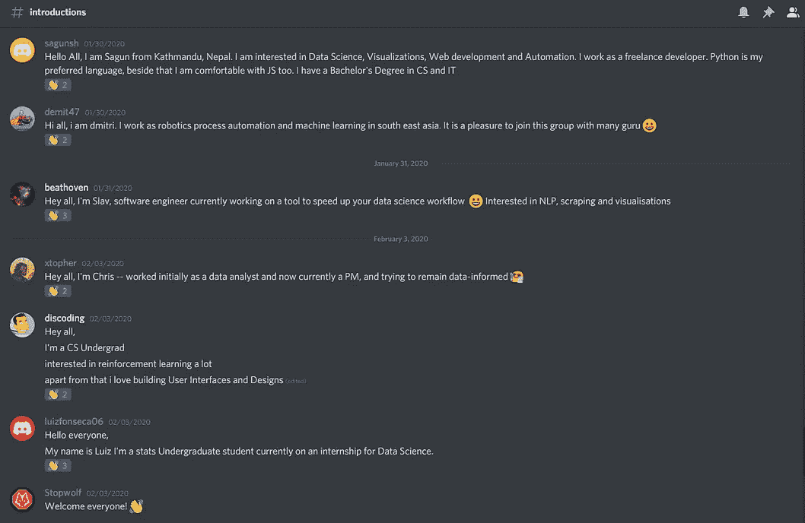
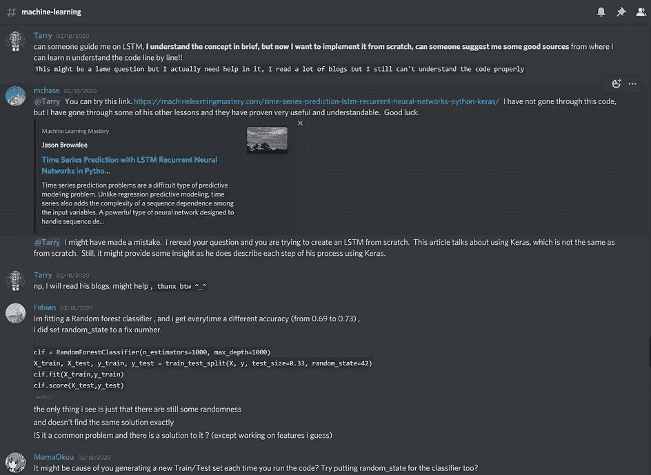
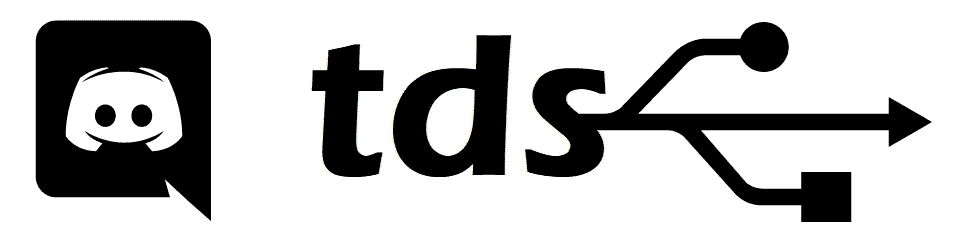

# 数据共享——加入我们的纷争

> 原文：<https://towardsdatascience.com/the-data-share-join-our-discord-f7339b409f6c?source=collection_archive---------26----------------------->

## 一个由来自世界各地的数千名数据科学家组成的社区，随时准备交流想法并为您提供帮助！

来源:https://discordapp.com/

作为“走向数据科学”( TDS)的一员已经有几年了，看着我们的社区发展到今天拥有成千上万的读者，我想是时候为每个人提供一个地方了！

我们启动了这个项目，希望对 TDS 感兴趣的人可以通过这个简单的方式找到与他们有共同兴趣的人，并就他们希望提交给出版物的文章寻找反馈或想法。

现在，它已经远远超出了这个范围，成为了一个开放的领域，任何数据科学领域的人都可以来这里讨论他们正在从事的工作、他们面临的任何问题或提高他们的理解。

我们很乐意[加入我们的 Discord](https://discord.gg/7XWy7DW) ，寻求建议、资源并与行业内志同道合的人交流。我们涵盖了该领域的所有核心要素，包括机器学习、自然语言处理和数据工程。

只是我们来自全球会员的一些介绍&一些问题将在我们的#机器学习频道中得到解答！

此外，还有讨论你的职业生涯的区域，添加你正在从事的项目(或认为值得更多认可的项目)和值得一读的文章！

当你第一次到达时，花一分钟让我们在#介绍中知道你是谁，并查看我们的#指南。将会有一个由社区领导的编码挑战，所以你可能想在#the-project 停下来看看接下来会发生什么并参与进来！

我们有很多非常友好、知识渊博的会员，所以如果你想要一个具体问题的答案，或者只是想和这个领域的其他人搭讪，[我们的不和就是问题所在](https://discord.gg/7XWy7DW)。

