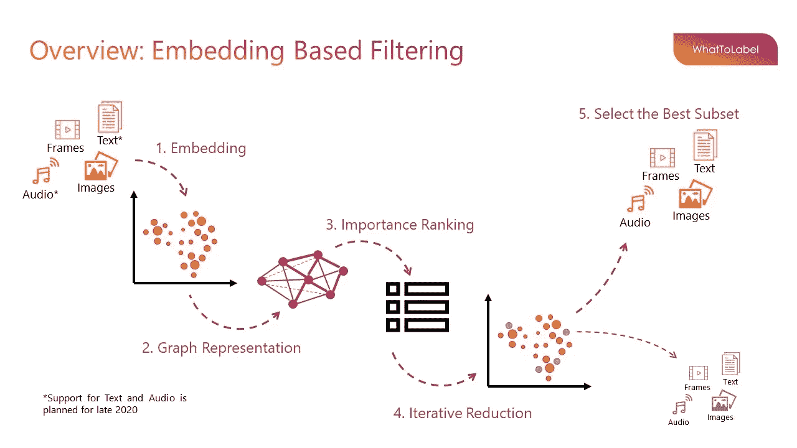

# 您不需要的数据:移除多余的样本

> 原文：<https://towardsdatascience.com/the-data-you-don-t-need-removing-redundant-samples-6bfd07c1516c?source=collection_archive---------22----------------------->

在 ML 中有这样一句话:垃圾进，垃圾出。但是数据好坏到底意味着什么呢？在本帖中，我们将探讨时尚 MNIST 训练集中的数据冗余，以及它如何影响测试集的准确性。

# 什么是数据冗余？

我们将在下一篇文章中给出更详细的解释，但是让我们给你一个冗余数据的例子。想象你正在构建一个分类器，试图区分猫和狗的图像。您已经有一个 100 只猫的数据集，并且正在寻找一个狗图片的数据集。你的两个朋友，罗伯特和汤姆，提供了他们的数据集。

*   罗伯特上周给他的狗贝拉拍了 100 张照片。
*   汤姆给你看了他去年收集的 100 只不同的狗的照片。

你会选择哪一组狗？

当然，这取决于分类器的确切目标以及它将在生产中运行的环境。但我希望在大多数情况下，你会同意，汤姆和 100 只不同的狗的数据集更有意义。

*为什么？*

让我们假设每个图像都有一定数量的信息可以贡献给我们的数据集。具有相同内容(相同的狗)的图像比具有新内容(不同的狗)的图像添加更少的附加信息。人们可以说相似的图像有语义冗余。

有一些论文，如[《你不需要的 10%》](https://arxiv.org/pdf/1901.11409.pdf)，更详细地探讨了这个问题。

# 删除冗余数据

像[你不需要的 10%](https://arxiv.org/pdf/1901.11409.pdf)这样的文件遵循一个两步程序来发现和删除信息较少的样本。首先，他们训练一个嵌入。然后，他们应用聚类方法，使用[凝聚聚类](https://en.wikipedia.org/wiki/Hierarchical_clustering)来移除最近的邻居。对于聚类，他们使用常见的[余弦距离](http://blog.christianperone.com/2013/09/machine-learning-cosine-similarity-for-vector-space-models-part-iii/)作为度量。您也可以将要素归一化为单位范数，并使用 L2 距离来代替。

我们需要解决两个问题:

*   我们如何得到好的嵌入？
*   凝聚聚类具有 O(n)的时间复杂度和 O(n)的空间复杂度

作者通过使用提供的标签训练嵌入来解决第一个问题。考虑训练一个分类器，然后去掉最后一层，得到好的特征。

第二个问题需要更多的创造力。让我们假设我们有很好的分离各个类的嵌入。我们现在可以独立处理各个类。对于具有 50k 个样本和 10 个类的数据集，我们将对每个 5k 个样本运行 10 次聚类。由于时间和空间复杂度都是 O(n)和 O(n ),这是一个显著的加速。

# WhatToLabel 的启动方式

在 WhatToLabel，我们希望通过关注最重要的数据来更有效地利用机器学习。我们帮助 ML 工程师过滤和分析他们的训练数据。

我们使用同样的两步方法。

我们数据选择算法的高级概述

**首先，我们想得到一个好的嵌入**。我们的很多努力都集中在这一部分。我们有预先训练好的模型，我们可以使用这些模型作为基础，通过自我监督对特定数据集进行微调。这使我们能够处理**未标记的数据**。我们将在另一篇博文中解释自我监督部分。预训练模型具有类似 ResNet50 的架构。然而，嵌入的输出维度只有 64 个维度。高维引入了各种问题，如更高的计算和存储时间，以及由于维度的[诅咒](https://en.wikipedia.org/wiki/Curse_of_dimensionality)而导致的更少有意义的距离。

我们训练嵌入的方式仍然可以获得很高的精确度:

ImageNet 2012 val 集上不同嵌入方式的比较

**其次，我们希望使用一种基于嵌入的快速数据选择算法**。凝聚聚类太慢。我们通过构建一个图来探索局部邻域，然后在其上迭代地运行算法。我们使用两种算法。破坏性的，我们从完整的数据集开始，然后移除样本。另一方面，构造性算法通过一个接一个地添加相关样本来从头开始构建新的数据集。

**当我们结合这两个步骤时，我们得到了一个快速过滤解决方案，即使没有标签也能工作。**

我们开发了一种产品，你可以在[whattolabel.com](https://www.whattolabel.com/)查看，或者你可以按照这个两步过滤程序建立自己的管道。

对于下面的实验，我们使用 [WhatToLabel 数据过滤解决方案](https://www.whattolabel.com/)。

# 过滤时尚-MNIST 去除冗余

*GitHub 资源库中提供了重现实验的完整代码:*[*https://github.com/WhatToLabel/examples*](https://github.com/WhatToLabel/examples)

现在，我们知道什么是冗余，它们会对训练数据产生负面影响。让我们来看看一个简单的数据集，如时尚-MNIST。

时尚-MNIST 在训练/测试集中包含 50k/ 10k。对于下面的实验，我们只过滤训练数据。我们的目标是去除 10%。一次使用随机选择的样本，一次使用更复杂的数据过滤方法。然后，我们针对整个数据集评估各种子采样方法。为了评估，我们简单地训练一个分类器。

# 实验设置

我们使用 PyTorch 作为框架。为了进行评估，我们使用以下参数训练带有 SGD 的 resnet34:

*   批量:128 个
*   纪元:100 年

为了确保再现性，我们为随机数生成器设置了种子:

为再现性设置随机种子

我们使用 ImageNet 统计数据对输入数据进行标准化，对于训练数据，我们使用随机水平翻转作为数据扩充。此外，我们将黑白图像转换为 RGB。

训练集和测试集的数据转换

为了用不同%的训练数据进行多次实验，我们使用了一个简单的技巧。在数据加载器中，我们使用随机子集采样器，它只从索引列表中采样。对于 WhatToLabel 过滤的数据集，我们提供了存储库中的索引列表。对于随机子采样，我们使用 NumPy 创建自己的列表。

获取实验索引和创建数据加载器的代码

在训练我们的分类器之前，我们希望根据每个类别的样本数量重新平衡交叉熵损失的权重。

基于每个类的样本数重新平衡损失的 Python 代码

现在一切就绪，我们可以开始训练模型了。在 Nvidia V100 GPU 上，每个时期大约需要 15 秒。完成整个笔记本大约需要 75 分钟。

# 结果

在完成训练和评估过程后，我们应该看到三个不同的情节。在左边的第一行，我们有使用随机二次抽样的两个实验的训练损失。在右边，我们有所有三个实验的测试精度(两个二次采样实验和一个全数据集实验)。在底部，我们仔细查看了 50–100 个训练时段的准确性结果。

显示三个实验的训练损失和测试准确度的图

在时间点 60 和 80 有两次准确性和损失的跳跃。那两次跳跃来自于学习率的更新。如果你仔细观察精确度，你会注意到使用 WhatToLabel 子采样(红色)的实验精确度与使用完整数据集(蓝色)的实验精确度非常相似。使用随机子采样(绿色)的实验精度较低。培训过程的结果支持这些发现。三个实验的最高精度如下:

*   使用 WhatToLabel 子采样的最佳测试精度(90%): **92.93%**
*   使用完整训练数据集的最佳测试准确度(100%): 92.79%
*   使用随机二次抽样的最佳测试精度(90%): 92.43%

# 用更少的训练数据获得更高的精度！？

起初，这可能没有意义。但是让我们回到文章的开头，在那里我们讨论了冗余数据。让我们假设在时尚 MNIST 数据集中有这样的冗余。如果我们删除它们，数据集会更小，但模型通过训练获得的信息不会减少相同的数量。这种冗余最简单的例子是一个看起来相似的图像。但是我们寻找的不仅仅是相似的图像，我们寻找相似的特征激活或语义冗余。

# 用不同的种子重复实验？

进行多次实验并报告平均值和标准偏差非常重要。也许我们之前的结果只是一个异常值？

我们在 [WhatToLabel](https://www.whattolabel.com/) 有一个内部基准测试套件，可以在各种数据集上评估我们的过滤软件，具有多种训练集大小和多种种子。

whattolabel 与随机二次抽样的时尚-MNIST 检验准确性

我希望你喜欢这篇文章。在我们的下一篇文章中，我们将更详细地讨论数据冗余。

伊戈尔，whattolabel.com
联合创始人