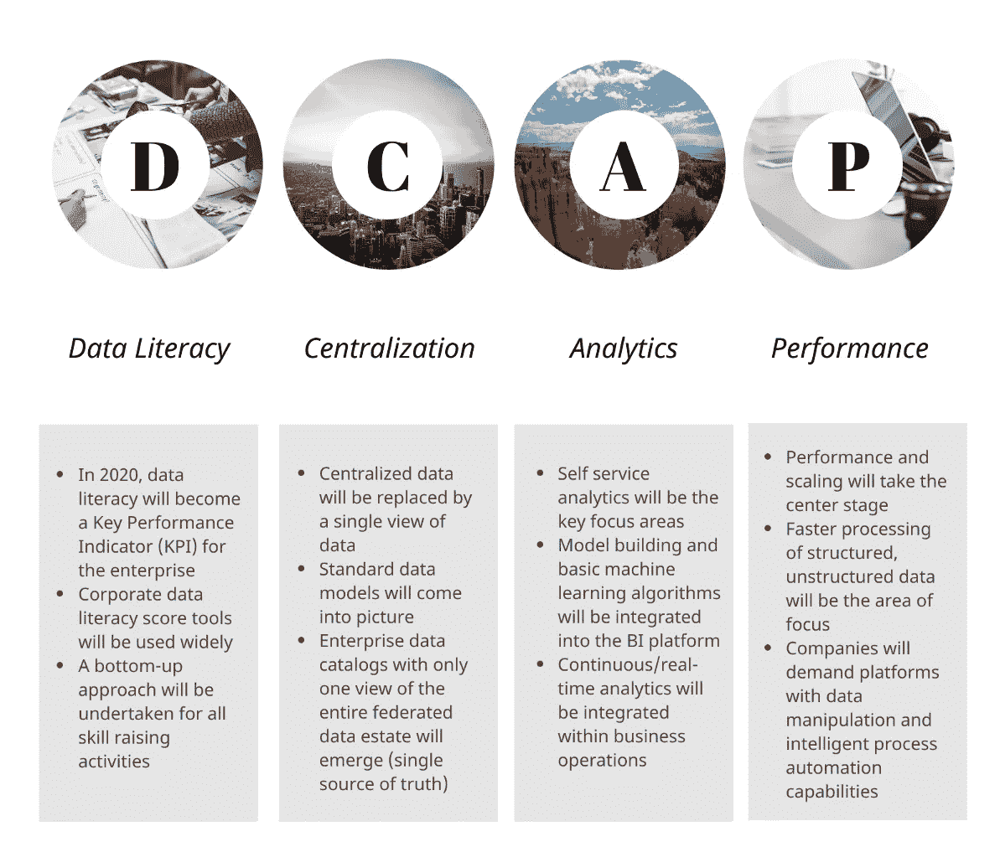
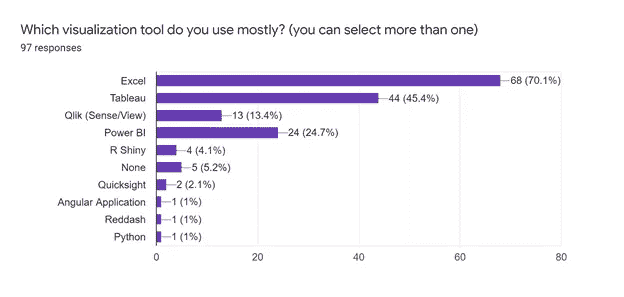
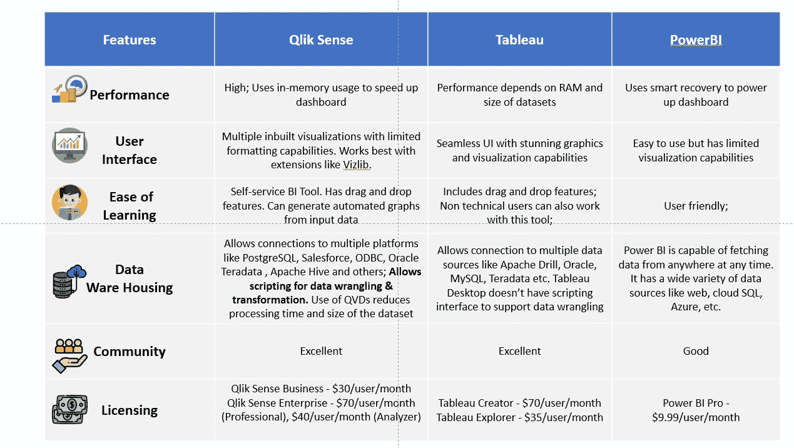

# 现代分析的黎明——2020 年商业智能工具的一些最新趋势

> 原文：<https://towardsdatascience.com/the-dawn-of-modern-analytics-a-look-into-some-of-the-recent-trends-of-business-intelligence-fc12cdf41cae?source=collection_archive---------41----------------------->

## 基于调查的方法来确定每个数据科学家都应该知道的 BI 工具

斯蒂芬·道森在 [Unsplash](https://unsplash.com?utm_source=medium&utm_medium=referral) 上拍摄的照片

商业智能(BI)是一个概念，通常涉及组织中适当且有价值的商业信息的交付和集成。公司使用 BI 来检测重大事件，如深入了解客户行为、监控关键绩效指标以及获取市场和销售情报，以快速适应不断变化的动态业务。

BI 构成了所有报告项目的支柱，尤其是在行业决定从孤立的工作方式转变为为所有业务部门创建单一的真实来源之后。70%的工作围绕着数据操作和报告，这就是为什么数据科学家、业务分析师、数据分析师，甚至利益相关者都应该熟悉至少一种自助式 BI 工具。

> ***作者注*** *—本文见解来源于在线* [*数据分析调查*](https://forms.gle/JxPZkZA1VWM2XYkK8) *。来自数据分析行业不同垂直行业的专业人士的 100 份回答样本用于记录趋势。*

# 背景

Bob 目前是 Cooper Company 的一名数据分析师，Cooper Company 是一家组织德克萨斯州文学博览会的小型组织。Bob 目前使用 MS Excel 跟踪所有活动，包括门票销售、宾客名单、安排、活动时间等等。他们的首席执行官安迪希望将这一活动扩展到其他三个州，鲍勃有权创建一个在线跟踪器，帮助创始人跟踪实时事件。看起来鲍勃是工作中的冠军。但是 Bob 以前从未使用过 BI 工具。鲍勃现在手头有一项艰巨的任务。他需要选择一个具有实时数据操作功能和自助服务分析能力的平台。可怜的鲍勃。在决定平台之前，让我们找出他做的所有研究。

照片由[卢克·切瑟](https://unsplash.com/@lukechesser?utm_source=medium&utm_medium=referral)在 [Unsplash](https://unsplash.com?utm_source=medium&utm_medium=referral) 上拍摄

# 鲍勃的谷歌搜索

一个晴朗的星期五，当公司的每个人都在计划团队出游时，Bob 决定花时间了解 BI 工具的市场和趋势。他对 BI 工具的功能、优势和关注领域做了一些初步研究，以了解他应该使用哪种工具。

## 商业智能(BI)工具的变化比我们大多数人所能理解的要快得多

BI 工具用于实现以下目标:

1.  **将数据转化为可操作的见解** —利用现有数据和分析能力推动业务决策
2.  **随着时间的推移跟踪关键绩效指标** —关键绩效指标包括销售额、收入、流量、访问量、新客户等。
3.  **在报告的数字中实现粒度** —使用动态过滤器和其他交互式功能允许用户对报告的指标进行自上而下的分析
4.  **允许同时使用仪表板** —多个利益相关者可以同时使用同一个报告。防止不同业务单位报告的数字不一致

[卡洛斯·穆扎](https://unsplash.com/@kmuza?utm_source=medium&utm_medium=referral)在 [Unsplash](https://unsplash.com?utm_source=medium&utm_medium=referral) 上的照片

## 所有商业智能工具的四个重点领域

大多数 BI 工具将继续投入资源，使其平台具有可伸缩性和健壮性。然而，代表数据素养、集中化、分析和性能的 D-CAP 框架仍将是主要关注领域。在深入探讨这些趋势之前，让我们先来看看它们代表了什么。

**数据素养—**“Gartner 将[数据素养](https://www.gartner.com/doc/3602517/information-second-language-enabling-data)定义为在上下文中读取、写入和交流数据的能力，包括对数据源和结构、应用的分析方法和技术的理解，以及描述用例应用和最终价值的能力。”

**集中化—**BI 中的集中化是主要出于治理和安全原因，在一个中央位置或部门存储、管理和维护所有商业智能或数据的系统。该模型确保了数据的准确性、可访问性和规模质量。

**分析—**BI 中的分析就是使用软件和统计数据从原始历史数据中总结关键信息，并提供见解以促进数据驱动的决策。

**绩效—** 商务智能的绩效包括三个关键方面:

*   后端数据的处理速度
*   数据加载后仪表板(前端)启动的速度
*   仪表板能够处理并发用户吗？

2020 年商务智能工具的发展趋势

# 鲍勃仍然很困惑

Bob 现在非常清楚商业智能代表什么，但是他仍然需要一个工具来使用！他意识到，虽然有些文章倾向于 Tableau 或 QlikSense，但也有一些文章建议使用 IBM Cognos & Power BI。为了避免任何困惑，他决定调查数据科学家和其他分析专业人士，以了解当今的需求

## 什么行业用？

## 调查问题—您最常用的可视化工具是什么？(您可以选择多个)。

共有 97 名专业人士参与了此次调查，并记录了 163 份回复，即平均每个人最终都会使用至少两种商务智能工具。

数据分析—调查结果

## 调查结果:

*   Excel 仍然是最受欢迎的可视化工具，广泛应用于不同的垂直行业
*   与市场上的任何其他 BI 工具相比，Tableau、QlikSense 和 Power BI 更受分析师青睐
*   像 R Shiny、Python (dash 和 plotly)这样需要编码的可视化工具并不是用户的最爱。这说明了为什么自助 BI 工具在今天如此受欢迎

# Bob 需要更多数据点

Bob 现在已经将他的工具选择范围缩小到 Tableau、Power BI 和 QlikSense。但是他想比较这三个平台，看看哪一个更符合他的要求。

## 比较框架

BI 工具的比较

# 作者说明

该行业正慢慢转向自助式 BI 工具。在与航空公司、医疗保健和保险行业合作时，我注意到 Tableau 和 Qlik Sense 是市场上使用最广泛的两种 BI 工具。Qlik Sense 正在加快步伐，特别是因为它的数据转换功能，减少了对 ETL 工具的依赖。然而，Qlik Sense 的最大挑战是使用扩展来实现更好的可视化。扩展通常是第三方脚本，拥有数据隐私协议的大型组织可能不习惯使用它们。如果你对脚本感兴趣，那么你可以专注于 Tableau 或 Qlik Sense 中的一个，否则拥有 Tableau & Qlik Sense 的工作知识是很好的。

*关于作者:高级分析专家和管理顾问，帮助公司通过对组织数据的商业、技术和数学的组合找到各种问题的解决方案。一个数据科学爱好者，在这里分享、学习、贡献；你可以和我在* [*上联系*](https://www.linkedin.com/in/angel-das-9532bb12a/) *和* [*上推特*](https://twitter.com/dasangel07_andy)*；*