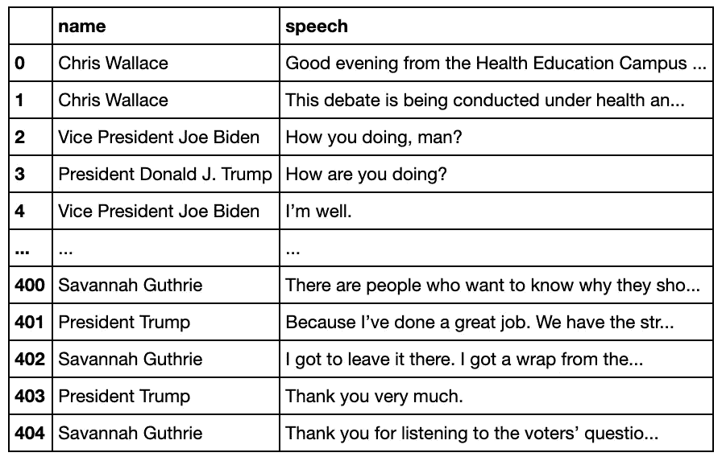
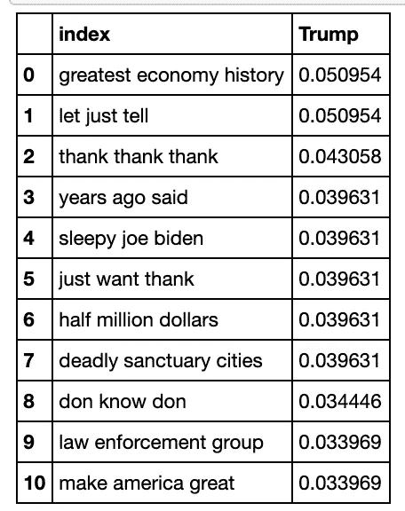
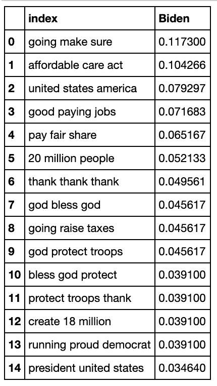
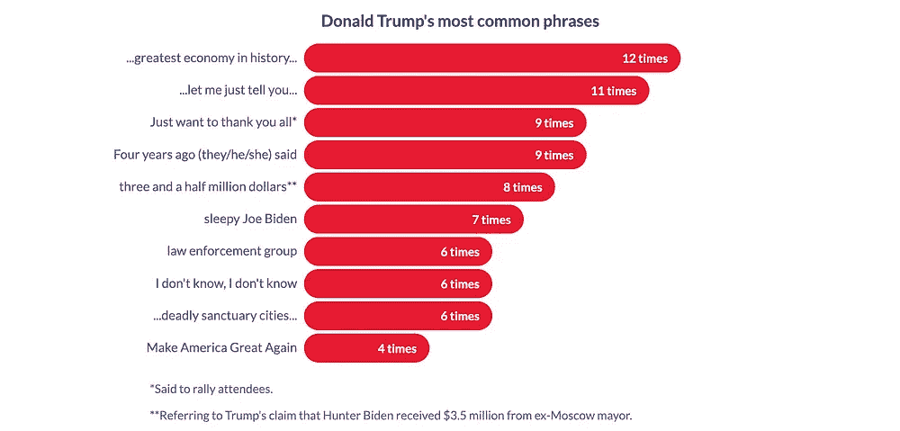

# 辩论喝酒游戏，用数据科学

> 原文：<https://towardsdatascience.com/the-debate-drinking-game-with-data-science-7a0c0692e5a?source=collection_archive---------34----------------------->

## 利用文本挖掘技术分析特朗普、拜登的演讲

新冠肺炎可能取消了我们的现场辩论观看派对，但这并没有阻止我们用它来做一个饮酒游戏！在我最新的 Youtube 视频中，我使用文本挖掘技术为即将到来的总统辩论开发了*终极*数据驱动的饮酒游戏规则。这篇文章将带你了解我是如何做到的。

首先，我从竞选集会、演讲和过去几周发生的任何其他活动中搜集了一些抄本，这些活动中拜登或特朗普(或两者都有！)说话了。我搜集的完整事件列表可以在这个项目的 [Github repo](https://github.com/vastava/data-science-projects/tree/master/debate-drinking-game) 中看到(见“辩论. csv”文件)。

我从 rev.com 那里刮来了成绩单(在他们的允许下！)因为它似乎有最详尽的 2020 年选举事件列表，还因为文字记录遵循标准化格式，这使得收集过程更容易。下面是我用来刮抄本的函数:

```
def scrapeTranscriptFormat1(url, sep):
    html = requests.get(url)
    html = html.text
    bs = BeautifulSoup(html, "lxml")
    paragraphs = bs.findAll("p")
    for paragraph in paragraphs:
        try:
            paragraph.find('u').decompose()
        except:
            continue
    speaker = []
    speech = []
    pattern = r'\[.*?\]' for paragraph in paragraphs:
        try:
            speechText = paragraph.text.replace(u'\xa0', u'') 
            speechText = re.sub(pattern, '', speechText) 
            if sep == "parenthesis":
                speech.append(re.search("[0-9]{2}\)[\r\n]+(.*)", speechText).group(1).strip(" ")) 
            else:
                speech.append(re.search(":[\r\n]+(.*)", speechText).group(1).strip(" ")) # search for speaker's speech, append to list
            speaker.append(re.search("^(.*?):", speechText).group(1)) # search for speaker name, append to list            
        except:
            continue
    return pd.DataFrame({'name': speaker, 'speech': speech})
```

上面的函数接受两个参数——rev.com 上的脚本的 URL 和“分隔符”“分隔符”是指用来表示每行发言人的字符；对于大多数抄本，分隔符是“括号”(例如，遵循下面的格式)。

> 克里斯·华莱士:( [01:20](https://www.rev.com/transcript-editor/shared/C-8bDp99BJeCjsjMD_TLZx3mzKMYLQlRNcIpn01gIDIitp25MT_XakH7HIktIkzYjsjgbemzC1JlO5zsFuPOVzteEGE?loadFrom=PastedDeeplink&ts=80.33) )
> 晚上好，来自……的健康教育校园

如果分隔符不是括号，我假设我写的正则表达式假设它是一个冒号(例如，遵循下面的格式)。根据抄本的格式，您可能需要修改正则表达式。

> 克里斯·华莱士:
> 晚上好，来自……的健康教育校园

scraping 函数应该返回一个类似于下面的数据帧。



抄本的数据框架。图片作者。

一旦你收集了所有的抄本并连接了数据框架，我们就可以开始文本分析了！

在开始语篇分析之前，我们必须准备好数据框架。尽管我是从同一个网站上搜集来的文字记录，但命名惯例并不一致——例如，拜登有时被称为“乔·拜登”，有时被称为“副总统乔·拜登”

我只是在 dataframe 的“name”列上调用了 pd.unique()，这样我就可以看到每个候选人的所有名字变化。然后，我创建了一个字典，并使用 pd.replace()替换所有这些变体。

```
name_variations = {"name": 
                   {
                     'Chris Wallace':"moderator", 'Vice President Joe Biden':"Joe Biden",
       'President Donald J. Trump':"Donald Trump", 'Moderator':"moderator", 'Ilia Calderón':"moderator",
       'Joe Biden':"Joe Biden", 'Bernie Sanders':"bernie", 'Dr. Sanjay Gupta':"moderator",
       'Amy Langenfeld':"moderator", 'John':"moderator", 'Donald Trump':"Donald Trump", 'President Trump':"Donald Trump",
       'Hannah Cannon':"moderator", 'President Donald Trump':"Donald Trump", 'Justin Gaethje':"moderator"

                   }
                }

df.replace(name_variations, inplace=**True**)
```

然后可以使用下面的“getSpeech”函数和代码来构造语料库。

```
def getSpeech(name):
    candidate = df[df['name']==name].reset_index()
    candidateSpeech = ""
    for row in range(0,len(candidate)):
        candidateSpeech = candidateSpeech + " " + candidate['speech'][row]
    return candidateSpeech
    candidateSpeech = candidateSpeech.translate(str.maketrans('', '', string.punctuation))
    candidateSpeech = candidateSpeech.strip(" ")
    stop_words = set(stopwords.words('english')) 
    word_tokens = word_tokenize(candidateSpeech)
    filtered_sentence = [w for w in word_tokens if not w in stop_words]
    filtered_sentence = []
    for w in word_tokens: 
        if w not in stop_words: 
            filtered_sentence.append(w)
    return ' '.join(word.lower() for word in filtered_sentence)biden = getSpeech("Joe Biden") 
trump = getSpeech("Donald Trump") 
moderator = getSpeech("moderator")  corpus = {'Moderator': moderator, 'Biden':biden, 'Trump':trump}
```

然后我使用 sklearn 库来计算“tf-idf”统计数据。Tf-Idf 代表术语频率-逆文档频率，是计算单词重要性的好方法。它不仅考虑了短语的频率，还贬低了两位候选人可能会说的一般短语(如“谢谢你的问题……”)，这确保了最后的短语将是特朗普或拜登独有的。

在计算了语料库中每个对象的 tf-idf 分数并转换了列之后，您将得到如下所示的数据帧:



左:特朗普的得分短语。右图:拜登的得分短语。作者图片。

有几点需要注意:首先，这个脚本只识别三到四个单词短语(不包括停用词)。因此，像“a”、“to”和“the”这样的词被删除了，这使得一些短语变得难以理解。例如，“don know don”的完整短语是“我不知道，我不知道。”“竞选自豪的民主党人”的完整短语是“作为一个自豪的民主党人竞选。”

第二，输出数据帧中的这些短语只有三或四个单词长，这一事实会带来许多问题。这意味着关键的词可能会被省略——“提高税收”的完整短语实际上是“*而不是*提高税收。”这也意味着较长的短语可能会被分成较小的块，并且在表中出现过多。拜登更常用的一句话是“上帝保佑你们所有人，愿上帝保护军队”，这句话被分成数据框中的第 7、9、10 和 11 行。

最后，tf-idf 分数并不表示*频率*——它是一个短语的频率和唯一性的组合。这就是为什么“谢谢，谢谢，谢谢”这个词在两位候选人身上都出现了——它不是唯一的，但被说了很多次，以至于出现在了前 10 名中。尽管它是最常见的，但它并不在列表的首位。(值得注意的是，拜登和川普*都没有说过这句话。它指的是当主持人说“谢谢你，总统先生。谢谢主席。谢谢您…。”当候选人随时间推移)。*

为了计算每个短语被说了多少次，你必须手动浏览你的辩论记录 CSV。或者至少，我是这么做的。

在清理替换停用词和按频率重新排序短语后，我们终于有了周四总统辩论的饮酒游戏规则！



左:拜登的饮酒游戏规则。右图:为川普制定饮酒游戏规则。作者图片。

对其中一些短语感到困惑？我在我的视频中解释了这些短语背后的背景，看看吧！

喝酒开心！请记得喝酒(还有投票！)负责任。