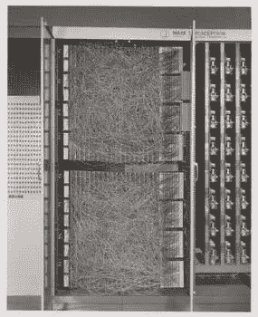

# 深度学习的进化

> 原文：<https://towardsdatascience.com/the-deep-history-of-deep-learning-3bebeb810fb2?source=collection_archive---------14----------------------->

## 探索深度学习在过去几十年的成长！

Frank Rosenblatt 的感知来自 [Reddit](https://www.reddit.com/r/interestingasfuck/comments/e8a8oy/frank_rosenblatt_with_a_mark_i_perceptron/) (左)&ann 来自[神经网络和深度学习](http://neuralnetworksanddeeplearning.com/chap1.html)(右)

我们大多数人都知道深度学习是 21 世纪的发明，但信不信由你，它自 20 世纪 40 年代就已经存在了。

我们大多数人不知道 20 世纪深度学习进步/研究的原因是因为当时使用的方法由于其各种缺点而相对不受欢迎，并且事实上从那时起它已经有过几次重新命名。

任何领域的新的原创研究都需要了解导致该领域普及的历史、演变和重大突破。深度学习也不例外。

纵观深度学习的历史，可以发现三大进步浪潮:

## 控制论——1940-1960 年

## 连接主义——在 1980-1990 年间

## 深度学习—自 2006 年以来

在前两次浪潮中所做的研究由于其缺点受到批评而不受欢迎，然而，毫无疑问，它帮助该领域发展到今天的位置，并且在那些时间中开发的一些算法直到今天仍广泛用于各种机器学习和深度学习模型。

让我们更详细地探讨一下这三种波，以获得一些视角。

# 控制论

是现代深度学习最早的前身，基于 ***生物学习***——人脑如何学习的思想。以控制论的名义取得的进步是基于在更简单的计算模型中复制人类/动物大脑工作的目标，这将有助于建立像真正的大脑一样开始学习的系统，并在给定一些输入的情况下提供结论。这种思维模式下的进一步研究在计算神经科学[下继续进行，直到现在。](https://en.wikipedia.org/wiki/Computational_neuroscience)

控制论的发展拉开了 [**麦卡洛克-皮茨神经元**](/mcculloch-pitts-model-5fdf65ac5dd1) **的序幕。这是一种模仿生物神经元的尝试。这是基于一个线性模型，将采取各种投入[X1，X2 …Xn]，对于每个输入，模型有一些权重[W1，W2 … Wn]和输出 f(x，w) = X1W1 + X2W2 + …。+ XnWn。该模型只能根据输入和权重输出真/假。**

**麦卡洛克-皮茨模型**从[走向数据科学](/mcculloch-pitts-model-5fdf65ac5dd1)

权重需要正确设置，并由人工输入。

后来在 20 世纪 50 年代， [**感知器**](https://en.wikipedia.org/wiki/Perceptron#History) 由美国心理学家 [Frank Rosenblatt](https://g.co/kgs/tJDU8G) 开发，可以自动学习权重。感知器最初被设计成一个电机，而不是一个程序/软件。Frank 为图像识别建立了感知器，它包含连接到多个神经元的光电池(接收器),这些神经元将对光电池捕获的输入进行分类。

**感知器**来自[维基百科](https://en.wikipedia.org/w/index.php?curid=47541432)

虽然感知器在当时是一台非凡的机器，但它做出了当时无法实现的大胆主张。

[**ADALINE**](http://rasbt.github.io/mlxtend/user_guide/classifier/Adaline/)**—**由**[Bernard wid row](https://en.wikipedia.org/wiki/Bernard_Widrow)开发，被称为自适应线性元件，它大约与感知器同时开发，也可以在学习阶段适应基于输入加权和的权重。**

****

****ADALINE** 来自 [mlxtend](http://rasbt.github.io/mlxtend/user_guide/classifier/Adaline/)**

**ADALINE 的学习函数类似于目前线性回归中使用的 s [到随机梯度下降。](https://machinelearningmastery.com/linear-regression-tutorial-using-gradient-descent-for-machine-learning/)**

**这些线性模型有各种各样的局限性，看到这些局限性的批评家们导致了它们的受欢迎程度大幅下降，并使研究停滞了一段时间。一个主要的限制是这些[线性模型不能训练异或函数](https://en.wikipedia.org/wiki/Perceptrons_(book)#The_XOR_affair)。**

**因为这些模型受到神经科学研究的启发，它们受欢迎程度的下降也激发了对神经科学基础之外的模型的探索。**

# **连接主义**

**或者说 ***并行分布式处理*** 在上世纪 80 年代开始流行。[这种方法](https://en.wikipedia.org/wiki/Connectionism)受到了认知科学的启发。与 20 世纪 80 年代被称为古典主义者的科学家们正在探索的各种符号推理方法相比，联结主义显示出了希望。**

**即使我们从更抽象的角度来看大脑，符号推理方法也很适合，但很难用经典的编程模型来明确实现。因此，实用连接主义者认为他们的工作是利用神经网络来实现与符号推理相似的效果。**

**但是激进的联结主义者简单地抛弃了符号推理的想法，声称它无论如何也不能解释我们大脑的各种复杂特征，并且是对人类大脑的不正确的认知。**

**[人工神经网络](https://en.m.wikipedia.org/wiki/Artificial_neural_network) (ANNs)的概念就是在这一波浪潮中引入的。人工神经网络背后的主要思想是开发一个由个体单元组成的网络，这些个体单元可以被编程以实现智能行为。这是第一次引入隐藏层的概念。**

**相互连接的人工神经元网络允许沿着网络的不同分支分布的并行信号处理。“神经元”单位的连接包含了控制一个神经元对另一个神经元的影响强度的权重。**

****

****安**来自[维基百科](https://commons.wikimedia.org/w/index.php?curid=1496812)**

**这种方法被认为与我们神经系统内部发生的事情非常相似，这在研究人员中引起了一些关于这些模型有效性的 hipe。**

**在这一波连接主义期间，各种模型，如 [LSTM](https://en.wikipedia.org/wiki/Long_short-term_memory#History) 、[分布式表示和处理](https://en.wikipedia.org/wiki/Connectionism#Parallel_distributed_processing)、[反向传播](https://en.wikipedia.org/wiki/Backpropagation)被开发出来，并继续成为深度学习的各种高级应用的关键组件。**

**但在 20 世纪 90 年代中期，基于人工智能的初创公司开始提出不切实际的主张，并且由于缺乏计算资源，永远无法从这些模型中提供那种复杂程度。投资者撤出，这导致了第二波深度学习的下降。**

**第二波从未消失，但被削弱了。各种实验室都在进行研究，但直到 2000 年代初，应用非常少。**

# **深度学习**

**经过两次下跌后，第三波在 2006 年出现突破。杰弗里·辛顿使用贪婪的逐层训练来训练深度信念网络。**

**在最简单的形式中，DBN 是多个隐藏层的组合，每一层包含各种潜在变量。连接存在于 b/w 层中，但不存在于每层内部的变量之间。DBN 的一个非常简单的实现也可以叫做受限[玻尔兹曼机器](http://www.scholarpedia.org/article/Boltzmann_machine)。**

****

****受限玻尔兹曼机**来自[维基百科](https://commons.wikimedia.org/w/index.php?curid=22717044)**

**杰弗里·辛顿的进步被其他研究人员用来训练不同类型的深度网络。这使得世界各地的研究人员能够训练越来越深的神经网络，并导致了术语 ***深度学习的普及。*****

**虽然 Geoffrey Hinton 似乎导致了深度学习的出现，但你不能忽视计算能力和大型数据集可用性的增加。当在越来越大的数据集上训练时，在连接主义期间开发的相同算法开始给出更好的结果。**

**当时和现在的区别在于，随着越来越多的人使用在线服务，我们有了更多的数据和更多的计算资源来处理这些数据，从而提高了各种模型的准确性。**

**深度学习更有趣、更复杂的应用正在浮出水面，但仍处于实际应用的早期阶段。例如，深度学习已被用于开发大脑的 3D 地图([连接体](http://on-demand.gputechconf.com/gtc/2014/poster/pdf/P4212_connectome_deep_learning_convolutional.pdf))，以帮助神经科学家和认知科学家研究大脑。制药公司开始使用深度学习来预测不同分子将如何反应，并帮助加速药物开发。**

# **结论**

**今天，深度学习在性能上超过了各种机器学习方法，并被广泛用于各种不同的任务。与其他方法相比，深度学习提高了语言翻译和图像识别等任务的准确性。但这不是/不可能在几年内发生，而是需要几十年！**

**尽管深度学习自 20 世纪 40 年代的第一个前身以来已经发展了很多，但记住它从何而来以及它是如何随着时间的推移而发展的非常重要，因为它仍然有很长的路要走。研究早期的构建模块有助于开发深度学习未来的新应用(*站在巨人的肩膀上*)。**

**如果有任何话题能引起你的兴趣，我会试着添加一些书籍和文章。如果你想要我的建议，一定要试试马文·明斯基的【T2 感知机】。它深入研究了弗兰克·罗森布拉特的感知机。**

# **资料来源和进一步阅读**

## **书**

> **[深度学习](https://amzn.to/2V5hopA)作者[伊恩·古德菲勒](https://www.amazon.com/Ian-Goodfellow/e/B01MQGN8N0/ref=dp_byline_cont_book_1)——这是今天任何从事深度学习的人的必读之作**
> 
> **[深度学习革命](https://amzn.to/34com08)作者 [Terry Sejnowski](https://g.co/kgs/Gnsshp)**
> 
> **[感知器](https://amzn.to/3c3k11X)由[马文·明斯基](https://g.co/kgs/kRNo9e)和[西蒙·派珀特](https://g.co/kgs/jybA4r)组成**

## **文章**

** [## 麦卡洛克-皮茨神经元——人类第一个生物神经元的数学模型

### 众所周知，深度神经网络的最基本单元被称为人工神经元/感知器…

towardsdatascience.com](/mcculloch-pitts-model-5fdf65ac5dd1)  [## 深度信念网络

### 深度信念网是一种概率生成模型，由多层随机的、潜在的…

www.scholarpedia.org](http://www.scholarpedia.org/article/Deep_belief_networks)  [## 人工神经网络中的反向传播是如何工作的？

### 自从机器学习的世界被引入到递归工作的非线性函数(即人工…

towardsdatascience.com](/how-does-back-propagation-in-artificial-neural-networks-work-c7cad873ea7)  [## 用单一感知器求解异或

### 提倡多项式变换作为增加人工神经元代表能力的一种方法。

medium.com](https://medium.com/@lucaspereira0612/solving-xor-with-a-single-perceptron-34539f395182)**