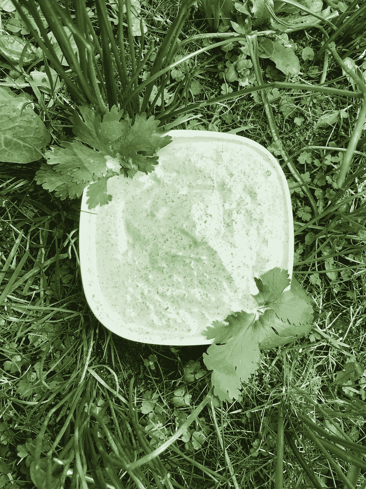

# 如何制作德国“绿酱”的 ML 方法

> 原文：<https://towardsdatascience.com/the-deep-learning-approach-on-how-to-make-german-green-sauce-8b05247fa09d?source=collection_archive---------32----------------------->

## 一个关于如何准备传统食物的 fast.ai 教程


法兰克福附近奥芬巴赫的一家非常独特的黑森餐厅——照片由 Pia Scharf 拍摄

你有没有想过神奇的关键词*深度学习*会如何影响你的生活——除了自动驾驶汽车、辅助服务和图像识别之外，1984 年令人恐惧的科幻场景突然不知何故变成了现实？这里有一个想法:使用深度学习来准备一道传统菜肴。让我提前说一句:我不认为当传统转化为对未知未来的恐惧时，或者当传统转化为对漫长(可能并不那么辉煌)过去的模糊记忆时，它就达到了最佳潜力。当传统有助于享受日常生活时，例如当它变成美味的食物时，它最能发挥潜力！在我看来，传统往往不是必需品，而是奢侈品。但这是另一个值得写的话题。

然而，由于深度学习技术非常强大，并且有许多潜在的用例，我试图包括我从杰瑞米·霍华德和雷切尔·托马斯的 [fast.ai 课程](https://course.fast.ai/index.html)中学到的一些东西。我问自己:机器学习如何帮助我更好地理解身边的日常事物？我能通过让传统可见来揭开它们吗——至少对我来说？在我看来，传统的关键在于我们每天周围的许多事情。在这个例子中，我想使用图像分类算法来分享过去的知识。


典型的黑森州:来自黑森州酒罐的苹果酒叫做“BEM bel”——照片由 Pia Scharf 拍摄

差不多十年前我搬到了法兰克福。起初，我对法兰克福 Hessestub 提供的食物和饮料非常陌生。在这些古老的餐馆里，有大量装在原装黑森州瓶里的苹果酒，即所谓的“bembel”。人们经常一起坐在木制长椅上的大桌子旁，餐馆里很拥挤，通常很吵。所以你坚持喝苹果酒，点非常原始和厚重的菜，这些菜可能是由一个非常快速但不那么友好的主人提供的(有时我认为他们讨厌友好——这让游客的整个体验更加有趣)。如果你要一份“原始黑森地区餐”，主人只是摇摇头，因为他们提供的一切都是地区性的，他或她不知道你的要求是什么意思。

如果你碰巧去了法兰克福或黑森州，我想给你一些建议:试试绿酱。黑森州人偶尔会把它和肉(如炸肉排)一起端上来，但通常只有土豆一起端上来。人人都爱。如果你带着它去野餐，这就是绿酱的样子:



黑森绿酱——照片由 Pia Scharf 拍摄

> 法兰克福绿色酱包含七种香草:欧芹、细香葱、山萝卜、琉璃苣、酸模、水芹和沙拉地榆

除非你有超能力，可以说服厨师(和德国老奶奶)改变传统食谱:忘记添加或改变这些草药中的一种。这是传统。香草是问题的核心:所以要做绿色酱汁，我们需要能够识别和收集这七种香草！我们制作绿色调味酱所需的所有香草都可以在法兰克福附近找到，它们生长在城市附近的田野和森林中。我已经告诉过你关于德国祖父母的事情:直到今天，一些年长的公民仍然确切地知道在哪里可以找到做绿色调味汁的草药。如果你想知道它们生长在哪里，你可以参加地区性的课程，尤其是在夏天。专家将向你展示只有到过那里的人才能发现的秘密景点。但我不想等待:我的目标是为我和我的朋友建立一个小助手，以确定制作我们自己的绿色酱所需的草药。我们开始吧！

# 深度学习是我选择的解决方案，它是我的人工祖父母，指引我找到荒野中的宝藏。


德国绿酱中使用的七种香草——照片由 Pia Scharf 拍摄

O ur 问题是一个分类问题。所以我们想知道我们找到的草药是否与制作绿色酱汁有关。我们打算将它们归类为欧芹、细香葱、山萝卜、琉璃苣、酢浆草、水芹和沙拉用地榆。作为我们的小算法助手的输入，我们选择图片。一旦我们到了地里，我们就可以拍下我们想要识别的植物或叶子的照片，并“展示”给我们的程序。简而言之，我们希望建立一个模型(一种数学抽象)，通过对输入图像进行分类，告诉我们该图像对应于哪一类。

我们将要工作的环境是一个 jupyter 笔记本。Fastai 是一个位于 Pytorch 之上的库(library =工具/代码部分的集合)，py torch 是一个非常强大的机器学习库，使用 Python 代码。如果你从未听说过这些东西:Python 是我们编写代码的语言，Pytorch 和 fastai 是我们正在使用的工具，jupyter notebook 帮助我们组织代码。有关设置的更多信息，请访问 [fastai 网站](https://course.fast.ai/index.html)。

我们打开 jupyter 笔记本，输入:

```
from fastai import *
from fastai.vision import *
```

这样我们就拥有了 fastai 库的所有图像识别功能。接下来，我们要确保我们可以训练我们的网络。通过向神经网络提供数据，我们希望建立一个数学表示(模型)，然后我们可以用它对发现的植物/叶子的新照片进行分类。

我们的模型不知道欧芹是什么，它从未见过绿色酱汁或任何类似的东西。为了训练一个模型，我们向它展示一系列带有正确标签的照片。这就是为什么我们首先要创建七个文件夹，分别贴上七种不同的标签:*欧芹、细香葱、山萝卜、琉璃苣、酸模、水芹和沙拉地榆。*

**第一步:获取数据集**

因此，我们打开 chrome 浏览器，进入谷歌图片搜索，输入:比如“欧芹”。然后我们得到大量欧芹的图片并向下滚动。然后我们按 Shift+Control+j 打开浏览器的 Javascript 控制台。我们输入:

```
urls = Array.from(document.querySelectorAll('.rg_di .rg_meta')).map(el=>JSON.parse(el.textContent).ou);
window.open('data:text/csv;charset=utf-8,' + escape(urls.join('\n')));
```

当我们点击 enter 时，我们下载了一个包含欧芹谷歌图片的所有 URL 的文件。我们将它保存在“欧芹. txt”下，并继续使用其他六种草药。太好了！准备好输出数据集链接。我们将所有文本文件放在一个名为“seven _ herbs”的文件夹中，并确保它位于我们主目录的 data 文件夹中(否则 fastai 不会找到它)。

**第二步:下载图像文件**

接下来，我们将数据直接下载到我们正在处理的服务器上。Fastai 需要知道我们的数据集所在的路径。在某些环境下，这一步可能会有所不同——例如，如果您正在 kaggle 的内核中工作。如果你纠结，可以在 kaggle 上访问[我的入门内核。](https://www.kaggle.com/piaoya/starter-7-herbs-fastai-1-0-6)

```
path = Path('data/seven_herbs')
```

后来，我们将草药的名称分类。

```
classes = ['borage', 'chervil', 'chives', 'garden_cress', 'parsley', 'salad_burnet', 'sorrel']
```

接下来的步骤看起来有点复杂，实际上非常简单。它只获取文本文件并做两件事:为每个类(又名 herb)创建并命名一个文件夹，然后用同名文本文件中定义的图片填充这个文件夹。(在 kaggle starterset 中，您不需要执行这些步骤，因为我已经将数据集附加到了内核。)

```
for x in range(0,7):
    dest = path/(classes[x])
    dest.mkdir(parents=True, exist_ok=True)
    download_images(path/(classes[x]+str('.txt')), dest, max_pics=200)
```

然后，我们检查我们的文件，以确保它们没有损坏或链接没有错误。以下代码将清除那些无法正确打开或下载的文件。

```
for c in classes:
    print(c)
    verify_images(path/c, delete=True, max_workers=8)
```

**第三步:创建一个 ImageDataBunch**

现在越来越严重了。我们通过创建一个 ImageDataBunch 对象开始处理数据。通过这种方式，我们可以处理数据，并在以后训练我们的模型。np.random.seed(13)定义了从我们的训练数据中随机选择哪些图像。(如果我们想以同样的方式再次训练模型，我们只需要这一行代码。)我们的 ImageDataBunch 是通过传递包含照片数据的文件夹的路径创建的。我们定义了一个代表 20%数据的验证集，并定义了图像的大小。

```
np.random.seed(13)
data = (ImageList.from_folder(path)
        .split_by_rand_pct(0.2)
        .label_from_folder()
        .transform(tfms, size=128)
        .databunch())
```

接下来，我们还需要将我们的类分配给 ImageDataBunch。

```
data.classes
```

如果我们输入下面的代码，ImageDataBunch 就会出现，我们可以查看我们的数据。

```
data.show_batch(rows=3, figsize=(7,8))
```


**步骤 4:训练模型**

开始训练吧！首先，我们加载 vision.learner，一个保存 cnn_learner 的模块:想象这是一个预训练的神经网络，它在一个大型图像数据集上进行训练。接下来，我们将“迁移学习”作为一种技术——我们向 cnn_learner 展示我们的数据集，以便它学习七种草药的具体细节。

```
from fastai.vision.learner import create_cnn,models
from fastai.vision import error_rate
```

最后:让我们创建我们的模型——我们的标签和图片之间相关性的数学表示。

```
learn = create_cnn(data, models.resnet34, metrics=error_rate)
```

所以我们从 Fastai 库下载了预训练的模型。接下来，我们要根据数据调整模型。为了确保我们可以在以后保存我们的结果，我们在四个训练周期后直接保存模型。

```
learn.fit_one_cycle(4)
learn.save('green-sauce-stage-1')
```


在这个过程之后，我们得到了一个结果，显示错误率为 0.33，这意味着在 33%的情况下，模型仍然会出错。我们想进一步了解这意味着什么:

```
learn.unfreeze()
learn.lr_find()
learn.recorder.plot()
```


这个图向我们展示了学习率和我们训练好的模型的损失。如需进一步解释，请查看[，例如这里的](https://blog.algorithmia.com/introduction-to-loss-functions/)。简而言之，损失函数向我们展示了我们的模型做得有多好。对于每个预测，图表向我们显示了我们的模型做出的预测和照片持有的实际标签之间的绝对差异。(记住:我们所有的训练数据都是有标签的)。根据经验，我们总是想在情节中寻找一条下坡路。如果我们看从 1e-5 到 1e-3 的部分，似乎那里的模型仍然在变得更好。在 1e-3 之后不久，梯度再次非常快速地上升，这意味着错误率也再次增加。我们可以通过进一步训练来改进我们的模型。

```
learn.fit_one_cycle(2, max_lr=slice(1e-5,1e-3))
learn.save('green-sauce-stage-2')
```

**第四步:解读结果**

在所有这些训练之后，我们想知道我们做得有多好。我们解释我们的结果。

```
interp= ClassificationInterpretation.from_learner(learn)
interp.plot_confusion_matrix()
```


混淆矩阵向我们展示了基于模型做出的预测和图像的实际标签之间的关系。正如我们所看到的，在大多数情况下，模型做出了正确的决定:特别是，韭菜图像在 33 个案例中被正确识别。失败者是山黧豆和酢浆草:山黧豆，一种比长而光滑的细香葱更不容易被人眼识别的草本植物，不那么令人惊讶，而酢浆草，至少让我惊讶的是，已经被神经网络几次误认为是花园水芹。最混乱的列表也指出了这一点:

```
interp.most_confused()
```


由此可见，训练中出了问题。总的来说，我们的模型还不错，尽管我们当然还可以做很多事情来改进我们的结果，例如:

*   通过删除图像搜索中出现的图像来改进我们的数据集，但这些图像并不完全符合我们的预期结果(例如 fastai 库的 FileDeleter 小部件)。).
*   通过训练更多/用更多数据/用其他数据，使我们的模型更加适合
*   设计更好的验证集。在这里阅读更多

现在，我们就这样宣布:我们准备好了！我们已经建立了自己的神经网络。你可能会想:‘好吧，太好了，但是我如何拍摄一种药草，并展示给我训练有素的网络？’


测试:我想把这张照片展示给我的网络——照片由 Pia Scharf 拍摄

**第五步:建立网站**

请记住，我们的目标是有一个网站，我们可以上传图片。现在需要一个界面设计。(在本教程中，我们不会在设计本身上花时间，但在接下来的几个教程中可能会花时间。)为了简单起见，我们希望创建一个只能接收一个图像的图形用户界面。我们希望我们的服务可以随时通过互联网访问，所以我们制作了一个简单的主页，只有一个交互选项，即分析照片。为了让我们的小应用程序可用，我们使用了[渲染](https://render.com/)。这是一个云提供商，你可以用它来提供应用和网站。

首先，我们需要导出我们的模型。这就是 kaggle 内核的样子:

```
learn.load('green-sauce-stage-2')
learn.export(file = Path("/kaggle/working/export.pkl"))
```

这将在我们的数据结构中添加文件“export.pkl”。我们把文件下载到硬盘上。接下来，我们将它推到一个 google drive，并确保它对任何人都是免费的(否则下面的命令将不起作用)。我们使用这个[直接链接生成器](https://syncwithtech.blogspot.com/p/direct-download-link-generator.html)，所以下载我们的文件自动从点击链接开始。

为了使用 Render，我们需要将我们想要‘渲染’的项目上传到 [github](https://github.com/) 。如果你不知道 github:它基本上是一个人们共享代码的地方。github 的伟大之处在于，你会发现很多不错的项目，你可以把它们作为你自己项目的起点。
在这种情况下，我们使用 anurag 的[库作为基础，并利用它创建自己的。如果你在 anurags 仓库点击“fork ”,你会在你的 github 账户中找到他的仓库。然后您可以修改它(重命名，输入您的代码)并“提交”更改(不要担心——这只会更改您的“分支”——换句话说:您的存储库版本)。如果你想详细了解 github 的工作原理，我强烈推荐你阅读](https://github.com/render-examples/fastai-v3) [github 指南](https://guides.github.com/activities/hello-world/)。

因此，在分叉一个 anurags 存储库之后，您可以将其重命名为“green-sauce ”,我们需要做两件重要的事情来使代码工作:

*   我们需要编辑文件“server . py”(green-sauce/app/server . py)，这样我们的应用程序就可以找到模型的直接下载链接。我们还修改了 classes-section 并输入了我们七种草药的名称(又名 class)。然后，我们点击“提交更改”。

```
export_file_url = 'https://YOUR-DIRECT-DOWNLOAD-LINK'export_file_name = 'export.pkl' classes = ['borage', 'chervil', 'chives', 'garden_cress', 'parsley', 'salat_burnet', 'sorrel']
```

*   我们修改 index.html(green-sauce/app/view/index . html)。我们可以通过改变括号之间的文本来改变网页的标题(例如*this text*</div>)，并且我们可以在括号< p >之间写一些描述文本。我们还“提交”变更

如果我们想改变颜色、字体或其他视觉元素，我们可以修改 css 文件。我们一完成，就继续渲染。

在 render 的仪表板上，我们单击“新建 web 服务”图标。在那里，我们输入我们的存储库 github-address。你可以在 https://github.com/piaoyapia/Seven-Herbs 的[找到我的 github 知识库。如果你想渲染你自己的应用程序，把环境下拉菜单留在“Docker”上。就是这样。Render 会搞定剩下的！](https://github.com/piaoyapia/Seven-Herbs)

**第六步:测试网站**

最后，我们完成了，我们可以测试我们的网站！如果您一直跟着做，那么现在您可能已经有了自己的版本。[不然就测测我吧。](https://seven-herbs-green-sauce.onrender.com/)

于是上传了一张我拿着香菜的照片。然后我点击了“分析”。从视觉上看，结果并不那么壮观，但至少它是正确的:网络将药草识别为欧芹。耶！🎉


你可以在 https://seven-herbs-green-sauce.onrender.com[访问我的应用版本](https://seven-herbs-green-sauce.onrender.com/)

任务完成——我们有了寻找草药的模型。理论上，我们可以去法兰克福的田野里，分辨生长在那里的七种不同的草药。你可能已经注意到了，我们没有一个类叫做当这些草药都不出现在我们的镜头前的时候。这意味着，即使我们拍摄了一只可爱的小猫，我们的神经网络也会看到图片中七种草药中的一种。**总之，我不建议——我也不对任何损害负责——在现实生活中使用这个网站。相反，这个项目旨在激励人们寻找使用机器学习概念的方法，这些概念可以告诉我们一些关于我们生活的世界的事情，而这些事情是我们在日常生活中没有想到的。寻找绿色调味酱的草药当然不是一个世界难题，但它背后有文化。如果你读到这里，你可能不仅学到了一些关于机器学习的知识，还学到了一个古老的德国食谱。让我们在未来的项目中结合旧知识和机器学习——在比饮食文化更重要的领域！**