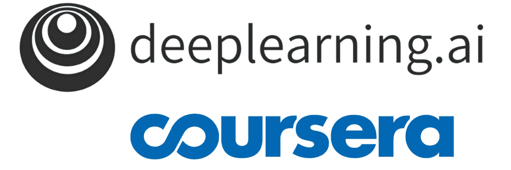

# 深度学习专业化

> 原文：<https://towardsdatascience.com/the-deep-learning-specialization-2503b9ee7ff6?source=collection_archive---------19----------------------->

## Coursera 与吴恩达深度学习专业化述评

[我和](https://www.deeplearning.ai/) [Coursera](http://coursera.org)

*Andrew ' s Ng*[*Coursera 上的深度学习专业化*](https://www.coursera.org/specializations/deep-learning?utm_source=gg&utm_medium=sem&utm_content=17-DeepLearning-ROW&campaignid=6465471773&adgroupid=77415260637&device=c&keyword=coursera%20artificial%20intelligence&matchtype=b&network=g&devicemodel=&adpostion=&creativeid=379493352691&hide_mobile_promo&gclid=CjwKCAjwqJ_1BRBZEiwAv73uwKeBLCU5rjQvvUn8HCl3iQUuV8uKTc0udErdQZ9Qtw7Szga4aIoJDRoC6nQQAvD_BwE) *是网上最著名的机器学习课程之一。许多数据科学家或机器学习工程师在其 Linkedin 的课程部分列出了这一专业。在这篇文章中，我们将探索它的内容，看看它是什么，不是什么，并澄清所有围绕它的炒作。我们开始吧！*

*我最近完成了这个专业，想分享我的经验，拨开迷雾，澄清它是什么，它不是什么，并帮助其他人做出是否接受它的决定。*

***注*** *:我对任何报名参加任何深度学习课程的人都没有任何好处。这篇文章的唯一目标是总结这种专业化，并提供关于它的诚实而深入的评论。*

# 这是什么？

来自 [Flaticon](https://www.flaticon.com/search?word=Machine%20Learning) 的机器学习图标

吴恩达的 [***深度学习专门化***](https://www.coursera.org/specializations/deep-learning?utm_source=gg&utm_medium=sem&utm_content=17-DeepLearning-ROW&campaignid=6465471773&adgroupid=77415260637&device=c&keyword=coursera%20artificial%20intelligence&matchtype=b&network=g&devicemodel=&adpostion=&creativeid=379493352691&hide_mobile_promo&gclid=CjwKCAjwqJ_1BRBZEiwAv73uwKeBLCU5rjQvvUn8HCl3iQUuV8uKTc0udErdQZ9Qtw7Szga4aIoJDRoC6nQQAvD_BwE) 可能是互联网上最著名的机器学习课程。它可以在 Coursera 上获得，它涵盖了成为神经网络专家所需了解的一切内容:从它们的基本形式，到如何构建深度学习项目和图像识别和自然语言处理的最先进网络:卷积和递归神经网络。

它分为 5 个不同的课程，每个课程大约 3-4 周。然而，这个持续时间是相对的，因为它取决于你每天/每周花在课程上的时间。对我来说，我通常可以在大约半周的时间内完成一周的课程，所以我可以在不到两周的时间内完成一门课程。

这类课程的一个主要优势是它们提供的灵活性，所以我建议你花点时间去做，试着深入学习并对内容进行自我测试。

# 是给谁的？

来自[平面图标](https://www.flaticon.com/search?word=Students)的学生图标

这个专业面向拥有数据科学和机器学习知识的人，因为它探索了机器学习的一个特定分支:**深度学习和人工神经网络**。如果你想了解一般的机器学习，并向这个世界迈出第一步，吴恩达还有一门非常著名的课程:*机器学习专门化*，你应该考虑提前选修。

参加*机器学习专业化*然后深度学习是一个非常流畅的过程，会让你成为一个准备非常充分的机器学习从业者。

# 先决条件

从[平面图标](https://www.flaticon.com/search?word=List)中列出图标

用吴恩达在莱克斯·弗里德曼采访中的话说(*这是一个精彩的演讲，关于人工智能、教育和努力工作，我将在这一段*中留下)，为了轻松完成这一专业化，你需要知道基本的编程(用 Python)，并对数学有非常基本的理解(甚至高中数学就足够了)。

安德鲁对莱克斯·弗里德曼的采访

然而，正如我之前提到的，从我的角度来看，如果你已经熟悉了机器学习及其主要概念，你将充分利用这种专业化。

# 内容

来自[平面图标](https://www.flaticon.com/search?word=Content)的内容图标

该专业由 5 门课程组成，每门课程分为不同的周。这些课程如下:

*   **课程一:*神经网络与深度学习*** 。解释如何从一个简单的神经元逻辑回归到一个完整的网络，包括不同的激活功能，向前和向后传播。关于人工神经网络如何工作的最基本的信息将在本课程中解释。
*   **课程二:*改进深度神经网络*** *:* ***超参数调优、正则化和优化*。**尽管不是一门精确的科学，但这门课程提到了如何调整学习速率、层数以及每层中神经元的数量**。**然后介绍了剔除和批量归一化等正则化技术，最后是讨论随机梯度下降、动量、RMS Prop 和 Adam 优化算法的优化部分。
*   **课程三:*结构化机器学习项目*** 。对我来说，这门课程对数据科学家/工程师来说是最有帮助的。这都是关于如何建立你的项目，快速获得结果，并迭代改进这些结果。它为如何诊断我们的模型的结果提供了令人愉快的见解，以便我们可以看到性能问题来自哪里(如果有的话):小的训练集、训练和测试集的不同分布、过度拟合和其他问题，以及它们的解决方案。
*   **课程四:*卷积神经网络*。**本课程是关于图像识别网络的最新发展。它涵盖了 CNN 如何工作，CNN 的不同风格，还详细介绍了它们的起源。然后，它解释了不同的用例，如对象识别，人脸验证，人脸识别，或神经类型转移。
*   **课程五:*序列车型*** 。所有关于递归神经网络:它们如何工作，为什么它们在一些特定的任务中优于传统网络，以及不同类型的优缺点。RNNs，LSTMs，gru 的解释，以及他们如何用于像语音识别，自然语言处理和时间序列分析和预测的任务。

# 课程结构

来自[平面图标](https://www.flaticon.com/search?word=Flow)的结构图标

正如前面几次提到的，课程分为不同的周:从最短的 3 周到最长的 5 周。每周包含**几个短视频**(时长大约从 3 分钟到 15 分钟不等)**一个小测验**和一个**编程练习**。

**视频**以快速介绍开始，然后是一系列涵盖技术内容的幻灯片，最后是对已解释内容的精彩总结，有时还有后续视频的简短通知。它们很有教育意义，而且因为时间长，一点也不难看。其中一些可以在视频速度超过正常速度的情况下被完全理解。

测验有一个类似考试的结构，有关于那一周内容的单项选择和多项选择问题。它们并不是非常难，但是你确实需要很好地理解所解释的内容，并仔细注意这些问题。为了能够在课程中取得进步，你需要在这些测试中获得至少 80/100 的分数，但是你可以想做多少次就做多少次，所以不要担心不及格。

**最后，我们有编程练习**。他们被呈现一个笔记本结构，在那里一周所涉及的材料被划分和解释，有代码块让我们不需要编辑就能运行，而其他的我们必须为某个任务编程。它们是复习概念理论和学习如何在实践中实现它们的绝佳材料。它们的难度相差很大:在前两门课程中，笔记本相当容易，大多数时候代码几乎完全给你了。课程 IV 和 V 有更难的笔记本，上面有挑战你的 Tensorflow 网络实现。同样，这些笔记本是有分数的，你需要一个最低分数才能通过。

在最初的课程中，每周都以一次名为 ***“深度学习的英雄*** ”的采访结束，吴恩达在采访中采访了该领域的某个顶级人物。这是一个很好的补充，绝对值得观看这些视频。

最后，在每门课程**结束时，会给你一张证书**，证明你已经成功完成了课程。

# 概述和意见

来自[平面图标](https://www.flaticon.com/search?word=Opinion)的意见图标

我认为**格式**很棒，有短视频、快速判断题和笔记本**。较长的视频会让人感觉乏味且永无止境，通过这种方式，你可以真正感觉到自己在进步。这也有助于清楚地区分不同的内容，如果学生愿意，他们可以更深入地学习任何内容。**

此外，在课程中，**涵盖了许多实际案例**，讲座通常以真实世界的例子来支持理论，在我看来，这很有帮助，对巩固所获得的知识非常有用。从这个意义上说，第三个课程特别好，有真实的用例作为练习。

我还喜欢的是，尽管有相当坚实的数学基础，但讲座更多地坚持每个优化/结构/方法解决的不同方面，而不是这些数学。它还在培训和应用之间做出了**明确的区分**，这是为了成为令人敬畏的机器学习实践者而在我们的思维方式中创建的基本分离。

总的来说，我认为专业化是学习深度学习和人工神经网络的一个**好资源。它包含大量的材料，测验和笔记本真正测试你对内容的理解。**

我唯一怀念的**是一种期末项目**，可能在每门课程结束时，或者在专业结束时，你必须自己从头开始编写整个项目的代码，然后由审校修改。我知道由于学生人数众多，这样做是不可能的，但也许可以提出一些其他建议。

对我来说，这绝对是值得的时间和金钱，我希望我可以把我所学到的审判很快！如果你也有兴趣做，可以在 Coursera 上找。好好享受吧！

就这些，我希望你喜欢这篇文章。随时 [*在 Twitter 上关注我*](https://twitter.com/Jaimezorno) *在****@ jaimezorno****。还有，你可以看看我在数据科学、统计学、机器学习上的帖子**[***这里***](https://medium.com/@jaimezornoza) *。好好读！**

* [## Jaime Zornoza -中等

### 阅读詹姆·佐诺扎在媒介上的作品。数据科学、机器学习与生活。每天，詹姆·佐诺扎和…

medium.com](https://medium.com/@jaimezornoza)*