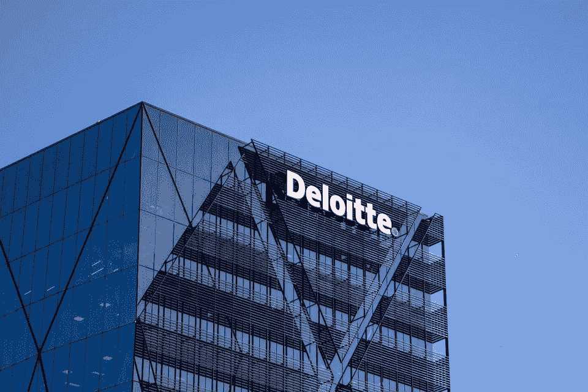

# 德勤数据科学家访谈

> 原文：<https://towardsdatascience.com/the-deloitte-data-scientist-interview-51401d11e14e?source=collection_archive---------42----------------------->

## 德勤数据科学面试问题

图片来自 [Pixabay](https://pixabay.com/photos/skyscraper-deloitte-logo-glass-5489696/)

## 介绍

德勤会计师事务所总部位于纽约，是一家私营跨国公司，提供审计和鉴证、咨询、风险和税务评估以及财务顾问方面的专业服务。自 1845 年成立以来，该公司已发展成为世界上最大的会计和审计公司之一，在全球 150 多个国家开展业务，拥有超过 25 万名员工。

德勤拥有“四大”会计师事务所中最大的客户群，通过其服务产生大量数据，努力利用和分析信息进行业务设计和组织领导。德勤利用“市场领先的端到端分析、信息管理和解决方案组合”，为其客户的业务提供可操作的数据和见解。

# 德勤的数据科学角色

图片来自 [Unsplash](https://unsplash.com/photos/unRkg2jH1j0)

在德勤，数据科学家主要为其他团队提供咨询服务，为决策提供依据和信息。这些角色是专业化的，从完善模型和算法到通过高级分析概念释放洞察力，从而显著提高盈利能力。

通过这种方式，数据科学家可以致力于应用基本的业务分析或统计概念，或者开发和设计预测模型、挖掘数据和优化信息。使用高级分析和建模(AAM)概念，**数据科学家使用机器学习/深度学习模型**和高度技术化的统计技术，以便从内部和外部数据提供端到端的解决方案。

> *来温习一下你的机器学习，* [*回顾一下关于面试查询的“亚马逊机器学习面试问题与解决方案”文章！*](https://www.interviewquery.com/blog-amazon-machine-learning-interview-questions-solutions/)

## 所需技能

鉴于德勤高度专业化的数据科学家角色，该职位的候选人必须在数据相关领域拥有至少 3 年(高级职位为 5 年以上)的咨询或行业经验。

其他相关资格包括:

*   计算机科学、工程、数学、统计学、管理信息、经济学、会计学或其他数据相关领域的学士、硕士或博士。
*   有编程语言经验，如 Python，R，VBA，SQL
*   具有建模和模拟分析经验，如逻辑和线性回归、文本分析、预测分析、自然语言处理、优化、决策树、神经网络或聚类技术。
*   具有结构化、半结构化和非结构化数据的定量分析经验。
*   具有使用 Spark、Kafka、Flink、Hadoop 和 NoSQL 数据存储等大数据技术的经验。
*   使用 Apache Hadoop、MapReduce、Pig & Hive 构建可扩展的高性能数据管道的经验。
*   精通数据提取、转换和加载，以支持高级分析。
*   有 AWS、Azure 或 Google 等基于云的平台的经验。

## 德勤的数据科学团队

德勤的数据科学和分析团队与其他团队合作，通过从客户数据中生成的应用数据决策来释放商业机会。鉴于数据科学家所扮演角色的跨职能方面，工作职责和责任可以从业务或机器学习分析到预测建模。

**分析和认知:**专注于利用数据分析、数学技术和预测建模的力量，从海量数据中发现隐藏的关系。与客户合作实施大规模数据生态系统，包括数据管理、治理以及结构化和非结构化数据的集成，从而深入了解如何利用基于云的平台。

**政府和公共服务(GPS):** 利用德勤客户关系管理(CRM)系统(Salesforce)的销售和渠道分析来支持和改善 GPS 销售。应用自然语言处理(NLP)和机器学习模型来促进研究和收集/设计流程，以挖掘各种业务发展，从而确定提高增长率的方法。

**DevOps:** 与数据工程师合作，构建和维护前沿的人工智能解决方案，为客户提供实时的客户洞察。与数据科学团队合作提供生产级管道，包括构建 ETL 作业以将数据接收到数据库中，管理和编目关于 ETL 数据集的元数据，以及实施数据模型解决方案。

财务和管理:提供专业知识、支持和资源，帮助企业更高效地完成工作。跨职能部门与团队合作，发现高质量的解决方案和创新，以解决当前和未来的挑战。

**工程(德勤数字):**建立和维护最先进的营销平台，为客户提供跨所有渠道(店内、在线、呼叫中心)的客户品牌互动的单一视图。设计、构建和维护先进的数据解决方案，为德勤的客户提供实时的客户洞察，以实现价值。

# 德勤面试流程

图片来自 [Unsplash](https://unsplash.com/photos/5QgIuuBxKwM)

德勤数据科学家面试遵循大多数科技公司标准的数据科学家面试模式。首先是招聘人员打来电话，详细讨论过去的项目或相关经历，以及它们如何融入你面试的数据科学家团队的计划。

*想了解更多关于科技公司数据科学面试的信息吗？* [*阅读“谷歌数据科学家访谈”上的访谈查询！*](https://www.interviewquery.com/blog-the-google-data-scientist-interview/)

通过**仅概述*与团队目标***一致的相关经历 **，给面试留下好印象是很重要的。初次面试后，招聘人员将安排与数据科学家同事、招聘经理和团队经理进行现场面试。**

## 初始屏幕

这是对招聘人员的电话或视频面试，通常持续 30 到 60 分钟。这只是一个标准的“普通”面试，问题围绕着你的背景经历、过去的项目以及可能与工作相关的工作经历。主要的重点将是更多地了解你的背景，同时，你将更多地了解德勤的文化和工作角色。

注意:这次面试可能会包含一些技术元素，所以你要准备一些 SQL 和机器方面的问题。

**样题:**

*   告诉我你不得不与难相处的人一起工作的时候。
*   为什么是咨询，为什么是德勤？

## 现场面试

标准的德勤现场面试流程包括不同的面试轮次，由行为、技术和基于案例的面试组成。

有四到五轮面试(一轮文化契合、两轮行为和两轮技术)，每轮持续 45 分钟，由一组面试官组成:团队成员、其他数据科学家、高级经理、招聘经理和合作伙伴/主管。面试问题是基于案例研究的，有时是开放式的。技术问题是标准化的，涵盖了广泛的数据科学概念。

典型的德勤数据科学家访谈包括:

*   **行为访谈:**这是与合作伙伴/客户的访谈。
*   **文化契合面试:**这是一次与高级经理的面试，围绕过去的项目以及它们与工作角色的关系。
*   **招聘经理的技术面试:**潜在的问题包括 Python、SQL、R、基础统计和概率。
*   **与经理的另一次技术面试:**这是一次评估你的核心机器学习算法知识的面试。它还评估你的数学解决能力和商业领域知识。

# 注意事项和提示

图片来自 [Unsplash](https://unsplash.com/photos/Ua-agENjmI4)

请记住，德勤数据科学家面试流程旨在**评估候选人利用数据科学概念提供基于科学和数据驱动的见解的能力**。德勤聘请具有丰富行业经验的专家，他们可以利用数据分析来解决问题，发现新的见解，并帮助德勤的客户提高决策质量。

*   德勤的数据科学家面试问题是标准化的，可以跨越广泛的数据科学概念。记得复习你的统计学、逻辑回归、时间序列、SQL、机器学习和预测建模知识。在白板上练习编码和在[interviewquery.com](https://www.interviewquery.com/)上练习中级数据科学家问题可以帮助你为技术现场面试做好心理准备。

*有关不同数据科学采访的更多信息，请在采访查询中查看“Lyft 数据科学家采访”。*

# 德勤数据科学家面试问题

*   你将如何为想与最好的出租车公司竞争的客户解决问题？
*   你最喜欢的 ML 算法是什么？
*   随机森林和额外树分类器有什么区别？
*   给亚马逊这样的电商网站设计一个数据库？

# 感谢阅读

*   希望在数据科学面试中胜出？查看 [**面试查询**](https://www.interviewquery.com/) **！**
*   前往我的 [**Youtube 频道**](https://www.youtube.com/channel/UCcQx1UnmorvmSEZef4X7-6g) 获取更多面试指南，以及解决问题的技巧&。
*   在面试查询博客上找到更多数据科学面试指南，如 [**Lyft 数据科学家面试**](https://www.interviewquery.com/blog-lyft-data-scientist-interview/) 和 [**谷歌数据科学家面试**](https://www.interviewquery.com/blog-the-google-data-scientist-interview/) 。

*原载于 2020 年 7 月 6 日 https://www.interviewquery.com**的* [*。*](https://www.interviewquery.com/blog-the-deloitte-data-scientist-interview/)