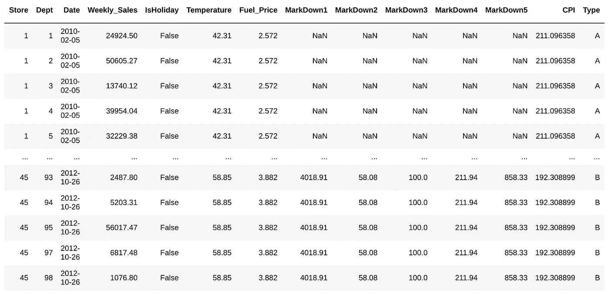
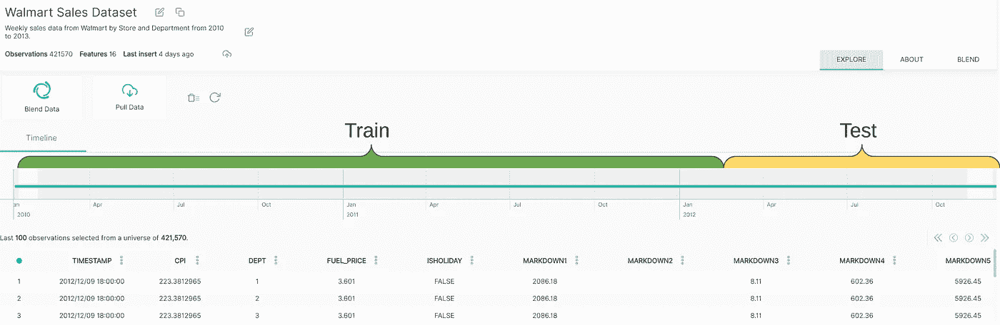
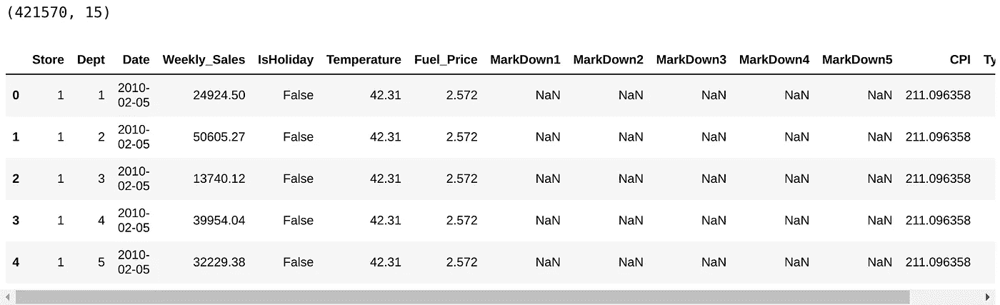
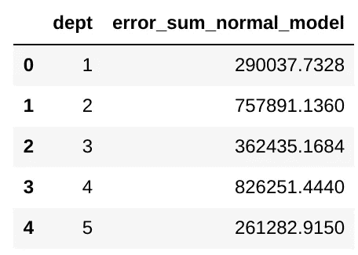
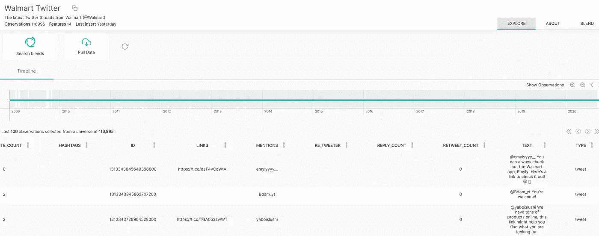
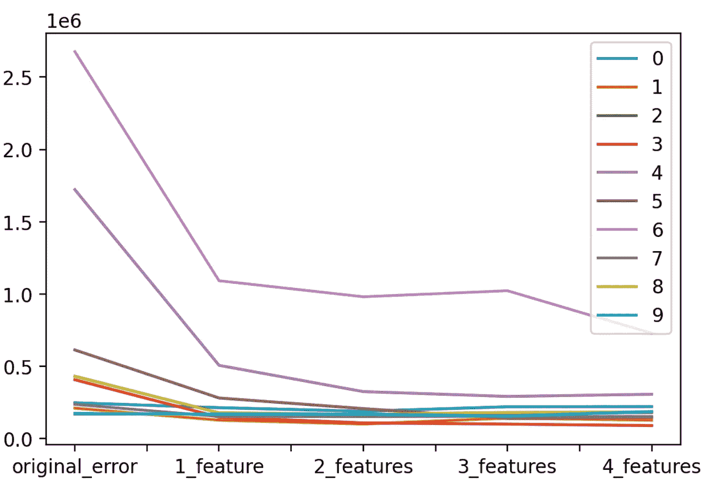
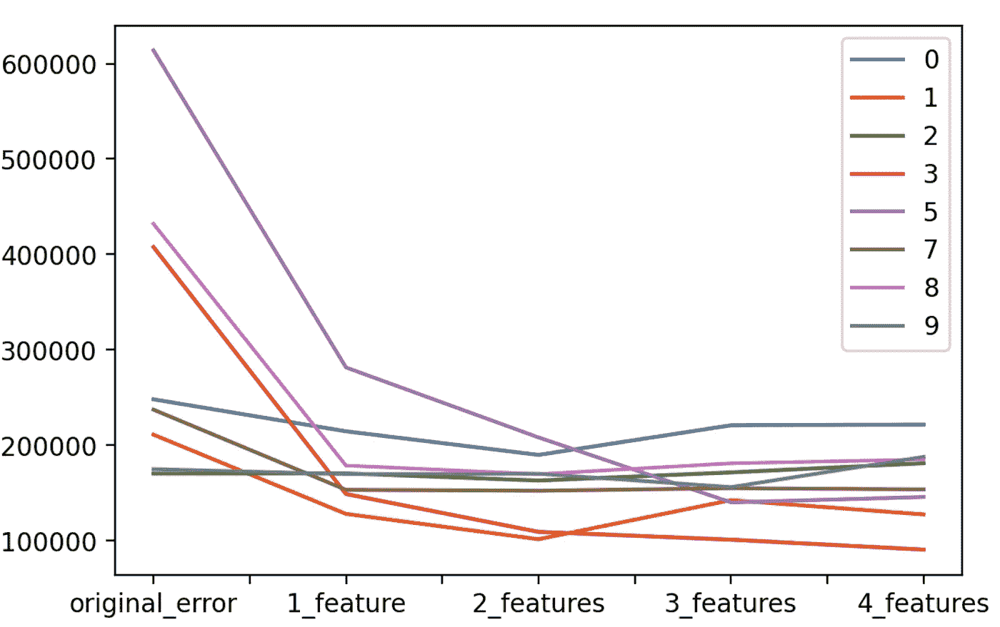
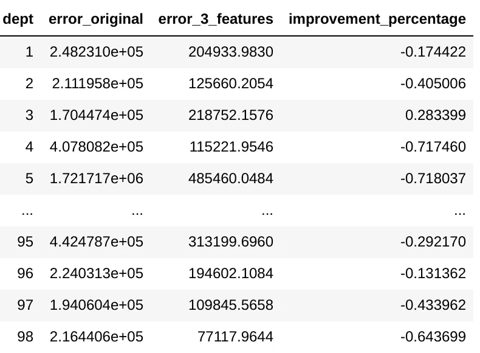
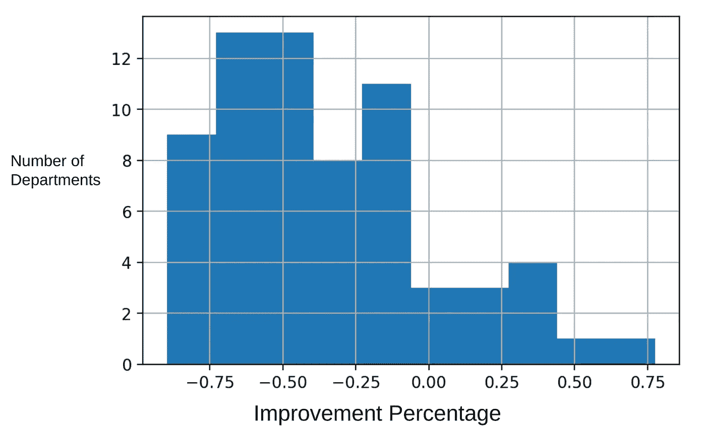

# 每个数据科学家都应该使用需求销售预测技术来减少错误

> 原文：<https://towardsdatascience.com/the-demand-sales-forecast-technique-every-data-scientist-should-be-using-to-reduce-error-1c6f25add9cb?source=collection_archive---------24----------------------->

## 使用 Python 在分步教程中创建破纪录的需求销售预测

> 为了更好地了解市场，组织有责任超越他们自己的四面墙去寻找数据源

Douglas Laney(Gartner Research 副总裁)


图片来自 Shutterstock

# 介绍

世界上成千上万的公司，从小创业公司到全球公司，都发现**能够**准确预测销售**的巨大价值**，这几乎总是他们的数据科学/分析团队的优先事项之一。

然而，他们似乎都**试图通过主要关注**两件事**来提高精度**(减少误差):

1) **功能工程**(充分利用您的功能)

2) **模型/参数优化**(选择最佳模型&最佳参数)

以上两者确实非常必要，但是还有第三件事，即**以一种互补的方式增加价值**，并且它不仅在这个用例中，而且在大多数数据科学项目中都被广泛地低估了:

*   **结合外部信息**。

在本文中，我们将做一个简单的销售**预测模型**，然后**混合外部变量**(正确完成)。

# 我们要做什么

*   第一步:定义并理解**目标**
*   第二步:制作一个**简单预测模型**
*   第三步:添加**财务指标和新闻**
*   第四步:测试**型号**
*   步骤 5:测量**结果**

# 第一步。定义和理解目标

流行的 [**沃尔玛销售预测**](https://www.kaggle.com/c/walmart-recruiting-store-sales-forecasting) 竞赛已经有好几个实施来预测他们的销售额。


来自 Kaggle 比赛的截图

在本文中，我们将使用数据，并通过结合外部信息来改进模型。

沃尔玛发布了包含每个实体店 99 个部门(服装、电子产品、食品……)的**周销售额**以及一些其他附加功能的数据。



沃尔玛数据集截图

为此，我们将**创建一个 ML 模型**，以“ *Weekly_Sales”为目标，*使用前 70%的观察值进行训练，并在后 30%进行测试。

目标是**最小化未来周销售额的预测误差**。


我们将**添加影响销售或与销售有关系的外部变量**，如**美元**指数、**石油**价格和关于沃尔玛的**新闻**。

我们**不会**使用模型/参数优化**或**特征工程，因此我们可以区分**收益** **和添加**外部特征。

# 第二步。制作一个简单的预测模型

首先，您需要安装 Python 3 和以下库:

```
$ pip install pandas OpenBlender scikit-learn
```

然后，打开一个 Python 脚本(最好是 Jupyter notebook)，让我们导入所需的库。

```
from sklearn.ensemble import RandomForestRegressor
import pandas as pd
import OpenBlender
import json
```

现在，让我们定义用于所有实验的方法和模型。

**首先是**，数据的*日期范围*是从 2010 年 1 月到 2012 年 12 月**。**让我们定义用于**训练**的数据的第一个 **70%** 和用于**测试**的后一个 **30%** (因为我们不希望我们的预测出现数据泄漏)。



**接下来**，让我们定义一个**标准模型**和一个*随机森林回归量*，有 50 个估计量，这是一个相当好的选择。

最后，为了使事情尽可能简单，让我们将误差定义为误差的绝对和。


现在，让我们把它放到一个 Python 类中。

```
class **StandardModel**:

    model = RandomForestRegressor(n_estimators=50, criterion='mse')

    def **train**(self, df, target):        
# Drop non numerics
        df = df.dropna(axis=1).select_dtypes(['number'])        
# Create train/test sets
        X = df.loc[:, df.columns != target].values
        y = df.loc[:,[target]].values        
# We take the first bit of the data as test and the 
        # last as train because the data is ordered desc.
        div = int(round(len(X) * 0.29))        
        X_train = X[div:]
        y_train = y[div:]        
        print('Train Shape:')
        print(X_train.shape)
        print(y_train.shape)        
#Random forest model specification
        self.model = RandomForestRegressor(n_estimators=50)        
# Train on data
        self.model.fit(X_train, y_train.ravel()) def **getMetrics**(self, df, target):
        # Function to get the error sum from the trained model        # Drop non numerics
        df = df.dropna(axis=1).select_dtypes(['number'])        
# Create train/test sets
        X = df.loc[:, df.columns != target].values
        y = df.loc[:,[target]].values        
        div = int(round(len(X) * 0.29))        
        X_test = X[:div]
        y_test = y[:div]        
        print('Test Shape:')
        print(X_test.shape)
        print(y_test.shape)# Predict on test
        y_pred_random = self.model.predict(X_test)        
# Gather absolute error
        error_sum = sum(abs(y_test.ravel() - y_pred_random))        
        return error_sum
```

上面我们有一个包含 3 个元素的对象:

*   **模型** (RandomForestRegressor)
*   **训练:**用数据帧和目标训练模型功能
*   **getMetrics:** 用测试数据对训练好的模型进行测试并检索错误的函数

我们将在所有实验中使用这种配置，尽管您可以根据需要修改它来测试不同的模型、参数、配置或其他任何东西。附加值将保持不变，并有可能提高。

现在，让我们得到沃尔玛的数据。你可以在这里得到那个 CSV。

```
df_walmart = pd.read_csv('walmartData.csv')
print(df_walmart.shape)
df_walmart.head()
```



有 421，570 个观察值。如前所述，观察值是每个部门每个商店的每周销售额的记录。

让我们将数据插入到模型中，而不要篡改它。

```
our_model = StandardModel()
our_model.train(df_walmart, 'Weekly_Sales')
total_error_sum = our_model.getMetrics(df_walmart, 'Weekly_Sales')
print("Error sum: " + str(total_error_sum))*> Error sum: 967705992.5034052*
```

整个模型的所有误差总和为 **$ 967，705，992.5 美元**。

这个本身没有太大的意义，唯一的参考就是那个时期所有销售额的总和 **$ 6，737，218，987.11 美元**。

由于有大量的数据，在本教程中，我们将**仅关注商店#1** ，但该方法绝对可用于所有商店。

再来看看**商店 1** 单独产生的**错误**。

```
# Select store 1
df_walmart_st1 = df_walmart[df_walmart['Store'] == 1]# Error of store 1
error_sum_st1 = our_model.getMetrics(df_walmart_st1, 'Weekly_Sales')
print("Error sum: " + str(error_sum_st1))**# > Error sum: 24009404.060399983**
```

因此，商店 1 应对**24，009，404.06 美元**误差负责，而**这个** **将是我们进行比较的阈值。**

现在，让我们按部门分解错误，以便稍后有更多的可见性。

```
error_summary = []
for i in range(1,100):
    try:
        df_dept = df_walmart_st1[df_walmart_st1['Dept'] == i]
        error_sum = our_model.getMetrics(df_dept, 'Weekly_Sales')
        print("Error dept : " + str(i) + ' is: ' + str(error_sum))
        error_summary.append({'dept' : i, 'error_sum_normal_model' : error_sum})
    except: 
        error_sum = 0
        print('No obs for Dept: ' + str(i))
error_summary_df = pd.DataFrame(error_summary)
error_summary_df.head()
```



现在，我们有了一个数据框架，其中包含了与阈值模型中商店 1 的每个部门相对应的错误。

让我们**提高**这些数字。

# 第三步。添加财务指标和新闻

让我们选择部门 1 作为一个简单的例子。

```
df_st1dept1 = df_walmart_st1[df_walmart_st1['Dept'] == 1]
```

现在，让我们搜索相交的数据集。

```
# First we need to add the **UNIX timestamp** which is the number 
# of seconds since 1970 on UTC, it is a very convenient 
# format because it is the same in every time zone in the world!df_st1dept1['timestamp'] = OpenBlender.dateToUnix(df_st1dept1['Date'], 
                       date_format = '%Y-%m-%d', 
                       timezone = 'GMT')df_st1dept1 = df_st1dept1.sort_values('timestamp').reset_index(drop = True)
```

现在，让我们在 OpenBlender 中搜索关于“商业”或“沃尔玛”的时间交叉(重叠)数据集。

**注意:**要获得您*需要的令牌*必须在 [openblender.io](https://www.openblender.io/#/welcome/or/39) (免费)上创建一个帐户，您可以在个人资料图标的“帐户”选项卡中找到它。


```
token = '**YOUR_TOKEN_HERE**'print('From : ' + OpenBlender.unixToDate(min(df_st1dept1.timestamp)))
print('Until: ' + OpenBlender.unixToDate(max(df_st1dept1.timestamp)))# Now, let's search on OpenBlender
search_keyword = 'business walmart'# We need to pass our timestamp column and 
# search keywords as parameters.
OpenBlender.searchTimeBlends(token,
                             df_st1dept1.timestamp,
                             search_keyword)
```


搜索找到了几个数据集。我们可以看到名称、描述、url、特征，最重要的是，我们的时间交互，因此我们可以将它们混合到我们的数据集。

让我们从混合这个[沃尔玛推文](https://www.openblender.io/#/dataset/explore/5e1deeda9516290a00c5f8f6/or/39)数据集开始，寻找宣传片。



*   注意:我选择这个是因为它有意义，但是你可以搜索成百上千个其他的。

我们可以**通过搜索按时间聚合的文本或新闻，将新的列混合到我们的数据集**中。例如，我们可以创建一个“ **promo** ”功能，其提及次数将与我们自制的 ngrams 相匹配:

```
**text_filter** = {'name' : 'promo', 
               'match_ngrams': ['promo', 'dicount', 'cut', 'markdown','deduction']}# **blend_source** needs the id_dataset and the name of the feature.blend_source = {
                'id_dataset':'**5e1deeda9516290a00c5f8f6**',
                'feature' : '**text**',
                'filter_text' : **text_filter**
            }df_blend = OpenBlender.timeBlend( token = token,
                                  anchor_ts = df_st1dept1.timestamp,
                                  blend_source = blend_source,
                                  blend_type = 'agg_in_intervals',
                                  interval_size = 60 * 60 * 24 * 7,
                                  direction = 'time_prior',
                                  interval_output = 'list')df_anchor = pd.concat([df_st1dept1, df_blend.loc[:, df_blend.columns != 'timestamp']], axis = 1)
```

timeBlend 功能的参数(您可以在此处找到文档[):](https://www.openblender.io/#/api_documentation)

*   **anchor_ts** :我们只需要发送我们的时间戳列，这样它就可以作为一个锚来混合外部数据。
*   **blend_source** :关于我们想要的特性的信息。
*   **blend _ type**:‘agg _ in _ intervals’因为我们希望对我们的每个观察进行 1 周时间间隔的聚合。
*   **inverval_size** :间隔的大小，以秒为单位(本例中为 24 * 7 小时)。
*   **方向**:‘time _ prior’因为我们希望间隔收集前 7 天的观察值，而不是转发以避免数据泄漏。

我们现在有了我们的原始数据集，但是增加了两个新列，我们的“推广”功能的“计数”和一个实际文本的列表，以防有人想要遍历每个文本。

```
df_anchor.tail()
```


现在我们有了一个数字特征，关于我们的 ngrams 被提及的次数。如果我们知道哪个商店或部门对应于“1”，我们可能会做得更好。

让我们应用标准模型，并将误差与原始值进行比较。

```
our_model.train(df_anchor, 'Weekly_Sales')
error_sum = our_model.getMetrics(df_anchor, 'Weekly_Sales')
error_sum#> 253875.30
```

目前的模型有 253，975 美元的误差，而以前的模型有 290，037 美元的误差。这是一个 **12%** 的改进。

但是这个**证明不了什么**，可能是随机森林运气好。毕竟，原始模型是用超过 299K 的观测值训练的。目前的一架**只训练了 102 架！！**

我们也可以混合数字特征。让我们尝试混合[美元指数](https://www.openblender.io/#/dataset/explore/5e91029d9516297827b8f08c)、[油价](http://5e91045a9516297827b8f5b1)和[月度消费者情绪](https://www.openblender.io/#/dataset/explore/5e979cf195162963e9c9853f)

```
**# OIL PRICE**blend_source = {
                'id_dataset':'5e91045a9516297827b8f5b1',
                'feature' : 'price'
            }df_blend = OpenBlender.timeBlend( token = token,
                                  anchor_ts = df_anchor.timestamp,
                                  blend_source = blend_source,
                                  blend_type = 'agg_in_intervals',
                                  interval_size = 60 * 60 * 24 * 7,
                                  direction = 'time_prior',
                                  interval_output = 'avg')df_anchor = pd.concat([df_anchor, df_blend.loc[:, df_blend.columns != 'timestamp']], axis = 1)**# DOLLAR INDEX**blend_source = {
                'id_dataset':'5e91029d9516297827b8f08c',
                'feature' : 'price'
            }df_blend = OpenBlender.timeBlend( token = token,
                                  anchor_ts = df_anchor.timestamp,
                                  blend_source = blend_source,
                                  blend_type = 'agg_in_intervals',
                                  interval_size = 60 * 60 * 24 * 7,
                                  direction = 'time_prior',
                                  interval_output = 'avg')df_anchor = pd.concat([df_anchor, df_blend.loc[:, df_blend.columns != 'timestamp']], axis = 1)**# CONSUMER SENTIMENT**blend_source = {
                'id_dataset':'5e979cf195162963e9c9853f',
                'feature' : 'umcsent'
            }df_blend = OpenBlender.timeBlend( token = token,
                                  anchor_ts = df_anchor.timestamp,
                                  blend_source = blend_source,
                                  blend_type = 'agg_in_intervals',
                                  interval_size = 60 * 60 * 24 * 7,
                                  direction = 'time_prior',
                                  interval_output = 'avg')df_anchor = pd.concat([df_anchor, df_blend.loc[:, df_blend.columns != 'timestamp']], axis = 1)df_anchor
```


现在我们又有了 **6 个特征**，石油指数、美元指数和消费者情绪在 7 天时间间隔内的平均值，以及每个特征的计数(这在本例中是不相关的)。

让我们再运行一次那个模型。

```
our_model.train(df_anchor, 'Weekly_Sales')
error_sum = our_model.getMetrics(df_anchor, 'Weekly_Sales')
error_sum>223831.9414
```

现在，我们减少到 223，831 美元的错误。相对于最初的 290，037 美元，提高了**24.1%**！！

现在，让我们分别对每个部门进行尝试，以衡量收益的一致性。

# 第四步。在所有部门进行测试

为了一目了然，我们将首先对**前 10 个**部门进行实验，并比较添加每个额外资源的**优势。**

```
**# Function to filter features from other sources**def excludeColsWithPrefix(df, prefixes):
    cols = df.columns
    for prefix in prefixes:
        cols = [col for col in cols if prefix not in col]
    return df[cols]error_sum_enhanced = []**# Loop through the first 10 Departments and test them.**for dept in range(1, 10):
    print('---')
    print('Starting department ' + str(dept))

    # Get it into a dataframe
    df_dept = df_walmart_st1[df_walmart_st1['Dept'] == dept]

    # Unix Timestamp
    df_dept['timestamp'] = OpenBlender.dateToUnix(df_dept['Date'], 
                                           date_format = '%Y-%m-%d', 
                                           timezone = 'GMT')df_dept = df_dept.sort_values('timestamp').reset_index(drop = True)

    **# "PROMO" FEATURE OF MENTIONS ON WALMART**

    text_filter = {'name' : 'promo', 
               'match_ngrams': ['promo', 'dicount', 'cut', 'markdown','deduction']}

    blend_source = {
                    'id_dataset':'5e1deeda9516290a00c5f8f6',
                    'feature' : 'text',
                    'filter_text' : text_filter
                }df_blend = OpenBlender.timeBlend( token = token,
                                      anchor_ts = df_st1dept1.timestamp,
                                      blend_source = blend_source,
                                      blend_type = 'agg_in_intervals',
                                      interval_size = 60 * 60 * 24 * 7,
                                      direction = 'time_prior',
                                      interval_output = 'list')df_anchor = pd.concat([df_st1dept1, df_blend.loc[:, df_blend.columns != 'timestamp']], axis = 1)

    **# OIL PRICE** blend_source = {
                    'id_dataset':'5e91045a9516297827b8f5b1',
                    'feature' : 'price'
                }df_blend = OpenBlender.timeBlend( token = token,
                                      anchor_ts = df_anchor.timestamp,
                                      blend_source = blend_source,
                                      blend_type = 'agg_in_intervals',
                                      interval_size = 60 * 60 * 24 * 7,
                                      direction = 'time_prior',
                                      interval_output = 'avg',
                                      missing_values = 'impute')df_anchor = pd.concat([df_anchor, df_blend.loc[:, df_blend.columns != 'timestamp']], axis = 1)**# DOLLAR INDEX**blend_source = {
                    'id_dataset':'5e91029d9516297827b8f08c',
                    'feature' : 'price'
                }df_blend = OpenBlender.timeBlend( token = token,
                                      anchor_ts = df_anchor.timestamp,
                                      blend_source = blend_source,
                                      blend_type = 'agg_in_intervals',
                                      interval_size = 60 * 60 * 24 * 7,
                                      direction = 'time_prior',
                                      interval_output = 'avg',
                                      missing_values = 'impute')df_anchor = pd.concat([df_anchor, df_blend.loc[:, df_blend.columns != 'timestamp']], axis = 1)**# CONSUMER SENTIMENT**blend_source = {
                    'id_dataset':'5e979cf195162963e9c9853f',
                    'feature' : 'umcsent'
                }df_blend = OpenBlender.timeBlend( token = token,
                                      anchor_ts = df_anchor.timestamp,
                                      blend_source = blend_source,
                                      blend_type = 'agg_in_intervals',
                                      interval_size = 60 * 60 * 24 * 7,
                                      direction = 'time_prior',
                                      interval_output = 'avg',
                                      missing_values = 'impute')df_anchor = pd.concat([df_anchor, df_blend.loc[:, df_blend.columns != 'timestamp']], axis = 1)

    try:

        error_sum = {}

        # Gather errors from every source by itself# Dollar Index
        df_selection = excludeColsWithPrefix(df_anchor, ['WALMART_TW', 'US_MONTHLY_CONSUMER', 'OIL_INDEX'])
        our_model.train(df_selection, 'weekly_sales') error_sum['1_features'] = our_model.getMetrics(df_selection, 'weekly_sales')

        # Walmart News
        df_selection = excludeColsWithPrefix(df_anchor, [ 'US_MONTHLY_CONSUMER', 'OIL_INDEX'])
        our_model.train(df_selection, 'weekly_sales') error_sum['2_feature'] = our_model.getMetrics(df_selection, 'weekly_sales')

        # Oil Index
        df_selection = excludeColsWithPrefix(df_anchor,['US_MONTHLY_CONSUMER'])
        our_model.train(df_selection, 'weekly_sales') error_sum['3_features'] = our_model.getMetrics(df_selection, 'weekly_sales')

        # Consumer Sentiment (All features)
        df_selection = df
        our_model.train(df_selection, 'weekly_sales') error_sum['4_features'] = our_model.getMetrics(df_selection, 'weekly_sales')

    except:
        import traceback
        print(traceback.format_exc())
        print("No observations found for department: " + str(dept))
        error_sum = 0

    error_sum_enhanced.append(error_sum)
```

让我们把结果放到一个数据框架中，然后可视化。

```
separated_results = pd.DataFrame(error_sum_enhanced)
separated_results['original_error'] = error_summary_df[0:10]['error_sum_normal_model']separated_results = separated_results[['original_error', '1_feature', '2_features', '3_features', '4_features']] separated_results.transpose().plot(kind='line')
```



部门 4 和 6 的级别比其他部门高，让我们将它们移除，以便更仔细地了解其他部门。

```
separated_results.drop([6, 4]).transpose().plot(kind=’line’)
```



我们可以看到，随着我们**增加新功能**，几乎所有部门的错误都降低了。我们还可以看到，石油指数(第三个特征)对某些部门不仅没有帮助，甚至是有害的。

我排除了石油指数，并在所有部门上运行具有 3 个特征**的算法(这可以通过迭代所有 *error_summary_df* 而不仅仅是前 10 个来完成)。**

让我们看看结果。

# 第五步。测量结果

这些是所有部门的“3 个特征”混合和改进百分比**的结果:**



添加的功能**不仅改善了超过 88%的部门的错误**，而且一些改进是显著的。

这是**改善百分比的直方图。**



原始误差(在文章开头计算)为**24，009，404.06 美元**，最终误差为**9，596，215.21 美元**，表示**减少了 60%以上**

而这只是**一家店**。

感谢您的阅读。