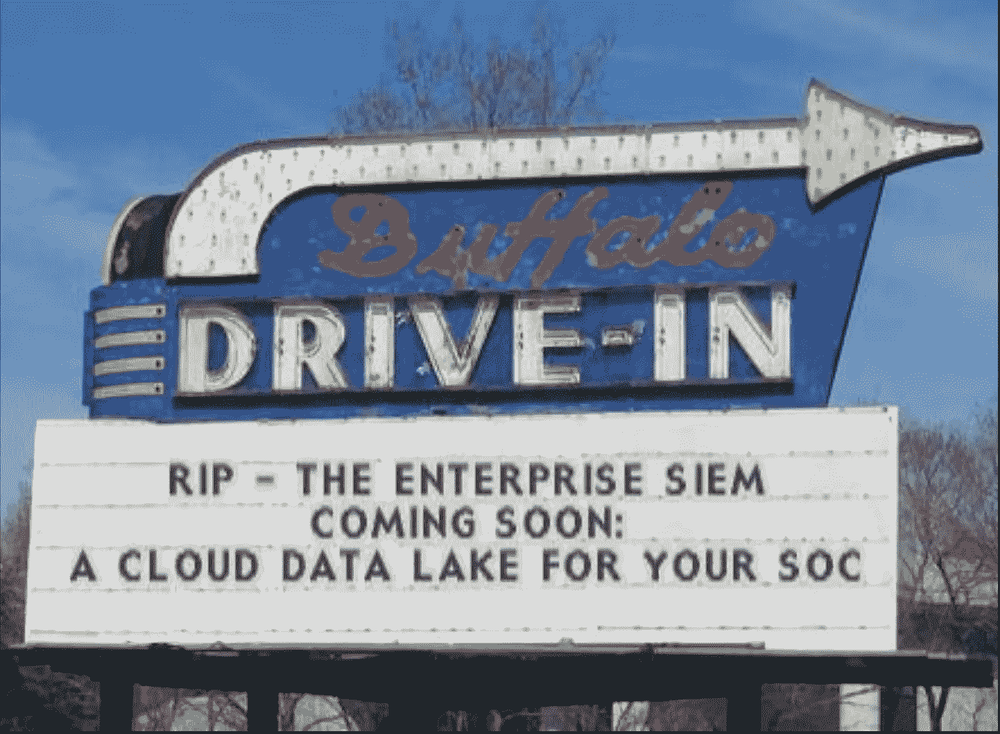

# SIEM 的消亡助长了安全数据湖的兴起

> 原文：<https://towardsdatascience.com/the-demise-of-the-siem-fuels-the-rise-of-security-data-lake-dace0df83306?source=collection_archive---------16----------------------->

激动人心的景点就在前方；阅读下面的“电影评论”。(图片来源:[http://www.redkid.net/generator/sign.php](http://www.redkid.net/generator/sign.php))

十年前，日志管理通常用于为法规遵从性和安全性用例捕获和保留事件。随着对手及其 TTP 变得越来越复杂，简单的日志记录演变为安全信息和事件管理(SIEM ),规则驱动的关联功能使得将原始事件数据转化为潜在的有价值情报成为可能。尽管实现并使一切正常工作具有挑战性，但找到所谓的“大海捞针”并识别正在进行的攻击的能力是一个巨大的进步。

今天，SIEM 仍然存在，市场主要由 Splunk 和 IBM Q-Radar 主导。许多客户最终转向了云原生部署，并且正在利用机器学习和复杂的行为分析。然而，新的企业部署更少，成本更高，最重要的是，CISO 和 SOC 中辛勤工作的团队的整体需求发生了变化。这些需求已经发生了变化，因为安全团队几乎普遍认识到他们正在输给坏人。减少对 SIEM 的依赖以及许多其他变化正在顺利进行。SIEM 不会消失，但它的角色正在迅速变化，它在 SOC 中有了一个新的合作伙伴。

# **为什么暹罗的作用正在迅速减弱？**

1.  这是**过于狭隘的关注**:仅仅收集安全事件已经不够了，因为这个数据集上的窗口太窄了。虽然在您的事件中可能有大量的事件数据要捕获和处理，但您却错过了大量的附加信息，如 OSINT(开源情报信息)、可消费的外部威胁源，以及恶意软件和 IP 信誉数据库等有价值的信息，甚至是来自黑暗网络活动的报告。情报来源无穷无尽，对于 SIEM 的架构来说太多了。
2.  **成本**(数据爆炸+硬件+许可证成本=糟糕的结果) **:** 有了如此多的物理和虚拟基础架构，被捕获的信息量已经爆炸式增长。机器生成的数据增长了 50 倍，而平均安全预算年增长率为 14%。存储所有这些信息的成本使得 SIEM 成本过高。SIEM 的平均成本已经飙升到接近[每年 100 万美元](https://foresite.com/true-cost-siem-security-information-event-management/)，这还只是许可证和硬件成本。经济因素迫使 SOC 中的团队捕获和/或保留更少的信息，以试图控制成本。这导致 SIEM 的有效性进一步降低。我最近与一个 SOC 团队进行了交谈，该团队希望查询大型数据集以寻找欺诈的证据，但在 Splunk 中这样做成本高昂，而且过程缓慢而艰难，因此需要努力探索新的方法。

结果是可怕的—[pone mon Institute 最近的一项调查](https://www.businesswire.com/news/home/20190730005215/en/Ponemon-Study-53-Percent-of-IT-Security-Leaders-Don%E2%80%99t-Know-if-Cybersecurity-Tools-are-Working-Despite-an-Average-of-18.4-Million-Annual-Spend)调查了近 600 名 IT 安全负责人，发现尽管每年平均花费 1840 万美元，平均使用 47 种产品，高达 53%的 IT 安全负责人“甚至不知道他们的产品是否工作”。显然，改变是理所应当的！

# **进入安全数据湖**

安全驱动的数据可能是多维的、动态的和异构的，因此，数据仓库解决方案在提供用户需要的敏捷性和性能方面效率较低。数据湖被认为是数据仓库的一个子集，然而，就灵活性而言，它是一个重大的进步。数据湖更加灵活，支持原生格式的非结构化和半结构化数据，可以包括日志文件、提要、表格、文本文件、系统日志等。您可以流式传输您的所有安全数据，没有一个被拒绝，一切都将被保留。安全团队可以以较低的成本轻松实现这一点。例如，如果在 S3 桶中，则为每月每 GB 0.03 美分。这种能力使数据湖成为 SIEM 的倒数第二次进化。

(图片来源:[http://www.redkid.net/generator/sign.php](http://www.redkid.net/generator/sign.php))

如果您正在构建一个安全数据湖，您将能够专注于更具战略性的活动:

*   **威胁追踪:**老练的对手知道如何隐藏和躲避现成安全解决方案的检测。高度熟练的安全团队将跟踪触发器(可能是可疑的 IP 或事件),并继续攻击，在损害发生之前找到并补救攻击者。威胁搜寻团队的经验是成功的最关键因素，但是，他们高度依赖于大量的威胁情报，因此他们可以交叉引用他们在内部观察到的情况，并使用最新的威胁情报来关联和检测真实的攻击。
*   **数据驱动调查:**每当检测到可疑活动，分析师就会开始调查。为了有效，这必须是一个迅速的过程。在典型组织中，行业平均使用 47 种安全产品，这使得访问所有相关数据变得非常困难。但是，有了安全数据湖，您可以将所有的侦察信息流入数据湖，并消除收集日志的耗时工作。该过程的价值在于将新观察到的行为与历史趋势进行比较，有时与跨越 10 年的数据集进行比较。在传统的 SIEM 中，这将是成本过高的。

数据湖在加载数据时自动处理数据(称为解析)，使安全团队更容易专注于他们工作中最关键的元素，防止或阻止攻击。

大量的历史数据，通常追溯到十年前，以确定特定的模式是典型的还是异常的。

# 有趣的公司为您的安全数据湖提供动力:

如果你正计划部署一个安全数据湖或者已经有了，这里有**三家尖端公司**你应该知道。我不是这些公司中任何一家的员工，但我对它们非常熟悉，并且相信每家公司都会以一种非常有意义的方式改变我们的行业，并且可以转变您自己的安全数据湖计划。

1.  团队 Cymru 是你还没听说过的最强大的安全公司。他们组装了一个全球性的传感器网络，当互联网上基于 IP 的流量通过 ISP 时，它会“监听”这些流量，并且可以“看到”，因此比典型 SOC 中的任何人都知道得多。他们通过将这些数据出售给大型公共安全公司来建立公司，如 Crowdstrike、 [FireEye](https://www.fireeye.com/mandiant/threat-intelligence/threat-intelligence-subscriptions.html) 、[微软](https://www.microsoft.com/en-us/security/business/solutions)，以及现在的 Palo Alto Networks，上周他们以 8 亿美元收购了[expense](https://www.cnbc.com/2020/11/16/palo-alto-networks-ceo-new-acquisition-provides-security-from-hackers-view.html)。此外，JPMC 和沃尔玛的尖端足球团队正在接受我在这篇文章中支持的东西，并利用 Cymru 的遥测数据馈送。现在，您可以访问相同的数据，您将希望他们的 50 多种数据类型和 10 多年的数据湖中的情报帮助您的团队根据某些特征(如 IP 或其他签名)更好地识别对手和不良行为者。
2.  [**Varada.io** :](http://www.varada.io) 安全数据湖的全部价值在于轻松、快速、自由地访问大量信息。它消除了移动和复制数据的需要，并提供了用户所需的敏捷性和灵活性。随着数据湖的增长，查询变得越来越慢，需要大量的数据操作来满足业务需求。云存储可能很便宜，但计算很快变得非常昂贵，因为查询引擎通常基于完全扫描。Varada 通过索引和虚拟化任何维度的所有关键数据解决了这个问题。数据以粒度形式保存在更接近 SOC 的 SSD 卷上，因此数据消费者可以在需要时随时利用最大的灵活性来运行任何查询。好处是通过避免耗时的全扫描，查询响应速度提高了 100 倍，而且成本更低。这支持诸如搜索攻击指标、事件后调查、完整性监控和威胁搜寻等工作负载。Varada 是如此的创新，以至于数据供应商 Starburst 最近刚刚收购了他们。
3.  [**Panther:**](http://www.panther.com)**snow flake 是一个广受欢迎的数据平台，主要面向中端市场和企业部门使用。它不是 SIEM，没有安全功能。来自 AWS 和 Airbnb 的工程师创建了 Panther，这是一个威胁检测和调查平台。该公司最近将 Panther 与 Snowflake 连接起来，能够将两个平台之间的数据连接起来，使 Snowflake 成为“下一代 SIEM ”,或者更好的定位是将 Snowflake 发展成为一个高性能、经济高效的安全数据湖。它仍然是一个较新的解决方案，但它是一个很酷的想法，有很大的前景，并且已经在 Dropbox 等公司以令人印象深刻的速度取代了 Splunk 的实施。如果你想知道未来会是什么样子，你甚至可以在这里免费试用。**

**总的来说，安全组织平均每年花费 1800 万美元，但在防止违规、知识产权盗窃和数据丢失方面却收效甚微。零敲碎打的方法没有奏效。安全数据湖虽然不是一种简单的“现成”方法，但它将您所有的关键威胁和事件数据集中在一个大型的中央存储库中，而且访问简单。它仍然可以利用现有的 SIEM，该 SIEM 可能会利用相关性、机器学习算法甚至人工智能来通过评估模式来检测欺诈，然后触发警报。无论如何配置，安全数据湖都是您应该考虑的令人兴奋的一步，还有我在本文中提到的三家创新公司。**

**我很想听听您对安全数据湖如何帮助您和您的团队的看法，以及它对您现有的 SIEM 投资意味着什么。你可以直接联系 dan@hightide-advisors.com 或 https://www.linkedin.com/in/schoenbaum。**

**如果你想阅读更多我的文章——专注于网络安全，并为投资者和高管提供如何改善公司走向市场的建议，可以在这里找到:[https://schoenbaum.medium.com/](https://schoenbaum.medium.com/)**