# 民主党的推特战争

> 原文：<https://towardsdatascience.com/the-democratic-twitter-wars-e83e18f4433d?source=collection_archive---------31----------------------->

## 每位候选人如何在网上争夺提名

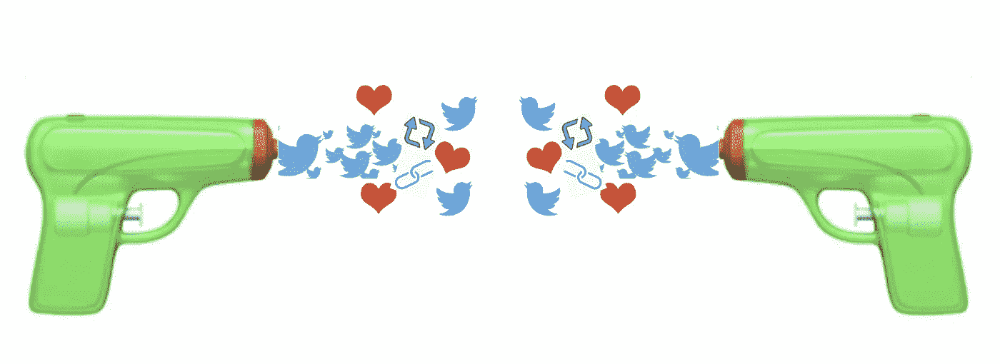

卡尔·冯·克劳塞维茨将军有一句名言:“战争是政治的另一种方式”。似乎反过来也是一样的。过去，政治斗争发生在幕后办公室、筹款晚宴和社论版。2020 年这些战役都是线上的。推文、点赞、链接都是战争武器。公众、媒体和政治阶层无休止地发射这些弹药。幸运的是，这些武器留下了分析起来很有趣的大数据痕迹。

随着我们进入民主党初选，我认为这将是一个很好的时间来看看自从我[上次对民主党推特](/which-2020-candidate-is-the-best-at-twitter-fd083d13fb4e)的分析以来，事情发生了怎样的变化。正如下面的数据所显示的，战斗仍然很激烈，战场仍然是敞开的。让我们来看看剩下的每一位候选人，看看他们在这个在线舞台上的表现如何。

# 乔·拜登

直到 2019 年夏天，乔·拜登的竞选策略似乎是[尽可能少说话](https://www.washingtontimes.com/news/2019/aug/16/joe-biden-strategy-hide-and-seek-to-avoid-gaffes/)。他在网上也是如此，直到 5 月份他才真正开始发微博。下图显示了拜登今年每周发送的推文数量。

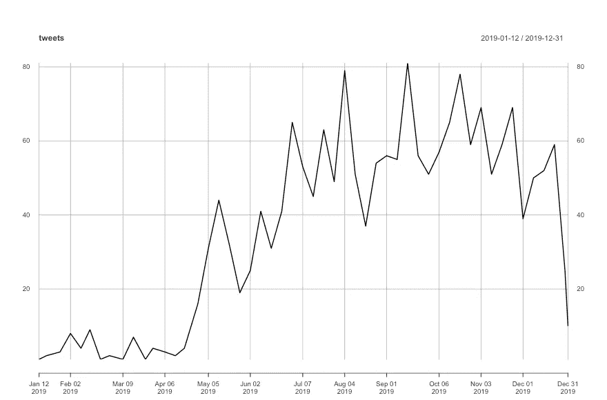

乔·拜登在 201 周内每周发送的推文数量

随着活动的增加，拜登赶上了其他顶级候选人的水平，使他在网上有了重要的存在。

请注意，这些推文的内容变化不大。拜登的热门词汇揭示了一些关键主题。

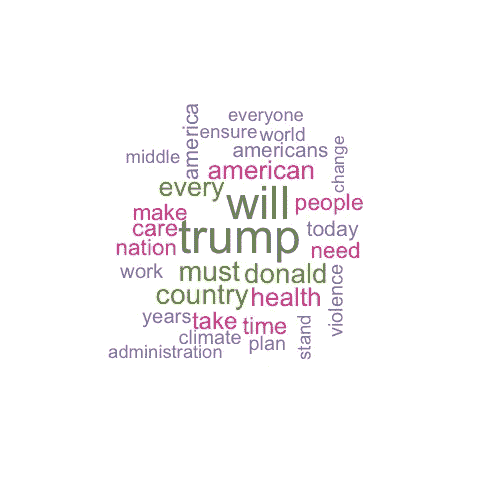

乔·拜登推特的文字云

在几乎所有的信件中，拜登都表示，我们“必须”击败“特朗普”，拜登竞选是实现这一目标的唯一途径。他最受欢迎的推文都是对现任总统的攻击。

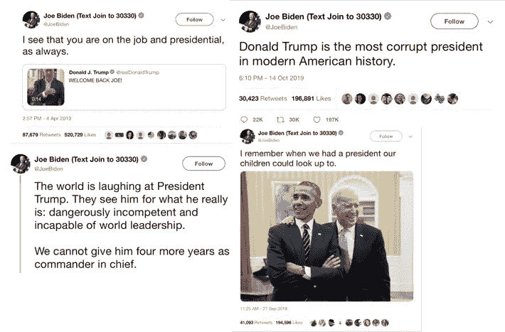

# 伯尼·桑德斯

谈到网上受欢迎程度，没有民主党人能胜过伯尼·桑德斯。对候选推特粉丝的比较清楚地表明了这一点。

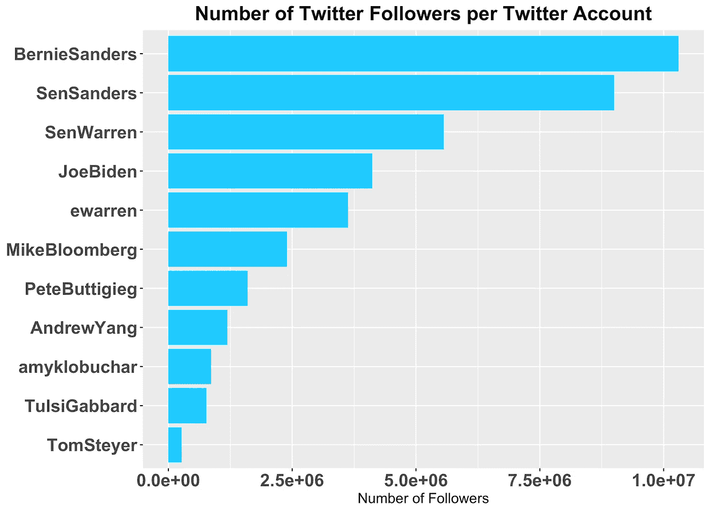

当然，拥有如此众多的追随者也有一些缺点。桑德斯因其支持者在社交媒体上的行为受到了持续的批评。然而，桑德斯的在线和离线支持都在飙升。下面是伯尼·桑德斯每周收到的推特点赞数的图表。这与他的民意测验非常接近。

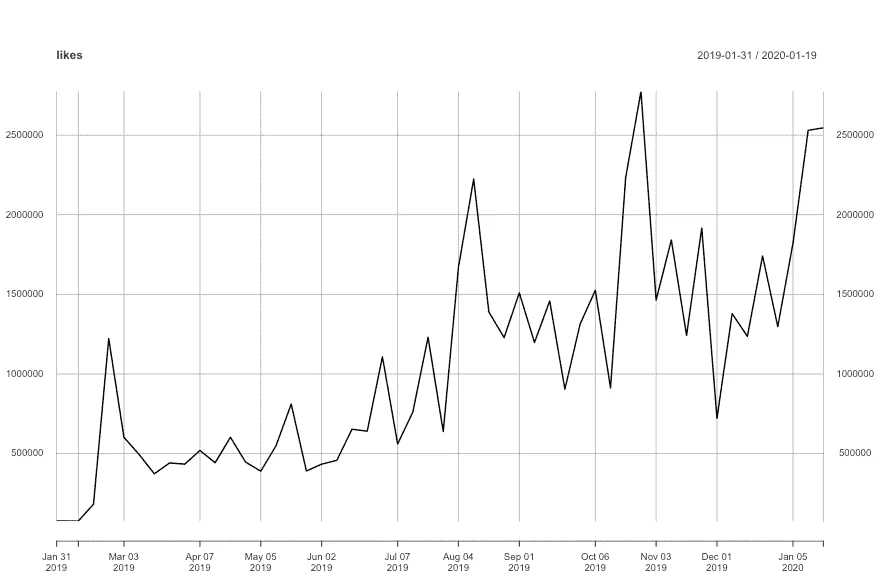

一些人指责记者戴维·西罗塔秘密控制伯尼的账户，包括其偶尔的负面言论。不管是真是假，3 月份聘用西罗塔与桑德斯崛起紧密相关。

如果我们看看桑德最受欢迎的推文，我们会发现它们都是 2019 年末的简短声明。唯一的例外是桑德斯发布的解释他心脏病发作的消息。

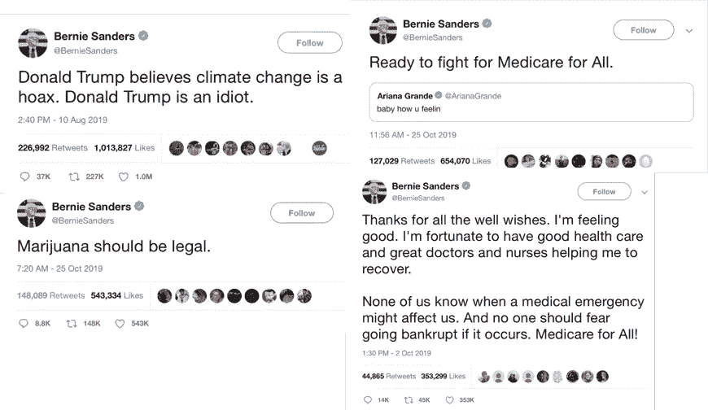

桑德的推特和他的演讲一样，焦点总是在“人”上。

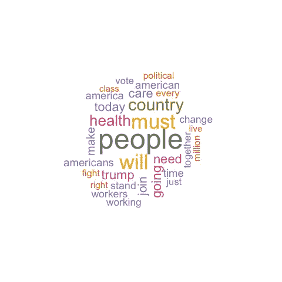

# 伊丽莎白·沃伦

伊丽莎白·沃伦是最后的领跑者，在在线支持方面仅次于伯尼·桑德斯。对 2019 年推特总赞数的比较显示了这一点。

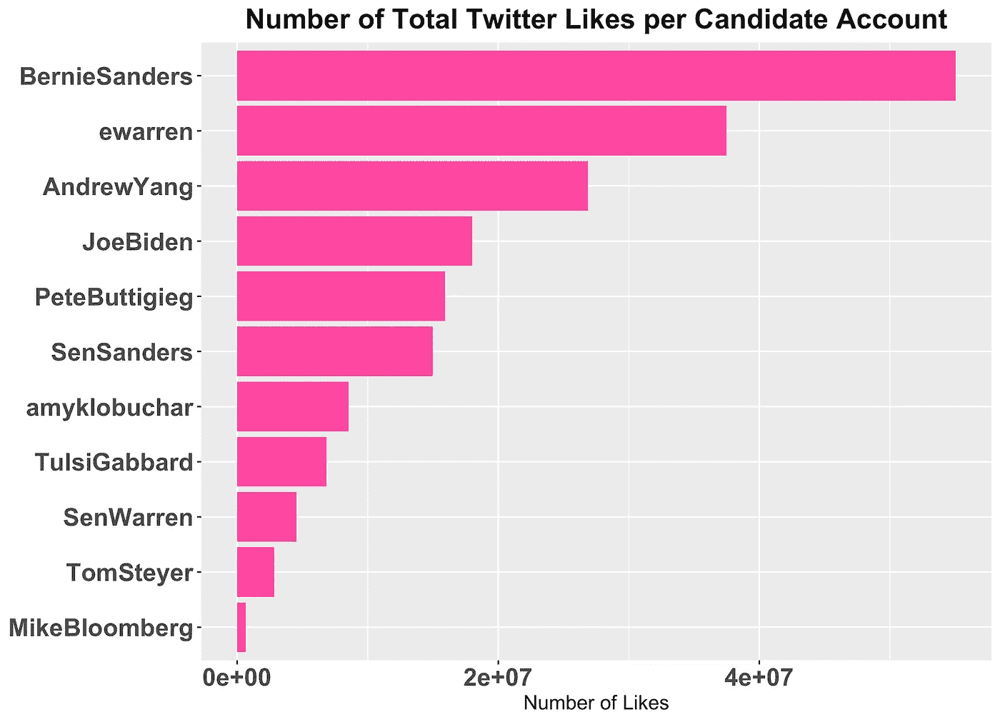

数据显示，在下半年，沃伦的候选人资格一直在动摇。例如，她的账户每周获得的赞数急剧下降。

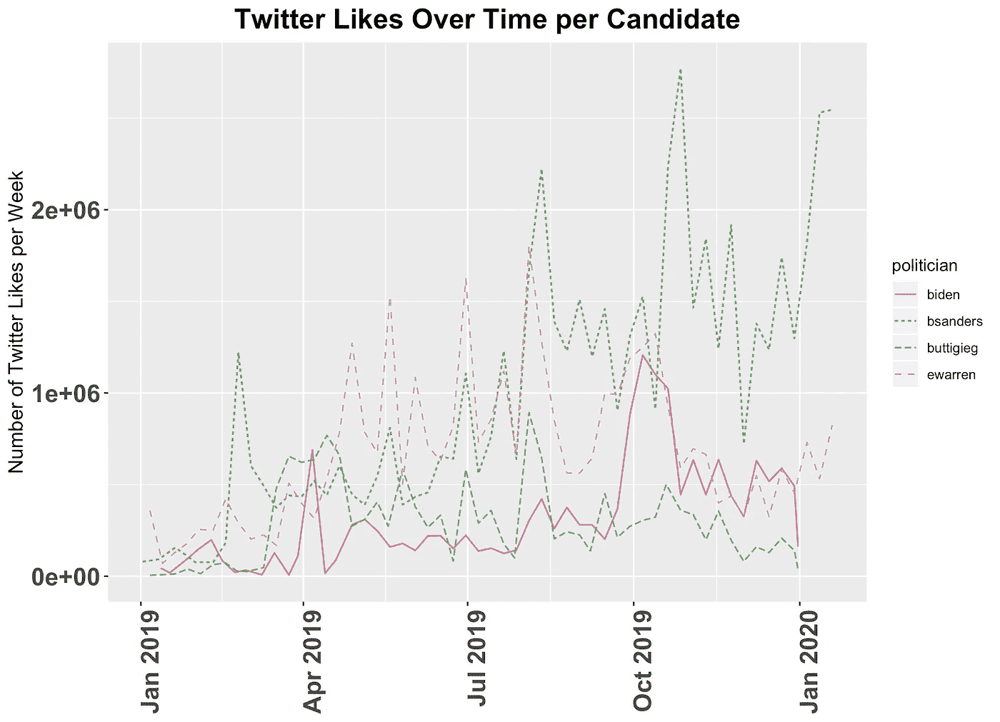

不仅如此，她的粉丝也没有增长多少。下图显示了沃伦的个人账户和参议院账户每月新增的 Twitter 粉丝数量。

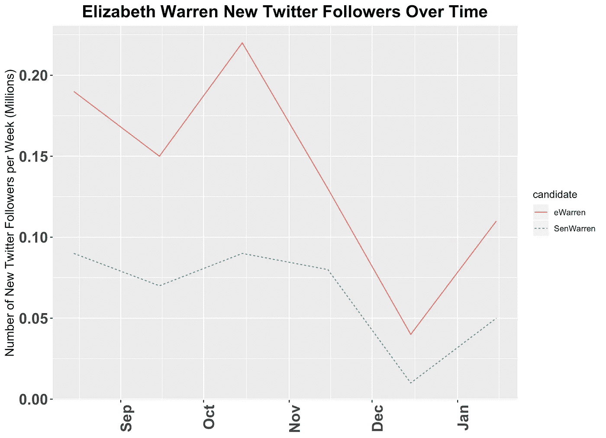

回顾沃伦 2020 年的热门推文，可以看到这种下降的进一步证据。所有这些都是在 2019 年 10 月她的民调达到峰值之前写的。

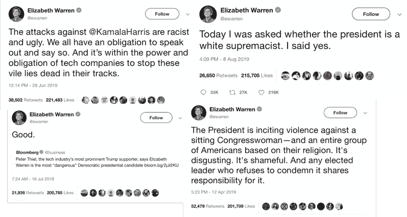

沃伦的[衰落](https://www.realclearpolitics.com/articles/2019/12/18/examining_elizabeth_warrens_slide_141987.html)有[多种理论](https://theweek.com/articles/881221/why-elizabeth-warren-falling-polls-blame-medicareforall)。就我个人而言，我将此归咎于奥巴马时代政客们的影响，他们全力支持她，包括竞选联合主席 Ayanna Pressley。

# 皮特·布蒂吉格

在所有顶级候选人中，皮特·布蒂吉格发微博最少。统计 2019 年每位候选人的推文总数就清楚地说明了这一点。

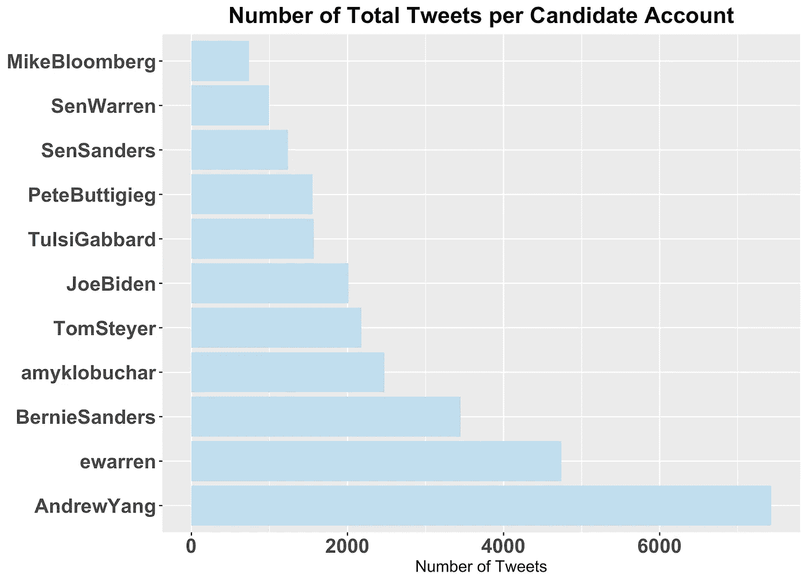

然而，当 Buttigieg 发微博时，他得到了关注。通过候选人的推特粉丝来衡量推特点赞数，我们发现 Buttigieg 名列榜首。因此，在极少数情况下，Buttigieg 确实写了一些东西，它可能会受到好评。

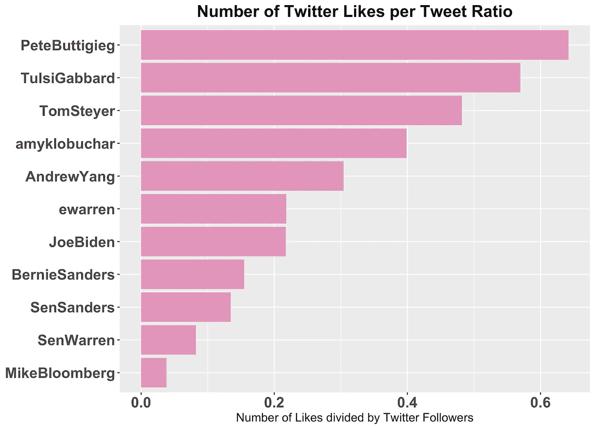

但如果他以其他方式吸引注意力，那么他缺乏持续的沟通就不是问题。不幸的是，他不再有 Twitter 追随者，这表明他的竞选意识正在下降。

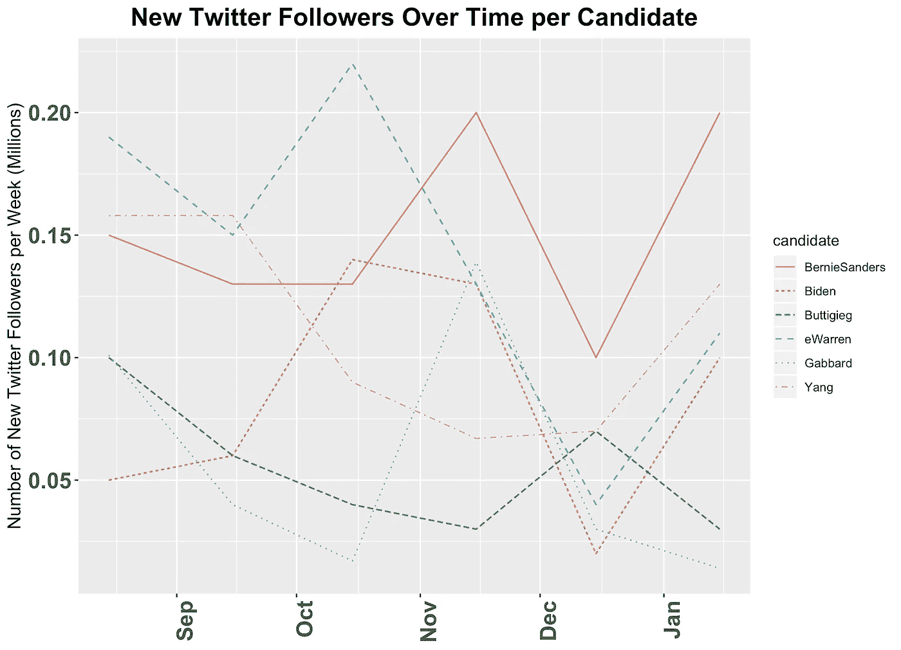

当 Buttigieg 发微博时，它往往是出于一种道德优越感。他最受欢迎的信息听起来都像是告诫，符合他作为中间派改革者的风格。

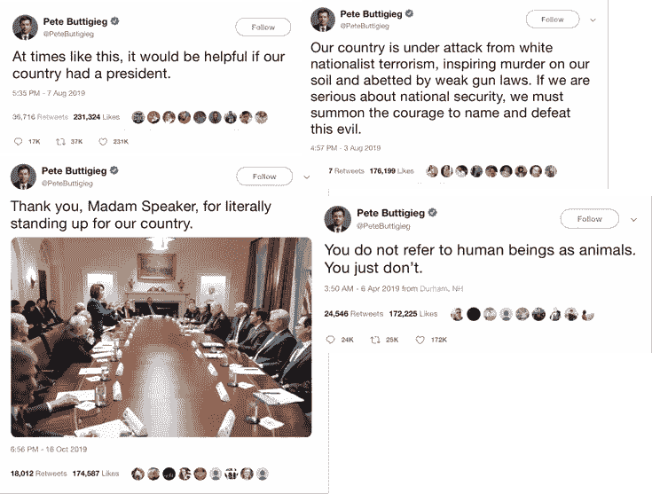

Buttigieg 推文的词云显示，他喜欢的术语是经典政治言论的一部分。

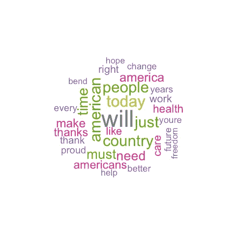

# 杨安泽

杨安泽在许多方面都与众不同。杨是该领域唯一剩下的少数族裔候选人，也是唯一一个不是职业政治家的人。除此之外，杨是最在线的。他在 2019 年发了最多的推文，也是迄今为止社交媒体上最活跃的。

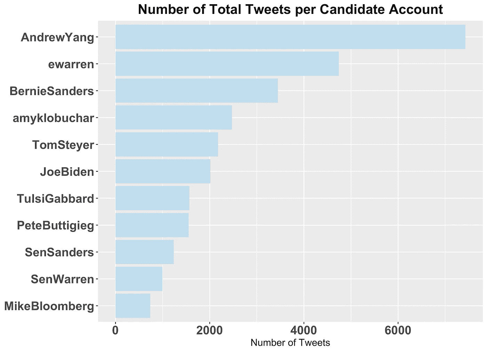

此外，对候选人推文的情感分析显示，杨是最积极的候选人。也就是说，他在 Twitter 上使用的词语和句子比他的对手有更少的负面感觉。

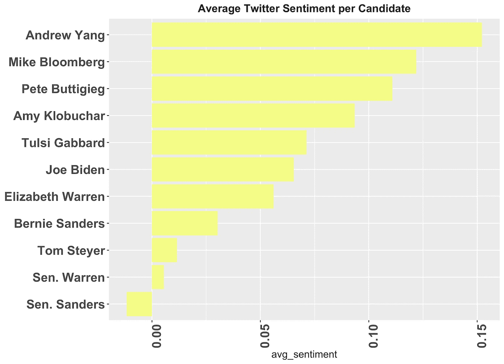

使用情感库的候选人情感

他的推文词云显示，“谢谢”是他目前最喜欢的词。

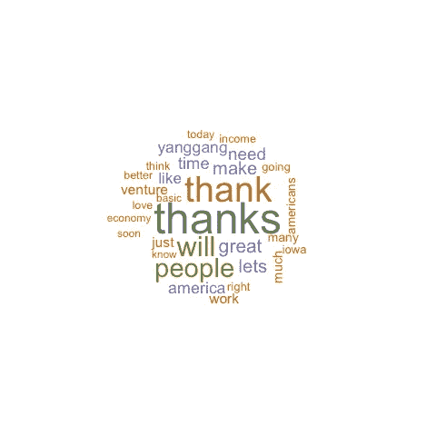

# 图尔西·加巴德

Tulsi Gabbard 不太可能赢得提名，但她确实让竞选变得有趣。在所有候选人中，加巴德是唯一一个公开反对党内精英的人，这让她在网上赢得了钦佩和愤怒。

这方面最好的例子是她在十月份与希拉里·克林顿的口水战。那次口角为她赢得了大量的赞和关注者。

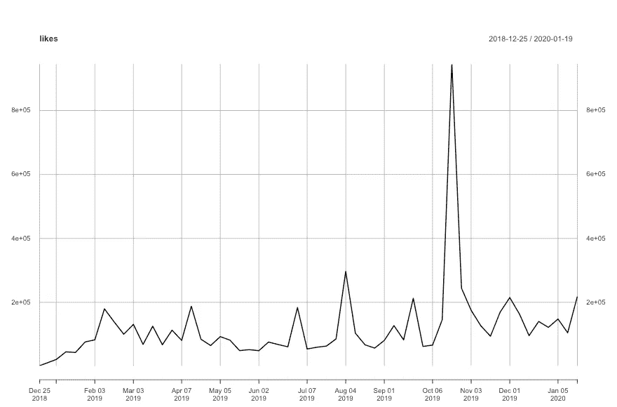

Tulsi Twitter 每周点赞数

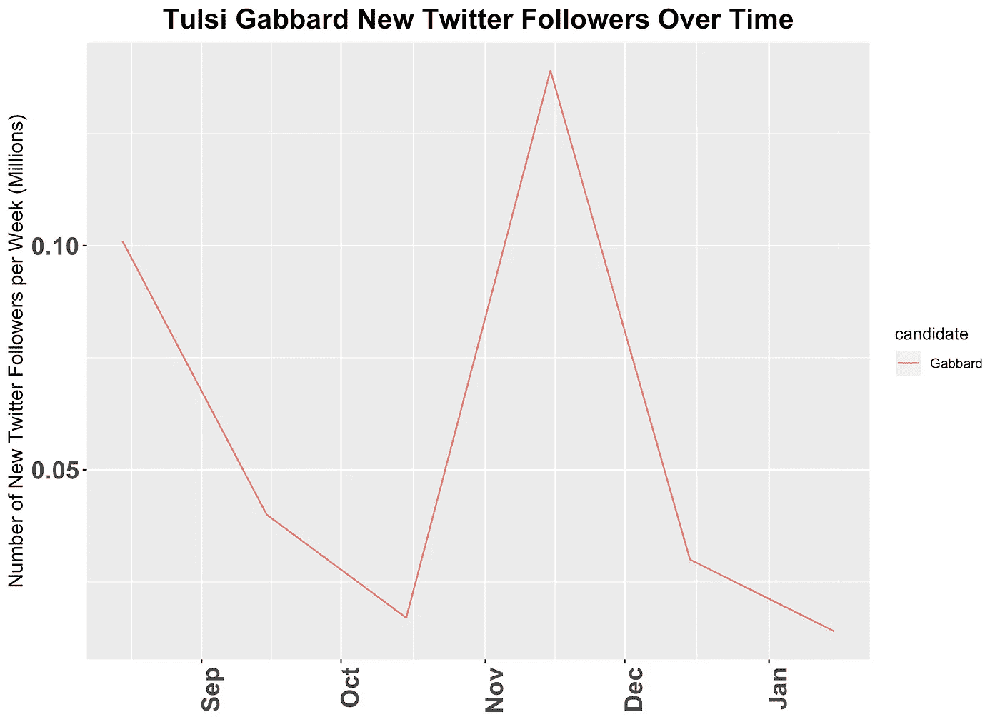

这场争论证明了攻击政治对手有明显的好处。Twitter 就像一场皇家战争，战斗人员在冲突中茁壮成长。那些最能驾驭这些竞赛的人能够获得显著的关注。

# 最后的想法

今年 2 月，2020 年民主党提名战进入了最后阶段。随着我们进入爱荷华州党团会议，我们将看到哪位候选人在传播他们的信息方面做得最好。虽然没有什么能打败地面上的靴子和基层的支持，但我认为 2020 年在线宣传是必不可少的。当初选结果出来后，我想我们会看到那些在网上表现最出色的候选人将会在投票中获得奖励。