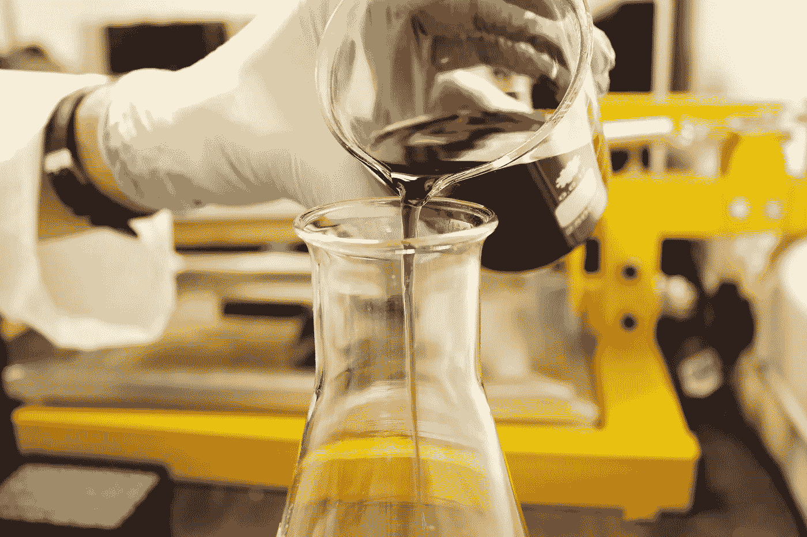

# 数据科学和统计学的区别

> 原文：<https://towardsdatascience.com/the-difference-between-data-science-and-statistics-168c7062c201?source=collection_archive---------4----------------------->

## 意见

## 你是哪个角色，该不该转行？


由[Unsplash](https://unsplash.com/s/photos/two-people-working?utm_source=unsplash&utm_medium=referral&utm_content=creditCopyText)【1】上的 [krakenimages](https://unsplash.com/@krakenimages?utm_source=unsplash&utm_medium=referral&utm_content=creditCopyText) 拍摄的照片。

# 目录

1.  介绍
2.  数据科学家
3.  统计员
4.  类似
5.  差异
6.  摘要
7.  参考

# 介绍

最有可能的是，在 21 世纪初，数据科学家的头衔在任何行业都不会出现，但它很快成为近年来职业趋势中爆发的热门词汇。这真的是我们第一次看到这样的工作吗？答案是*不*，在数据科学出现之前，我们已经看到过非常相似的职业。我们现在也看到了这个职业——统计学家的角色。

他们有什么不同？有哪些相似之处？这些是我将在以下部分回答的问题。继续阅读，找出哪个角色是哪个。

# 数据科学家


照片由 [Arseny Togulev](https://unsplash.com/@tetrakiss?utm_source=unsplash&utm_medium=referral&utm_content=creditCopyText) 在[Unsplash](https://unsplash.com/s/photos/machine-learning?utm_source=unsplash&utm_medium=referral&utm_content=creditCopyText)【2】上拍摄。

这个角色最近变得非常受欢迎，这是有原因的。当你的业务中有一名数据科学家时，你是在为一个人招聘几个角色。成为一名数据科学家所需的技能令人望而生畏，需要勾选许多选项。这个角色可以被认为是跨职能的——需要了解业务的技术技能和软技能。仅仅知道编码技术是不够的，还要知道如何与非技术利益相关者和公司领导一起解决重要的业务问题。数据科学家需要了解一些简单明了的技能，但随着时间的推移，在这些情况下，您需要通过实践获得一些不一致的技能。这些技能是技术性较低的技能，通常包括但不限于:形成一个问题，形成一个问题陈述，创建一个回答该问题的过程，向利益相关者展示发现和解释结果。

**数据科学所需的一些**关键技能包括:

```
machine-learning librariesPython or R programmingSQL
```

# 统计员



由[路易斯·里德](https://unsplash.com/@_louisreed?utm_source=unsplash&utm_medium=referral&utm_content=creditCopyText)在[Unsplash](https://unsplash.com/s/photos/experiment?utm_source=unsplash&utm_medium=referral&utm_content=creditCopyText)【3】上拍摄的照片。

统计学家的角色比数据科学家的角色存在的时间要长得多。需要这个岗位的行业数不胜数。如果你想在医疗保健、安全、学术、营销、经济和许多其他领域工作，你肯定会成为那里的统计学家。统计员的主要职责包括但不限于:实验设计、进行研究、创建估计和开展调查。你需要在数学和实验设计方面有很强的背景知识。这个职位也需要软技能。其中包括向利益相关者报告您的发现，以及这些统计发现需要他们各自做出的改变。

以下是**统计的一些**关键技能:

```
SAS ProgrammingExperimental designMathematics
```

# 类似

正如您可能已经看到的，这两个角色需要的一些技能是相似的，如果不是完全相同的话。那么，数据科学家和统计学家之间的主要相似之处是什么？以下是这两种角色之间的一些相似之处:

*   *对数学的理解*
*   *调查问题*
*   *探索性数据分析*
*   *分析趋势*
*   *创建预测*
*   *可视化*
*   *向非技术用户报告调查结果*

当然，这些角色之间有更多的相似之处，但这些是我从角色以及各自的工作描述中遇到的一些相似之处。随着时间的推移，知道统计学是否变得更像数据科学或者相反，或者它们是否彼此背离，将是一件有趣的事情。

# 差异

现在，让我们讨论一下这些角色之间的区别。

> 首先，统计学家比数据科学家存在的时间更长，这意味着差异可能在于新技术。

这是它们之间的主要区别，主要由那些新技术组成。

> 统计数字

*   *一次性报道*
*   *使用 SAS 编程*
*   *关注诊断图*
*   *关注显著性检验*
*   *侧重于 t 检验、方差分析、方差分析等。*
*   *更多手动数据收集(有时来自调查)*
*   *通常，你会发现医疗保健和经济领域的统计学家*
*   *或更多学术设置*

> 数据科学

*   *自动化*
*   *使用 SQL 查询收集数据*
*   *像 sklearn 和 TensorFlow 这样的机器学习库*
*   *使用 Python 和 R 编程语言*
*   *部署自动化模型(到应用程序中)*
*   *关注软件工程实践*

上述差异也可以在工作描述和个人经历中看到。根据公司的不同，你可能会发现其中一些技能是重叠的，但我相信这是这两种角色之间最大的区别。

# 摘要


照片由[克里斯蒂娜@ wocintechchat.com](https://unsplash.com/@wocintechchat?utm_source=unsplash&utm_medium=referral&utm_content=creditCopyText)在[Unsplash](https://unsplash.com/s/photos/two-people-working?utm_source=unsplash&utm_medium=referral&utm_content=creditCopyText)【4】上拍摄。

所以，总结一下，统计学家和数据科学家或者数据科学和统计学研究之间的区别是什么？这可以用一句话来概括— *来自新技术的自动化*。一个角色比另一个角色更重要吗？*否*。他们都是重要的角色。如果你想专注于显著性、测试、实验设计、正态分布和诊断绘图，那么成为一名统计学家。如果你想实践更多的软件工程，比如编码和机器学习模型的自动化，那么就成为一名数据科学家。你会发现，这两种角色的许多工作描述都有重叠，但很少找到统计员角色所需的机器学习库。

*如果你正在考虑开始一份新的职业或转行，我希望这篇关于统计学家和数据科学家之间的相似性和差异的概述是有趣的，并对你有所帮助。当然，有更多的相同点和不同点，所以请在下面随意评论你在这些角色中有哪些经历。感谢您的阅读！*

请记住，本文来自个人经验，这些研究和角色可能因大学和公司而异。

# 参考

[1]照片由 [krakenimages](https://unsplash.com/@krakenimages?utm_source=unsplash&utm_medium=referral&utm_content=creditCopyText) 在[Unsplash](https://unsplash.com/s/photos/two-people-working?utm_source=unsplash&utm_medium=referral&utm_content=creditCopyText)(2020)拍摄

[2]2019 年 [Unsplash](https://unsplash.com/s/photos/machine-learning?utm_source=unsplash&utm_medium=referral&utm_content=creditCopyText) 上 [Arseny Togulev](https://unsplash.com/@tetrakiss?utm_source=unsplash&utm_medium=referral&utm_content=creditCopyText) 拍摄的照片

[3]照片由[路易·里德](https://unsplash.com/@_louisreed?utm_source=unsplash&utm_medium=referral&utm_content=creditCopyText)在[Unsplash](https://unsplash.com/s/photos/experiment?utm_source=unsplash&utm_medium=referral&utm_content=creditCopyText)(2018)上拍摄

[4]照片由[克里斯蒂娜@ wocintechchat.com](https://unsplash.com/@wocintechchat?utm_source=unsplash&utm_medium=referral&utm_content=creditCopyText)在[Unsplash](https://unsplash.com/s/photos/two-people-working?utm_source=unsplash&utm_medium=referral&utm_content=creditCopyText)(2019)上拍摄