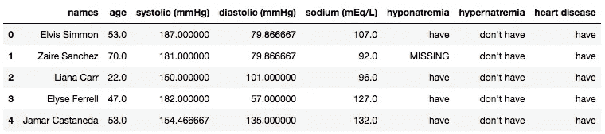
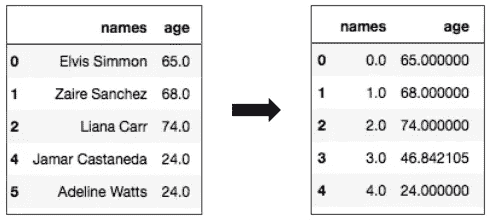
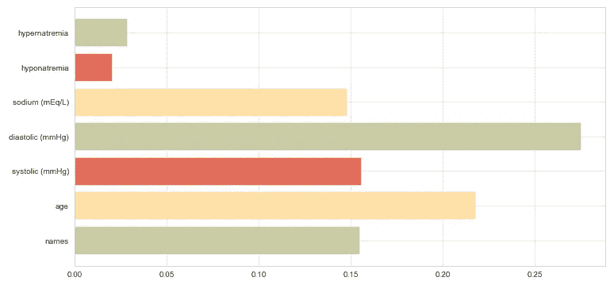

# 特征转换、工程和选择之间的区别

> 原文：<https://towardsdatascience.com/the-difference-between-feature-transformation-engineering-and-selection-b3e5d85b4b0b?source=collection_archive---------24----------------------->

## 作为数据科学家，它们是日常任务。但是你知道每一个是什么意思吗？

照片由[布伦丹·丘奇](https://unsplash.com/@bdchu614?utm_source=medium&utm_medium=referral)在 [Unsplash](https://unsplash.com?utm_source=medium&utm_medium=referral) 上拍摄

# 简介

当您开始学习数据科学概念时，您意识到有许多事情需要考虑。修饰过的名字无助于解释我们应该做什么，对吗？今天，我们将一劳永逸地了解它们的含义。

# 数据集

图片由雷南·洛里科拍摄——中号

我将使用我为另一篇文章创建的数据集。这组人工数据模拟了一些关于心脏病可能性的数据，这就是我们的目标。为了找到答案，我们有一些虚假的医疗信息，如血压、年龄和钠含量。

# 特征转换

图片由[吉菲](https://giphy.com/gifs/wood-elijah-transforming-aW9JHxQojjliU/links)提供

我们将遵循一个顺序，从第一步到最后一步，这样我们可以更好地理解一切是如何工作的。首先，我们有特征转换，它**修改数据**，让机器更容易理解。这是数据清理和数据争论的结合。

图片由雷南·洛里科拍摄——中号

这里，我们填充空值，对分类资源进行编码，调整数值列的大小，并应用标准化和规范化；注意**我们没有从当前的**创建新的列；这就是转换不同于特征工程的地方。

# 特征工程

图片由 [Giphy](https://giphy.com/gifs/c5eqVJN7oNLTq/links) 提供

特征工程**使用已经修改的特征来创建新的特征**，这将使任何机器学习算法更容易理解和学习任何模式。

让我们看一个例子:

图片由雷南·洛里科拍摄——中号

例如，我们可以创建两个新列来检查患者是否患有低钠血症(钠浓度小于 135)或高钠血症(钠浓度大于 145)。输出将是下图。

图片由雷南·洛里科拍摄——中号

> “心脏病”功能是一个[条件列](/an-easy-way-to-create-conditional-columns-on-pandas-with-numpy-d1d31bd89fa7)，也是我们的目标；如果心脏收缩指数大于 140 或心脏舒张指数大于 90，则为真。年龄也会影响结果。虚构的表示！

## 纪念

> 每个新创建的资源都需要以某种方式提高产量；否则会适得其反，恶化最终结果。当这种情况发生时，我们需要应用特征选择。

# 特征选择

图片由 [Giphy](https://giphy.com/gifs/fruit-cookies-cookie-monster-3og0Iwmv38WmJBrYvS/links) 提供

比方说，你的数据包含一个巨大的特征集，它可以改善或恶化你的预测，而你只是不知道哪些是需要的；**这就是你使用特征选择的地方。**

特征选择**学习每个特征**对你的模型的影响并带来结果。这样，您就可以用正确的资源创建训练集、验证集和测试集。

特征选择。图片由雷南·洛里科拍摄——中号

但是等等！正如你在上面的图片中看到的，**他们总是会出错**，看起来“名称”功能有很大的影响，但我们知道它不会对我们的模型产生积极的影响。

# 最终提示

*   和特征选择一样，还有降维，降维要完整复杂得多。
*   几乎每个项目都可以用特性工程来改进，尽可能地使用它。
*   特征选择的使用直接取决于数据集中可用的特征数量；不到 20？考虑使用特征选择；否则，降维可能是必要的。
*   您不需要在所有项目中使用特性选择。

# 想了解更多？

有一篇文章列出了特性转换中的每一个必要步骤；真是过瘾！让我们来看看？

 [## 数据科学家的特征转换

### 数据插补，宁滨，编码，等等！熟练掌握所有步骤！

towardsdatascience.com](/feature-transformation-for-data-scientists-3a9eed562752) 

# 我在哪里可以找到这些材料？

如果您对我如何创建所有这些图形和代码感兴趣，您可以:

*   [获取 Jupyter 笔记本文件](https://github.com/renfelo/datascience/blob/master/others/guides/feature_transformation/feature_transformation.ipynb)；
*   [下载数据集](https://github.com/renfelo/datascience/tree/master/others/guides/feature_transformation/data)；

# 就这样，伙计们！

我希望你喜欢这个内容，并能熟练运用你的新知识！如果你想每天学习有趣的东西，我很乐意与你分享精彩的内容！

另外，你可以在 Github 上查看我的个人资料。我从事一些数据科学项目已经有一段时间了。所有的关键概念都可以学习和重用！

 [## 雷南·洛利科-吉图布

### 在 GitHub 上注册你自己的个人资料，这是托管代码、管理项目和构建软件的最佳地方…

github.com](https://github.com/renfelo)