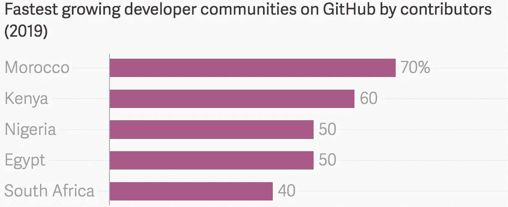

# 数字电视

> 原文：<https://towardsdatascience.com/the-digital-divaide-f31363bc4f95?source=collection_archive---------32----------------------->

## 人工智能将对数字鸿沟产生影响

作为一个以看动画片为生的孩子，当我想到社会的未来时，我想到了飞行汽车和传送到我朋友家*(感谢杰特森夫妇)。但是我不知道技术进步会带来不平等、失业和彻底的气候变化等等。15 年后，当我发现自己转向科技行业时，一个令人震惊的现实震撼了我的内心。*

经由[吉菲](https://giphy.com/gifs/traffic-television-animated-YlQQYUIEAZ76o)的捷成航空公司

虽然技术进步的缺点是众所周知的现象，但我要说的是，只是在过去十年里，公司和政府才开始积极地解决这些问题，特别是有关数字鸿沟的问题。

> 数字鸿沟:由于不同社会、文化和经济群体之间的不平等而导致的获取技术的不平等；往往由地理位置引起- [社会学词典](https://sociologydictionary.org/digital-divide/)

然而，焦点主要集中在让互联网更容易访问，或者提高科技公司的多样性和包容性。但是一个更紧迫的因素会加速数字鸿沟，那就是*人工智能、* *人工智能*(通过算法模仿人类智能的系统)的革命，我称之为“**数字鸿沟*人工智能*的概念。**

照片由[弗兰克诉](https://unsplash.com/@franckinjapan?utm_source=medium&utm_medium=referral)在 [Unsplash](https://unsplash.com?utm_source=medium&utm_medium=referral) 上拍摄

> 人工智能导致的不平等或歧视

根据埃森哲对 12 个发达国家进行的一项研究，人工智能有能力在 2035 年前将发达国家的年经济增长率翻一番[，这让我想知道发展中国家(仍未建立良好的数字基础设施)是否有能力竞争？此外，该领域缺乏技能，这意味着科技巨头在扩张时会渴求人才，这可能导致发展中国家的人才无法与提供的薪酬竞争。据](https://www.accenture.com/t20170524T055435__w__/ca-en/_acnmedia/PDF-52/Accenture-Why-AI-is-the-Future-of-Growth.pdf) [Github](https://octoverse.github.com/) 报道，这一浪潮可能会波及拥有发展最快的开发者群体的非洲。另一方面，这种增长可能为非洲提供一个扩大其数字足迹的机会，我们已经在肯尼亚、尼日利亚和摩洛哥等国家看到了这一点。

Via [石英非洲](https://qz.com/africa/1743569/africa-is-the-fastest-growing-continent-for-developers-globally/)

医疗保健领域也是一个值得关注的领域，因为目前，顶级人工智能面部识别系统在对少数民族进行分类时仍然有最高的错误，这可能对少数民族患者的疾病早期检测和诊断产生负面影响。 ***但正如*** ***罗马不是一天建成的，我们也不应该指望算法能做到这一点，然而，只有当科技公司致力于并负责实现数据集多样化时，它们才能得到改善*。** *因此，如果任何来自谷歌、微软和其他公司的人正在阅读这篇文章，那么请让你的人工智能团队参考* [*棕色皮肤问题*](https://www.instagram.com/brownskinmatters/?hl=en) *，在那里他们可以获得各种肤色的状况图像。*

至于教育领域，我相信人工智能将创造奇迹，尤其是在个性化学习领域。但是，随着教育经费变得更加紧张，甚至在一些国家几乎没有教育经费，如果政府不加强并优先考虑教育投资，下一代可能会经历比上一代更严重的教育不平等。

还有许多其他的[例子](https://www.weforum.org/agenda/2018/09/the-promise-and-pitfalls-of-ai/)但我试图推动的关键点是，我们需要让科技公司负起责任，并确保政府制定正确的政策，以确保人工智能的好处能够更广泛地惠及大多数人，因为我相信 ***技术的未来应该是改善人类，而不是少数人。***