# 浓缩咖啡的收益递减

> 原文：<https://towardsdatascience.com/the-diminishing-returns-of-tamping-for-espresso-cac289685059?source=collection_archive---------20----------------------->

## 一个更好地了解你的压力的小实验

这个实验始于脸书在一个咖啡小组中关于捣实和敲击的讨论。想法是夯实压缩地面在顶部和底部比中间，这就是为什么应该使用重型夯。所以我设计了一个实验来更好地理解捣固。

小故事:就压缩而言，夯实对顶层的影响大于底层。随着压紧压力的增加，压轮压缩的非线性回报减少。

[之前的工作](https://link.medium.com/5KQES9RsV8)表明，在 5 磅至 20 磅的夯实压力下，提取不会出现变化。我自己的经验是大大降低夯压，但我不知道如何压缩圆盘。我也没能在网上找到很多信息。

所以，我用一根直的透明管子和一个天平来做这个实验，看看地面是如何压缩的。我用 Kompresso 做管子，因为它有一个清晰、直而长的活塞。我把它放在一个可以升到 5 公斤的秤上，我按下去的时候录了一段视频。

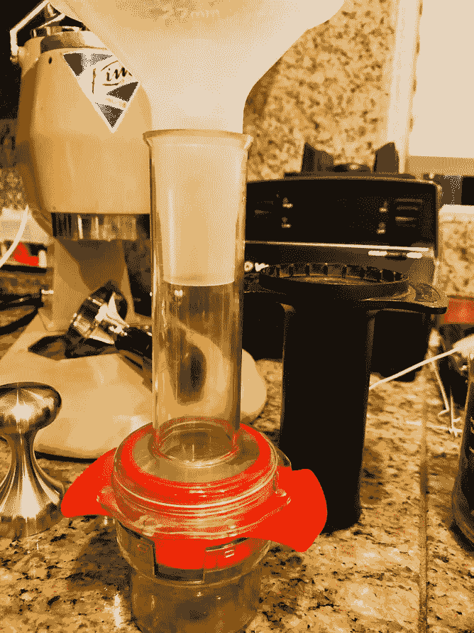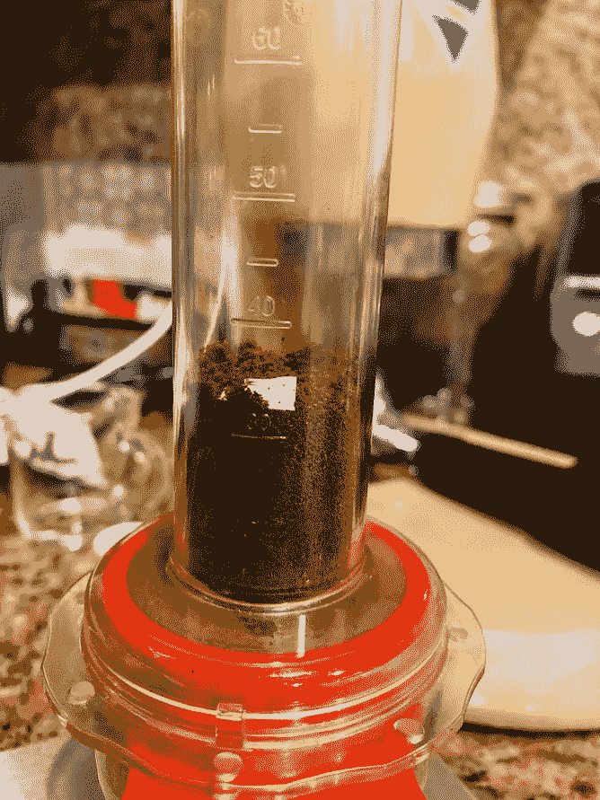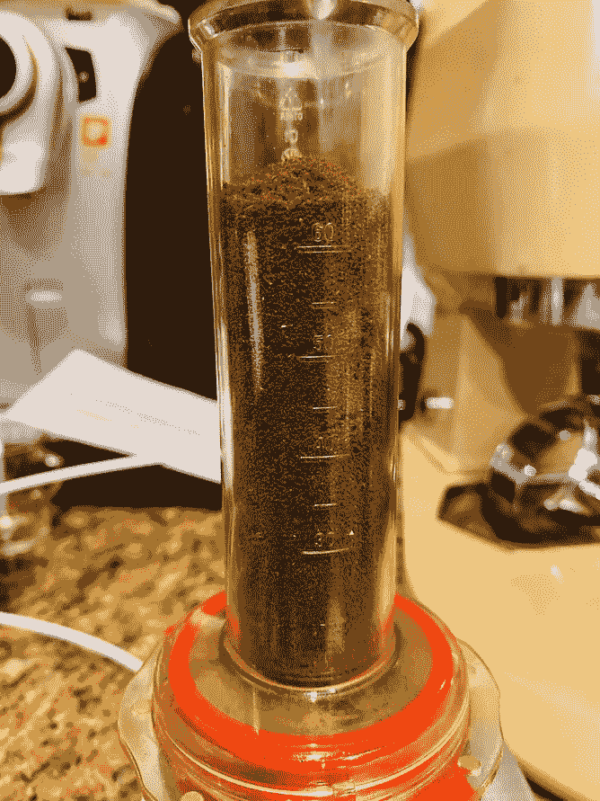

我收集了两次，因为第一轮在标记上有些麻烦，但第二轮就好多了。

这两个问题需要解决:

1.  夯击如何影响冰球的顶部、中部和底部？
2.  什么时候更大的夯击能提供递减的回报？

# 数据收集

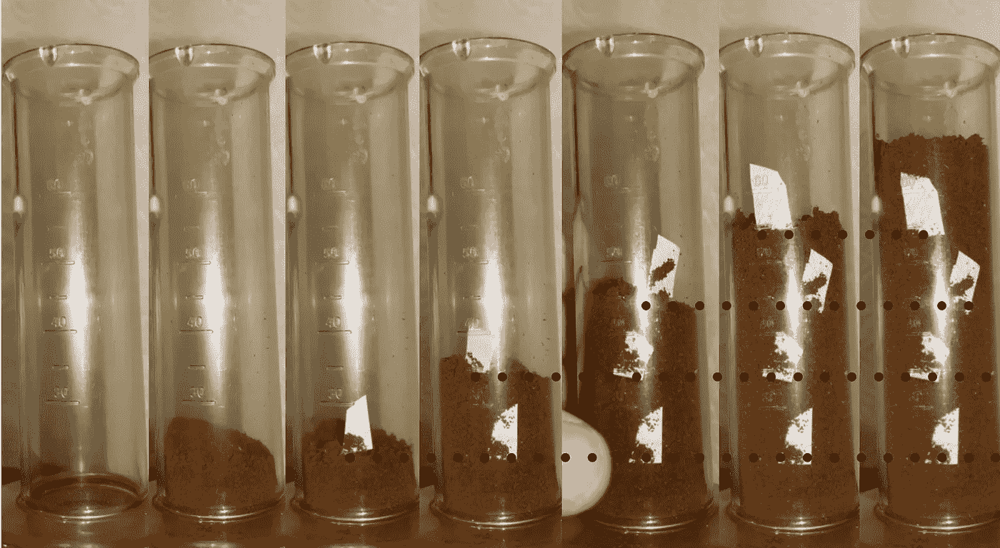

我在试管中每 3 克咖啡后放一张小纸，但我的目标是让纸小一些。我不想让这张纸影响咖啡的压缩。从上面可以看出，将最初的粉末放入管中并没有引起压缩。

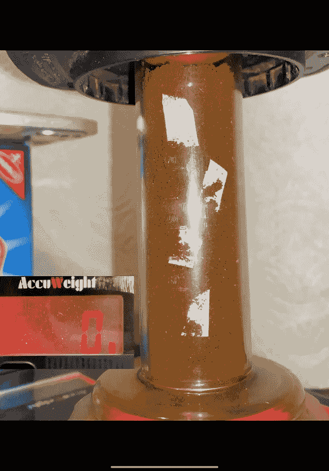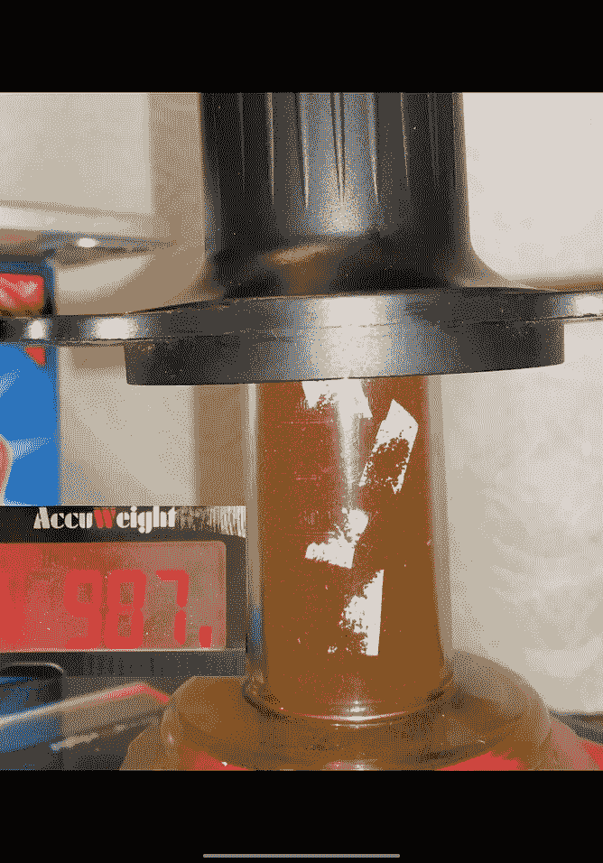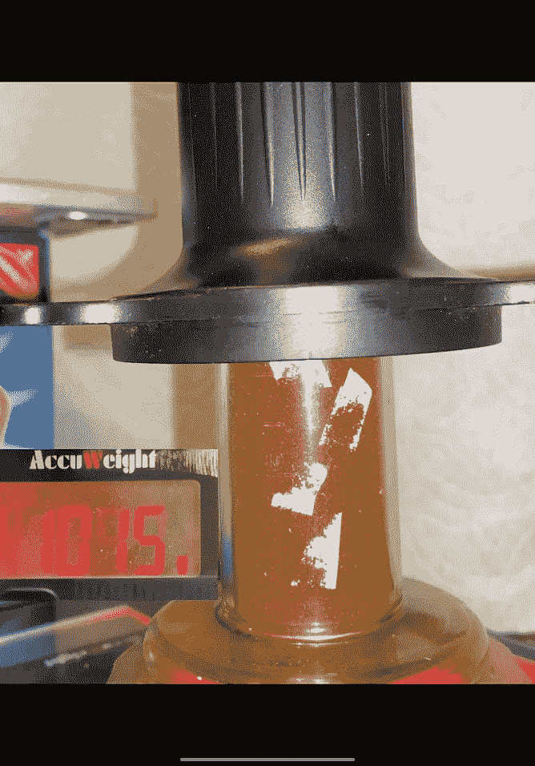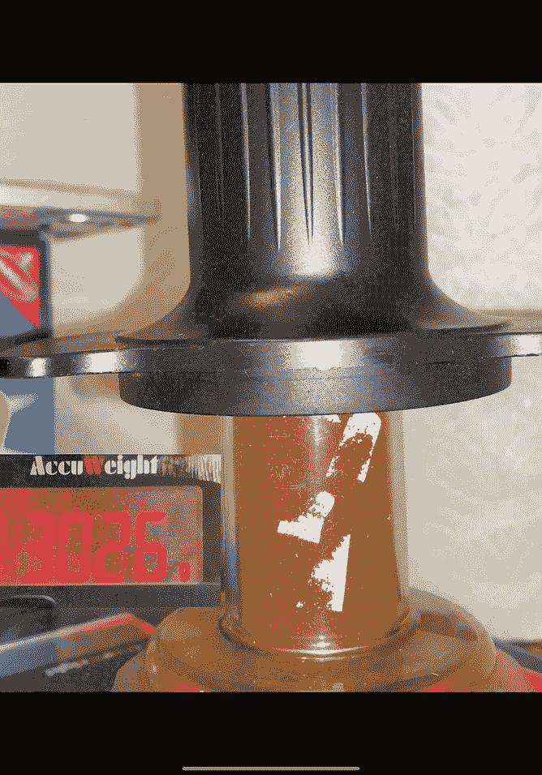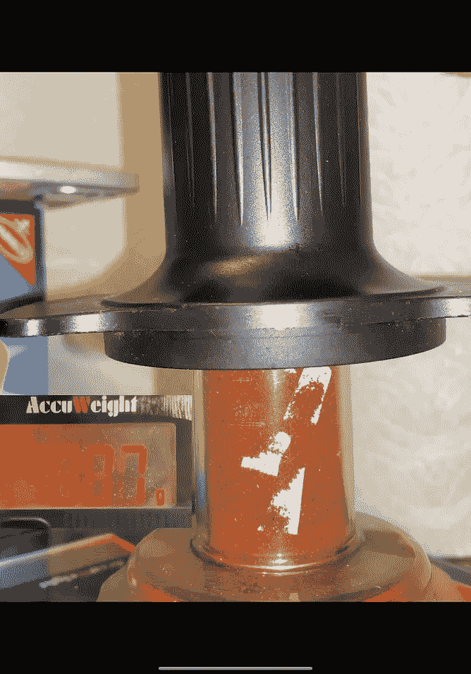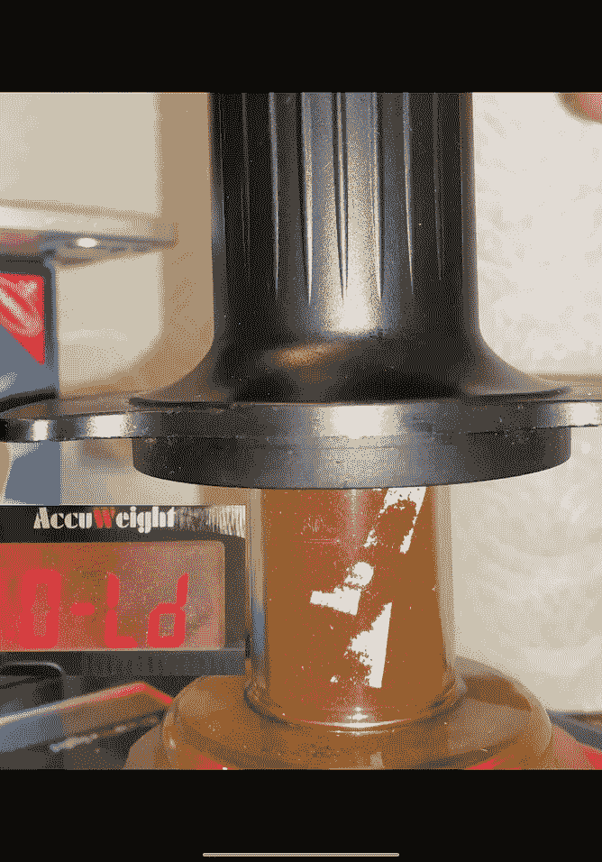

我在所需的压力下拍摄样本图像，然后将它们与起始图像对齐。然后我用红线表示起始位置，绿线表示结束位置。

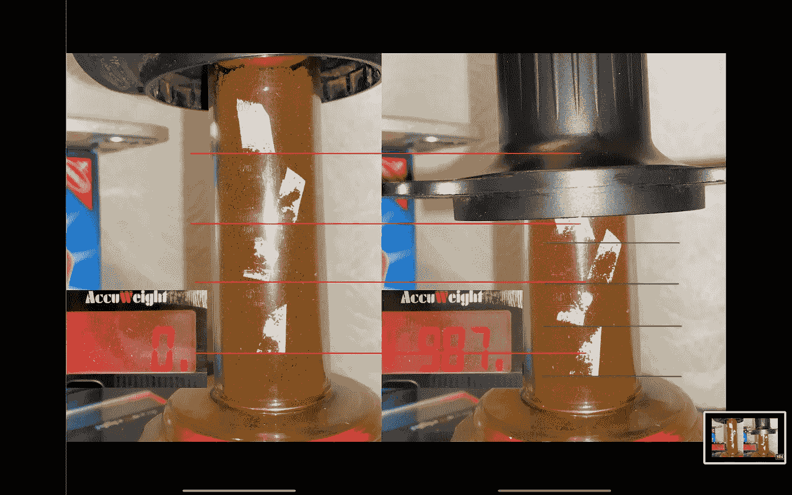

我在 Matlab 中编写了一个简单的脚本来查找图像中红色和绿色线条的位置。

# 校准和标签

我还想消除相机的偏差，所以我用一把尺子来制作校准图像。然后我用红线标记出来，并用同样的脚本找到红线的位置。然后，我在这些标记上画了一条线，并将每张图片的线位置转换成物理距离。

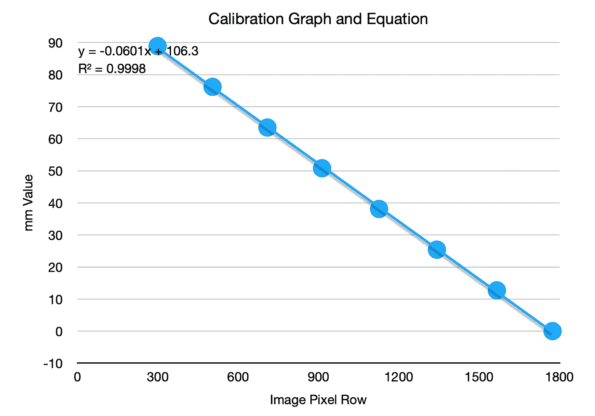

对于每幅图像，我能够清楚地得到顶部、中部和底部切片的四条线。上面和下面都有咖啡，但我看不到上面，我对使用底部感到怀疑。我最终在分析中使用了三个切片和四条线(用于导出切片)。

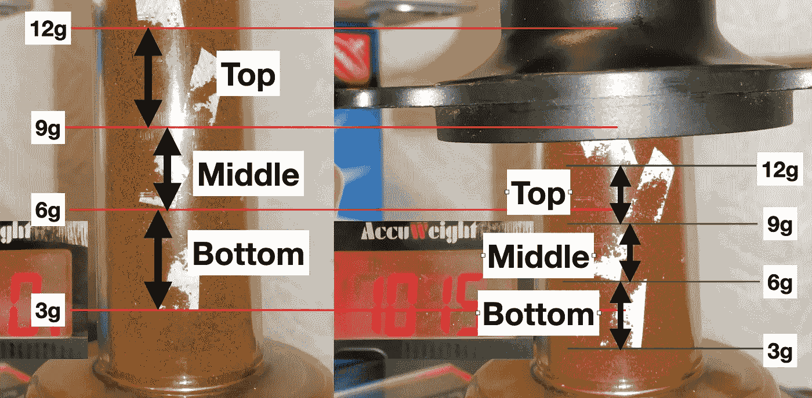

柱塞也小于 58 毫米(准确地说是 58.5 毫米)的过滤篮。为了适应，我将每平方英寸的磅数从 Kompresso 管的 0.93 平方英寸缩放到 58 毫米篮子的 4.16 平方英寸。

# 夯实压力分析

我在这里画出切片高度，然后是标记的高度。我用对数标绘了标记的高度，以显示它们的对数趋势。这意味着，要获得相同的高度变化或压缩，所需的力呈指数增长。

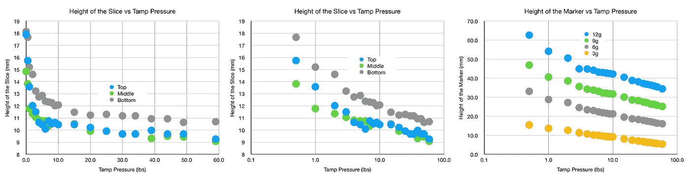

数据中有一些噪音，但趋势非常明显。当看一个线形图时，我们可以看到趋势是底部不像顶部和中部那样压缩。我们可以看看相对于 59 磅达到的最大压缩的压缩百分比。

最上面的压缩大部分在前 6 磅，中间的压缩最慢。这是有道理的，因为当你压缩地面时，底部地面上会有一个大小相等方向相反的反作用力。从绝对值来看，底部被压缩得更少。这可能是由于在放入研磨料时纸标记移动了。如果一组地面是有色的，另一组不是，这个实验会进行得更好。我在这里的目的是得到一个快速的实验，看看它能告诉我什么关于捣固。

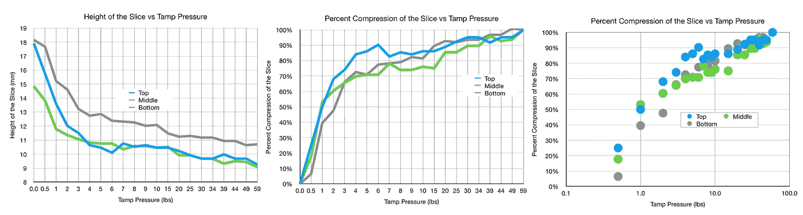

## 比较切片

我们可以使用切片压缩百分比来比较不同的切片。我做了如下所示的压缩比。顶/底比最初是最高的，这似乎有点明显。

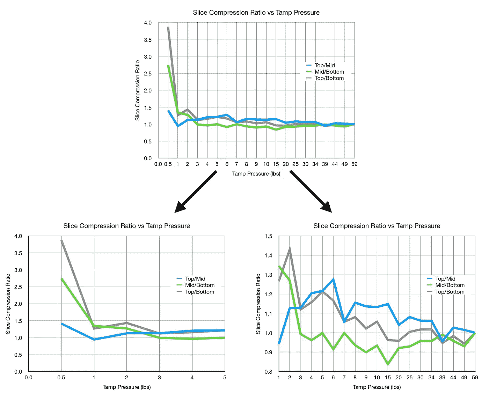

仔细观察，顶部/中部和顶部/底部似乎持平，而中部/底部保持在 1 以下，这意味着底部比中部压缩得更多。

## 专注于线条标记

如果我们观察线条标记移动的量占其总移动量或压缩量的百分比，我们可以在中间看到更多一点。中顶和中底趋势相同。当比较一层和下一层时，它们的比例接近 1:1。然而，当观察不同的线与底线时，所有层都比底部压缩得快，直到 15 磅。那么它们都相当接近(在 20%以内)它们的最大压缩位置。

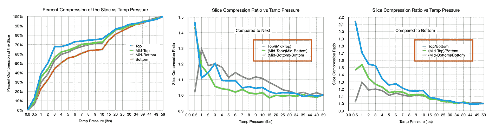

## 收益递减

如果我们看一下冰球的总高度，收益递减的概念就很清楚了。80%的压缩发生在 3 磅的压力下。达到 90%的压缩率需要 20 磅，然后达到 100%的压缩率需要 50 多磅。50%的压缩发生在最初的 1 磅压力中。

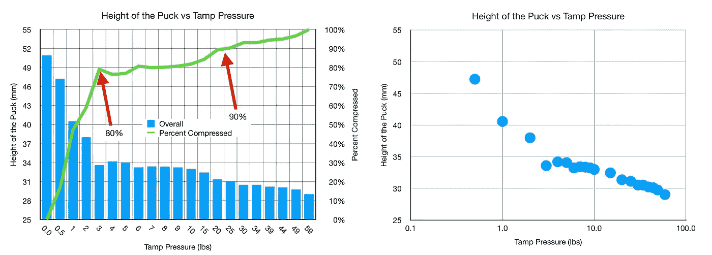

我无法让它压缩超过这一点，我无法用这种秤测量超过 13 磅的压力，或者相当于一个 58 毫米的篮子超过 60 磅的夯锤。然而，我怀疑做一个 60 磅的夯锤能有多大的不同。[之前关于夯压的实验](https://link.medium.com/AOOMbM83O8)显示，当比较 10 磅夯压和 40 磅夯压时，提取没有差异。虽然他们没有低于 10 磅，所以还不清楚。

在我自己的实验中，我已经把我的夯压降低到 1 磅或更少。

作为这个实验的结果，可以设计一个更好的实验:

1.  使用两种不同颜色的咖啡渣
2.  以 2g 为增量分层
3.  看压缩的程度。

我很满意现在对我们的两个问题有了更好的理解:

1.夯击如何影响冰球的顶部、中部和底部？

即使在非常高的压力下也不均匀。

2.什么时候更大的夯击能提供递减的回报？

在 2 磅到 3 磅的压力下，压力增加了 20%，相比之下，在 3 磅到 20 磅或者 20 磅到 59 磅之间，压力增加了 10%。这意味着大多数重于 3 磅的夯锤应该是相似的，一个巨大的夯锤可能不值得它对击球的任何影响。

如果你愿意，可以在 Twitter 和 YouTube 上关注我，我会在那里发布不同机器上的浓缩咖啡视频和浓缩咖啡相关的东西。你也可以在 [LinkedIn](https://www.linkedin.com/in/robert-mckeon-aloe-01581595?source=post_page---------------------------) 上找到我。

# 我的进一步阅读:

[解构咖啡:分割烘焙、研磨、分层以获得更好的浓缩咖啡](/deconstructed-coffee-split-roasting-grinding-and-layering-for-better-espresso-fd408c1ac535)

[浓缩咖啡的预浸:更好的浓缩咖啡的视觉提示](/pre-infusion-for-espresso-visual-cues-for-better-espresso-c23b2542152e)

[咖啡的形状](/the-shape-of-coffee-fa87d3a67752)

[搅拌还是旋转:更好的浓缩咖啡体验](https://towardsdatascience.com/p/8cf623ea27ef)

[香辣浓缩咖啡:热磨，冷捣以获得更好的咖啡](/spicy-espresso-grind-hot-tamp-cold-36bb547211ef)

[断续浓缩咖啡:提升浓缩咖啡](https://medium.com/overthinking-life/staccato-espresso-leveling-up-espresso-70b68144f94)

[用纸质过滤器改进浓缩咖啡](/the-impact-of-paper-filters-on-espresso-cfaf6e047456)

[浓缩咖啡中咖啡溶解度的初步研究](/coffee-solubility-in-espresso-an-initial-study-88f78a432e2c)

[断奏捣固:不用筛子改进浓缩咖啡](/staccato-tamping-improving-espresso-without-a-sifter-b22de5db28f6)

[浓缩咖啡模拟:计算机模型的第一步](https://towardsdatascience.com/@rmckeon/espresso-simulation-first-steps-in-computer-models-56e06fc9a13c)

[更好的浓缩咖啡压力脉动](/pressure-pulsing-for-better-espresso-62f09362211d)

[咖啡数据表](https://towardsdatascience.com/@rmckeon/coffee-data-sheet-d95fd241e7f6)

[工匠咖啡价格过高](https://towardsdatascience.com/overthinking-life/artisan-coffee-is-overpriced-81410a429aaa)

被盗浓缩咖啡机的故事

[浓缩咖啡过滤器分析](/espresso-filters-an-analysis-7672899ce4c0)

[便携式浓缩咖啡:指南](https://towardsdatascience.com/overthinking-life/portable-espresso-a-guide-5fb32185621)

[克鲁夫筛:分析](https://towardsdatascience.com/overthinking-life/kruve-coffee-sifter-an-analysis-c6bd4f843124)