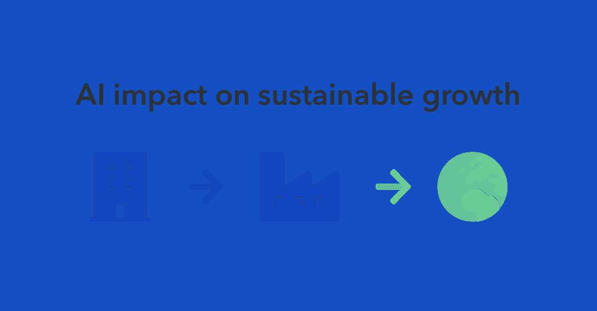
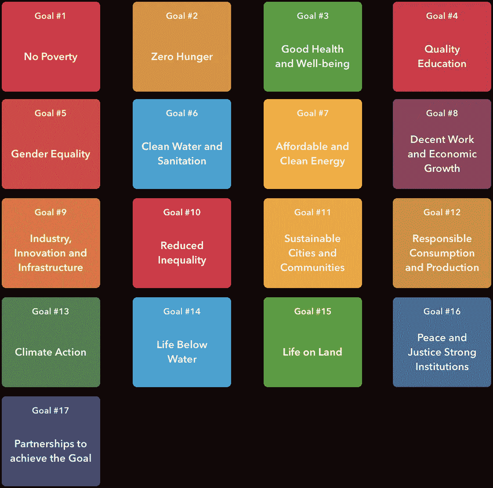
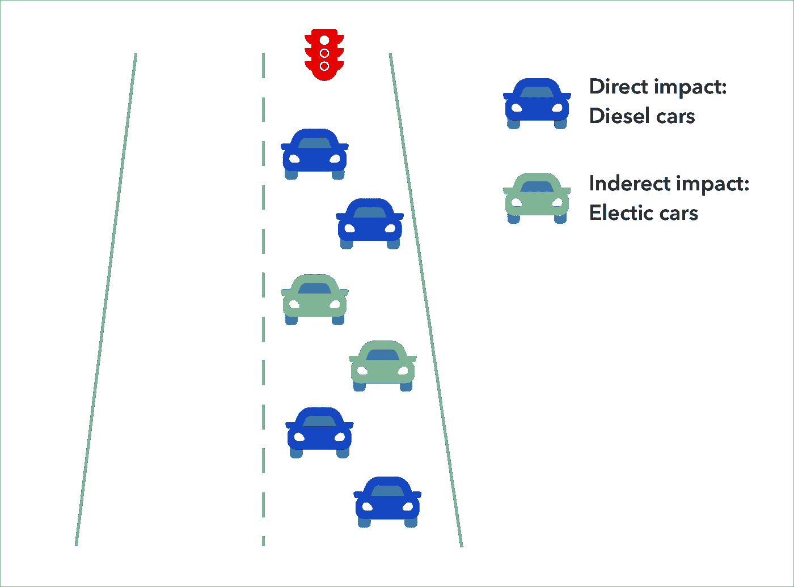
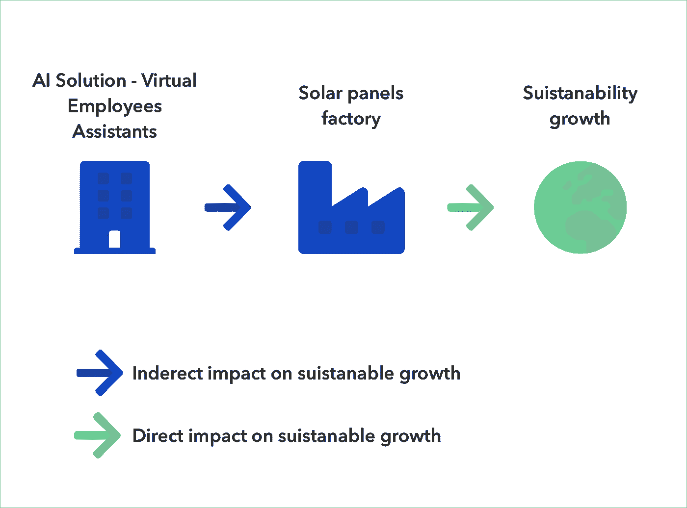

# 人工智能对可持续增长的直接和间接影响

> 原文：<https://towardsdatascience.com/the-direct-and-indirect-impact-of-ai-on-sustainable-growth-fc43b6a5998?source=collection_archive---------24----------------------->

人工智能(AI)的传播正在对社会产生重大影响，改变着我们工作、生活和交流的方式。今天的人工智能允许世界诊断疾病和开发临床路径。它还被用来将个人技能与工作机会相匹配，并创造智能交通，从而减少污染。在地球和组织的可持续发展中，有许多应用人工智能技术的例子。

是时候用人工智能等新兴技术解决一些世界上最大的问题了。

人工智能应该为地球工作，而不是反对它。

据联合国称，有 17 个可持续发展目标(SDG)来改变我们的世界:

来源:[关于可持续发展目标](https://www.un.org/sustainabledevelopment/sustainable-development-goals/)

17 个目标中有许多直接适用于环境和人类对环境的影响。

我们是影响可持续发展的人或组织的一部分吗？简单的回答是肯定的。

我坚信，对可持续增长存在几种类型的影响:直接影响和间接影响。影响的类型可以应用于一个组织及其产品/解决方案，也可以应用于一系列组织。

## **让我们看看第一个例子——Waze**

成千上万的人使用 Waze 寻找最佳路线。也许你甚至没有想到这一点，但当你使用 Waze 时，你正在成为可持续发展的一部分。Waze 不仅仅是为了提高安全性、减少拥堵和优化交通流量，还为了减少污染。当我开始思考 Waze 和它们的影响时，我想到，好吧，如果我开的是柴油车，那么 Waze 会引导我去拥堵较少的道路。因此，我不会产生太多的污染，因为我会避免交通堵塞。

但是如果我开的是电动车呢？我不是可持续发展的一部分吗？答案是——不，我是它的一部分！同样，如果 Waze 可以帮助我避免交通堵塞，我将在车辆较少的道路上行驶，因此我的车辆不会造成更严重的交通堵塞。这是我对可持续增长的间接影响。我能做到这一点多亏了 Waze 和 AI 技术。

**另一个例子——太阳能电池板**

随着物联网传感器连接到太阳能工厂，公司有机会收集用于机器学习监控和预测的数据。应用人工智能技术的一些好处是远程站点检查、预测性维护和能源预测。因此，为使用太阳能电池板的公司开发机器学习模型的 XYZ 公司对可持续发展产生了直接影响。

如果我们深入了解一下，我们可以假设 XYZ 公司正在使用企业软件，例如 SAP。因此，SAP 通过向 XYZ 公司提供 ERP 解决方案，对整体可持续增长产生了间接影响，因为它允许 XYZ 公司处理所有业务流程，例如会计、销售、人力资源、项目等。

即使你是一名会计师，或是为其他制造电动汽车的组织生产半成品的组织的人力资源主管，你也在对可持续增长产生间接影响。

**直接和间接人工智能影响**

基于上面的例子，我们可以将人工智能解决方案分为两类——那些产生直接影响的和那些产生间接影响的。

人工智能公司对气候变化的直接影响的好例子可能是[微软、Agder Energi 和 Powel AS](https://www.nasdaq.com/articles/how-microsoft-using-artificial-intelligence-fight-climate-change-2018-04-06) 。他们创造了一个更有效、更灵活、更自主的电网，这将使节能和更舒适的可再生能源融入电网组合。

有间接影响的 AI 公司。很难衡量人工智能公司对可持续增长的间接影响。但是我们可以大胆地说，例如，RPA 解决方案正在使任何行业的流程自动化。通过这项技术，组织可以降低运营成本并提高效率，这当然会影响可持续的增长链。

此外，在人工智能领域有很多公司，使用自然语言处理和机器学习模型来建立虚拟员工助理。到 2021 年， [Gartner](https://www.gartner.com/en/newsroom/press-releases/2019-01-09-gartner-predicts-25-percent-of-digital-workers-will-u) 预测，25%的数字工作者将每天使用虚拟员工助理(VEA)。这意味着人工智能技术及其间接影响将在提高人们的生产力方面发挥巨大作用。因此，人们将有更多的时间进行创新和可持续发展。

> 如果我们了解我们对可持续增长和人工智能技术能力的影响，我们就可以专注于重要的事情，并取得更好的结果。

**建议**

*对于公司*

组织在定义其技术战略时，应考虑人工智能对可持续发展成果和增长的影响。这两种类型的人工智能解决方案都会对组织的效率产生重大影响。具有直接影响的人工智能解决方案可以提供短期效益，而具有间接影响的人工智能解决方案将提供长期效益。

*针对科技公司*

科技公司意识到了自己在可持续增长中的作用，在创造核心产品和服务的同时，它们也在努力加速可持续增长。例如，AWS 推出了“[小时代码](https://aws.amazon.com/blogs/publicsector/tag/hour-of-code/)计划，数百万学生可以迈出编码的第一步，创造新的解决方案，获得更好的工作。

另一个例子是微软启动了“ [AI for Earth](https://www.microsoft.com/en-us/ai/ai-for-earth) ”计划。该计划是微软加速可持续发展愿景的一部分，通过该计划，您可以获得新知识、资助、云计算、人工智能服务等更多内容。

> 每个大公司都有责任开始在可持续增长方面有所作为。

*面向投资者*

所有类型的投资者都应该扩大他们对解决可持续性挑战的公司的投资组合，包括直接影响和间接影响。这种投资可以加快可持续增长技术投资的转型影响和商业机会。

问候，

安德里·鲁楚克