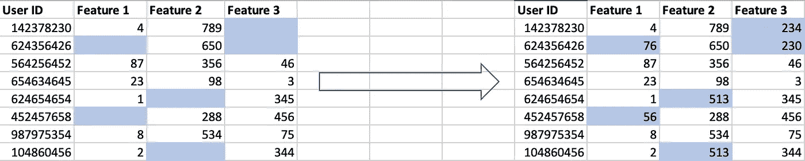
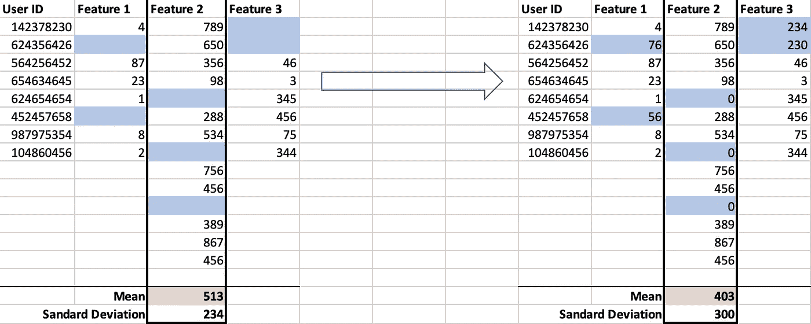
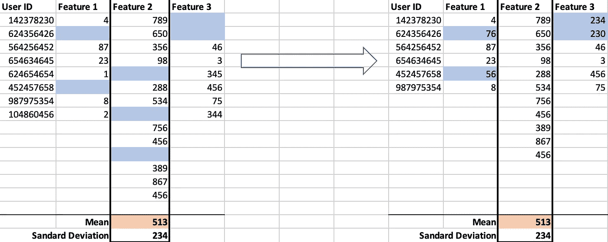

# 归纳法的该做与不该做

> 原文：<https://towardsdatascience.com/the-dos-and-donts-of-imputation-d89d72a26a58?source=collection_archive---------22----------------------->

来源:[乔纳斯·雅各布松](https://unsplash.com/@jonasjacobsson?utm_source=medium&utm_medium=referral)

## 处理缺失数据的好方法

缺少数据是一个问题，在用于教程的数据集中通常不存在，但在现实生活中几乎总是存在。在现实生活中，数据被认为是杂乱的，有错误，并呈现缺失的信息。这可能是因为字段不适用于该记录，例如用户没有备用电话号码，或者是因为数据收集过程中的问题。通常的情况是，特别是在调查中，人们没有完成所有的字段，导致数据不一致。

# 何必呢？

缺失会导致问题，不仅因为数据不能代表实际人口的信息，还因为许多算法不能处理缺失数据。例如， [Sklearn](https://scikit-learn.org/stable/) 中的大多数算法仍然无法处理包含空值的数据。

# 怎么办？

## 改进数据收集过程

很多时候这是不可能的，但是如果可以的话，确保你有一个可靠的数据收集过程。例如，当处理表单时，这意味着发送带有**必填字段**而不是普通字段的谷歌表单，以及下拉项目而不是自由文本框。

使用“自由文本”框获取用户答案的表单示例。在这种情况下，由于不需要答案，用户可以在此过程中创建空值。

与上述选项相同，但标记为“必需”。这样做(几乎)消除了空值的可能性。此外，通过“自由文本”选项，用户获得了更高程度的灵活性，但可以输入任何可能的值。聚集诸如“黑色”、“黑色”和相同答案的拼写错误版本的值变得困难。

使用“多项选择”输入用户输入的“必需”表单示例。在这种情况下，用户需要输入一个值，并且只限于几个选项，一旦收集到调查结果，这些选项很容易分析。

## 使用插补

插补是用特定值填充特征缺失条目的过程。例如，这可以是使用机器学习算法的列的平均值、其中值、零或更复杂的方法。

插补对数据影响的一个简单例子。

在深入研究插补的最佳实践之前，让我们先关注一下不要做什么。

# 不要做什么？

有些被吹捧为良好做法的做法并不完全如此。

## 平均插补

例如，一种方法是使用均值插补或任何其他插补方法，即用固定值填充数据。这是一个快速简单的解决方案，在“让模型运行”方面很有效。然而，通过这样做，我们极大地修改了数据集的方差，改变了数据的底层分布。让我们看一个例子:

应用于特征 2 的均值插补改变了数据的基本分布，从而改变了数据集的可变性(标准差从 234 到 206)。

此外，均值插补不考虑特征之间的相关性。事实上，该算法在要素级别工作，只考虑属于该列的信息，而不是整个数据集。

## 零插补

零插补是另一种解决方案，通常用于简单地允许模型运行，但实际上是一种要避免的解决方案。这种技术有许多缺点。首先，它会使总体向 0 倾斜，从而改变底层数据集的分布。此外，它还突出了均值插补的问题，包括缺乏对特征相关性的深入了解。

用零输入特征 2 使特征的平均值更接近于零(平均值从 513 到 403)。

最后，对于某些变量来说，缺失和零意味着截然不同的两件事。例如，当考虑以米为单位的特征“高度”时，输入缺失值可能会产生误导，因为高度值等于零可能意味着缺失和条目高度小于一米。

## 删除缺少值的行

另一个通常非常容易执行的解决方案是删除所有受缺失值影响的行。这包括删除至少有一个单元格包含空值的每一行。尽管在使算法工作方面是有效的，但是这种解决方案倾向于大大减少观察的数量。

删除特性 2 中的空值条目会导致很大一部分行被删除。

在大多数情况下，具有缺失值的观察值的数量非常大，以至于将它们全部移除会导致观察值的数量相对较少。此外，这种方法会引起偏见方面的问题。由于固有的数据特征，移除至少具有缺失值的所有观测值会引入偏差。例如，删除电话号码特征为空的所有条目可能导致删除由买不起电话的人组成的所有条目。

# 归罪

## 回归插补

这种类型的插补旨在使用其余数据填补特定列的缺失值。特别是，它使用回归模型来使用除要估算的特征之外的所有数据来推断该特定列的缺失值。使用在目标列中具有值的特征来执行模型的训练。然后，通过每个特征重复该方法，直到数据被完全估算。

## KNN 插补

KNN 插补是一种使用 K-最近邻算法在记录间寻找相似性的技术。它的工作原理是在一个 *n* 维空间上绘制代表每个记录的向量，其中 *n* 是特征的数量。使用预定义的距离度量，两个向量越接近，样本就越相似。KNN 插补使用关于 *K* 个相邻样本的信息来填充我们正在考虑的样本的缺失信息。

这项技术对于大多数现实生活中的应用程序来说都是一个很好的解决方案，并且是一种相对可靠的方法。

## 链式方程多元插补(小鼠)

MICE 的工作方式是迭代回归每个特征，使用其余特征推断缺失值，并多次重复这一过程。特别是，MICE 算法的工作原理如下:

1.  对所有特征执行简单类型的插补，例如均值插补
2.  要素的值被重新设置为缺失。
3.  使用插补模型中的其他变量对步骤 2 中目标变量的观察值进行回归。
4.  此栏中缺失的值将由回归模型中的预测值(插补值)替换。
5.  对每个丢失数据的变量重复步骤 2 到 4。
6.  重复步骤 2 到 4 若干个周期，在每个周期更新估算值。

# 摘要

总的来说，我们讨论了丢失数据的注意事项。
**尽量避免**:

*   平均插补
*   零插补
*   删除丢失的值

**试使用**:

*   回归插补
*   KNN 插补
*   老鼠归罪

如果您可以访问数据收集流程，也要确保开发足够健壮的流程，以阻止用户生成缺失值。

*想看更多这样的文章，关注我的*[*Twitter*](https://twitter.com/jayzuccarelli)*，*[*LinkedIn*](https://www.linkedin.com/in/ezuccarelli)*或者我的* [*网站*](https://eugeniozuccarelli.com/) *。*