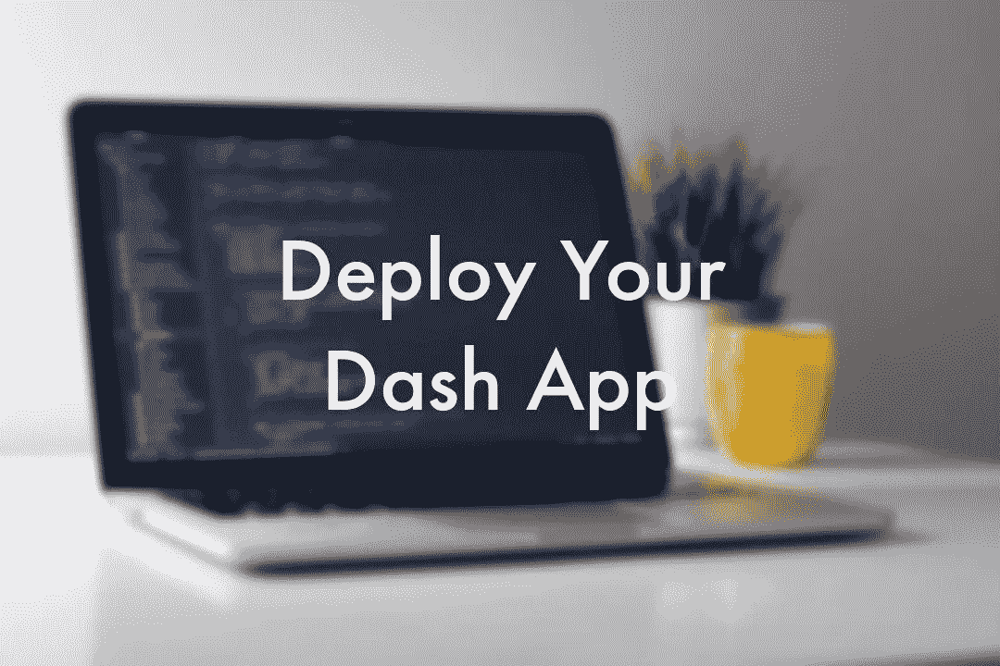
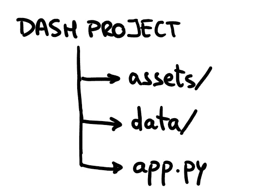
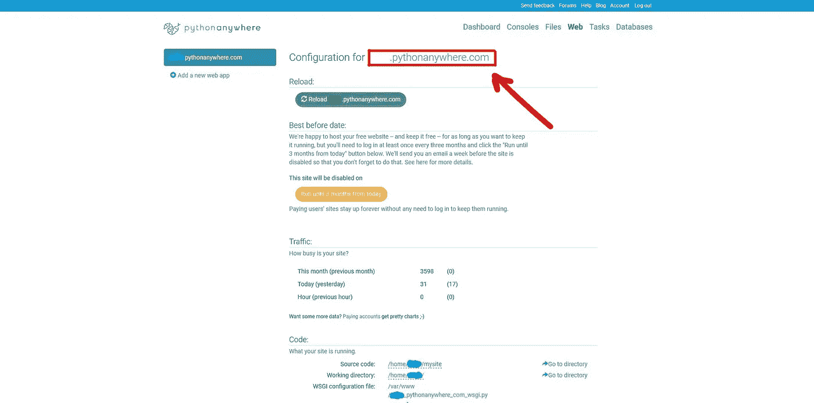
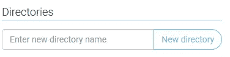
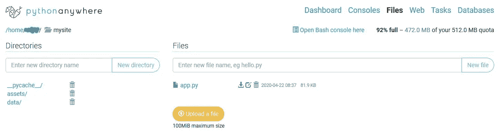
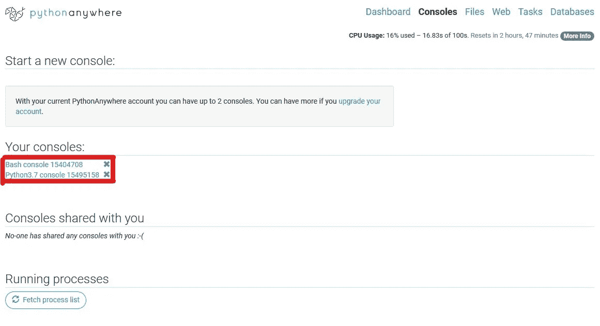

# 免费部署 Dash 应用程序的最简单方法

> 原文：<https://towardsdatascience.com/the-easiest-way-to-deploy-your-dash-app-for-free-f92c575bb69e?source=collection_archive---------8----------------------->

您是否开发了一个在本地运行的 Dash 应用程序，现在想与全世界分享它？让我们看看如何在服务器上免费部署 Python web 应用程序，这样任何人都可以通过链接访问它。



由作者编辑的 [Clément H](https://unsplash.com/@clemhlrdt?utm_source=unsplash&utm_medium=referral&utm_content=creditCopyText) 在 [Unsplash](https://unsplash.com/@clemhlrdt?utm_source=unsplash&utm_medium=referral&utm_content=creditCopyText) 上的照片。

在这篇文章中，我们将看看如何发布一个 Dash 应用程序:首先，我们将简要介绍 Dash(解释 Dash 应用程序的开发不在这篇文章的范围之内)。其次，我们将看到如何使用 **pythonanywhere 建立一个 web 应用程序。**最后，我们将介绍如何让您的 Dash 应用程序全天候运行，并通过一个链接使其可用。

# Dash 是什么

Dash 是用于构建 web 应用程序的 Python 框架，使您能够使用纯 Python 构建仪表板。Dash 是开源的，它的应用运行在网络浏览器上。



Dash 项目通常具有以下结构:

*   **app . py**:Python 主 app。
*   **assets 文件夹**:包含字体、图像和 CSS 的资源。
*   **数据文件夹**:包含应用程序使用的数据文件。

# 如何发布您的 Dash 应用

一旦你建立了你的 Dash 应用程序，让我们开始如何与世界分享它吧！🌍

## 设置 web 应用程序🔧

通过创建一个*初级账户*来注册[pythonanywhere.com](https://www.pythonanywhere.com/pricing/)。

在顶栏上，转到 *Web* > *添加新的 Web 应用程序*:

1.  点击下一个的**。**
2.  选择 **Flask** 作为 Python Web 框架。
3.  选择你用开发 app 的 **Python 版本。**

您可以通过在 Python 中运行以下代码来检查计算机上的 Python 版本:

```
import sys
print(sys.version)
```

4.保留默认路径，点击**下一步**。

现在，您的 web 应用程序已设置完毕，可以通过 web 仪表盘中的链接进行访问:



当您进入时，您将看到默认应用程序，我们现在将使用 Dash 应用程序替换它。

👉重要事项:这是任何人都可以访问您的 web 应用程序的链接。

## 上传您的文件📤

在顶栏上，转到*文件*，在*目录*侧栏中，点击`mysite/`。在里面，您会发现一个名为`flask_app.py`的文件。此文件包含当前作为您的 web 应用程序运行的默认代码。你可以直接**删除这个文件**。

现在你可以开始上传你自己项目的文件了。通过创建新文件夹并上传文件，您应该能够重新创建与本地计算机中相同的文件结构。



创建新文件夹。

一旦你上传了所有的文件，你应该在`mysite/`文件夹中有这样的东西。确保`app.py`(主 dash 应用文件)不在任何其他文件夹中。



👉注意:如果你的应用程序需要访问其他文件夹中的数据，一旦你上传了必要的文件，记得更改`app.py`中的路径。你只需点击文件打开它来替换路径。例如，如果我想访问`data/`文件夹中的一个文件，新路径将是`/home/user_name/mysite/data/file.csv`。

## 安装依赖项🎒

在顶栏上，转到*控制台*。在这里，您将找到 **Bash 控制台、**，这是您在计算机中常见的终端，以及 Python 控制台。



进入 Bash 控制台，安装应用程序正常运行所需的任何 Python 依赖项。

👉快速提示:尝试在您的计算机上安装相同的库版本，以确保不会出现任何意外错误。

## 最后一档🏁

在顶栏上，转到 *Web* 并在*代码*部分打开 *WSGI 配置文件。*

你会看到一行写着:

```
from flask_app import app as application
```

你要把它替换成:

```
from app import app
application = app.server
```

单击保存，然后在 Web 选项卡中单击重新加载以使用新文件更新应用程序。

恭喜你。🥳现在任何人都可以访问链接`[your-username].pythonanywhere.com`使用你的应用🎉🎉🎉

如果您看到任何错误，您可以随时检查错误日志文件。您可以在 *Web* 选项卡的*日志文件*部分中找到它。

如果你正在读这篇文章，感谢你的时间，我真的希望你能从这篇文章中得到一些价值😊

下一集再见！🚀

(附:如果有什么不清楚的地方，我很乐意帮忙🤓)