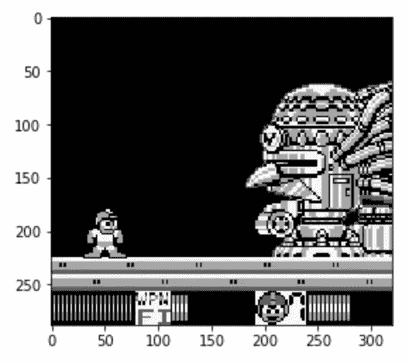

# 使用 Python 下载 YouTube 视频的最简单方法

> 原文：<https://towardsdatascience.com/the-easiest-way-to-download-youtube-videos-using-python-2640958318ab?source=collection_archive---------0----------------------->


来源: [Unsplash](https://unsplash.com/photos/peLs78VbU50)

## 以及如何使用自定义类将帧提取为图像

在我的第一篇关于 Medium 的文章中，我展示了如何训练一个卷积神经网络来分类来自旧 GameBoy 游戏——Mario 和 Wario 的图像。一年多后，我想重温这个过程的一个方面——从 YouTube 视频下载视频(可能还有音频),并提取帧作为图像。我们可以将这样的图像用于各种机器学习项目。

# 设置

在我之前的文章中，我使用了一个名为`pytube`的库来下载视频。然而，在 YouTube 引入一些变化后，它不再真正可用——任何下载视频的尝试都会导致`KeyError: ‘url_encoded_fmt_stream_map’`。此外，图书馆不再得到积极维护。

这就是为什么在这篇文章中我建议使用`pytube3`，它是原始`pytube`库的一个分支，并且已经修复了错误(它只适用于 Python 3)。原始库的所有功能都被保留，我们实际上仍然使用`import pytube`来导入库(即使我们使用`pip install pytube3`来安装它)。

下面我给出了本文所需的所有导入的列表:

```
from pytube import YouTube# misc
import os
import shutil
import math
import datetime# plots
import matplotlib.pyplot as plt
%matplotlib inline# image operation
import cv2
```

# 下载视频

在这一部分，我将介绍如何使用 Python 下载 YouTube 视频。我将使用 GameBoy 的一款经典视频游戏—*Mega Man:Wily 博士的复仇*。第一步是使用我们想要下载的视频的链接创建一个`YouTube`类的实例。

```
video = YouTube('https://www.youtube.com/watch?v=NqC_1GuY3dw')
```

使用这个对象，我们可以下载视频/音频，并检查视频本身的一些属性。我们可以使用的一些有趣的方法有:

*   `length` —以秒为单位的视频长度
*   `rating` —视频的分级
*   `views` —视图的数量

下一步是使用`streams`方法检查可用的流。我们可以用`all`方法来链接它，以查看所有可用的流。

```
video.streams.all()
```

运行该行代码将返回以下媒体格式列表:

关于媒体格式和流处理选项的更深入的描述，我在这里参考`pytube`的可用文档[。](https://python-pytube.readthedocs.io/en/latest/index.html)

让我们使用过滤方法将所有可用的流缩小到 mp4 文件:

```
video.streams.filter(*file_extension* = "mp4").all()
```

运行该代码会导致以下选择:

在这种情况下，我们将使用第一个可用的选项，即 360p(分辨率)的选项。为了下载视频，我们首先通过使用`itag`来指示我们想要下载的视频，然后使用`download`方法来下载文件。下载视频的完整代码如下:

```
video.streams.get_by_itag(18).download()
```

在`download`方法中，我们还可以指定视频的目的路径。默认值是当前目录。

# 从视频中提取帧

我创建了一个名为`FrameExtractor`的特殊类——顾名思义——从视频中提取单个帧并保存为图像。该类定义如下:

在实例化`FrameExtractor`类的对象时，我们需要提供我们想要处理的视频的路径。在`__init__`方法中，我们还提取了视频的一些特征，如总帧数和每秒帧数(FPS)。一般来说，该类提供了从视频中提取每第 *x* 帧的功能，因为任何两个相邻帧之间的差异将是最小的。我们还提供了一些方便的方法。所有方法描述如下:

*   `get_video_duration` —打印视频的持续时间
*   `get_n_images` —打印每隔 *x* 帧提取的图像数量(由`every_x_frame`表示)
*   `extract_frames` —这是该类的主要方法，用于提取图像。最起码要提供`every_x_frame`的值和图像的名称(表示序列的数字会自动添加到名称的末尾)。默认情况下，图像将保存在当前目录中。我们还可以提供一个到所需目录的路径(`dest_path`)，如果它不存在，就会为我们创建一个。我们还可以指定图像文件的格式，默认是 JPG。

现在是实际使用该类的时候了。我们从实例化`FrameExtractor`类的对象开始:

```
fe = FrameExtractor('Game Boy Longplay [009] Mega Man Dr Wilys Revenge.mp4')
```

接下来，我们调查视频的长度:

```
fe.get_video_duration()
# Duration: 0:39:48.333333
```

举个例子，假设我们想每隔 1000 帧提取一次。为了计算使用此设置提取的图像数量，我们运行:

```
fe.get_n_images(every_x_frame=1000)
# Extracting every 1000 (nd/rd/th) frame would result in 71 images.
```

最后一步，我们提取图像:

```
fe.extract_frames(every_x_frame=1000, 
                  img_name='megaman', 
                  dest_path='megaman_images')# Created the following directory: megaman_images
```

在使用`extract_frames`方法之前，指定的目录并不存在，所以它是自动创建的，我们看到了一个打印的声明来确认这一点。

最后，我们定义了一个查看下载图像的简短函数:

```
def show_image(path):
    image = cv2.imread(path)
    plt.imshow(image)
    plt.show()show_image('megaman_images/megaman_61.jpg')
```

运行该代码会导致显示下图:



图片来自接近比赛结束的时候:)

# 结论

在本文中，我描述了如何使用`pytube3`库从 YouTube 下载视频，并编写了一个自定义类，用于从下载的视频中提取帧作为图像。对该类的一个潜在修改是考虑到跳过视频的第一个 *n* 秒，因为开头通常包含标题屏幕、公司徽标等。在视频的结尾也可以这样做。然而，就目前而言，我们也可以通过手动删除对我们没有用处的图像来解决这个问题。

你可以在我的 [GitHub](https://github.com/erykml/medium_articles/blob/master/Computer%20Vision/downloading_youtube_videos.ipynb) 上找到本文使用的代码。一如既往，我们欢迎任何建设性的反馈。你可以在推特上或者评论里联系我。

喜欢这篇文章吗？成为一个媒介成员，通过无限制的阅读继续学习。如果你使用[这个链接](https://eryk-lewinson.medium.com/membership)成为会员，你将支持我，不需要你额外付费。提前感谢，再见！

我最近出版了一本关于使用 Python 解决金融领域实际任务的书。如果你有兴趣，我在[贴了一篇文章](/introducing-my-book-python-for-finance-cookbook-de219ca0d612)介绍这本书的内容。你可以在亚马逊或者 Packt 的网站上买到这本书。