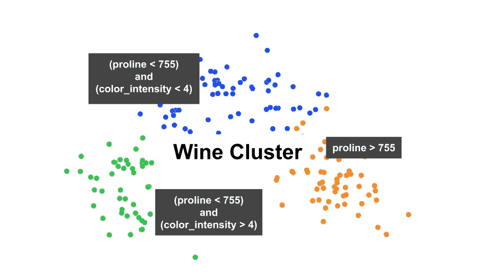
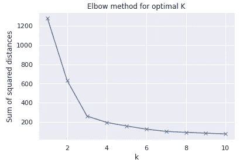
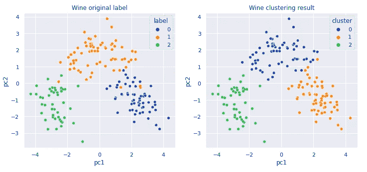
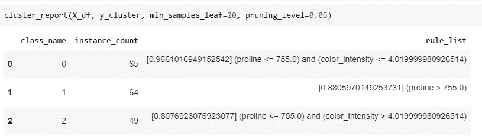

# 解释聚类结果的最简单方法

> 原文：<https://towardsdatascience.com/the-easiest-way-to-interpret-clustering-result-8137e488a127?source=collection_archive---------8----------------------->

## 用函数调用描述集群

你以前使用过聚类方法吗？对你来说最困难的部分是什么？通常，我通过以下步骤进行聚类:缩放输入要素、降维，并选择一种可以对数据执行良好的聚类算法。这些步骤很标准，对吧？但是，问题摆在面前:**理解聚类结果**。

理解或解释聚类结果通常需要时间。我们做一些统计分析和可视化来比较集群。如果我们改变降维或聚类方法，聚类将会改变，我们需要重新进行分析。解释聚类结果成为阻碍我们快速迭代整个过程的瓶颈。

**我对聚类结果的初步解读就像调用一个函数** `**cluster_report(features, clustering_result)**`一样简单。在接下来的部分，我将给出一个集群的例子和`cluster_report`的结果。如果你想跳过这个例子，你可以滚动到这篇文章的底部来获得代码和 Google Collab 笔记本。

# 示例:葡萄酒聚类

让我们以 [Scikit 的葡萄酒数据集](https://scikit-learn.org/stable/datasets/index.html#wine-dataset)为例。这个数据集有 13 个数字特征和一个指示葡萄酒类型的标签。以下是数据样本。

首先，我们需要将数据标准化，以防止由更大规模的特征主导的聚类。在这种情况下，我们使用零均值和单位方差标准化。之后，我们使用 PCA(主成分分析)将维数从 13 个特征减少到 2 个特征/主成分。

我们在这个例子中使用 KMeans 集群，因为我们大多数人都知道它。为了确定 k 均值聚类的聚类数，我们使用了肘方法，并得到 k=3 为最佳值。

在两个主成分上使用 k=3 的 k 均值，我们得到下面的聚类结果。左侧散点图显示的是原始标签。右边的散点图显示了聚类结果。

获得聚类结果后，我们需要解释聚类。描述集群最简单的方法是使用一组规则。我们可以使用原始特征和聚类结果作为标签，通过训练决策树模型来自动生成规则。我写了一个`cluster_report`函数，包装决策树训练和从树中提取规则。**你可以简单地调用** `**cluster_report**` **来描述集群**。很简单，对吧？

有两个参数我们可以调整:`min_samples_leaf`和`pruning_level`。这些参数控制着决策树的复杂性。为了得到更一般的规则，我们可以增加`min_samples_leaf`或`pruning_level`的值。否则，如果我们想得到更详细的规则，我们可以减小`min_samples_leaf`或`pruning_level`的值。

括号中的数字表示满足规则的`class_name`的比例。例如，`**[0.880]** (proline > 755.0)`意味着对于满足`(proline > 775.0)`规则的所有实例，它们中的 88%在聚类 1 中。

# 代码

您可以查看并运行我用来生成示例的代码:

> [**Google Colab 笔记本**](https://colab.research.google.com/drive/1IntZ7lIXqlkLi9vyxz-uHAoowj4gaQlz?usp=sharing)