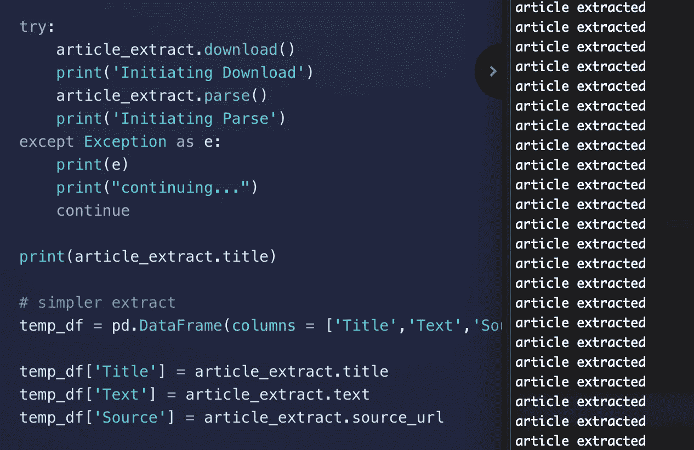

# 网上搜集文章的简单方法

> 原文：<https://towardsdatascience.com/the-easy-way-to-web-scrape-articles-online-d28947fc5979?source=collection_archive---------27----------------------->



文章刮刀截图由安德鲁贝里

## 在我的朋友 newspaper3k 插件的一点帮助下，我们可以将来自不同新闻媒体的文章语料库放入熊猫数据框架。

前几天，我在做一个项目，需要我在网上搜集一堆新闻文章。我了解自己，我想找出最简单快捷的方法来完成这个任务。

有一些著名的 python 插件可以帮我完成这项工作，其中一个是 [BeautifulSoup](https://www.crummy.com/software/BeautifulSoup/bs4/doc/) 。这是一个很棒的插件，但是我不想深入了解每个在线新闻平台独特的 html 结构。

通过大量的谷歌搜索，我确实找到了解决问题的简单方法。我找到了[报社 3k](https://newspaper.readthedocs.io/en/latest/) ！

在本教程中，我将向你展示如何快速地将来自不同新闻媒体的大量新闻文章整合到一个简单的 python 脚本中。

# 如何使用 Newspaper3k 抓取网上文章

首先，我们需要将 python 插件安装到您的环境中。

专业提示:创建另一个虚拟 python 环境，这被认为是最佳实践。

```
$ pip install newspaper3k
```

## 基础知识

## 高级:从一个新闻网站下载多篇文章

当我抓取一堆新闻文章时，我想从一个新闻网站抓取一堆文章，然后把所有的东西放在一个熊猫数据框架中，这样我就可以把数据导出到一个*中。csv* 文件。**在这个插件的帮助下做起来其实挺简单的。**

….这就对了。你就是这样轻松刮出一堆文章的。

使用上面的代码，您可以实现一个 for 循环，来循环访问一堆报纸源。创建一个巨大的最终数据框架，你可以导出它，然后用它来玩。

## 发烧友:多线程网页抓取

然而，我上面提出的解决方案对某些人来说可能有点慢，因为它一篇接一篇地下载每篇文章。如果你有很多新闻来源，这可能会有点费时。然而，**有一种方法可以加速这一切**。我们可以在多线程技术的帮助下做到这一点。

*注意:在下面的代码中，我实现了每个源的下载限制。在运行这个脚本时，您可能想去掉它。限制 was 的实现是为了让用户在运行时测试他们的代码。*

我喜欢**边做边学**，所以我建议任何阅读本书的人去**玩上面的代码**。从这里开始，你现在可以使用 newspaper3k 来抓取文章。快乐的网页抓取！

**注意事项:**

*注意:从每个在线新闻渠道抓取大量文章的成功因渠道而异。*

*注意:Newspaper3k 的多线程特性有时会出错。取决于新闻渠道。网络抓取文章每个新闻出口使用。构建功能是最可靠的。*

然而，在大多数情况下，它工作得很好！

一定要看看我的其他网页抓取媒体帖子。

[](/how-to-collect-comments-from-any-new-york-times-article-to-a-pandas-dataframe-a595ec6a1ddf) [## 如何从《纽约时报》的任何一篇文章中收集对熊猫数据框架的评论

### 《纽约时报》( NYT)最精彩的部分是他们对文章积极且高度节制的评论部分。

towardsdatascience.com](/how-to-collect-comments-from-any-new-york-times-article-to-a-pandas-dataframe-a595ec6a1ddf) 

## 参考

[1] Newspaper3k:文章搜集与整理文档，[https://newspaper.readthedocs.io/en/latest/](https://newspaper.readthedocs.io/en/latest/)