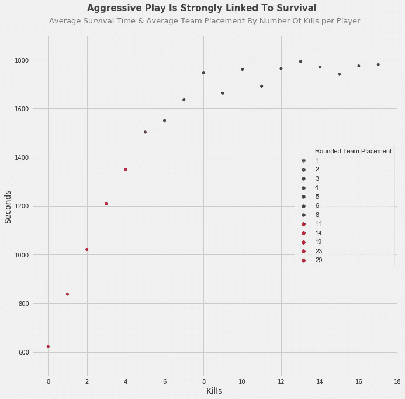
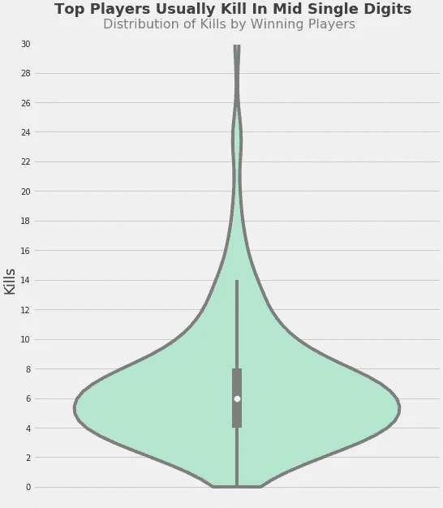
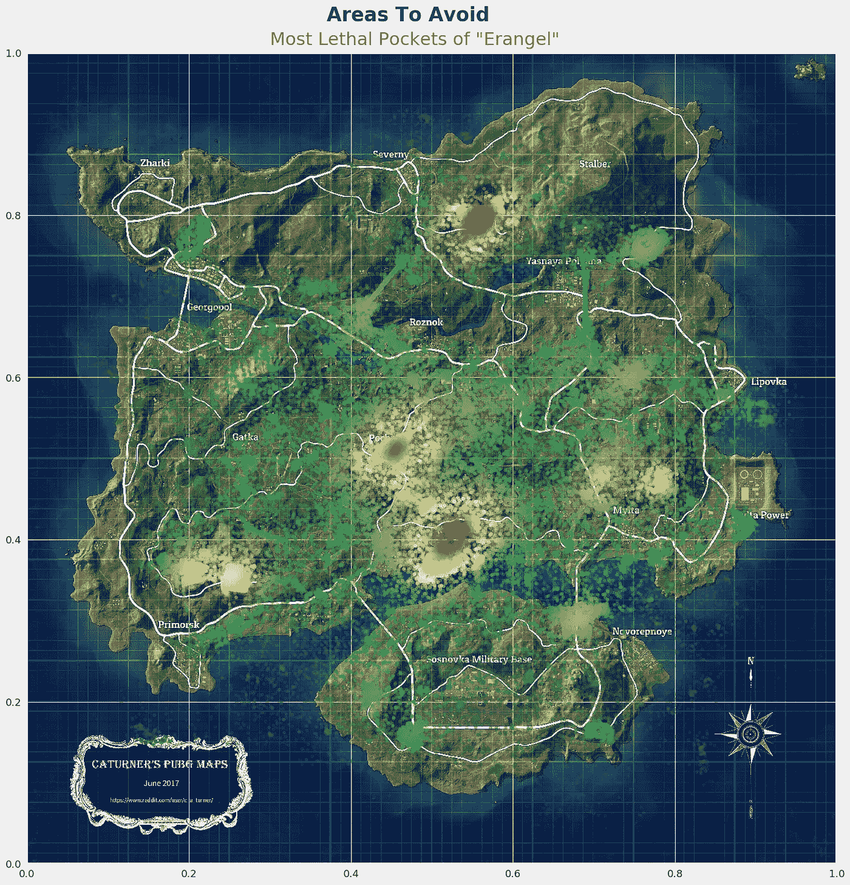
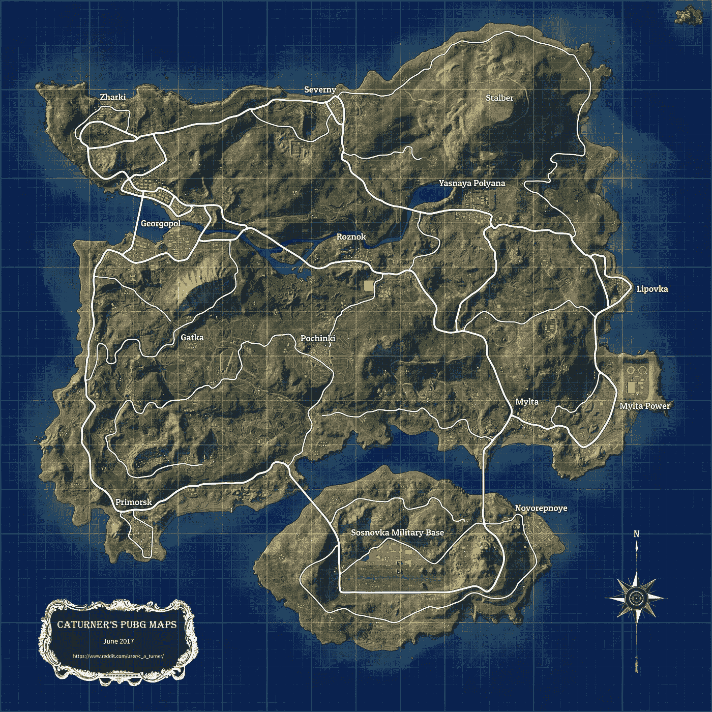
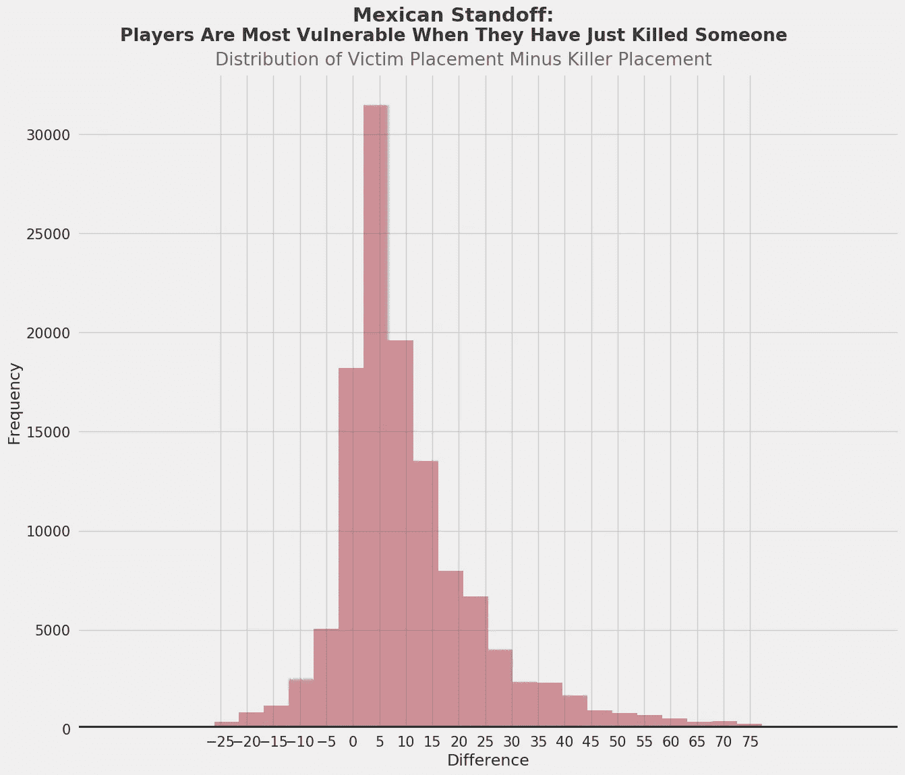
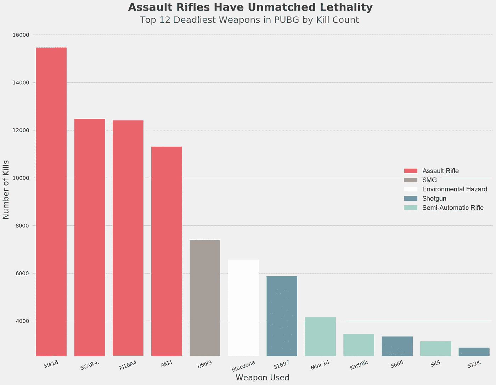
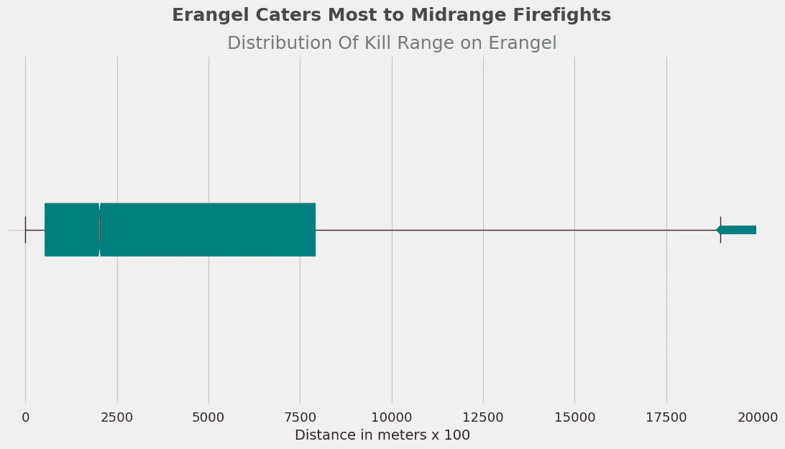
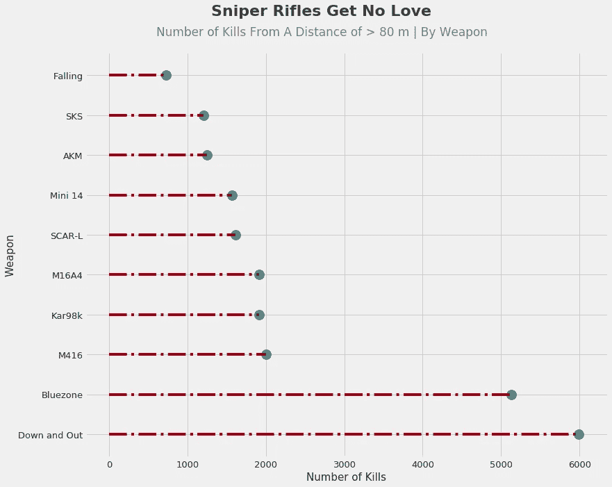
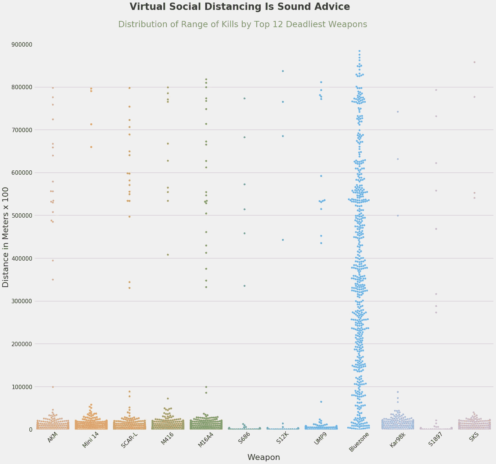

# 皇家战役游戏的潮起潮落:通过漂亮的图表吸取更少的指南

> 原文：<https://towardsdatascience.com/the-ebb-and-flow-of-a-battle-royale-game-or-a-guide-to-sucking-less-through-pretty-graphs-6933a7367077?source=collection_archive---------41----------------------->

Hugo Jehanne 在 [Unsplash](https://unsplash.com?utm_source=medium&utm_medium=referral) 上拍摄的照片

## 隔离时代的策略、生存和安置模式

没有什么比流行病更能让我们粘在屏幕上了。在冠状病毒引发的隔离期间，游戏开发商 Infinity Ward 为《使命召唤:现代战争》(Call of Duty:Modern war)发布了一款名为 Warzone 的皇家战役(Battle Royale)游戏模式，这是一款拥有[5000 万玩家数量的游戏](https://www.theverge.com/2020/4/10/21216683/call-of-duty-cod-warzone-players-milestone-50-million-activision)。在封锁期间，我一直在和一些朋友一起玩，我想知道我们可以在 s̶t̶o̶p̶̶b̶e̶i̶n̶g̶̶b̶l̶i̶n̶d̶s̶i̶d̶e̶d̶̶a̶n̶d̶̶c̶o̶n̶s̶i̶s̶t̶e̶n̶t̶l̶y̶̶m̶o̶w̶e̶d̶̶d̶o̶w̶n̶̶i̶n̶̶o̶u̶r̶̶r̶u̶s̶h̶̶t̶o̶̶g̶e̶t̶̶t̶o̶̶t̶h̶e̶̶s̶a̶f̶e̶̶z̶o̶n̶e̶̶t̶o̶w̶a̶r̶d̶s̶̶t̶h̶e̶̶e̶n̶d̶̶o̶f̶̶e̶a̶c̶h̶̶m̶a̶t̶c̶h̶的游戏中做些什么样的改变来提高整体水平。

我没有找到任何关于 Warzone 的数据，但我找到了 PUBG 的大量数据，这是一款与 Warzone 共享大部分机制的 BR 游戏，事实上，可以被视为后者的前身。

我随后使用 Seaborn 进行的分析确实为我提供了游戏技巧，但它基本上变成了一种数据驱动的视角，审视玩家在游戏中的一般行为，以及这种行为如何与他们的生存和获胜机会相关联。

如果你想了解获胜的玩家在做什么，或者为什么你的另一半会花几个小时玩这些游戏，并通过赞美它们的复杂性和对策略的需求来证明这一点，请继续阅读。

## BR 游戏的简短入门:

50-100 名玩家，不管是单独游戏还是团队游戏，都被空投到一个大地图上，没有任何武器或装备。游戏的目的是从地图上收集这些物品，并成为最后一个杀死对手的人/队。

“安全区”的机制确保比赛继续进行。安全区是圆形的，随着时间的推移逐渐缩小。如果玩家被抓到这个安全区域之外，他们很快就会死亡。通过这种方式，幸存的玩家最终会在游戏结束时被赶到一个很小的安全区域，在那里他们别无选择，只能互相残杀。

本页[上的第五张图片](https://forums.tomsguide.com/faq/playerunknowns-battlegrounds-beginners-tips.205823/)对安全区技工来说是一个很好的视觉指南。

安全区的每个增量 a)是随机决定的，但 b)是前一个增量的子集，因此有一个可控的不可预测性的元素，使游戏和策略有点独特。

# 数据和代码

我感谢用户 [KP](https://www.kaggle.com/skihikingkevin) 搜集原始数据并在 [Kaggle](https://www.kaggle.com/skihikingkevin/pubg-match-deaths#erangel.jpg) 上提供。我会让他们介绍数据集:

“这个数据集提供了两个 zip:聚合和死亡。

*   在“死亡”中，文件记录了在 72 万场比赛中发生的每一起死亡事件。也就是说，每一行记录了一个玩家在比赛中死亡的事件。
*   在“aggregate”中，每场比赛的元信息和球员统计数据被汇总(由 pubg 提供)。它包括各种综合统计数据，如玩家死亡、伤害、步行距离等，以及比赛本身的元数据，如队列大小、fpp/tpp、日期等。"

因为有如此多的数据，我在一些地方使用了微小的(1%)随机样本，以便更清晰地可视化。我把我的发现分成三类:1)生存和位置，2)地点，3)武器和杀戮。最后，所有的功能工程、争论和可视化代码都可以在我的 [Github](https://github.com/Taimur-Shabbir/Battle-Royale-Strategy-Visualisation-and-Analysis/tree/master) 的 Jupyter 笔记本上找到。

# 生存和安置

## 永恒的争论:露营还是不露营？

BR 游戏中的游戏风格可以不完全分为两类:I)露营，玩家/团队隐藏在有利的位置，等待对方玩家杀死对方，只有当敌人接近他们时才参与；ii)侵略，玩家不会在一个位置停留很长时间，可能会主动寻找敌人。

Giorgio Trovato 在 [Unsplash](https://unsplash.com?utm_source=medium&utm_medium=referral) 上拍摄的照片

因为这是描述性分析，不是实验，所以不能推断因果关系。这篇文章中的每一个分析和图表都是如此；都是我自己的解读。这可能是一个虚假的变量负责的关系或因果关系的方向是相反的。

不管怎样，不躲避敌人的攻击肯定会带来更好的游戏效果:

我是 FiveThirtyEight 的无耻粉丝

这个图表显示了平均存活时间和平均位置，每一个数值都代表了玩家个人的杀戮次数。

换句话说，每一个在比赛中杀死两个敌人的玩家都活了下来，无论是独自一人还是在团队中，平均时间超过 1000 秒。此外，他们的平均排名在 10 位左右。这项措施表明，更好的球员不会简单地等待对方球员杀死对方，然后与剩下的人交战。

但是野营的玩家有没有可能在他们有利的位置上被保护起来的时候简单的干掉敌人呢？

我们可以从另一个角度来回答这个问题，这个角度也许更准确地抓住了露营的本质:运动

更拥挤的数据用不同的颜色表示

有一个弱到中等的线性关系，其中数据被涂上水手蓝。

有趣的是，有很多这样的例子，球队/球员移动不多，但始终排名在 15 到 30 之间。然而，随着位置的进一步提高，移动的距离不可否认地增加了。

停留在一个地方可能:I)招致一波又一波的敌人，因为他们可能已经发现了你的确切位置；或者 ii)在游戏中，安全区域会像这样变化，这对游戏没有好处。

因此，不完美的答案是，虽然露营可以让你走得很远，但如果你不像一个沙发土豆那样玩耍，你更有可能走完全程。

这又引出了另一个问题。

## 什么是你能成为的最和平主义者，并且仍然有很大的胜算？

露营并不完全等同于和平主义，但我想知道一个人能杀死几个敌人，并且仍然有相当大的机会成为最后一个站着的人。

让我们看看所有赢得比赛的玩家，以及他们杀死了多少玩家:

这个小提琴图的宽度显示了获胜玩家获得不同杀死数量的分布

50%的赢家杀死 4 到 8 个玩家，而任何超过 14 个的玩家都被认为是非常极端的。

这似乎是这两种打法的理想组合。

# 位置

## Erangel 有哪些最致命的口袋？

Erangel 是提供数据的两个地图之一，据公共公报称，面积为 8 公里×8 公里。以下是 Erangel 上大多数玩家集体死亡的热点:

鸣谢:卡特勒的 PUBG 地图

和原始图像进行比较:

鸣谢:卡特勒的 PUBG 地图

据统计，波钦基是埃兰格尔岛上最糟糕的地方之一。它的东南方有一个更不利于生存的地理邻居，应该避开。

我对 PUBG 不像对 Warzone 那样熟悉，但我猜 Pochinki 和它的表亲必须:I)提供一些好的武器，这样玩家就会被它们吸引，或者 ii)成为安全区最终增量的公共场所。

同样，Severny 的东南部应该是禁区。

这三个地区是 Erangel 最致命的地方，我们可以说 Primorsk、Mylta 和军事基地东北角以北的地区也是如此。

## 玩家什么时候最有可能被杀？

我想找到这个问题的答案，不依赖于时间变量，而是依赖于游戏中的事件，因为一场比赛持续的时间可能会有很大的不同，所以没有固定的基准。

“名次”是一名运动员在一场比赛中的排名。如果一个玩家是第一个被淘汰的，他们的名次等于游戏中的玩家人数；如果 n = 100，玩家的落点是 100(即最差)。

第二个被淘汰的玩家将有 n-1 的位置，在这种情况下是 99。

获胜者总是有 1 个位置，因为他们是最后一个站着的人/队。换句话说，你的位置越低，你打得越好。

有趣的是，玩家最常死于他们刚刚完成对对手的领先后不久。通过比较凶手和受害者的位置，我们可以得出这个结论:

大多数数据的位置差异在-5 到 10 之间。

仅限于正差异，这意味着一个刚刚杀死另一个人的玩家通常会比他们的受害者好不到 10 个位置。

此外，杀手几乎立即(0

这可能是由于“抢劫”的机制；当你在 BR 游戏中杀死一个玩家时，你可以拾取或掠夺他们的装备。其他玩家知道这一点，并经常瞄准新鲜的尸体来挑选潜在的秃鹫。另一方面，可能现在你的位置被其他玩家知道了，因为你参与了交火。

反过来，我们如何解释负的位置差异的存在？

答案是玩家可能会作为一个团队来玩。如果一个玩家杀死了另一个玩家，但第一个玩家的整个团队在第二个玩家的整个团队之前被淘汰，那么对于该观察，位置差异将为负。

# 武器和杀戮

## 你应该使用什么武器？

有竞争力的玩家几乎会做任何事情来找到超越他人的优势，所以武器被使用的程度是其有效性的一个很好的代理。

这里有一个意想不到的发现:在两张地图上，没有一把狙击步枪是造成最多杀戮的武器，考虑到它们的尺寸，这很奇怪。另一方面，顶级捕食者无疑是突击步枪:

我真的试着把“蓝色区域”涂成蓝色，但是谁想看到 3 个白色的条纹？

M416 拥有最多的杀伤，在战区也被认为是一种非常“元”的武器。一把 UMP9 形式的冲锋枪溜了进来，这也是有道理的，因为 SMG 只在近距离表现出色。

在这种性质的战斗中，伴随它的是猎枪，其中 3 支能命中目标。

最后，狙击步枪的一个可能的替代品，神枪手步枪，也让它的存在为人所知。

我要给狙击枪另一次机会，通过增加对它有利的机会。为了做到这一点，我需要看到艾朗格尔的具体杀戮范围。

## 大多数决定性的交火发生在埃兰格尔的什么距离？

数据中的轴的范围是 0，800000，正如我前面提到的，Erangel 是一个 64 公里的正方形地图。

这意味着，在我的“杀伤范围”变量中，100 步等于地面上 1 米的距离。我保留了这个约定，而不是将距离单位转换成米。

一半的杀人事件涉及到黑仔和受害者相距 5 到 75 米，所有异常值都在 200 米左右的北方。

如果我们期望狙击步枪在长距离方面表现出色，那么我们可以在> 80 米处寻找最致命的武器，因为这大约是上述分布的第三个四分位数，可以作为一个有用的基准。

但是 PUBG 玩家*真的*不喜欢这个级别的武器:

“蓝色区域”是非安全区域的公共名称

要么是狙击步枪的技能下限太高，没有足够多的玩家可以有效地使用它们，要么是玩家认为神射手步枪是更好的替代品，所以使用它们。

另一个观察是，太多的玩家在远离安全区的地方被抓到。

这就是蓝带杀戮所表明的；这个小样本中的 5000+玩家，死时距离安全区都在 80 米以上，真是地域意识太差了。

不会比这更糟了，对吧？错误:

完全巧合的是,“蓝色地带”这次被染成了蓝色

*   太多的玩家因为蓝区而死的时候都在方向盘上睡着了
*   散弹枪(S686，S12K，S1897)只有在你离玩家角色足够近，可以闻到玩家游戏控制器上汗味的时候才有效
*   这些异常值中的大部分可能是反常的事故，因为长距离的子弹投掷是 PUBG 中重复的机制，很少有人能有效地使用它

# 结果(相当明显)是减少吮吸的描述性清单

由于这是一个描述性的分析，下面的列表告诉我们成功的球员是怎么做的。但这并不一定意味着复制它们就能让你成功；你必须实施这些策略，自己去发现！

1.  不要做一个纯粹的露营者
2.  不要做一个纯粹的露营者
3.  但是也不要喷和祈祷；移动并选择你的镜头
4.  杀死一个玩家后保持警惕；忽略立即掠夺他们尸体的诱惑，离开交火区域，因为你的位置现在可能被其他玩家知道了
5.  无论你玩什么 BR 游戏，都可以使用 M4A1
6.  在你和从有利位置向你射击的人之间保持一定距离是在遭遇中生存的有效方法
7.  在 PUBG 的 Erangel 上避免 Pochinki 和 Mylta