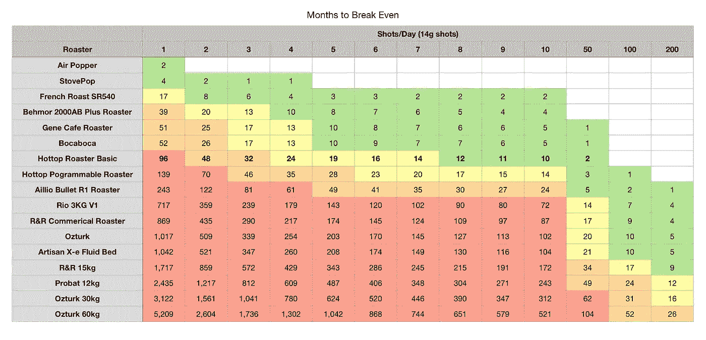

# 家庭烘焙咖啡的经济学

> 原文：<https://towardsdatascience.com/the-economics-of-home-roasting-coffee-93003ea31ee8?source=collection_archive---------30----------------------->

## 成本分析

6 年前，我开始用爆米花机在家烘焙。我最好奇的是我是否会喜欢在家烘焙，因为买一个烘焙器似乎几年后就能得到回报。所以我买了一个杂物箱开始工作。事实证明，如果烘焙得当，我可以省下很多钱，但缺点是我会喝更多的咖啡，因为咖啡更便宜也更好。因此，它的成本可能是一样的，但我可以通过家庭烘焙来更好地控制质量。

我第一次尝试烧烤。所有图片由作者提供。

一开始，我试了爆米花机，但它非常慢。我也试过烤箱，但是里面烟太多了。当我的房子充满烟雾时，所有的烟雾报警器都响了，我感到非常恐慌。

当我搬到加州时，一位同事刚刚升级到一台更大的烘焙机，并免费把他的旧烘焙机给了我。这是一辆时髦的汽车，比最新款的旧了一个型号。显示器出现了一些问题，两年后终于坏了。然而，在使用的第一年里，我已经形成了自己的烘焙风格。因为我每次都使用相同的配置文件，所以我仍然可以导航到正确的位置。

夜烤！

# 豆类经济

在过去的两年里，我一直在更详细地跟踪我的烘焙，但有了电子邮件，我可以回头看看我在过去几年里购买的所有生咖啡，以汇总每磅的成本。

这是我烤肉用的桌子的样品。我已经记录了在甜甜玛丽亚的网站上找到的拔罐指数，我在那里买了大部分的青豆。

我的烘焙数据表的一个例子，我也根据每颗咖啡豆的 Q 值追踪烘焙的平均 [Q 值](https://link.medium.com/Wd8NVYfrpab)

我调整了每磅的成本，基于运输和估计 12%的烘烤重量损失。一般来说，中度烘焙会因水分蒸发而损失 12-20%的重量。平均来说，我在运输和烘烤后支付了 8.42 美元/磅。我没有包括电费，因为是 1000 瓦 20 分钟，每千瓦时 0.1 美元。我绘制了我买的所有豆子的直方图，有时我会挥霍，但大多数时候我在 7 美元到 8 美元之间。这个直方图是每磅的最终成本。

通常，[咖啡以 12 盎司袋](https://link.medium.com/Ftm2Jborpab)出售，当你把成本调整到 16 盎司袋时，我得到的相同质量的咖啡豆的价格在 20 美元到 30 美元之间。

当看质量时，成本大致与 Q 分数一致，这很好，因为成本应该与豆子的质量相关，而不仅仅是某人希望豆子是什么样的。

我进一步查看了我的混合物的平均 Q 值以及它们的成本。这个 Q 值是进入混合物的咖啡豆的平均 Q 值，基于它们对混合物的重量贡献。对于我的混合物来说，成本和 Q 值之间似乎有相当的相关性。

# 焙烧设备的经济性

烘焙咖啡豆的成本如此之低，购买烘焙机的回报会很快产生。基于这一成本和 20 美元/磅的差额，我研究了各种机器，以确定何时达到盈亏平衡点。

我利用这些信息，根据你每天喝多少杯浓缩咖啡(假设 14 克或一杯标准双份浓缩咖啡)制作了下表。这是以月为基础的，因为家庭烘焙者购买的大多数设备将在一两年内收回成本。我把更贵的烤面包机包括进来做比较。

家庭烘焙并不适合每一个人，因为它需要更多的关注细节和欣赏，尝试一点点才能成功。然而，家庭烘焙给了我更多的控制力和一致性，这是我没有的，也让我对来自世界各地的咖啡有了更好的欣赏。在我尝试的东西和我制作的混合物中，我变得更具实验性。

我最喜欢的快乐错误是不小心烤到第二个裂缝。我通常在第一次破裂后 1 分钟到 1:30 分钟。这个的问题是它是混合的一半。我决定留着它，试着用中火烤一下。这是非常有趣的混合，并创造了一些漂亮的图像时，分层。

如果你愿意，可以在 Twitter 和 YouTube 上关注我，我会在那里发布不同机器上的浓缩咖啡视频和浓缩咖啡相关的东西。你也可以在 [LinkedIn](https://www.linkedin.com/in/robert-mckeon-aloe-01581595?source=post_page---------------------------) 上找到我。

# 我的进一步阅读:

[咖啡豆脱气](/coffee-bean-degassing-d747c8a9d4c9)

[解构咖啡:分割烘焙、研磨和分层以获得更好的浓缩咖啡](/deconstructed-coffee-split-roasting-grinding-and-layering-for-better-espresso-fd408c1ac535)

[浓缩咖啡的预浸:更好的浓缩咖啡的视觉提示](/pre-infusion-for-espresso-visual-cues-for-better-espresso-c23b2542152e)

[咖啡的形状](/the-shape-of-coffee-fa87d3a67752)

[搅拌还是旋转:更好的浓缩咖啡体验](https://towardsdatascience.com/p/8cf623ea27ef)

[香辣意式浓缩咖啡:热磨，冷捣以获得更好的咖啡](/spicy-espresso-grind-hot-tamp-cold-36bb547211ef)

[断续浓缩咖啡:提升浓缩咖啡](https://towardsdatascience.com/overthinking-life/staccato-espresso-leveling-up-espresso-70b68144f94)

[用纸质过滤器改进浓缩咖啡](/the-impact-of-paper-filters-on-espresso-cfaf6e047456)

[浓缩咖啡中咖啡溶解度的初步研究](/coffee-solubility-in-espresso-an-initial-study-88f78a432e2c)

[断奏捣固:不用筛子改进浓缩咖啡](/staccato-tamping-improving-espresso-without-a-sifter-b22de5db28f6)

[浓缩咖啡模拟:计算机模型的第一步](https://towardsdatascience.com/@rmckeon/espresso-simulation-first-steps-in-computer-models-56e06fc9a13c)

[更好的浓缩咖啡压力脉动](/pressure-pulsing-for-better-espresso-62f09362211d)

[咖啡数据表](https://towardsdatascience.com/@rmckeon/coffee-data-sheet-d95fd241e7f6)

[被盗浓缩咖啡机的故事](https://towardsdatascience.com/overthinking-life/the-tale-of-a-stolen-espresso-machine-6cc24d2d21a3)

[浓缩咖啡过滤器分析](/espresso-filters-an-analysis-7672899ce4c0)