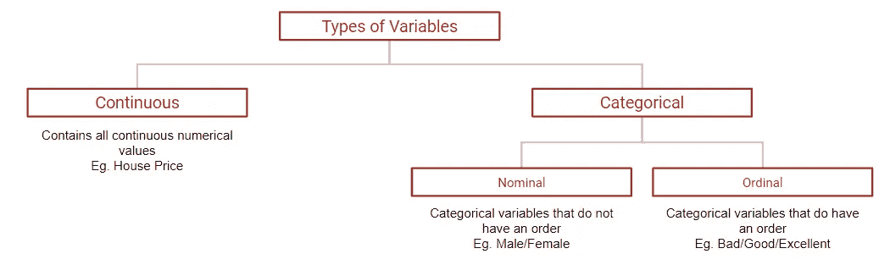
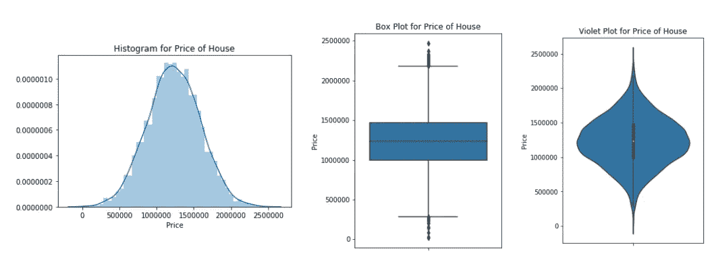
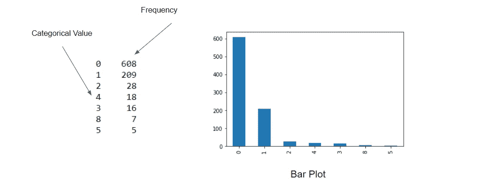
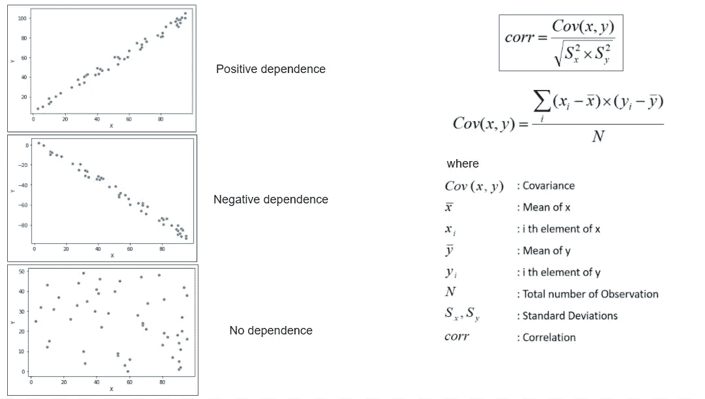
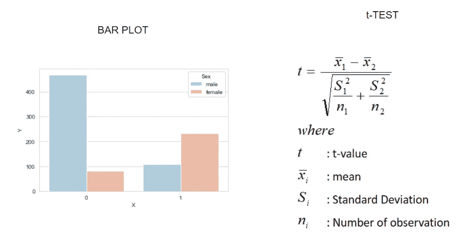
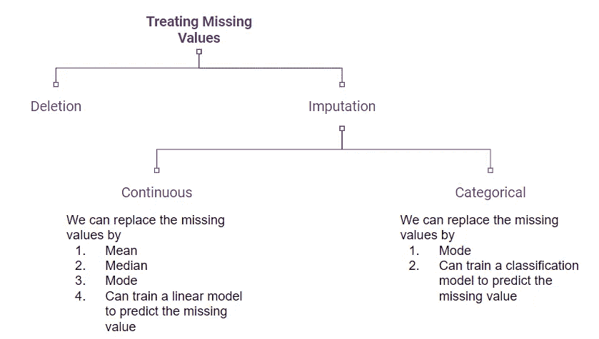

# EDA 理论指南

> 原文：<https://towardsdatascience.com/the-eda-theoretical-guide-b7cef7653f0d?source=collection_archive---------18----------------------->

## 探索性数据分析完全指南


Kaprekar 常数，或 **6174** ，是一个常数，当我们取一个 4 位数的整数，从它的位数中形成最大和最小的数，然后减去这**两个**数。继续这个形成和减去的过程，我们总会得到数字 **6174** 。(照片由[摩根豪斯](https://unsplash.com/@morganhousel?utm_source=unsplash&utm_medium=referral&utm_content=creditCopyText)在 [Unsplash](https://unsplash.com/s/photos/knowledge-graph?utm_source=unsplash&utm_medium=referral&utm_content=creditCopyText) 上拍摄)

M ost 数据分析问题从理解数据开始。这是最关键也是最复杂的一步。这一步还会影响我们在预测建模问题中做出的进一步决策，其中之一就是我们要为一个问题选择什么算法。

在这篇文章中，我们将看到一个完整的关于这类问题的指南。

内容

1.  读取数据
2.  变量识别
3.  单变量分析
4.  双变量分析
5.  缺失值-类型和分析
6.  异常值处理
7.  变量变换

# 读取数据和变量标识

阅读数据可以推断出下列问题的答案

*   我的数据是什么样的？
*   我的数据包含多少个要素？
*   它看起来像什么？
*   变量的类型有哪些？



指南 1:变量类型

# 单变量分析

## UA 是什么？

当我们从给定的特性列表中一次探索一个变量时，它被称为 UA。我们总结变量，帮助我们更好地理解数据。

我们在 UA 中看到以下内容

*   变量的集中趋势(均值、中值、众数)和离差
*   变量对称、右偏或左偏的分布
*   缺失值和异常值
*   计数和计数百分比:观察分类变量中每个类别的频率有助于我们理解和处理该变量。

## 为什么是 UA？

我们研究这个变量，检查异常值，以及我们将在后面部分看到的缺失值。

## 普遍获得的方法

对于连续变量:

1.  表格法:用于描述集中趋势、分散和缺失值。
2.  图解法:用于分布和检查异常值。我们可以使用**直方图**来理解分布，使用**箱线图**来检测异常值。

直方图和箱形图的组合被称为**小提琴图**



指南 2:连续变量的单变量分析方法

对于分类变量:

1.  表格法:“。value_counts()”运算给出了频率的表格形式。
2.  图形方法:在分类变量的情况下，最好的图形是柱状图。



指南 3:分类变量的单变量分析方法

# 双变量分析

## 巴是什么？

当我们研究两个相互关联的变量的经验关系时，我们称之为 BA。

## 为什么是巴？

它有助于发现异常，理解两个变量之间的相互依赖关系，以及每个变量对目标变量的影响。

## BA 的方法

1.  **对于连续-连续类型**:有两种方法研究两个连续变量之间的关系，即**散点图**和**相关分析**。



指南 4:连续-连续型变量的二元分析

2.**对于分类-连续类型:**在此标题下，我们可以使用**条形图**和 **T 检验**进行分析。

**T 检验**是一种推断统计，用于确定两个或更多组/类别的平均值之间是否存在显著差异。计算 t 检验需要每个类别的平均值和标准偏差之间的差值。



指南 5:分类连续型变量的二元分析

3.**对于分类-分类类型:**双向表和卡方检验用于分析两个分类变量之间的关系。

# 缺少值

## 缺失值的原因？

数据中可能有各种缺失值，其中一些可能是

*   可能没有记录任何响应。
*   记录数据时可能会有一些错误
*   读取数据时可能会有一些错误，等等。

## 缺失值的类型？

1.  **完全随机缺失(MCAR):** 这些缺失值与任何其他变量或它们所在的变量没有任何关系。
2.  **随机缺失(MAR):** 存在于变量内部没有任何关系，但在其他变量中可能有可观测趋势的缺失值。例如。年龄超过 60 岁的人的收入数据可能会丢失，因为这个年龄的人通常都退休了。
3.  **非随机缺失(MNAR):** 缺失值与它们存在的变量有关系。**例如**。价格超过卢比的房子。2000 万在数据库中可能会丢失，因为这个价格不可能有经常购买者。

## 处理缺失值的方法

有两种处理缺失值的基本方法

1.  **删除:**在训练模型之前，我们从数据集中删除所有缺失的值行。
2.  **插补:**有多种方法可以填补缺失值。



指南 6:处理缺失值

# 极端值

## 异常值的类型及其识别

有两种异常值:

1.  **单变量异常值:**可以使用箱线图来识别。
2.  **双变量异常值:**可以使用两个变量之间的散点图来识别。

## 异常值的标准

```
**Criteria for X to be outlier:**Q1: median for first 25% observation when sorted in ascending order
Q2: median for last 25% observation when sorted in ascending order
Q3: median of all observation
**IQR**: Inter quartile range = Q3-Q1
if **X** is outlier then X must satisfy:
**X > (Q3 + 1.5*IQR)** OR **X < (Q1-1.5*IQR)**
```

## 异常值的处理

1.  我们可以删除那个观察。
2.  我们可以通过输入缺失值中讨论的方法来输入异常值。
3.  我们可以应用变换(将在下面讨论)

# 变量变换

我们都知道归一化增加了模型的准确性。但是到底什么是正常化呢？它是变量变换的技术之一。

在变量变换中，我们用变量的一个函数来代替变量。例如，将变量 x 替换为它的对数值。

我们可以尝试解决我们在之前的 EDA 流程中观察到的以下问题:

1.  我们可以改变变量的标度(重新定义变量的极限)
2.  非线性关系到线性关系的转换
3.  据观察，算法在对称分布的变量上比偏斜分布的变量表现得更好，因此我们可以将偏斜分布转换成对称分布。

## 变量变换方法

1.  **非线性变换**:我们可以用变量的对数值、平方根或立方根来代替变量。这些是非线性转换，因此有助于我们处理上述所有问题。
2.  **宁滨:**我们可以将连续值分成不同的区间，从而将连续变量转换成分类变量。这可能有助于我们将离群值归类到我们的模型可以处理的一些类别中。

# 总结

这是探索性数据分析的广泛指南。这不仅包括如何检测异常，还包括如何处理和消除异常。这是一个非常幼稚的 EDA 方法，因此大部分章节都已经涵盖了。