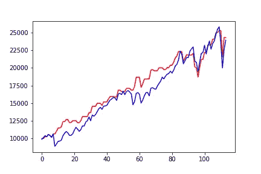
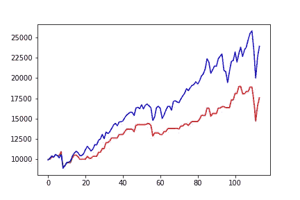

# 前馈神经网络在趋势交易中的有效性(1)

> 原文：<https://towardsdatascience.com/the-effectiveness-of-feed-forward-neural-networks-in-trend-based-trading-1-4074912cf5cd?source=collection_archive---------36----------------------->

## 展示了在基于趋势的技术分析中使用简单的前馈神经网络的惊人的有效性和局限性

这是由 ***【丹尼尔】*** *和* ***孙敏·李*** *合作研究的初步展示。你可以在文章底部找到我们的联系方式。*

***来自《走向数据科学》编辑的提示:*** *虽然我们允许独立作者根据我们的* [*规则和指导方针*](/questions-96667b06af5) *发表文章，但我们并不认可每个作者的贡献。你不应该在没有寻求专业建议的情况下依赖一个作者的作品。详见我们的* [*读者术语*](/readers-terms-b5d780a700a4) *。*

随着对人工智能的兴趣不断增加，许多人试图将机器学习技术应用于预测市场，特别是在使用股票价格时间序列数据的高频交易领域。

仅在 Medium 上，就有数十篇关于使用 RNN、LSTM、GRU、前馈神经网络等进行股价预测的帖子。然而，预测市场并不是一项简单的任务:似乎大多数**揭示的**尝试都没有显示出基于模型预测的策略成功所需的性能。在大多数帖子中，这种情况要么是完美的预测(表明作者肯定做错了什么)，要么是令人沮丧的结果，阻碍了任何进一步的研究。

*然而，Aldridge 和 Avellaneda (2019)* 表明使用神经网络预测收益是有希望的。虽然该论文明确证明了简单神经网络的局限性，但它也表明，通过仔细选择训练期和输入数据，基于神经网络预测的简单策略可以优于买入并持有策略。

我们的研究希望重现 *Aldridge 和 Avellaneda (2019)* 的结果，同时也花更多时间探索金融理论背景。最后，我们将使用研究的验证结果来引入更稳健的预测模型和策略。

在这篇具体的文章中，我们将讨论我们早期的失败。更具体地说，我们将训练一个具有固定窗口时间序列输入的前馈神经网络，解释为什么这种训练应该有效背后的假设，然后探索为什么该假设失败。

# 基于股价趋势分析背后的基本原理

由于有上百万个中型帖子解释神经网络的有效性和局限性，我们将切入正题，讨论为什么基于股价趋势的分析可能有效。也就是说，过去的股票价格数据+一些其他数据点可能包含足够的信息来提供有意义的预测。

*Pedersen (2015)* 对趋势的生命周期描述如下:

1.  趋势的开始:对信息反应不足
2.  趋势延续:延迟过度反应
3.  趋势结束(回到基本价值)

*Pedersen (2015)* 提到趋势跟踪投资是管理期货的一种策略，但也许一些想法可以应用于我们这里的案例。

尽管有效市场假说的极端形式表明，市场即时纳入了所有信息，包括公开和未公开的信息，但像 *Ho，Danny et al. (2019)* 这样的研究表明，人们甚至对公开可用的数据反应不足。同样，由于“羊群效应”和市场危机期间追缴保证金等事件导致的过度反应可能会导致市场价格偏离资产的基本价值。

诚然，市场的许多低效率已经被利用，从而加强了市场效率。这就是使用神经网络的原因。正如 *Aldridge 和 Avellaneda (2019)* 和 *QRAFT (2020)* ，**所强调的，检测数据中非线性模式的能力对于检测以前未检测到的金融模式**至关重要。例如， *Aldridge 和 Avellaneda (2019)* 谨慎地将对间谍和目标资产的股价数据进行操作的神经网络预测的卓越性能归因于神经网络检测非线性模式的能力，克服了著名的 CAPM 对线性的依赖的局限性。

## 理论假定

我们在研究开始时的假设是，用大量股票价格数据训练的神经网络将能够检测相关股票与其基本面价值的偏差。尽管股票价格数据包含大量噪声和偏差，但我们假设大量的训练数据将允许神经网络正确训练。

## 目标和对困难的承认

这项研究的目标是击败买入并持有策略。由于我们专注于揭示神经网络做出准确的未来价格预测的能力/能力，我们只模拟了一个给定资产的交易策略。事后看来，这是一个令人难以置信的雄心勃勃的项目，因为如果扩展到多样化的投资组合，仅使用最少的财务数据就能击败对某一特定资产的买入并持有策略，将会带来惊人的回报。然而， *Aldridge 和 Avellaneda (2019)* 已经表明，仅使用来自两种资产(目标资产和间谍)的股票数据就足以击败具有相对简单的前馈神经网络的买入并持有策略。因此，虽然这种方法可能不适用于*任何*给定的资产，但它可能适用于某些资产。

# 要避免的陷阱

所以在我们继续之前…

在太多关于股票价格预测的时间序列数据分析的中型文章中，可以观察到一些常见的陷阱。

1.  标准化/规范化整个数据集
2.  训练整个数据集并在已训练的数据集中进行测试
3.  不正确地选择输入/输出，因此产生看似完美的预测输出，实际上只是具有时滞的输入(在大多数情况下，训练模型来预测股票价格，而不是回报)

虽然我们的研究并不完美，但你可以放心，上面提到的陷阱是可以避免的。

# 测试交易策略

如上所述，我们的测试交易策略不创建投资组合；我们使用一种资产的回报预测来做出全力买入/卖出的决定。

1.  如果对下一个交易周期的回报预测是积极的，使用当前的现金银行尽可能多地购买该资产。
2.  如果下一个交易周期的回报预测是负面的，清算一切。

理论上，一个训练有素的神经网络将能够通过这种策略击败买入并持有的头寸。这种策略能够带来丰厚回报的关键因素是:

1.  在牛市中跟上股票价格的上涨。
2.  避免市场崩盘，在市场再次回暖时乘风破浪。

选择这样一个简单的交易策略的原因是，首先，因为这使得策略的性能可以更直接地归因于预测模型，其次，因为我们缺乏更复杂的金融知识，第三，因为作为一个月收入 400 美元的士兵和一个大学生，我们无法负担复杂的投资组合管理回溯测试所需的计算能力。

还要注意，我们将假设无风险利率为零，并且我们在回溯测试中没有考虑交易成本。

# 训练固定窗口预测模型

那些熟悉这个主题的人在阅读这里讨论的预测模型的规范时可能会嗤之以鼻，因为很明显这样的模型不应该工作。然而，这个模型的失败确实提供了关键的见解，并有助于消除错误的假设，因此它应该值得探索。

## 假设

1.  根据固定的 10~20 年资产回报数据训练一个前馈神经网络，应该能让模型发现显著的趋势。
2.  检测到的趋势可以用于预测未来的资产回报。

## 数据预处理

我用 yfinance 收集了雅虎财经的历史数据。为了便于理解，我将介绍我在这个过程中使用的三个术语。

1.  培训期间:收集培训数据的时间跨度
2.  训练大小:神经网络的输入数据(train_x)被组装的时间段的大小
3.  预测期:我们希望展望的时间段

对于这里的例子，我们将使用 18 年的训练周期(使用 1993 年 6 月 30 日至 2010 年 6 月 30 日之间的交易日)，100 天的训练规模和 21 天的预测周期(=进行月度回报预测)。选择的资产将是间谍 ETF。我们只会把月收益当作训练数据。

使用 pandas DataFrame 使得预处理过程变得非常简单。
*(注意，下面的描述将输入和输出解释为 numpy 数组，而不是张量形式)*

1.  将收盘价移动(-1) * prediction_period。
2.  使用移动后的收盘价计算每个交易日的远期回报。
3.  消除具有空值的交易日，然后提取远期回报列表的列表，每个内部列表的大小为 training_size。这是我们的 x 次列车。
4.  对于每个回报列表(train_x 内的每个列表)，目标回报应该是与列表中包含的最晚日期相距一个预测期的交易日的月度远期回报。
5.  然后使用来自 sklearn 的 MinMaxScaler 来 *scaler.fit_transform* 输入数据。

您可能会注意到，可以修改第 3 步和第 4 步，以便使用历史回报率[(close _ t/close _(t-prediction _ period))-1]来代替远期回报率，从而达到相同的效果。

你也可能想知道为什么我们选择使用每日收盘价，而不是调整后的收盘价。考虑到可能的前瞻偏差，我们假设收盘价比调整后的收盘价更“安全”。还有其他观点认为，在对回报进行回溯测试时，使用调整后的收盘价更合适(不是价格！);这是我们正在继续研究的问题。通过特征工程，我们希望在不久的将来将生存偏差和前瞻偏差一起最小化。

那么测试集呢？我们遵循上面详述的相同过程，只是数据是从大约 10 年(使用 2010 年 7 月 1 日至 2020 年 7 月 1 日之间的交易日)收集的，并且在缩放测试输入时，我们使用*scaler . trans inform*来避免数据泄漏。

## 型号选择

从本文的标题可以明显看出，我们用前馈神经网络进行了实验。

为了优化神经网络并获得洞察力，我们尝试了许多超参数、激活函数、层数等，但有一个共同点。

在所有模型中，我们为最终输出层使用 *tanh* 激活函数。
由于 *tanh* 返回一个介于-1 和 1 之间的值，所以它是比 sigmoid 更好的选择，因为我们在策略中不考虑杠杆作用，所以不应该出现实际返回超出 *tanh* 函数范围的情况。

# 回溯测试

## 一个隐藏层，均方误差损失函数

*Aldridge 和 Avellaneda (2019)* 表明，非常令人惊讶的是，具有单个隐藏层的简单神经网络具有足够的计算能力来模拟交叉移动平均策略。然而，不太清楚 *Aldridge 和 Avellaneda (2019)* 是否在整篇论文中保持了相同的模型结构，只有在论文的结尾，我们才看到一个击败买入并持有策略的预测模型的成功实例。

因此，我们首先用一个具有一个隐藏层的神经网络来测试性能。非常令人惊讶的是，我们用这个模型结构进行的第一次回溯测试显示了出色的结果。

图一。蓝色:间谍，红色:模拟策略(x 轴:月，y 轴:美元)

SPY ETF 买入并持有头寸的 0.903 夏普比率(零无风险利率)与 0.750 夏普比率(零无风险利率)形成惊人对比。印象深刻吧。会有什么问题呢？

可悲的是，问题很多。

第一个问题是，尽管上图看起来很好，但这样的结果不容易重现。多次运行相同的代码表明上图是纯粹运气的结果。大多数代码迭代显示出较差的 Sharpe、returns 等，并且在这一点上，修补模型以获得与上面类似的结果有效地将测试集变成了验证集，使任何结果的可信度受到质疑。

第二个问题，也是最主要的问题是，上述模型的表现主要来自于对正回报的预测和对间谍买入并持有头寸的榨取。用数字表示，为上图训练的模型在 78%的情况下预测正回报，在预测负回报的情况下，它在 62%的情况下是错误的。

换句话说，这个模型很幸运，在 38%的时间里，它对负回报的预测是正确的，它锁定了资产价格波动较大的关键位置，然后求助于拥抱资产。

最后一个问题是，培训损失在一个相当高的点停止下降。这也许应该是第一个指标，一个隐藏层是不会做的魔术；神经网络缺乏适当训练的计算能力，否则训练损失将不断减少。

## 多个隐藏层，均方误差损失函数

这里真的没什么好说的了。模型预测很糟糕。

具有多个隐藏层的模型比具有一个隐藏层的模型更有前途，因为预测的回报不会偏向正或负领域。这反过来又转化为模型在做出有用的预测方面表现不佳。呀。

图二。蓝色:间谍，红色:模拟策略(x 轴:月，y 轴:美元)

## 其他人

*   不同的训练时期
*   自定义损失函数
*   不同的资产
*   来自同一培训期的不同资产的数据集合
*   平均用相同超参数和数据训练的几个模型的预测，以获得一致的结果

上述所有努力都证明了利用前馈神经网络的固定窗口预测模型不能击败买入并持有的头寸。

## 等等，那么*阿尔德里奇和阿韦利亚内达(2019)* 是在传播假消息吗？

**没有**。我们上述回溯测试的糟糕表现首先是由于我们的策略偏离了*阿尔德里奇和阿韦利亚内达(2019)提到的策略。*一个这样的主要偏差是固定窗口预测模型本身的使用。根据我们对论文的解释， *Aldridge 和 Avellaneda (2019)* 似乎使用了移动窗口预测模型。

事实上，深入研究理论背景可以发现，固定窗口预测模型注定无法做出有用的预测。

# 固定窗口预测模型失败的原因

## **缺乏数据**

在上面的例子中，我们有超过 4000 个数据点作为前馈神经网络的输入。在传统的机器学习研究中，这似乎是一个理想的数据量。然而，我们的项目并非如此。

考虑我们希望我们的神经网络训练学习什么模式是很重要的。还记得我们在文章开头提到的，在*基于股票价格趋势分析背后的基本原理下，*如果神经网络能够检测到市场的过度反应和反应不足，它应该是成功的。

我们在这里得出的结论没有任何证据支持，但似乎市场与资产基本面价值的偏差太多，神经网络不可能检测到我们正在寻找的特定趋势模式。也就是说，市场并不像我们想象的那样有效，导致数据中有太多噪音。

如果某些模式主要存在于训练期间(1993 年 6 月 30 日至 2010 年 6 月 30 日)，它们可能会导致过度拟合，这会损害预测。此外，请注意，我们希望寻找的模式可以被描述为一种普遍模式——它应该存在于任何时间框架内，因为迄今为止，人们确实对市场信息反应过度和反应不足。

Khandani 和 Lo (2007) 所展示的反向策略的有效性向我们表明，即使是最近，市场中也存在着持续了十多年**的大规模无效率现象(夏普指数超过 50 曾经可以通过相对简单的策略实现！).考虑到这一点，神经网络的适当训练可能需要一个世纪(如果不是多个世纪的话)的原始数据才能消除持续的噪声。**

**结论可以如下:如果我们想要可行的前馈神经网络预测，我们要么需要更多的数据，要么需要更多的抛光和工程数据(不像我们在这里使用的原始数据)。**

**另一种选择是转换我们正在寻找的趋势模式；我们不再寻找一个普遍的模式，而是去寻找我们能发现的最近的模式。这就是移动窗口预测背后的思想。**

## **数据不平衡**

**我们选择时间周期的另一个问题是，看涨比看跌略多。通过预测每个未来回报为正，神经网络可以实现接近 56%的方向预测精度。**

**如果在机械上有可能实现比 56%更高的预测精度，这将不是问题。但是，如果在不坚持特定方向预测的情况下，我们通过这种方法可以实现的最佳预测精度低于 56%，会怎么样呢？然后，神经网络预测每个下一个回报在 0 和 1 之间是有意义的，因为这可能是实现最低损失的直接方法。**

**上面的对话实际上与研究过程中进行的大多数过程无关，因为在大多数情况下，神经网络过度拟合，这意味着它超过了方向预测的 56%的准确性。但它已被证明是我们早期努力的障碍，所以我们为那些可能试图复制我们工作的人提及它。**

## **任务的艰巨性**

**当我们停下来再次思考任务的目标和我们用来实现目标的少量信息时，我们就越能意识到任务的雄心。**

**到目前为止，上述实验的结果确实告诉我们，需要更复杂的方法。**

# **那么接下来呢？**

**上述结果一点也不令人沮丧。从某种意义上说，我们在文章中描述的资产回报预测方法注定会失败；我们的实际实现只是证实了这一信念。**

**正如我们上面所讨论的，有其他方法可以解决缺少数据的问题。目前，我们正在实施具有不同工程特征和不同机器学习模型的移动窗口预测模型，并开始看到改进。**

**如果您在执行过程中发现逻辑谬误或错误，请反馈给我们！也欢迎论文、帖子、课程等方面的推荐。**

# **作者**

1.  **https://www.linkedin.com/in/seouk-jun-kim-a74921184 金俊
    T3**
2.  **李
    孙敏[https://www.linkedin.com/in/sun-min-lee-3116aa123/](https://www.linkedin.com/in/sun-min-lee-3116aa123/)**

# **来源**

1.  **奥尔德里奇，艾琳 e .和马尔科阿韦拉内达。"金融中的神经网络:设计与性能."(2019).**
2.  **拉塞·赫杰·彼得森。"有效率无效率:聪明的钱如何投资和市场价格是如何决定的."(2015)**
3.  **Ho，Danny and Huang，Yuxuan and Capretz，Luiz F .“基于基本面分析的股票选择神经网络模型”(2019)。**
4.  **QRAFT。《AI 资产管理报告》。人工智能如何创新资产管理？” *Qraft 技术公司。*中等。, (2020)**
5.  **2007 年 8 月，宽客发生了什么？(2007 年 11 月 4 日)**
6.  **https://pypi.org/project/yfinance/**