# 烘焙对咖啡豆硬度的影响

> 原文：<https://towardsdatascience.com/the-effects-of-roasting-on-coffee-bean-hardness-e819a2f5dd0a?source=collection_archive---------30----------------------->

## 检查绿色和棕色硬度

在做一些阅读的时候，我偶然发现了其他一些关于检查生咖啡豆硬度和密度的研究。至少在他的取样中，他没有看到豆类品种之间密度的差异，但是豆类硬度有差异。我对咖啡豆的硬度很好奇，因为我也在家烘焙，所以我开始收集烘焙前后咖啡豆的硬度。

生咖啡豆和烘焙咖啡豆之间的硬度变化很大，但我发现有趣的是，烘焙后咖啡豆的硬度与烘焙造成的重量损失量之间存在相关性。烘烤过程中的失重以失水为主。

# 实验装置

在烘烤前后，我用硬度计收集了 30 个豆子硬度样本。所以前后的抽样属于不同的豆类，但样本数量足够大时，分布是可靠的。为了更有效地收集数据，我为每一轮测量制作了一个视频，然后回放视频以手动记录数字。通常，录制视频需要 3 到 5 分钟，记录大约需要 5 分钟。

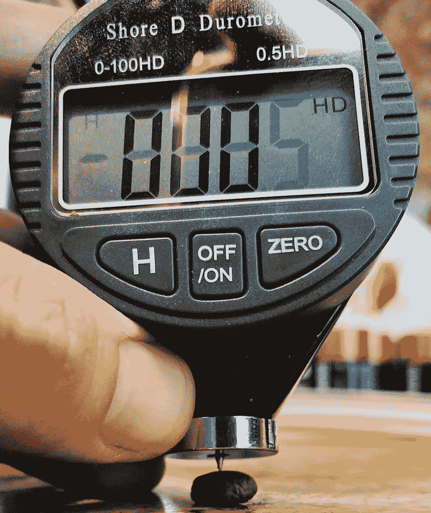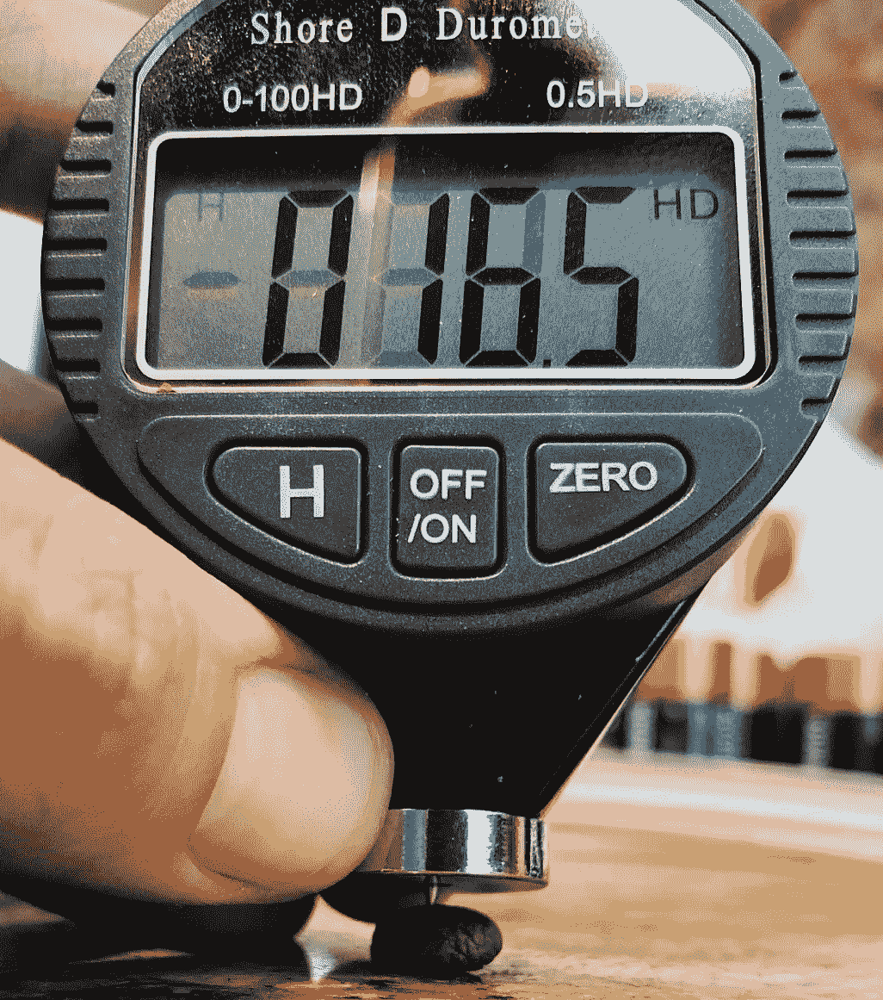

肖氏硬度计有一个弹簧，你把一根针插进一个物体。当硬度计不能再推时，读数就是硬度。为了测量豆的硬度，你需要一个 D 型硬度计，它有一个 30 度角的针和 44 牛顿的弹力。

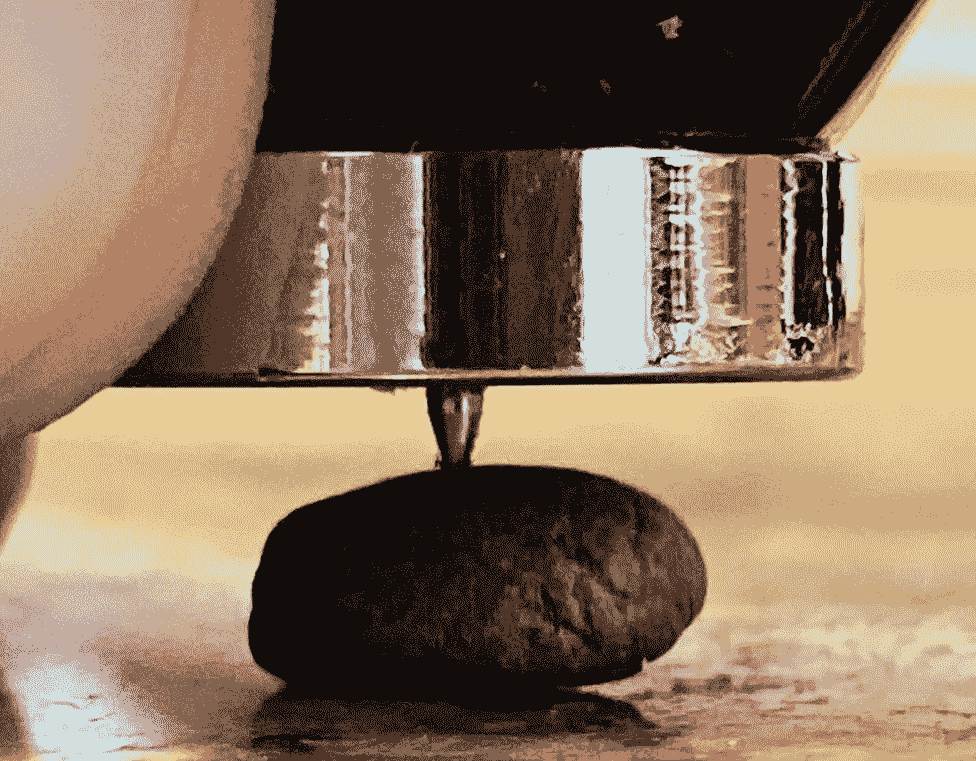

测量咖啡豆硬度的挑战之一是烘焙过的咖啡豆很容易破碎。我测量了超过 30 个样本来解释每一个豆子的破裂。我还注意到，对于青豆来说，测量硬度的行为给豆子留下了印象。

# 烤

我分别烘焙每一颗咖啡豆，然后将两颗混合在一起。我用的是热烘烤器，我的烘烤曲线比较慢，可以让它们升温。我在第一年致力于优化烘焙简介，但是一旦我选定了最好的，我只在结束烘焙时修改。还要注意的是，我立即添加豆子，所以我没有装料温度。

对于这些烘烤，我的目标是在第一次裂纹后的 1:30 结束烘烤。在 HI Mokka 中，时间变得更长，因为我很难听到第一次破裂。

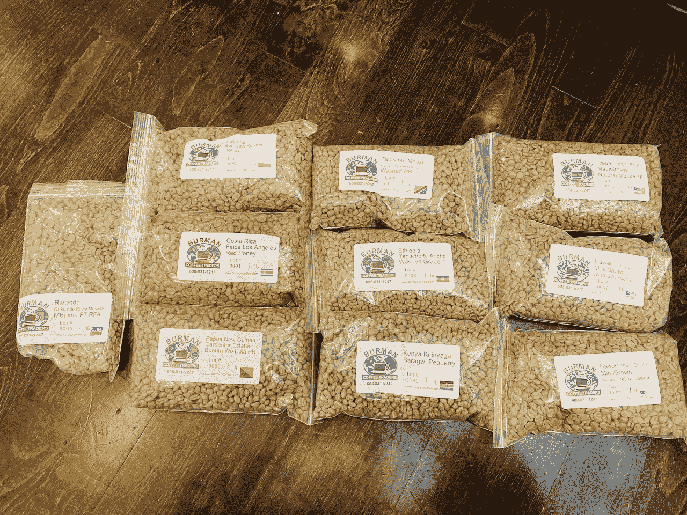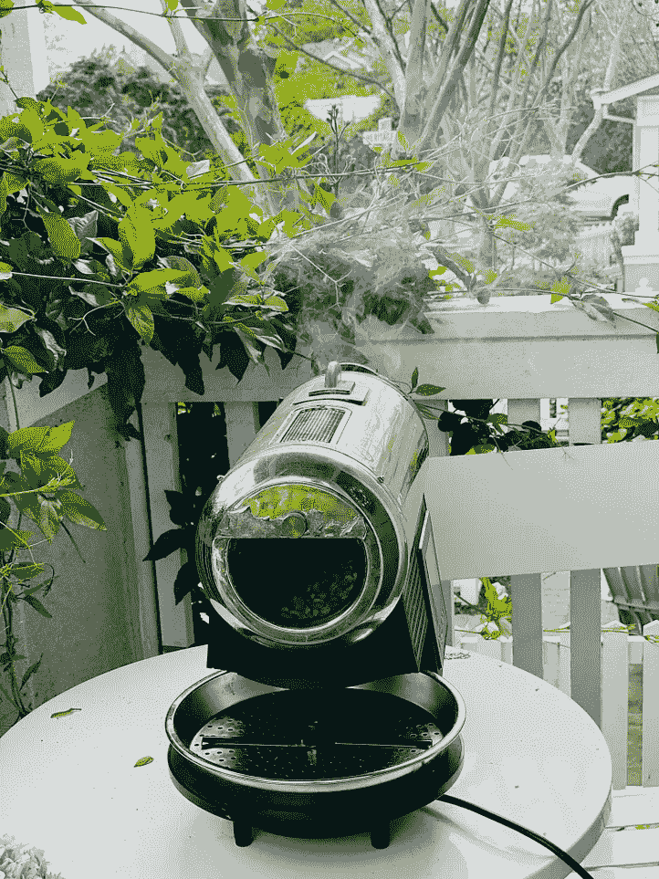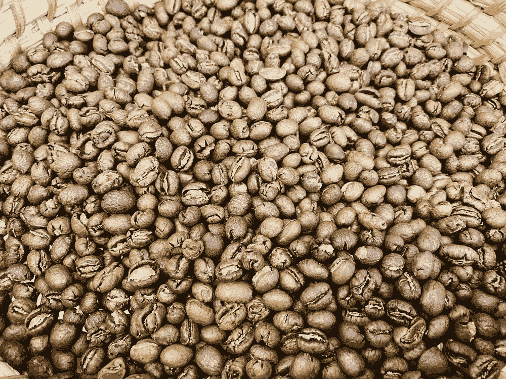

# 硬度数据

这些咖啡豆是我从 Burman 咖啡贸易商那里得到的。我通常从甜甜玛丽亚买咖啡，但我想尝试烘焙一些夏威夷豆。在这个表中，我有生坯硬度，烘烤硬度，两者之间的比率，以及烘烤重量与生坯重量的百分比。

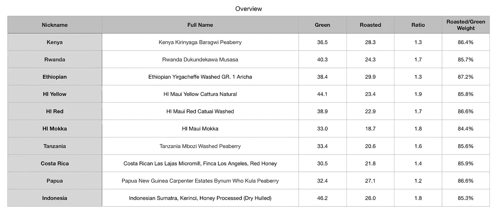

仅从平均硬度来看，所有咖啡豆的硬度都有所下降。

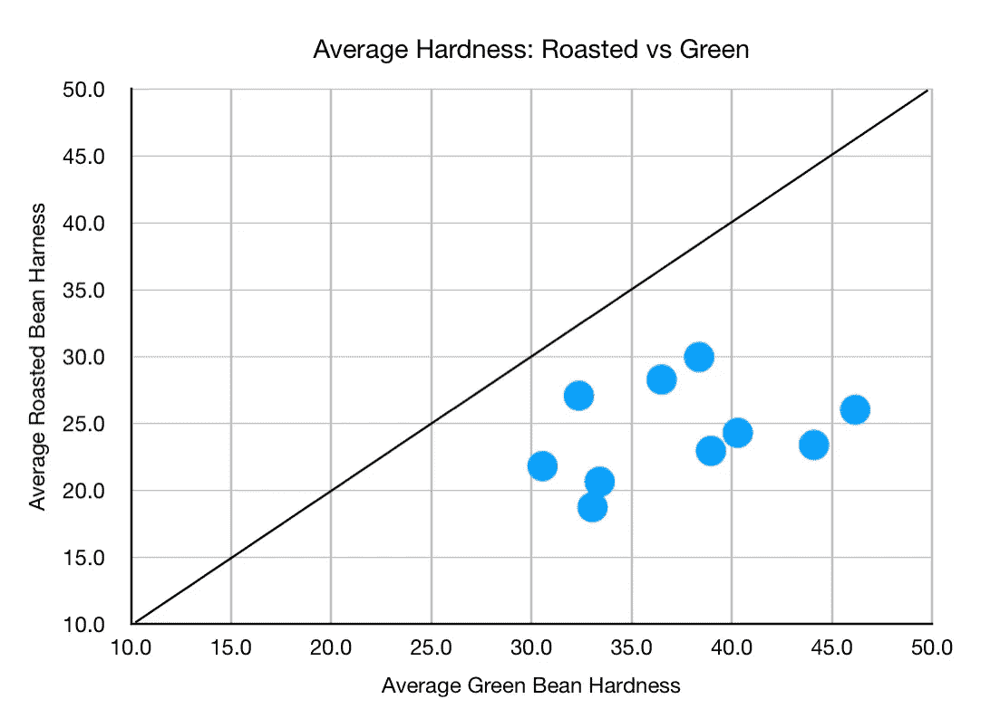

我取了所有的样本，把它们分类为青豆和烘焙豆，这种转变是明显的，但是仅仅因为一种变型比另一种变型更硬并不意味着它们由于烘焙而具有相等的硬度转变。

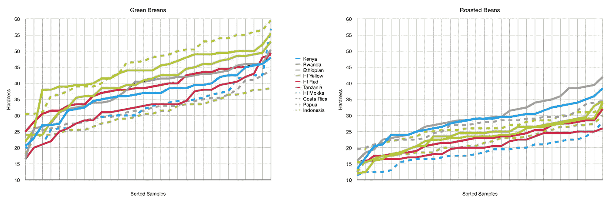

当绘制生豆和烘焙豆的各种分布时，它们具有相似的属性。这也假设最不硬的绿豆将是最不硬的烘焙豆。这项研究的困难之一是我使用了两个不同的样本集。一个更好的实验设计是使用一个小型样品烘焙器，在烘焙前测量所有的咖啡豆，在烘焙后测量所有的咖啡豆。

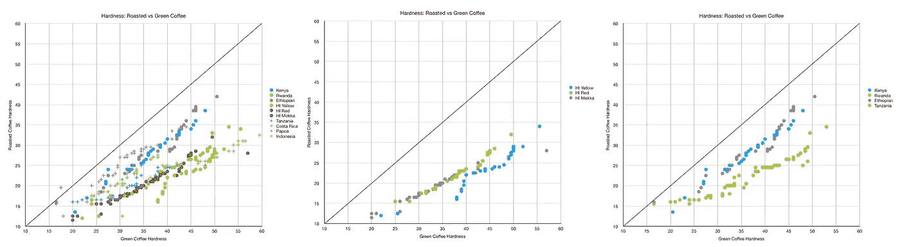

我还绘制了生豆和烤豆的比例与生豆硬度的关系图。从这里开始，唯一的趋势是一个相等的移动，但同样，采样不是一对一的。

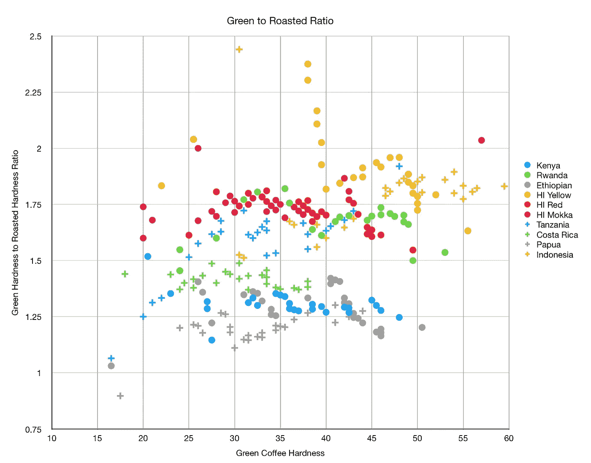

从整体数据来看，我们可以看到烘烤后保留了多少重量。通常情况下，烘焙会损失 10%到 20%的咖啡豆重量。在这种情况下，出现了一种趋势。我观察了烘豆硬度的趋势，以及生豆与烘豆硬度的比率。烘豆硬度的趋势最强。

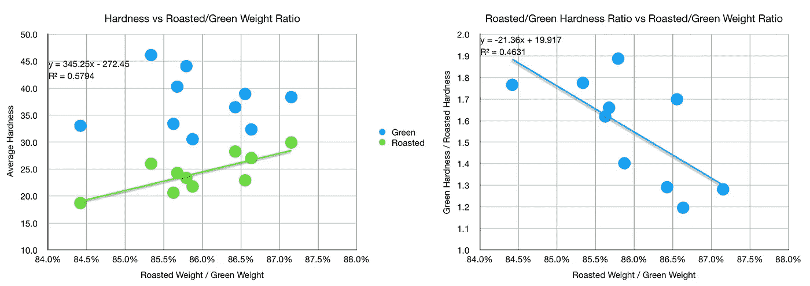

数据集只有 10 个烘焙咖啡豆的平均硬度样本，我通过处理对其进行了分解，以便查看。更多的数据将有助于更好地理解这种关系。

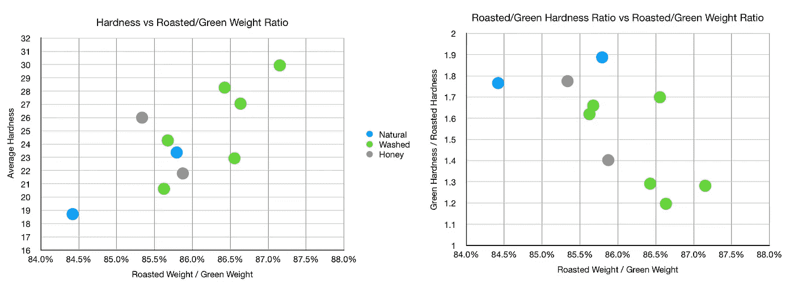

我没有绿豆的水分测量值，我很好奇豆子水分和硬度之间是否有关联。烘焙咖啡豆的质量损失似乎与硬度有关，质量损失主要是由于水分损失。

我还没有完全投入到烘焙的实验中，但我当然足够好奇。对于硬度，我收集了一些数据，希望我能对这个变量有更好的理解。另一个有趣的实验是将豆子脱水，然后逐个比较豆子的硬度和含水量。

如果你愿意，可以在 Twitter 和 YouTube 上关注我，我会在那里发布不同机器上的浓缩咖啡视频和浓缩咖啡相关的东西。你也可以在 [LinkedIn](https://www.linkedin.com/in/robert-mckeon-aloe-01581595?source=post_page---------------------------) 上找到我。

# 我的进一步阅读:

[咖啡豆脱气](/coffee-bean-degassing-d747c8a9d4c9)

[解构咖啡:分割烘焙、研磨和分层以获得更好的浓缩咖啡](/deconstructed-coffee-split-roasting-grinding-and-layering-for-better-espresso-fd408c1ac535)

[浓缩咖啡的预浸:更好的浓缩咖啡的视觉提示](/pre-infusion-for-espresso-visual-cues-for-better-espresso-c23b2542152e)

[咖啡的形状](/the-shape-of-coffee-fa87d3a67752)

[搅拌还是旋转:更好的浓缩咖啡体验](https://towardsdatascience.com/p/8cf623ea27ef)

[香辣浓缩咖啡:热磨，冷捣以获得更好的咖啡](/spicy-espresso-grind-hot-tamp-cold-36bb547211ef)

[断续浓缩咖啡:提升浓缩咖啡](https://medium.com/overthinking-life/staccato-espresso-leveling-up-espresso-70b68144f94)

[用纸质过滤器改进浓缩咖啡](/the-impact-of-paper-filters-on-espresso-cfaf6e047456)

[浓缩咖啡中咖啡的溶解度:初步研究](/coffee-solubility-in-espresso-an-initial-study-88f78a432e2c)

[断奏捣固:不用筛子改进浓缩咖啡](/staccato-tamping-improving-espresso-without-a-sifter-b22de5db28f6)

[浓缩咖啡模拟:计算机模型的第一步](https://towardsdatascience.com/@rmckeon/espresso-simulation-first-steps-in-computer-models-56e06fc9a13c)

[更好的浓缩咖啡压力脉动](/pressure-pulsing-for-better-espresso-62f09362211d)

[咖啡数据表](https://towardsdatascience.com/@rmckeon/coffee-data-sheet-d95fd241e7f6)

[被盗咖啡机的故事](https://towardsdatascience.com/overthinking-life/the-tale-of-a-stolen-espresso-machine-6cc24d2d21a3)

[浓缩咖啡过滤器分析](/espresso-filters-an-analysis-7672899ce4c0)

[便携式浓缩咖啡:指南](https://towardsdatascience.com/overthinking-life/portable-espresso-a-guide-5fb32185621)