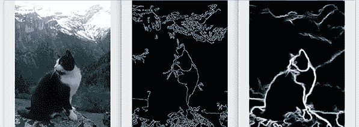

# 用 OpenCV Canny 算法轻松处理图像

> 原文：<https://towardsdatascience.com/the-effortless-way-to-process-images-with-opencv-canny-algorithm-9c636d8a017a?source=collection_archive---------41----------------------->

边缘检测示例

在软件工程中，简单很重要，在虚拟机中部署最先进的模型通常是不可能的，因为旧的库不支持您的环境。幸运的是，您可以使用 OpenCV 以简单的图像处理方式来完成这项任务，而不是使用基于神经网络的具有数百万参数的模型。

T 处理图像的简单方法是利用一种巧妙的边缘检测算法，而不是最先进的人工智能方法。Canny 算法是成熟的，它是一种无监督的算法，不需要大量的数据来训练算法，而且算法的结果总是可证明的和严格的。从图像编辑到游戏制作，每天都要用到图像处理。在图像处理中，有一个像轮廓和边缘检测这样的问题。通常，这适用于从背景中剪切出对象的情况。为了在没有人工干预的情况下解决这个问题，使用了 canny 边缘检测算法。它的工作原理是寻找图像的强度梯度，然后用 Sobel 核对平滑后的图像进行滤波。这是一种流行的边缘检测算法。它是由约翰·f·坎尼[1]开发的。Canny 算法是可以使用的，它是成熟的，也有复杂的人工智能模型，这些模型有大约 2500 万[2]个参数，很难训练这样大的模型。在这种情况下，当训练这么大的一个有这么多参数的模型来证明模型收敛性变得越来越困难时，这就是为什么基于内核的解决方案或无监督模型在生产环境中工作得更严格。无监督机器学习因其对未标记数据进行分类并发现其中大量未知模式的能力而如此突出[3]。为了证明非基于规则的算法，总是存在算法失败的风险[4]。使这样的系统失败是非常容易的，单像素攻击只需要改变图像中的一个像素。通过向输入向量添加相对较小的变化，可以容易地改变深度神经网络。在极其有限的情况下，只能修改一个像素的攻击。这种攻击探索了在极其有限的场景中对对抗性机器学习的不同看法，表明当前的深度神经网络也容易受到这种低维攻击[5]

图像处理是图像编辑、虚拟现实和可视化中需要解决的一个非常重要的任务，它在医学和农业等许多领域都有应用。对于一个机器学习问题，首先要做的就是从数据分析入手。这是了解领域业务知识的最佳方式。例如，为了对图像进行分类，有像 inception v3 [5]这样的机器学习模型。然而，这种模型存在问题，这些模型是受监督的，这意味着需要大量的数据来训练，而且用如此多的数据来训练模型需要大量的计算能力。这就是无监督模型被发明的原因。干净、完美标记的数据集不容易获得。所以有时候，研究人员会问一些不知道答案的算法问题。这就是无监督学习的用武之地。在无监督学习中，深度学习模型被交给一个数据集，而没有关于如何处理它的显式指令。训练数据集是没有特定期望结果或正确答案的示例的集合。然后，神经网络试图通过提取有用的特征并分析其结构来自动找到数据中的结构。[6]有可能监督模型缓慢收敛，并且为了训练以获得好的结果，需要有大量的计算来解决问题。训练这样的模型，重要的是测量模型特征，如推理时间，该特征表示算法从开始到结束将计算多少时间。谈到人工智能训练，应该区分训练和执行时间两件事。训练时间通常很长，推理执行时间应该很快。模型只需要训练一次，然后在执行时多次使用。软件工程中的简单性问题算法应该按照用例需求来实现，根据奥卡姆剃刀原理，最简单的解决方案往往更好。

Canny 边缘检测算法众所周知，它是在 1986 年创建的。还有 14891 条引文证明了该算法的可行性和正确性。需要编辑或操作图像的开发人员使用这种方法的例子有很多。第二个例子是基于基于内核的计算机视觉算法的思想。这种方法之所以可行，是因为其背后的数学原理。我们希望移除可能不属于边缘的多余像素。然后发生具有滞后的阈值处理，如果强度梯度值超过上阈值，则接受像素作为边缘，如果强度梯度值低于下阈值，则拒绝像素作为边缘。如果一个像素在两个阈值之间，只有当它与高于上限阈值的像素相邻时，才接受它[8]。数学是简单明了的，而且提炼出了本质，在一个 canny 算法上做了如此多的研究，我们可以说这个方法是成熟的。此外，我们可以用 CMM 模型定义软件算法成熟度。CMM 是由卡内基梅隆大学的软件工程研究所(SEI)于 1987 年开发的。5 成熟度等级是初始的、可重复的、定义的、管理的和优化的。每一个阶段，都有成熟的要求。例如，在初始阶段，流程不成熟，没有很好地定义。在可重复阶段，项目计划、需求管理和质量保证都已就绪。定义阶段 it 是一套完整的特定于项目的软件工程和管理过程。在管理阶段，为软件产品和软件过程的组织设置量化的质量目标。最后一个阶段的优化是 CMM 中过程成熟度的最高层次，它关注于组织中使用定量反馈的持续过程改进[9]。Canny 边缘检测算法是在 OpenCV 框架中实现的，OpenCV 框架是开源的，有很好的文档记录并不断优化，这意味着 OpenCV 算法处于成熟的第五阶段。

Canny 边缘检测是一种无监督的方法，这意味着不需要大量的数据。监督算法从其训练数据中学习，并试图收敛到最佳解决方案。该算法需要大量的时间和资源，这意味着将需要使用大量的计算能力。如果数据集非常大，推断可能会很慢，因为算法只是开始记忆所有可能发生的情况。当我们用大量参数训练模型时，会出现收敛缓慢的情况，在这种情况下，谁的计算能力更强，谁就能得到更好的模型。这就是为什么当 BP 神经网络采用梯度法时，神经网络有一个缺点，即学习收敛速度慢和容易收敛到局部最小值等问题无法避免。此外，学习因子和惯性因子的选择会影响 BP 神经网络的收敛性，通常由经验决定。因此，BP 神经网络的有效应用受到了限制。提出了一种在 BP 算法中通过逐步增加训练数据和隐单元来避免陷入局部极小值的新方法。此外，论文提出了一种新的可控前馈神经网络模型[10]。在大型模型中，由于推理速度变慢，不可能采用任何移动或嵌入式策略，因此有一些策略可以削减和降低模型的复杂性，但这会降低模型的准确性。在部署之前测试这个过程是非常重要的，否则，它可能会影响业务用例，推断时间可能需要 5 到 10 秒，但要求最多 1 秒。为了获得更好的结果，部署模型时应该考虑到 GPU 或 TPU 优化。

Canny 边缘检测结果是严格的和可证明的，可以用于图像的预测来检测物体的边缘。这用于从图像中剪切出对象的背景。严格地说，这意味着当开发者定制算法过滤器内核时，决定了算法将如何完成任务。这与人工智能边缘检测算法不同，通常，人工智能检测算法使用大量数据，并试图学习对象边缘的特征，并学习这些模式。在这两种情况下，做这项工作都有优点和缺点。例如，当使用 canny 边缘检测时，没有语义理解，这意味着所有边缘都被相同地对待，但是像语义分割这样的神经网络算法工作不同，如果有区域，它应该有边界边缘。但是一些边界是透明的，因为边缘检测算法使用阈值技术来滤除可识别的边缘。如果问题背景很简单，那么使用 canny 算法会更好，因为它很简单。有一个类似奥卡姆剃刀的简单原则。奥卡姆剃刀原则可以追溯到 17 世纪奥卡姆的威廉——这是一个最简单和最直接的解决方案应该是首选的想法，或者对于不同的假设，最简单的或假设最少的将是最好的应用[11]。这意味着证明 OpenCV 算法比人工智能模型更容易，而且当在生产环境中部署模型时，它应该是在云计算服务器中执行的高效和廉价的方法。要在这样的环境中部署，算法的复杂性应该用推理时间来衡量。最先进的深度神经网络(DNNs)有数亿个连接，并且计算和内存都很密集，这使得它们很难部署在硬件资源和功率预算有限的嵌入式系统上[12]。

对于简单的图像上下文任务，canny 边缘检测等简单的 OpenCV 方法可以以最小的努力获得很好的结果。这个库在许多应用程序中使用，这意味着它在生产环境中被广泛试用和使用。该算法是古老的，并从许多角度得到认可，可用于各种各样的问题。由于这种算法是无监督的，所以不需要像神经监督的人工智能模型那样有那么多数据。考虑奥卡姆剃刀原理，最简单的解决方案往往是最好的选择。如果 OpenCV 算法足以解决问题，则无需尝试具有数百万参数的复杂监督人工智能模型。软件成熟度可以通过能力成熟度模型(CMM)来评估。应该对半监督方法进行更多的研究，这种方法不需要大量的数据来获得最先进的结果。考虑到资源有限，不可能部署有数百万个连接的复杂神经网络。总的来说，最重要的事情是研究满足需求的用例，这应该是选择在商业中使用人工智能模型的最佳方法的主要关注点，因为许多模型是最先进的，在生产环境中，它不会满足某些标准。

# 图像源

边缘检测示例图片来源:[https://www . pyimagesearch . com/2019/03/04/holiologically-nested-edge-detection-with-opencv-and-deep-learning/](https://www.pyimagesearch.com/2019/03/04/holistically-nested-edge-detection-with-opencv-and-deep-learning/)

# 文献学

[1]

《精明》，[在线]。可用:[https://docs . opencv . org/master/da/d22/tutorial _ py _ canny . html](https://docs.opencv.org/master/da/d22/tutorial_py_canny.html.)

[2]

“https://www . McKinsey . com/business-functions/McKinsey-analytics/our-insights/conflicting-the-risks-of-the-artificial-intelligence，”[在线]。可用:[https://www . McKinsey . com/business-functions/McKinsey-analytics/our-insights/conflicting-the-risks-of-artificial-intelligence。](https://www.mckinsey.com/business-functions/mckinsey-analytics/our-insights/confronting-the-risks-of-artificial-intelligence.)

[3]

“有监督的与无监督的学习有什么不同，”(在线)。可用:[https://autome . me/supervised-vs-unsupervised-learning-what-is-the-difference/。](https://autome.me/supervised-vs-unsupervised-learning-what-is-the-difference/.)

[4]

“直面人工智能的风险”，[在线]。可用:[https://www . McKinsey . com/business-functions/McKinsey-analytics/our-insights/conflicting-the-risks-of-artificial-intelligence #。](https://www.mckinsey.com/business-functions/mckinsey-analytics/our-insights/confronting-the-risks-of-artificial-intelligence#.)

[5]

“https://arxiv . org/ABS/1710.08864”，【在线】。

[6]

“InceptionV3”，【在线】。可用:[https://www . tensor flow . org/API _ docs/python/TF/keras/applications/InceptionV3。](https://www.tensorflow.org/api_docs/python/tf/keras/applications/InceptionV3.)

[7]

“https://blogs . NVIDIA . com/blog/2018/08/02/监督-非监督-学习”，【在线】。可用:[https://blogs . NVIDIA . com/blog/2018/08/02/supervised-unsupervised-learning。](https://blogs.nvidia.com/blog/2018/08/02/supervised-unsupervised-learning.)

[8]

“https://automatic Addison . com/how-the-canny-edge-detector-works，”[在线]。

[9]

“https://searchsoftwarequality . techtarget . com/definition/Capability-Maturity-Model，”[在线]。

[10]

" https://IEEE explore . IEEE . org/abstract/document/893417，"[在线]。

[11]

“https://www . techopedia . com/how-does-occams-razor-apply-to-machine-learning/7/33087，”[在线]。

[12]

“https://dl . ACM . org/doi/ABS/10.1145/3007787.3001163，”【在线】。