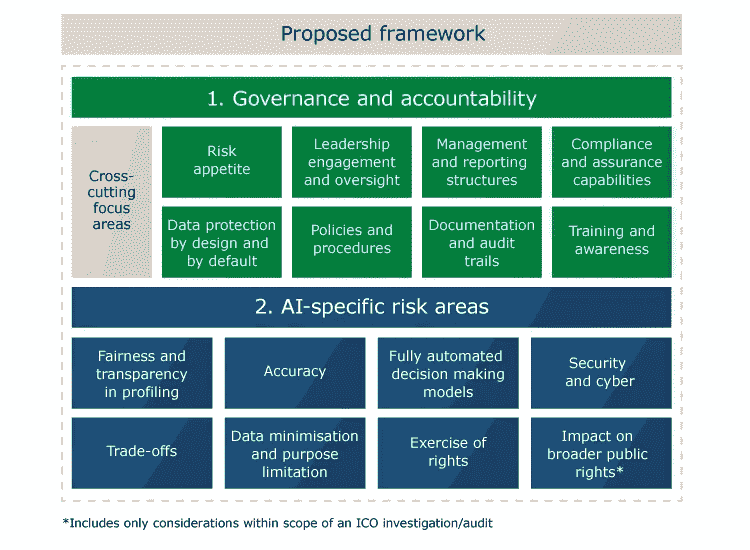

# 专业人工智能风险经理的出现

> 原文：<https://towardsdatascience.com/the-emergence-of-the-professional-ai-risk-manager-d25d5b4822ef?source=collection_archive---------55----------------------->

## 监管将导致专业人工智能风险经理的诞生，就像金融领域发生的情况一样

当 20 世纪 70 年代和 80 年代受到银行危机的影响时，世界各地的监管者联合起来，就如何管理金融风险制定国际标准。这些标准，现在被称为巴塞尔标准，定义了如何衡量和管理风险的通用框架和分类。这导致了专业金融风险经理的兴起，这是我的第一份工作。最大的专业风险协会，GARP 和 PRMIA，现在总共有超过 250，000 名认证会员，还有许多专业风险经理没有通过这些特定的认证。

我们现在受到数据泄露和数据隐私丑闻的困扰，世界各地的监管机构已经用数据法规做出了回应。 [GDPR 是目前的榜样](https://venturebeat.com/2020/02/20/irish-data-agency-investigates-gdpr-violations-by-facebook-and-others/)，但我预计一个全球性的监管机构团体将扩大规则，以更广泛地涵盖人工智能，并为如何管理人工智能设定标准。英国 ICO 刚刚发布了一份关于[审计人工智能](https://ico.org.uk/about-the-ico/ico-and-stakeholder-consultations/ico-consultation-on-the-draft-ai-auditing-framework-guidance-for-organisations/)的草案但很详细的指南。欧盟也正在开发一款。有趣的是，他们的方法与巴塞尔标准非常相似:特定的人工智能风险应该得到明确的管理。这将导致专业 AI 风险经理的出现。

下面我将充实一个正式的人工智能风险管理角色的含义。但在此之前，有一些概念需要澄清:

*   世界各地的大多数数据法规都关注数据隐私
*   数据隐私是数据保护的一个子集。GDPR 不仅仅是隐私
*   数据保护是[人工智能法规](https://venturebeat.com/2020/02/08/an-ai-regulation-strategy-that-could-really-work/)的一个子集。后者也包括算法/模型开发。

# 全球人工智能监管标准的兴起

巴塞尔框架是国际清算银行(BIS)为促进金融市场稳定而制定的一套国际银行监管标准。国际清算银行本身没有监管权，但其“央行中的央行”的地位使巴塞尔监管成为世界标准。起草标准的巴塞尔银行监管委员会(BCBS)成立于全球金融危机时期。它于 1974 年由 10 位央行行长组成，现在由来自 28 个管辖区的 45 位成员组成。

鉴于最近的隐私侵犯和丑闻，我们可以将 GDPR 视为数据世界的巴塞尔标准等价物。我们可以将欧洲数据保护监管机构(EDPS)视为数据隐私的 BCBS。(EDPS 是 GDPR 的主管。)我预计，随着更多国家颁布数据保护法，一个更加全球化的组织将会出现。

目前还没有领先的算法规定。GDPR 只覆盖了它的一部分。一个原因是很难对算法本身进行监管，另一个原因是对算法的监管被嵌入到行业监管中。例如，巴塞尔规定了算法应该如何在银行中构建和部署。医疗保健领域也有类似的规定。潜在的冲突或重叠规则使得编写更广泛的算法规则变得困难。尽管如此，欧盟、英国和新加坡的监管者正在带头提供关于如何治理和审计人工智能系统的详细指导。

# 共同框架和方法

《巴塞尔协议一》是在 30 多年前的 1988 年写成的。2004 年的新巴塞尔协议。2010 年巴塞尔协议 III。这些法规为如何建立风险模型、支持这些模型的流程以及风险将如何影响银行业务设定了标准。它为讨论、衡量和评估银行面临的风险提供了一个通用框架。这就是欧盟/英国/SG 发布的详细指南所发生的情况。所有人都在采取基于风险的方法，并帮助定义人工智能的具体风险和必要的治理结构。

[巴塞尔新协议结构](https://www.bis.org/publ/bcbsca.htm)

[英国 ICO AI 审计框架](https://ico.org.uk/about-the-ico/ico-and-stakeholder-consultations/ico-consultation-on-the-draft-ai-auditing-framework-guidance-for-organisations/)

# 新职业和 C 级职位

一个通用的框架允许专业人员快速共享概念、遵守指导原则和标准化实践。巴塞尔协议导致了金融风险经理和专业风险协会的出现。还设立了一个新的 C 级职位，首席风险官(CRO)。银行首席风险官独立于其他高管，通常直接向首席执行官或董事会报告。

GDPR 推动了这项数据隐私的发展。它要求拥有超过 250 名员工的组织有一名数据保护官(DPOs)。这引起了国际隐私专家协会的兴趣。首席隐私和数据官(CPO 和 CDO)也在增加。随着更广泛的人工智能法规的到来，将会出现一波专业人工智能风险经理和围绕它形成的全球专业社区。dpo 是第一次迭代。

# 一个专业的人工智能风险经理需要或需要做什么？

这项工作将结合金融风险经理和数据保护官员的一些职责和技能。金融风险经理需要技术技能来建立、评估和解释模型。他们的主要任务之一是在开发和部署银行贷款模型时对其进行审计。dpo 必须监控内部合规性，进行数据保护影响评估(DPIAs ),并充当高层管理人员和监管机构的联系人。人工智能风险经理必须在技术上娴熟，同时对法规有很好的理解。

# 这对创新意味着什么？

AI 发展会慢很多。监管是银行没有站在人工智能创新前沿的主要原因。贷款模型多年不更新，以避免来自内部和外部的额外审计工作。

但是人工智能的发展也会更安全。人工智能风险经理将要求明确定义模型的目的，并且只复制所需的数据用于训练。数据科学家的笔记本电脑中不再有敏感数据。

# 这对创业公司意味着什么？

专业人工智能风险经理的出现将有利于数据隐私和人工智能审计领域的初创公司。

**数据隐私。**根据个人数据开发模型将自动需要 DPIA。想象一下，数据科学家在开始一个项目之前必须请求批准。(提示:不太好)为了解决这个问题，数据科学家需要工具来大规模匿名化数据或生成合成数据，这样他们就可以避开 DPIAs。因此，初创公司的机会是双重的:将会有遵守法规的软件需求，也会有为这些法规提供变通办法的软件需求，例如复杂的合成数据解决方案。

【艾审计】。模型准确性是一个与人工智能相关的风险，我们已经有了通用的评估技术。但对于其他与人工智能相关的风险，则没有。审计的公平性和透明度没有标准。让人工智能模型对对抗性攻击具有鲁棒性仍然是一个活跃的研究领域。因此，这对初创公司来说是一个开放的空间，尤其是那些在可解释的人工智能领域的初创公司，他们可以帮助定义标准，并成为首选供应商。

*观点是我自己的。同样在 kenn.io*