# 真空的能量

> 原文：<https://towardsdatascience.com/the-energy-of-the-vacuum-5f70ed72f820?source=collection_archive---------28----------------------->

## 量子真空涨落和卡西米尔效应

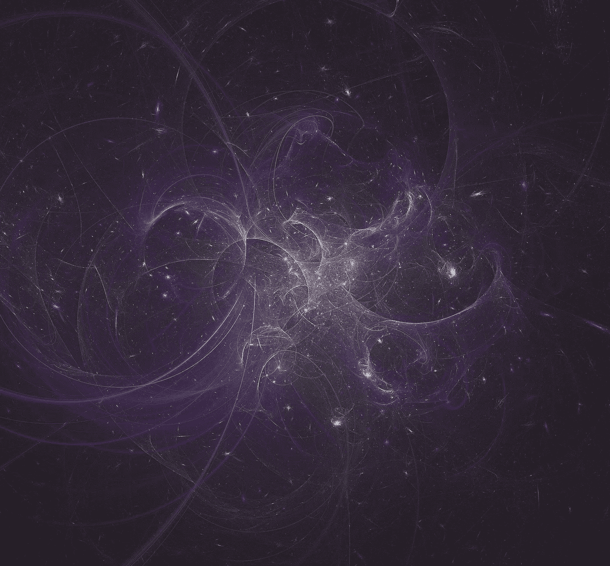

图片由来自[皮克斯拜](https://pixabay.com/fr/?utm_source=link-attribution&utm_medium=referral&utm_campaign=image&utm_content=1147253)的[皮特·林福思](https://pixabay.com/fr/users/TheDigitalArtist-202249/?utm_source=link-attribution&utm_medium=referral&utm_campaign=image&utm_content=1147253)拍摄

在这篇文章中，我将描述真空的[量子能量的一些重要结果。后者存在于整个宇宙的背景中。更具体地说，我将在](https://en.wikipedia.org/wiki/Vacuum_energy)[量子场论](https://en.wikipedia.org/wiki/Quantum_field_theory) (QFT)中解释所谓的[卡西米尔效应](https://en.wikipedia.org/wiki/Casimir_effect)。卡西米尔效应是由于电磁场的量子真空波动而在两个紧密平行的不带电导电板之间作用的小吸引力。更具体地说，不断出现和消失的波动的[虚拟粒子](https://en.wikipedia.org/wiki/Virtual_particle)(根据[海森堡的不确定性原理](https://en.wikipedia.org/wiki/Uncertainty_principle)，在短时间内违反了系统的能量守恒)对两个平行板施加了一种辐射压力。

[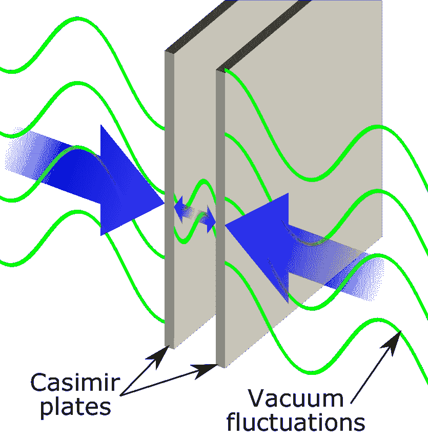](https://en.wikipedia.org/wiki/Casimir_effect)

图 1:平行板之间卡西米尔力的图示([来源](https://en.wikipedia.org/wiki/Casimir_effect))。

卡西米尔效应是由于理想导电板的存在而引起的电磁场真空期望值ε的**变化**δε的结果。**变化**产生了板之间的[卡西米尔力](http://www.scholarpedia.org/article/Casimir_Force)(因为真空预期本身是不可观测的)。

[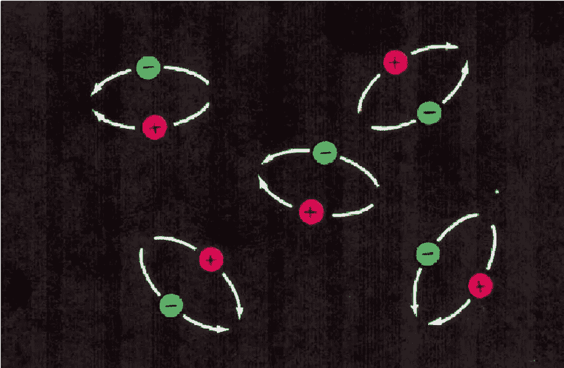](https://pages.uoregon.edu/imamura/123/lecture-8/lambda.html)

图 2:根据海森堡测不准原理(来源[来源](https://pages.uoregon.edu/imamura/123/lecture-8/lambda.html))，波动的虚粒子进出存在并因此在短时间内违反能量守恒。

# 量子标量场

为了简单起见，我将遵循 [Zee](https://books.google.com.br/books?id=n8Mmbjtco78C&printsec=frontcover&dq=zee+nutshell&hl=en&sa=X&ved=0ahUKEwiLlPHxqcDoAhXfE7kGHfHbB5IQ6AEIKDAA#v=onepage&q=zee%20nutshell&f=false) 并计算真实无质量标量场 *φ* 而不是电磁场*的卡西米尔力。*原因是标量场是最简单的可能量子场。它由标量函数 *φ* ( **x** ， *t* )描述，其中自变量 **x** 和 *t* 分别为，，空间和时间坐标。该场符合克莱因-戈登方程(KG):

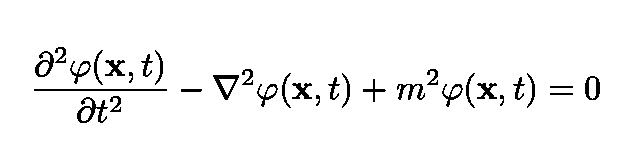

方程 1:大质量标量场φ( **x** ，t)的 Klein-Gordon 方程。

如果场 *φ* 无质量，则该等式变为:

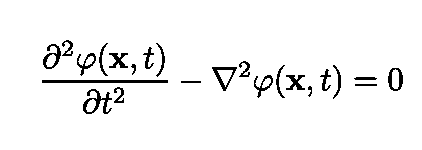

等式 2:无质量场φ( **x** ，t)的 Klein-Gordon 等式。

在这种情况下，经典的哈密顿量是:

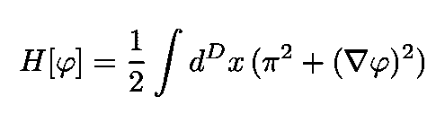

方程 3:经典实无质量标量场的自由哈密顿量。

## 规范量子化

在这一节，我将遵循一个[过程来量子化](https://en.wikipedia.org/wiki/Canonical_quantization)一个[经典场论](https://en.wikipedia.org/wiki/Classical_theory)称为[规范量子化](https://en.wikipedia.org/wiki/Canonical_quantization)。对于那些熟悉普通(非相对论)量子力学中的量子化的人来说，这个过程是类似的。如果 QFT 我们处理变量，即场和它的共轭动量

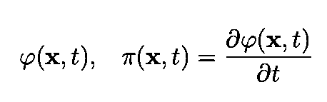

方程 4:场φ及其共轭动量π。

作为算符并强加[规范的换向关系](https://en.wikipedia.org/wiki/Canonical_commutation_relations):

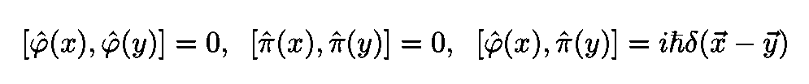

等式 5:遵循标准量子化过程的算符上的正则对易关系。

量子标量粒子的一个例子是希格斯玻色子。

[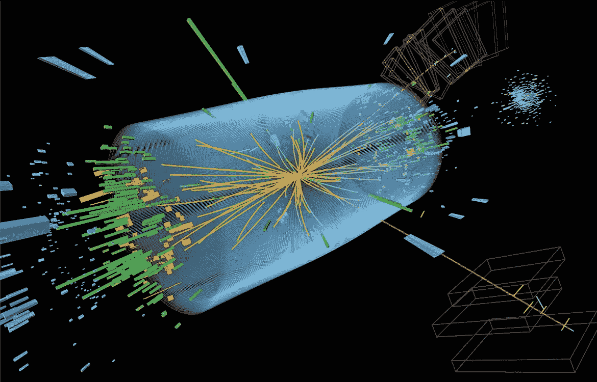](https://www.britannica.com/science/Higgs-boson)

图 3:希格斯玻色子探测。在这种情况下，一个质量为 126 GeV 的粒子产生了，然后，它衰变为两个 Z 玻色子，正如预期的那样，如果观察到的粒子是希格斯玻色子([来源](https://www.britannica.com/science/Higgs-boson))。

真空的能量是通过对真空状态取期望值获得的:

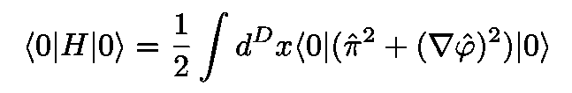

方程式 6:真空的能量。

用创造和湮灭来表达这个场，经过一些简单的代数运算，我们得到:

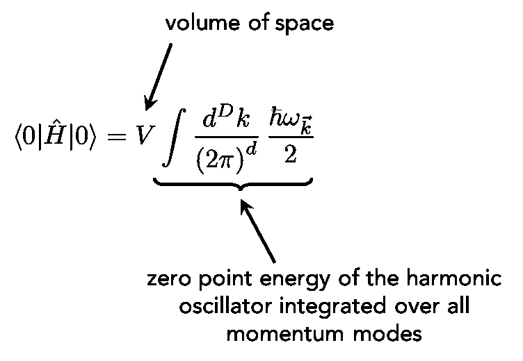

等式 7:总真空能量，由对谐振子的零点能量的所有动量和整个空间的积分给出。

这是谐振子的零点能，对所有动量和所有空间积分。注意积分发散。在实践中，为了获得具有有限能量的哈密顿量，我们通常从 *H* 中减去该期望值，因为该期望值是不可观测的。

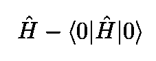

等式 8:从哈密顿量中减去它的无限期望值。后者发散。

# 卡西米尔效应

虽然真空能量是不可观测的，但它的**变化是可以测量的**。只要我们适当地调整场的边界条件，就可以得到这些变化。这是我们将在本节定量讨论的[卡西米尔效应](https://en.wikipedia.org/wiki/Casimir_effect)的基础。卡西米尔效应以荷兰物理学家亨德里克·卡西米尔的名字命名。

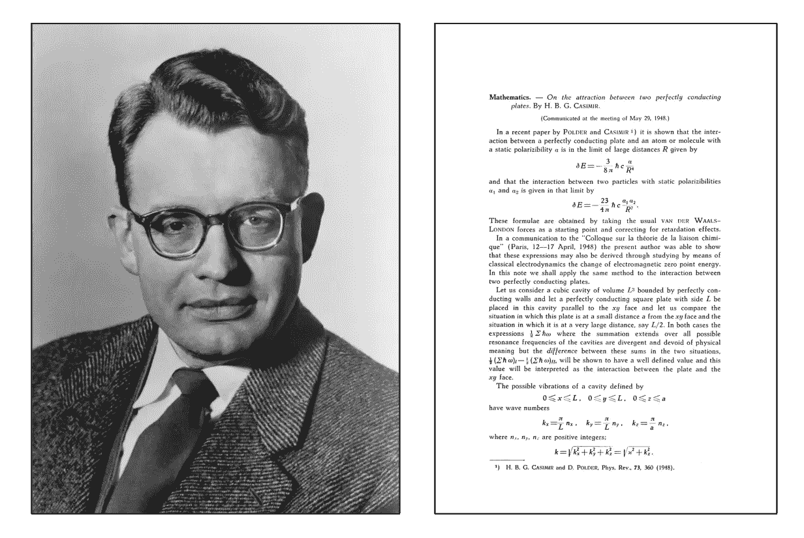

图 4:荷兰物理学家亨德里克·卡西米尔([来源](https://en.wikipedia.org/wiki/Hendrik_Casimir))。右边是他的原创论文([来源](https://www.mit.edu/~kardar/research/seminars/Casimir/Casimir1948.pdf))。

为了计算这种能量变化，考虑下图所示的实验设置。有两个金属位置 I 和 II 被距离 *L* 分开，在它们之间有额外的板 III。如图所示，板 I 和板 III 之间的距离为 *x* 。

[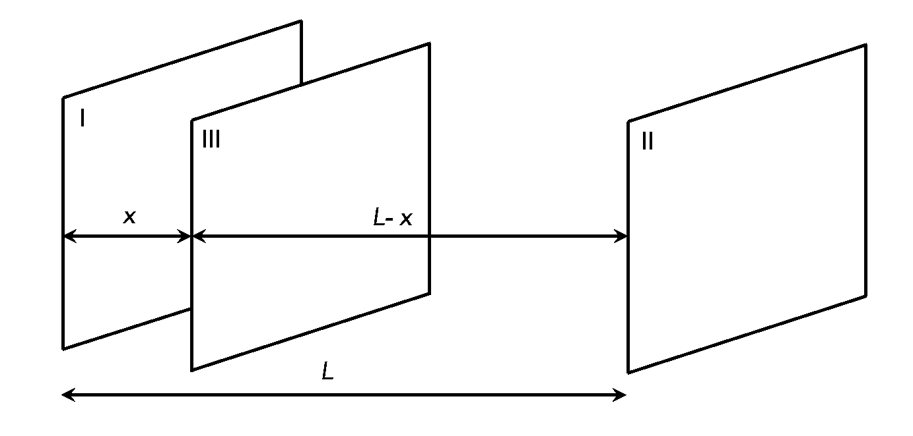](https://books.google.com.br/books?id=Y-0kAwAAQBAJ&printsec=frontcover&dq=quantum+field+theory+gifted&hl=en&sa=X&ved=0ahUKEwii1vGaqbzoAhVzGbkGHcPsD6IQ6AEIKDAA#v=onepage&q=quantum%20field%20theory%20gifted&f=false)

图 5:由 L 隔开的两个金属位置 I 和 II，中间有一个额外的金属板 III(基于[来源](https://books.google.com.br/books?id=Y-0kAwAAQBAJ&printsec=frontcover&dq=quantum+field+theory+gifted&hl=en&sa=X&ved=0ahUKEwii1vGaqbzoAhVzGbkGHcPsD6IQ6AEIKDAA#v=onepage&q=quantum%20field%20theory%20gifted&f=false))。

让我们考虑一下，板之间的场就是电磁场(在我们的计算中，为了简单起见，我们将回到标量场)。导电板的存在对场的波矢施加了条件。动量模式被量化为:

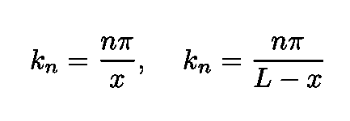

方程式 9:磁场的动量因金属板的存在而量子化。

让我们也忽略 *y* 和 *z* 尺寸，以避免不必要的混乱。总零点能读数

等式 10:总零点能量，动量因金属板的存在而量子化。

因为我们知道相应的模式是

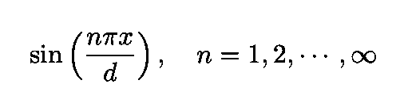

等式 11:贡献系统能量的模式。

现在，高频模式泄漏出来。这可以通过在模式中引入指数衰减因子来解决。换句话说，高频波不能保持在板块内部(它们看不到它们)。然后，我们通过选择以下[正则化](https://en.wikipedia.org/wiki/Regularization_(physics))来移除具有λ << *a* 的模式(其中 *a* 是未知参数):

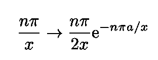

等式 12:使用指数来截止高能量模式。

让我们用等式来评估 *f* ( *x* )。12:

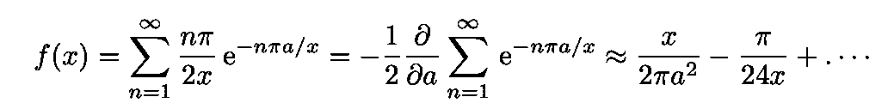

等式 13:和 f(x)的计算。

获得等式中的能量。10、我们类比计算 *f* ( *L* -x】。为了找到板之间的卡西米尔力，我们将 *E* 相对于 *x* 进行微分:

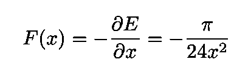

等式 14:图 5 中板 I 和板 III 之间的卡西米尔引力的近似表达式。

应该注意，正则化参数从力的最终表达式中消失了。这(幸运地)允许实验者测量 *F.*

一些快速观察:

*   两块板之间的卡西米尔力是吸引的(等式中有一个负号。14)
*   我们使用的指数正则化有一个物理解释。根据 Zee 的说法，如果波以足够高的频率振荡，电子“跟不上”，板就不再“完全”导电。

我的 [Github](https://github.com/marcotav) 和个人网站 [www.marcotavora.me](https://marcotavora.me/) 有一些其他有趣的材料，既有关于物理的，也有关于数学、数据科学和金融等其他主题的。看看他们！