# 回归分析中的调整 R 平方之谜

> 原文：<https://towardsdatascience.com/the-enigma-of-adjusted-r-squared-57b01edac9f?source=collection_archive---------24----------------------->

## 在数据科学家中，调整后的 R 平方比 R 平方的可信度背后的真正煽动


马库斯·斯皮斯克在 [Unsplash](https://unsplash.com/s/photos/accuracy?utm_source=unsplash&utm_medium=referral&utm_content=creditCopyText) 上的照片

> **“真理不在于细节的精确；而是传达一个正确的印象。”**
> 
> **亨利·阿福德**

## 介绍

回归分析是最基本但最重要的机器学习技术之一，它仍然占主导地位，并为行业中的许多高级研究开辟了道路。虽然有一些先进的回归技术已经用于预测连续变量，如 bagging、boosting、support vectors 等，但如果数据在多维空间中表现为直线形式，线性回归原理仍然是大多数研究人员的首选。线性回归模型最广泛使用的评估指标之一是 **R 的平方**又名**决定系数**。r 的平方被认为是一个**拟合优度**度量，在大多数情况下范围在 0 到 1 之间。R 平方值越高，模型的一致性和预测能力越高。

但与机器学习中的大多数其他评估指标一样，R 平方也有一些限制，这使得它有时通过用极高的值表示一个贫乏的模型来给出不精确的指示。在本文中，我们将讨论 R 平方的计算过程、其局限性，以及如何使用一种称为调整后 R 平方的高级评估指标来克服这些局限性。

## 目录

1.  回归分析中 R 平方的直观性
2.  R 平方的极限
3.  调整后的 R 平方的重要性

## 回归分析中 R 平方的直观性

我们将从一个示例用例开始。假设我们有一个机器学习问题，使用一个人的体重、父亲的身高和母亲的身高作为自变量来预测他/她的身高。

我们有以下研究数据-

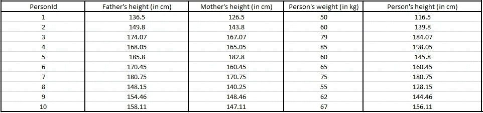

回归分析的输入数据(在 MS Excel 上显示)

这里，我们的目标变量是身高，预测变量是-

1.  父亲的身高(厘米)
2.  母亲的身高(厘米)
3.  人的重量(千克)

从数据中可以清楚地看出，预测变量和目标变量之间存在线性关系。因此，使用多元线性回归算法来构建模型以服务于我们的预测目的是一种典型的想法。

让我们假设我们有一个 0.7 的训练比，我们认为前 7 个记录是训练数据，其余的 3 个记录是测试数据。

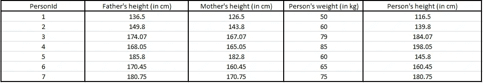

培训数据(在 MS Excel 上显示)

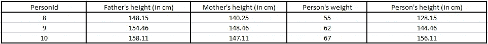

测试数据(在 MS Excel 上显示)

我们完成了线性回归模型，现在，我们需要评估我们的模型，以了解我们的预测与现实的接近程度。

接下来是 R 平方，这是衡量预测强度和接近程度的最流行的性能评估指标之一。

**R 的平方= 1- (SSR/SST)**

在哪里，

**SSR =残差平方和**

**SST =总和的平方和**

考虑我们对测试数据的预测如下-


带有预测结果的测试数据(在 MS Excel 上显示)

让我们使用 sklearn 库计算我们模型的 R 平方(之后我们将讨论其数学推导的深入直觉)

```
#Import necessary packages and libraries
import numpy as np  
import pandas as pd
from sklearn.linear_model import LinearRegression#Create input data as a dictionary
input_dict = 
{
"PersonId": [1,2,3,4,5,6,7,8,9,10],
"Father's height" [136.5,149.8,174.07,168.05,185.8,170.45,180.75,148.15,154.46,158.11],
"Mother's height" : [126.5,143.8,167.07,165.05,182.8,160.45,170.75,140.25,148.46,147.11],
"Weight" : [50,60,79,85,60,65,75,55,62,67] ,
"Person's Height":  [116.5,139.8,184.07,198.05,145.8,160.45,180.75,128.15,144.46,156.11]}#Convert dictionary into a pandas dataframe
data = pd.DataFrame(input_dict)
```

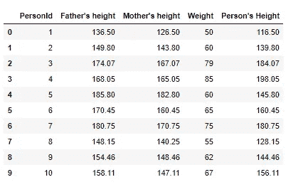

用于回归分析的熊猫数据框格式的输入数据(在 Jupyter 笔记本上显示)

```
#Split the data into train data and test data
X_train = data.head(7)
X_test = data.tail(3)#Remove UniqueId and target variable
del X_train["PersonId"]
del X_train["Person's Height"]#Remove UniqueId and target variable
del X_test["PersonId"]
del X_test["Person's Height"]y_train = data.head(7)
y_test = data.tail(3)#Remove UniqueId and predictor variables
del y_train["PersonId"]
del y_train["Father's height"]
del y_train["Mother's height"]
del y_train["Weight"]#Remove UniqueId and predictor variables
del y_test["PersonId"]
del y_test["Father's height"]
del y_test["Mother's height"]
del y_test["Weight"]#Perform linear regression using sklearn library
regressor = LinearRegression()
regressor.fit(X_train,y_train)        
predictions = regressor.predict(X_test)#sklearn's inbuilt method for computing the RSquared of the model
rsquared = regressor.score(X_test, y_test)#Predictions of testdata
print(predictions)
```

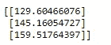

测试数据的预测值(在 Jupyter 笔记本上显示)

```
#R Sqaured of the model
print(rsquared)
```

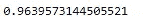

模型的 r 平方值(在 Jupyter 笔记本上显示)

这里，R 的平方= 0.963。根据这一指标的特征，这看起来是一个非常好的值。

但是，这是否足以证实关于该模型预测能力的信心呢？

号码

让我们检查一下这个模型调整后的 R 的平方

```
#Adjusted RSquared of the model
n=len(data) #number of records
p=len(data.columns)-2 #number of features .i.e. columns excluding uniqueId and target variable
adjr= 1-(1-score)*(n-1)/(n-p-1)
print(adjr)
```

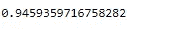

模型的调整 R 平方(在 Jupyter 笔记本上有插图)

哎呀！！！它小于 R 的平方。此外，从 R 的平方(0.963)到调整后的 R 的平方(0.945)，置信度下降了大约 2%。

1.  **为什么调整后的 R 平方会下降？**
2.  **这种差异所传达的真实直观意义是什么？**
3.  **它将如何反映在实时用例中？**
4.  **R 的平方是否总是属于 0 到 1 之间的某个值或者有什么我们经常遗漏的例外情况？**

让我们知道答案…

## R 平方的极限

**R 的平方= 1- (SSR/SST)**

这里，SST 代表总和的平方和，它只表示“**预测点与目标变量的平均值相差多少**”。均值在这里不过是一条回归线。

**SST = Sum(平方(每个数据点——目标变量的平均值))**

数学上，

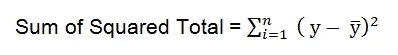

在 MS Word 上显示

在哪里，

n =观察次数

y =目标变量的观察值

y̅ =目标变量的平均值

举个例子，

如果我们想建立一个回归模型，以体重作为独立变量来预测一个人的身高，那么一个不需要太多努力的可能预测就是计算属于我们样本的所有人的平均身高，并将其视为预测值。下图中的红线显示了属于我们样本的所有人的平均身高。

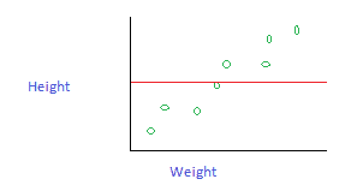

在 MS Paint 上显示

现在来看 SSR，

SSR 代表残差平方和。这个残差是从我们用数学方法(线性回归、贝叶斯回归、多项式回归或任何其他方法)构建的模型中计算出来的。如果我们使用复杂的方法，而不是简单的方法，比如均值，那么我们的准确度就会提高。

**SSR = Sum(平方(每个数据点—回归线中每个对应的数据点))**

数学上，

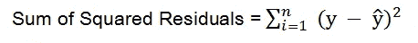

在 MS Word 上显示

在哪里，

n =观察次数

y =目标变量的观察值

ŷ =目标变量的预测值

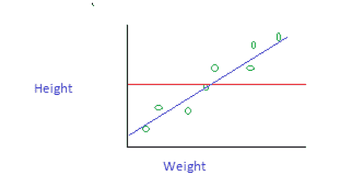

在 MS Paint 上显示

在上图中，让我们假设蓝线表示通过高级数学分析的复杂模型的预测。我们可以看到它比红线有更高的精度。

现在来看公式，

**R 的平方= 1- (SSR/SST)**

这里，

*   **SST 会是一个很大的数字，因为它是一个很差的型号(红线)。**
*   **SSR 将是一个小数字，因为它是我们经过大量数学分析后开发的最佳模型(蓝线)。**
*   **所以，SSR/SST 会是一个很小的数(每当 SSR 降低的时候就会变得很小)。**
*   **所以，1- (SSR/SST)会是一个很大的数字。**
*   **所以我们可以推断，每当 R 的平方变高，就说明模型太好了。**

这是一种一般情况，但在存在多个独立变量的许多情况下，这是不适用的。在这个例子中，我们只有一个自变量和一个目标变量，但在实际情况下，我们将有 100 个自变量作为一个因变量。实际问题是，在 100 个独立变量中

*   **有些变量会与目标变量有很高的相关性。**
*   **有些变量与目标变量的相关性很小。**
*   **此外，一些独立变量根本不相关。**

如果没有相关性，那么发生的是**——“我们的模型将自动尝试建立因变量和自变量之间的关系，并继续进行数学计算，假设研究人员已经消除了不想要的自变量。”**

举个例子，

为了预测一个人的身高，我们将有以下自变量

*   **权重(高相关性)**
*   **电话号码(无关联)**
*   **位置(低相关性)**
*   **年龄(高相关性)**
*   **性别(低相关性)**

在这里，只有体重和年龄足以建立一个精确的模型，但该模型将假设电话号码也会影响身高，并在多维空间中表示它。当通过这 5 个独立变量构建回归平面时，**的梯度、截距、成本和残差**将自动调整以提高精确度。当精度得到人为提高时，显然 R 的平方也会增加。

在这种情况下，回归平面将接触多维空间中原始数据点的所有边缘。这将使 SSR 成为一个非常小的数字，最终将使 R 的平方成为一个非常大的数字，但是当引入测试数据时，这样的模型将悲惨地失败。

这就是为什么高 R 平方值不能保证精确模型的原因。

## 调整后的 R 平方的重要性

为了克服上面提到的挑战，我们有一个额外的指标叫做**调整的 R 平方**。

**调整后的 R 平方= 1—[(1—R 平方)* (n-1) ) / (n-p-1) ]**

在哪里，

*   **p =自变量的数量。**
*   **n =数据集中的记录数。**

对于一个简单的表示，我们可以这样重写上面的公式

**调整后的 R 平方= 1 — (A * B)**

在哪里，

*   **A = 1 — R 的平方**
*   **B = (n-1) / (n-p-1)**

从上面的公式，我们可以冲动地考虑以下推论——

*   **当预测变量的数量增加时，会降低 b 的整体值。**
*   **当 R 的平方值增加时，它将减少 a 的整个值。**
*   因此，从技术上讲，如果 R 的平方很高或者预测变量的数量很高，那么 A 和 B 的值都会受到惩罚。
*   如果我们把 A 和 B 相乘，那么它将是一个小得多的数。
*   如果我们从 1 中减去 A 和 B 的乘积，那么它肯定小于 1，除非 p = 1。
*   **不仅 R 平方和经调整的 R 平方之间的差异，而且经调整的 R 平方本身的值都可以被认为是代替 R 平方的限制的拟合优度度量，用于评估模型的设想一致性。**

总的来说，当自变量的数量增加时，它会惩罚公式，所以总价值会下降。受自变量增加的影响最小。因此，调整后的 R 平方将比 R 平方更准确地指示模型的性能。

## R 的平方可以是负数吗？

是的。在一些罕见的情况下，它也可以是负值。

因为，R 的平方= 1 — ( SSR / SST)

它是基于这样的假设计算的，即目标的平均线是 y 轴的垂直线，是模型在最大风险情况下可能具有的最差拟合。SST 是这条平均线和原始数据点之间的平方差。类似地，SSR 是预测数据点(通过模型平面)和原始数据点之间的平方差。

SSR/SST 给出了一个比率，该比率表明，**“相对于 SST，SSR 如何最差？”**。如果你的模型能在某种程度上建造出一架相对较好的飞机，那么在 99%的情况下，SSR < SST。如果你把它代入方程，它最终会使 R 的平方为正。

但是如果 SSR >SST 呢？这意味着你的回归平面比均值线(SST)差。在这种情况下，R 的平方将是负的。但这种情况只发生在 1%或更少的病例中。

## 结论

尽管 R 平方是一种众所周知的、被广泛接受的性能评估方法，但在一些不属于它的范围的情况下，它的推理传递能力有所下降。然而，要接受的是，没有一根魔棒可以 100%完全代表回归模型的固有倾向。调整后的 R 平方是这样一个指标，它可以在很大程度上适应 R 平方的局限性，并且仍然是全球数据科学家青睐的主要原因。

尽管这不在本文的讨论范围内，但请看看我们在回归和预测中通常使用的其他一些性能评估指标 [**这里**](https://medium.com/@sanjayjsw05/time-series-analysis-complete-tutorial-for-beginners-part-4-afea36da7ac6) 像 MAE、MSE、RMSE、MAPE 等。除了我们到目前为止在这里讨论的内容之外，它将给你一个处理连续变量的模型评估的更先天的视角。

我希望现在你对 R 平方和调整后 R 平方的原理和推导，以及如何在正确的位置和正确的时间实现它们有了直观的理解。

您可以通过以下平台与我联系-

1.  [Quora](https://www.quora.com/profile/Sanjay-Kumar-563?q=sanjay%20kumar)
2.  [领英](https://www.linkedin.com/in/sanjay-nandakumar-8278229b/)
3.  Gmail—sanjayjsw05@gmail.com

## 参考

1.  Sougata Deb，[**一种新的稳健 R 平方测度及其在线性回归中的应用**](https://link.springer.com/chapter/10.1007%2F978-3-319-48517-1_12)*(2016)*
2.  *Kazhurio Ohtani 和 Hisashi Tanizaki，[**R2 和调整后的 R2 在线性回归模型中的精确分布，带有多元误差项**](http://www2.econ.osaka-u.ac.jp/~tanizaki/cv/papers/dist_r2.pdf)(2004 年)*
3.  *Carrodus，M.L .和 Giles，D.E.A .， [**回归扰动自相关时 R2 的精确分布**](https://www.sciencedirect.com/science/article/abs/pii/016517659290021P) ，《经济学快报》，38，375–380(1992)*

***感谢阅读！！！***