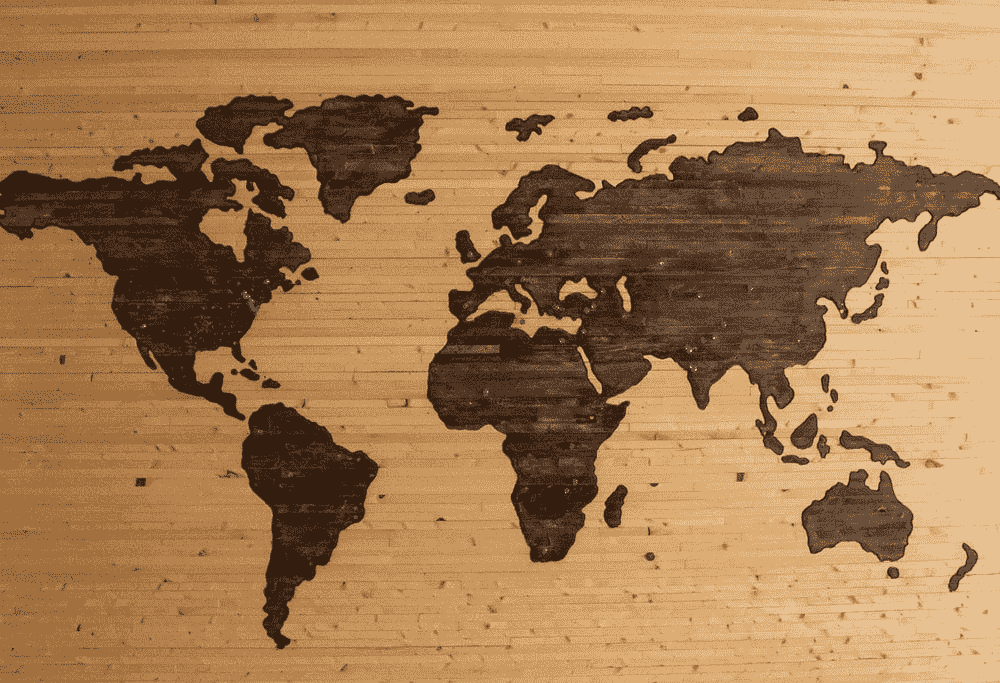

# 第三世界国家的数据科学家角色之谜

> 原文：<https://towardsdatascience.com/the-enigma-of-the-data-scientist-role-on-a-third-world-country-b6cf1ec7e245?source=collection_archive---------32----------------------->

## 数据科学家的社会概念如何根据其环境的需要而变化

佩里·格罗内在 [Unsplash](https://unsplash.com/s/photos/guatemala?utm_source=unsplash&utm_medium=referral&utm_content=creditCopyText) 上的照片

# 成为一名**数据科学家**很酷。

或者这是我在大学的看法，我有一个模糊的想法，一个数据科学家不仅实现了模型，而且还创造了这个惊人的算法，基本上可以使数据变成可以解决每个人问题的*仙尘*但是**男孩我错了。**作为一名数据科学家，对一家公司的不同领域来说可能意味着不同的事情，但这也取决于一家公司的结构方式。我可以向你保证，在谷歌做数据科学家和在创业公司做数据科学家没有任何关系，他们的职能变了，职责的数量和性质变了。基本上，数据科学家的职位可以根据你作为客户的需求或他们作为公司的要求而变化和调整。

照片由[布雷特·泽克](https://unsplash.com/@iambrettzeck?utm_source=unsplash&utm_medium=referral&utm_content=creditCopyText)在 [Unsplash](https://unsplash.com/s/photos/map?utm_source=unsplash&utm_medium=referral&utm_content=creditCopyText) 上拍摄

我是一个 22 岁的女人，住在一个叫做危地马拉的第三世界国家，就在分隔北美(墨西哥、美国和加拿大)和南美(巴西、哥伦比亚、秘鲁等)的小桥上。)我们是中美洲的一部分，虽然世界上大多数人无法区分我们的国旗和大多数其他中美洲国家的国旗，但我们的经济确实很不一样，因为我真的不想谈论细节，所以我只想说，我们很不一样。

身处第三世界国家意味着你不得不每天正视贫穷和暴力，但这也意味着你有更大的框架来用创造性的想法来解决你的世界问题，这些机会可以通过稍微改变你在更先进国家的想法来填补，这从未停止让我感到惊讶。在美国，他们有优步，嗯，我们有 20 多个这样的应用程序，你有优步吃，我们有哥伦比亚版本，再加上 15 个。作为这些实施的一部分，工作人员中会产生新的职位，例如我现在担任的数据科学家职位。

# 数据科学家可以变形

是的，但只有真正的数据科学家才能通过不同类型的工作实现巨大的变化，无论你是在医疗领域，还是在技术领域，还是与 finch 合作，或者从事任何你正在从事的工作。在这里，你可以看到一个已经学习、测试、应用并获得如何实现模型的知识的人与另一个只是碰巧在公司获得数据科学家职位的普通开发人员之间的差异。

数据科学家的角色是 ***分析*** 、 ***解构*** 、 ***构建*** 和 ***创建*** 新的数据处理方式，以便获得他们期望的答案，假设是的，他们知道他们的目标变量是什么。但在第三世界国家，真正的交易和模仿可能会混淆不清。这是一个混合种族，有人大喊数据，有人盲目假设每个模型都一样，或者模型所说的是宇宙中最终的真理，这是第三世界国家需要的错误类型的数据科学家。一个持怀疑态度但不极端的数据科学家，一个谨慎但知道自己所冒风险的数据科学家，一个在模型的不同变化中强化自己知识的数据科学家，或者一个知道什么时候*“模型在说谎】*的数据科学家，是第三世界国家需要的那种数据科学家。一个知道计算机是一台旨在授权而不是奴役人类分析的机器的数据科学家，一个在随机丢弃变量之前了解业务的数据科学家，一个知道在美国经济中奏效的数据科学家不会有与中美洲国家相同的行为，这是第三世界国家应该拥有的数据科学家。

# 这就是第三世界国家的数据科学家的角色之谜。