# EPL 还有一周就要开始了，我们的算法 2.0 已经准备好了

> 原文：<https://towardsdatascience.com/the-epl-is-one-week-away-and-our-fpl-algorithm-2-0-is-ready-to-play-ededb2df5f6d?source=collection_archive---------26----------------------->

## 我们的金钱球方法到幻想的 EPL(队 _id: 2122122)

如果这是你第一次登陆我的幻想 EPL 博客，你可能会想看看我的媒体档案中的一些我在上一季开始时写的 EPL 博客(GW1-GW9)，以熟悉我们的整体方法和我们随着时间的推移所做的改进。在这个项目中，我最初的犯罪搭档是 Andrew Sproul，他和我一样对数据科学、人工智能和梦幻运动充满热情。今年，一名新的 EPL 爱好者——**普尔基特·查布拉**——加入了这个团队，并为算法添加了许多新鲜的想法和优化建议。谢谢你到目前为止所做的努力，Pulkit，我期待着和你一起努力，从长远来看，尽可能地改进这个模型！

## 什么是新的？

在过去的两个赛季中，我们的算法已经发展了多次，因为我们一直在寻找方法为我们的决策过程添加更多的数据，并提高我们预测的准确性。也就是说，我们很兴奋地分享我们在过去几个月中所做的一些新变化。下面是我们今年增加的一些新指标的列表:

**裁判统计:** *【每场比赛的牌数】*和*【每场比赛奖励的点球数】*过去 3 个赛季的统计数据——我们的想法是 ***在裁判更有可能给予 1 个或更多点球的比赛中，让我们队中的球员成为点球手****。此外，我们需要小心从裁判可能会给很多黄牌或红牌的比赛中增加球员。*

***团队处罚统计:***【total _ penalties _ award】*和*【Penalty _ conversion _ ratio】*—想法是将该统计与裁判统计*【每场比赛奖励的处罚】****相结合，从历史上获得更多处罚*** 和比赛裁判具有 ***高“pen _ award coefficient”*的团队中挑选球员甚至队长***

***赌注系数:**目前，我们正在整合来自 8-10 家主要赌注公司的平均系数，分别为***【W/L/D】***以及 ***低于 2.5/超过 2.5*** 统计数据——这里的想法是让更多来自团队 ***的*进攻型玩家 ，以及更多防守型 ***此外，我们试图从 ***胜率高*** 的队伍中吸收更多玩家。******

*****预测模型:**现在我们使用两个 ML 模型的预测，基于历史数据和每个球员的组合概率统计，例如( ***上场 60 分钟以上的机会*得分机会*助攻机会*不失球机会*加分机会等。*** ) —这里的想法是 ***不同 ML 模型的平均组合预测值往往比一个微调模型本身的预测值更准确*** 。我们的 ML 模型预测未来 n 周 的 ***预计点数，以及 ***每个玩家的预计 ROI(每 1M 成本的点数)。*********

*****预测不确定性:**我们采用每个玩家的每个模型的预测 之间的 ***平方差，并使用该数字来***分配预测*** 的不确定性级别，以便在选择最终阵容时使用——这里的想法是，如果两个模型为给定玩家输出非常相似的值，那么我们更愿意相信那些预测点数。******

*****改进的优化器:**我们调整了优化算法，使其能够 ***接受大量新的额外输入，并且在逻辑上更加智能和灵活*** 。在过去，该算法通常会输出每个游戏周 15 名球员的最佳阵容，旨在优化整个阵容的 ROI。经过最近的变化，我们现在可以优化: ***团队形成，每个位置的廉价填充人数，预计投资回报率，预计总点数，预计奖金点数，固定转让次数等。—*** 可能性是无穷无尽的，如果我们能够获得数据，那么我们就可以向它优化！***

# ***有用的统计数据***

***由于我们今年在算法中加入了很多新的统计数据，随着时间的推移，这个博客将会有更多的统计数据和图表，更少的文本 。这第一个帖子可能会有更多的文字，因为我们选择介绍新的变化，并为赛季的剩余部分定下基调。请看下面的一些有用的统计数据，我们在为 GW1 挑选队员时考虑到了这些数据:***

## ***博彩赔率***

******

***正如你所看到的，我们将尝试积累来自 ***队的玩家，他们有超过 50 %的机会赢得*** 如 ***LIV、ARS、CHE、TOT 和雷*** 。***

***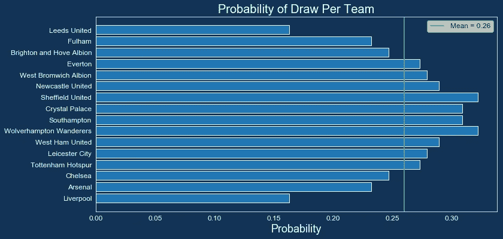***

***拥有 ***的队伍以更高的概率抽到了*** ，特别是当比赛是 ***结合高赔率为 2.5 以下的*** 时，可能会有 ***适合选择防守球员*** 因为如果比赛以 0:0 结束，那将会产生大量的加分。结合 下方的 ***下/上图，我们可以识别出以下 ***概率较高的至少一场不失球的比赛——舒 vs***、 ***、*** 和 ***哭 vs .苏。*********

***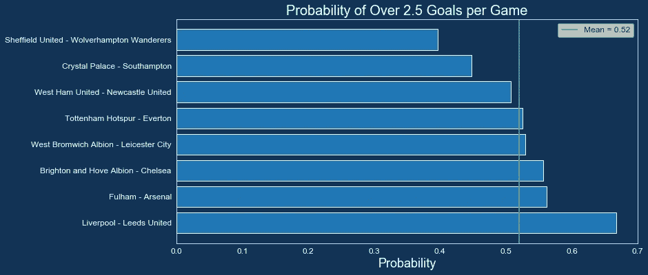***

***反过来，我们可能希望有更多的****高赔率超过 2.5*** 的游戏中的攻击玩家，比如 ***丽芙 vs 李，FUL vs. ARS，vs 车。*******

## ******裁判统计******

********

****正如我们提到的，我们可能希望在比赛中有 ***甚至队长这样的主罚者*** ，其中 ***裁判更有可能判罚至少一个点球*** 。这个属性与下面每个团队的 ***【判罚】*** 和 ***【判罚转换率】*** 属性结合起来会变得更加强大:****

********

****看到两位裁判“宠儿”——***曼联和曼城在那个榜单*** 附近，我一点都不惊讶，但是看到 ***莱斯特和*** 水晶宫在那里，我绝对感到惊讶。事实上，这里有一个 ***体面的球队名称列表*** 在平均值 19.42 以上的 ***，所以为了缩小我们对球员的选择，让我们也看看下面每个球队的惩罚转换率:*******

****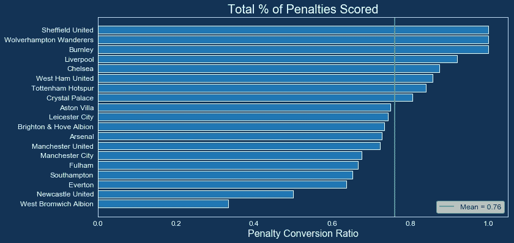****

****上面的图表让事情变得有点有趣，当谈到*(两者都接近 70%的成功率)时，曼城 ***和曼联*** 现在下降到图表底部附近。因此，这引起了一些关于因错失点球 而被罚 ***负分的担忧，并使成功率接近 100%的 ***球队的点球手，如、BUR、LIV、CHE、TOT 和 CRY*** ，从长远来看更具吸引力。********

***即将到来的比赛的裁判分配还没有上线，但是我们会在他们可用的时候加入他们。下面的最后一个统计，我们可能会考虑，是每个裁判的*——这里的想法是，如果我们 ***预计两个强硬对手*** 之间会有一场激烈的比赛，加上一个喜欢给他们看牌的裁判，我们可能要小心地从这些比赛中选择球员。当心裁判 ***马德利、胡珀、蒂尔尼、斯科特、梅森和朋友*** ，他们过去 3 个赛季场均 ***7 张或更多牌。*******

****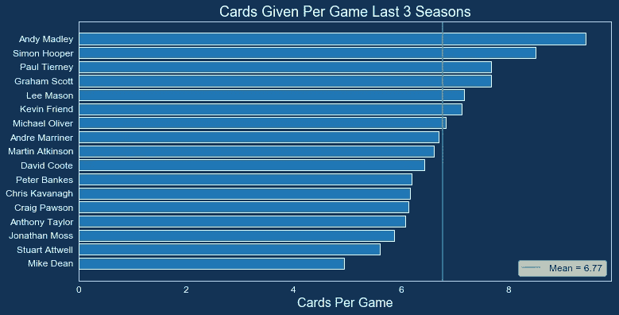****

## ******团队统计******

****就像去年一样，我们将着眼于调整后的 ***对手难度分数(FDR)，考虑到每支球队在未来 3 场比赛中即将到来的赛程，*** ，我们的目标是 ***最大限度地减少来自拥有 FDR 分数的球队的玩家数量>第 75 百分位*** 和 ***最大限度地增加来自赛程更轻松的球队的玩家数量*** 。正如你所看到的，我们将放弃从、WBA、或 BUR 中获取玩家，我们将尝试从 SHU、MUN、TOT、CHE 等中获取更多。****

****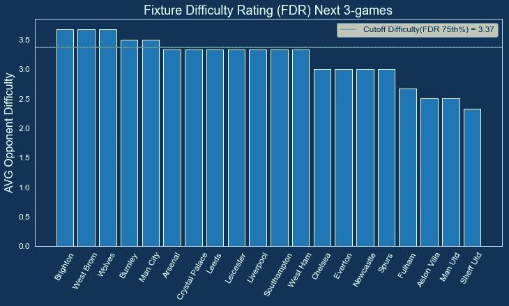****

## ******预测模型(球员统计)******

****现在是今年改进算法的皇冠上的宝石——预测球员统计数据的时候了。当我们为接下来的 n 个游戏周调整我们的团队优化器时，有三个主要指标*—***预测总点数、期望值(ROI)和每场游戏奖励点数*** 。下面是每个指标的统计数据，也是按职位细分的。*****

## ******预计总积分—前 25 名玩家******

****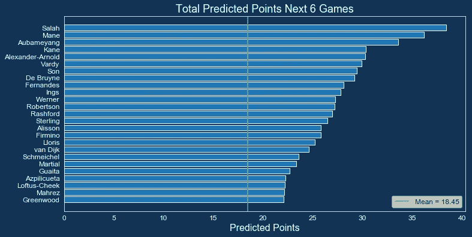****

## ****预计预期价值(ROI) —前 25 名参与者****

****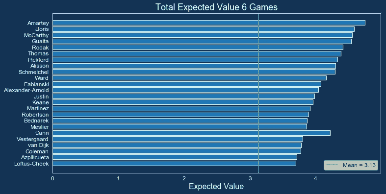****

## ****每场比赛奖金(上赛季)—前 25 名球员****

****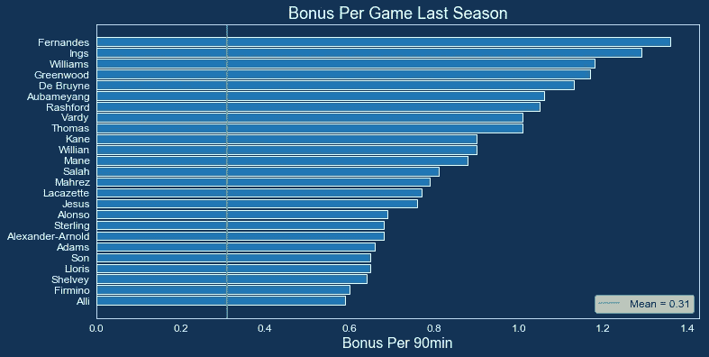****

## ******预测积分——顶级门将******

****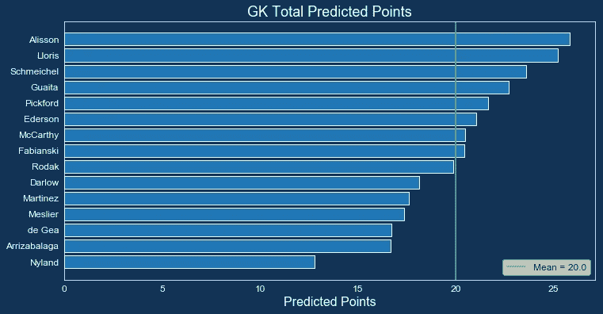****

## ****投射点数—顶级防守者****

****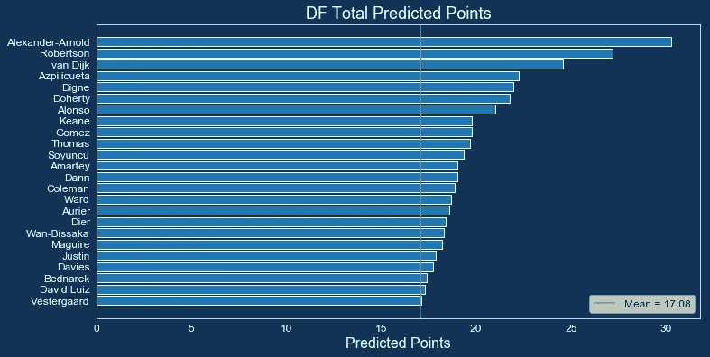****

## ****预测得分——顶级中场****

****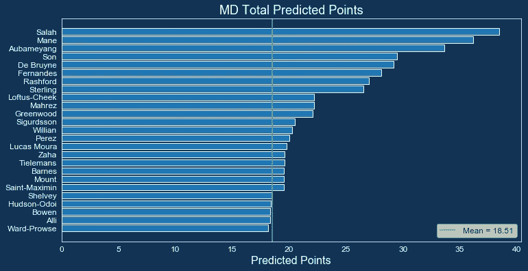****

## ****预测分数——顶级前锋****

****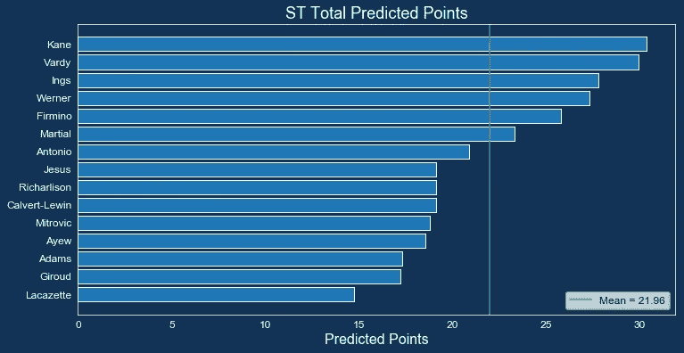****

****正如你所看到的，我们可以为每个位置选择大量选项，因此我们将把上面的许多统计数据插入 Python 中的 ***优化函数，该函数将 ***输出具有最高预期总积分*** 的团队，给定我们的预算约束和其他进入我们决策过程的指标。在团队选择器代码生效之前应用的一些初步过滤器包括:*******

1.  *****排除受伤或停赛球员*****
2.  *****将球员排除在 FDR 高的队伍之外*****
3.  *****排除 GW1 中没有固定比赛的队伍中的球员*****
4.  *****同一团队不能有超过 3 名玩家*****
5.  *****总共必须有 15 名球员(GK=2，DF=5，MD=5，ST=3)*****

***下面是模型文本输出的两个例子——一个用于**一个*全队优化*** ，一个用于**一个*单人转会。******

## *****例 1:利用填充接头优化 3–5–2 地层的预算*****

***正如你在下面看到的，模型首先查看参数，告诉它是否应该向 15 名球员的*全队优化，或者向有 ***11 名关键球员和 4 名廉价替补*** 的特定阵型优化。对于填充符，它首先查看 ***首选地层*** ，并使用那个 ***来决定每个位置*** 需要多少个填充符。然后，模型从我们的初始预算中减去花费在 4 个填充者上的总金额，并将剩余的预算花费在关键的 11 个玩家上， ***给出优化函数和模型约束*** 。****

********

## ****例 2:用 650 万的预算优化一名前锋的转会****

****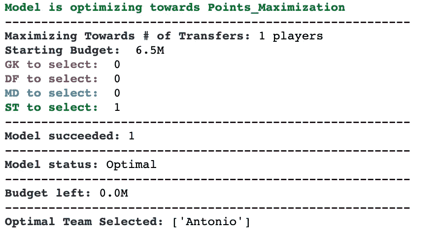****

# ******为游戏周 1 选出的最终队伍******

****和去年一样，并不是我们所有的决策过程都可以完全自动化，这就是这个游戏如此有趣和令人兴奋的原因。也就是说，我们经常会查看优化器算法的多个输出 ***以及一些不同的约束和优化函数*** ，并将它们与本文前面描述的所有其他有用的统计数据组合在一起— ***裁判统计数据、博彩赔率、FDR 分数、处罚统计数据、奖励积分统计数据*** 等。—向我们最终的团队选择 流程添加一个 ***人的因素。请看下面几个从这个过程中产生的不同的团队版本，这将有望给你一些想法，让你能够 ***明智地花费你最初的 FPL 预算*** 并以一个体面的 ***ROI /总积分期望*** 开始这个赛季。*******

*****最优 Team1 (MD-heavy):** *从 4–4–2 阵型开始，投入* ***布鲁诺费尔南德斯*** *并切换到****3–5–2 在 GW2*** *。****

***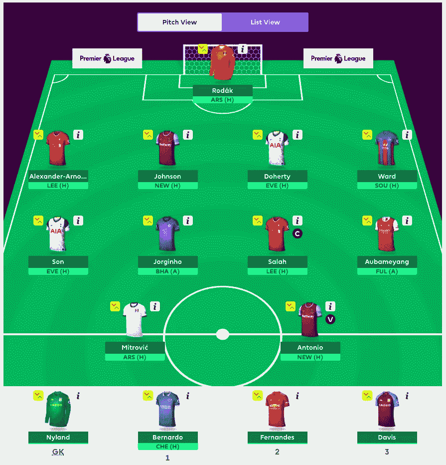***

*****最佳团队 2(平衡):**全面平衡团队，允许 ***阵型灵活，每个位置有更多球员选择*** *。****

***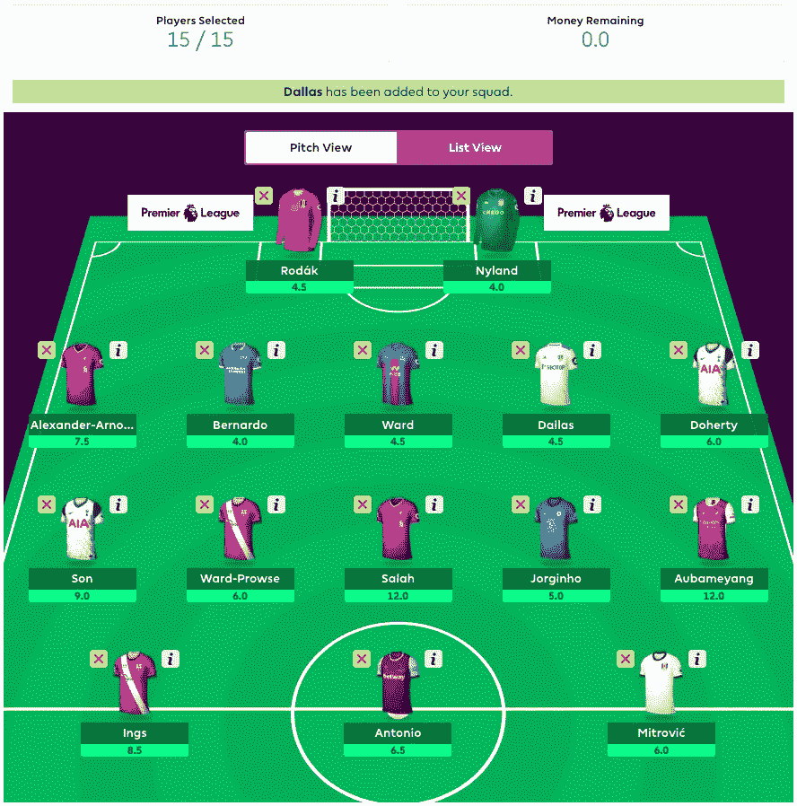***

*****最优团队 3 (ST-heavy):** 围绕几个 ***昂贵的前锋和中场*** 与 ***高点期望*** ，从 FDR 分数 ***低*** 和 ***高超过 2.5 的团队中脱颖而出，赢得赔率。******

***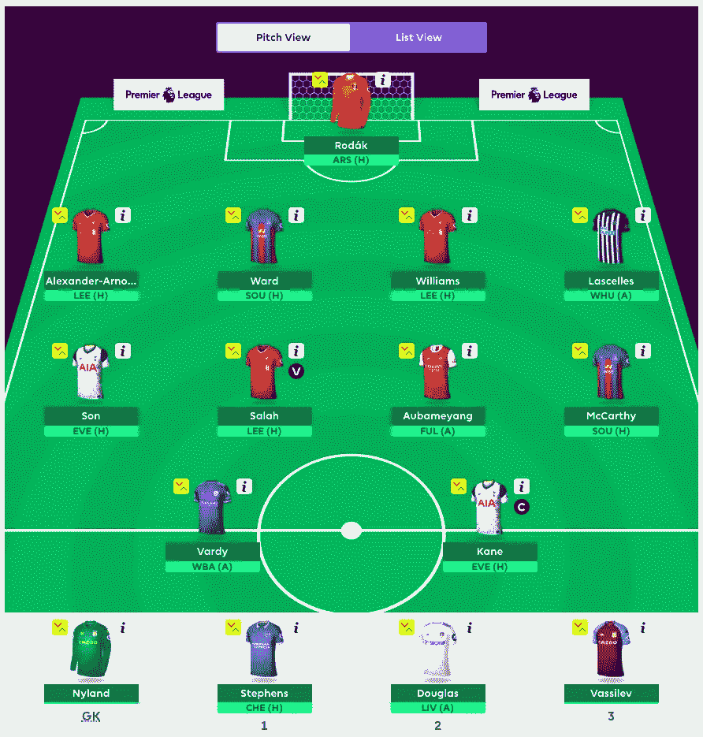***

# ***结论***

***如果你还在读这篇长篇大论的博客，感谢你一直忍耐到最后！希望这意味着你发现分享的信息是有趣和有用的，这是对我们这些热爱为 FPL 社区做贡献的开发者和作者来说最重要的事情。如果你喜欢阅读我们上面的优化方法，请在每个 FPL 游戏周的转会截止日期之前回来查看我们的每周状态更新和团队建议。此外，如果您认为我们可以在决策过程中增加新的数据源或优化技术，请随时提出建议。我们的一个想法是，从关注 FPL 推荐和更新的流行推特账户中获取推特数据，并将这些数据添加到球员选择逻辑中。如果您关注任何特别想推荐的客户，请与我们分享。提前感谢，并祝你在本赛季的 FPL 好运！！！***