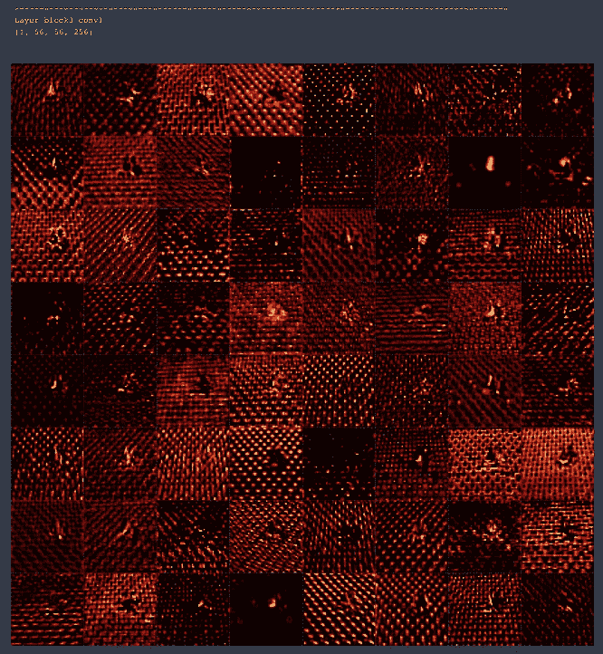
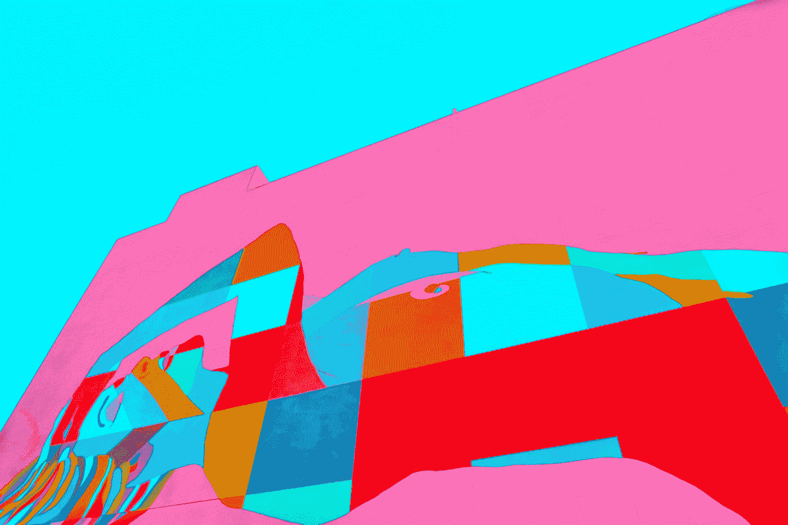

# 获奖照片背后的结构——深度学习方法

> 原文：<https://towardsdatascience.com/the-essence-behind-an-award-winning-photo-an-ai-approach-f044d908d412?source=collection_archive---------57----------------------->

## 通过可视化 CNN 架构的各层，我们深入了解机器如何处理图像。


*来源*[*https://unsplash.com/photos/hJKkyoG8_ng*](https://unsplash.com/photos/hJKkyoG8_ng)*由哈迪·雅兹迪·阿兹纳韦—昂斯普拉什奖 2019 年入选《时事要闻》*

卷积神经网络(CNN)允许计算机对图像进行分类。除了对物体进行分类，它们还能让我们了解是什么构成了一幅图片。一幅画的本质是什么？通过可视化 CNN 架构的各层，我们深入了解机器如何处理图像。这也提供了人类如何“看见”图片的见解。

这篇文章将在一边展示什么元素构建了一幅图片，并提供了用 Keras 实现 Python 的代码。

# 目录

*   [免责声明](https://github.com/Createdd/Writing/blob/master/2020/articles/visualizeLayersCNN.md#disclaimer)
*   [基础图像](https://github.com/Createdd/Writing/blob/master/2020/articles/visualizeLayersCNN.md#the-base-image)
*   [使用 VGG 网络](https://github.com/Createdd/Writing/blob/master/2020/articles/visualizeLayersCNN.md#using-a-vgg-network)
*   [卷积层特征图](https://github.com/Createdd/Writing/blob/master/2020/articles/visualizeLayersCNN.md#convolutional-layer-feature-maps)
*   我们能观察到什么？
*   [用代码](https://github.com/Createdd/Writing/blob/master/2020/articles/visualizeLayersCNN.md#visualize-with-code)可视化
*   [网格中的特征](https://github.com/Createdd/Writing/blob/master/2020/articles/visualizeLayersCNN.md#features-in-grid)
*   [笔记本显示器的特性](https://github.com/Createdd/Writing/blob/master/2020/articles/visualizeLayersCNN.md#features-with-notebook-display)
*   [奖励——一种神经转移方法](https://github.com/Createdd/Writing/blob/master/2020/articles/visualizeLayersCNN.md#bonus---a-neural-transfer-approach)
*   [灵感](https://github.com/Createdd/Writing/blob/master/2020/articles/visualizeLayersCNN.md#inspiration)
*   [关于](https://github.com/Createdd/Writing/blob/master/2020/articles/visualizeLayersCNN.md#about)

# 放弃

我与本文中使用的任何服务都没有关联。

我不认为自己是专家。如果你觉得我错过了重要的步骤或者忽略了什么，可以考虑在评论区指出来或者联系我。

我总是乐于听取建设性的意见以及如何改进。

**这篇文章写于 2020 年 10 月 25 日。**我无法监控我的所有文章。当你阅读这篇文章时，提示很可能已经过时，过程已经改变。

如果你需要更多关于某些部分的信息，请在评论中指出来。

# 基本图像


*来源*[*https://unsplash.com/photos/hJKkyoG8_ng*](https://unsplash.com/photos/hJKkyoG8_ng)*由哈迪·雅兹迪·阿兹纳韦—昂斯普拉什奖 2019 入选《时事热点》*

我喜欢这张图片，因为它有一个故事，它激发了情感，但也在摄影的层面上提供了一个丰富的结构。

为了解释我为什么选择这张图片，我直接引用 Vice 的设计总监 Joel Tellier 的话(摘自 [Unsplash Awards 页面](https://awards.unsplash.com/2019/#/current-events)):

> 这张照片的构图令人难以置信。每个元素都有故事和历史层次。这个主题的随意性表明，她在一个她和她的性别在历史上从未受到欢迎的地方完全自在。她受伤，因此很难参加那一天，增加了她爱国庆祝活动的轻松性质，暗示了一个更复杂的故事。座位上的数字有助于暗示历史，让我想知道在一个(第一个)女人被允许之前，有多少男人坐在她坐的地方。

这使得用 CNN 提取信息成为一个非常有趣的图像。

# 使用 VGG 网络

我假设理解卷积神经网络(CNN)。这种架构对于计算机视觉和深度学习中的许多事情都非常关键。网上有很多可用的资源。作为复习，我建议这篇[文章](https://medium.com/@himadrisankarchatterjee/a-basic-introduction-to-convolutional-neural-network-8e39019b27c4)。

为了理解随后的可视化，有必要说明 CNN 的不同层代表什么。

*   CNN 的较浅层倾向于检测较低级别的特征，例如边缘和简单纹理。
*   更深的层倾向于检测更高级的特征，例如更复杂的纹理以及对象类别。


来自研究论文[的 VGG19 架构使用深度卷积神经网络和 SVM 分类器](https://www.researchgate.net/publication/334388209_Automatic_Mass_Detection_in_Breast_Using_Deep_Convolutional_Neural_Network_and_SVM_Classifier)和[知识共享许可](https://creativecommons.org/licenses/by/4.0/)进行乳房自动肿块检测

可以可视化过滤器和特征图。过滤器也是描绘特定特征的图像。应用这些过滤器导致特征图。实际上，图层越浅，要素地图看起来就越像原始输入。在这篇文章中，我想把重点放在特征地图和它们的可视化上，因为它们给 CNN“看到”和学到的东西留下了很好的印象。

# 卷积图层要素地图

VGG19 模型具有以下结构和层:

```
_________________________________________________________________
Layer (type)                 Output Shape              Param #
=================================================================
input_1 (InputLayer)         (None, None, None, 3)     0
_________________________________________________________________
block1_conv1 (Conv2D)        (3, 800, 1199, 64)        1792
_________________________________________________________________
block1_conv2 (Conv2D)        (3, 800, 1199, 64)        36928
_________________________________________________________________
block1_pool (MaxPooling2D)   (3, 400, 599, 64)         0
_________________________________________________________________
block2_conv1 (Conv2D)        (3, 400, 599, 128)        73856
_________________________________________________________________
block2_conv2 (Conv2D)        (3, 400, 599, 128)        147584
_________________________________________________________________
block2_pool (MaxPooling2D)   (3, 200, 299, 128)        0
_________________________________________________________________
block3_conv1 (Conv2D)        (3, 200, 299, 256)        295168
_________________________________________________________________
block3_conv2 (Conv2D)        (3, 200, 299, 256)        590080
_________________________________________________________________
block3_conv3 (Conv2D)        (3, 200, 299, 256)        590080
_________________________________________________________________
block3_conv4 (Conv2D)        (3, 200, 299, 256)        590080
_________________________________________________________________
block3_pool (MaxPooling2D)   (3, 100, 149, 256)        0
_________________________________________________________________
block4_conv1 (Conv2D)        (3, 100, 149, 512)        1180160
_________________________________________________________________
block4_conv2 (Conv2D)        (3, 100, 149, 512)        2359808
_________________________________________________________________
block4_conv3 (Conv2D)        (3, 100, 149, 512)        2359808
_________________________________________________________________
block4_conv4 (Conv2D)        (3, 100, 149, 512)        2359808
_________________________________________________________________
block4_pool (MaxPooling2D)   (3, 50, 74, 512)          0
_________________________________________________________________
block5_conv1 (Conv2D)        (3, 50, 74, 512)          2359808
_________________________________________________________________
block5_conv2 (Conv2D)        (3, 50, 74, 512)          2359808
_________________________________________________________________
block5_conv3 (Conv2D)        (3, 50, 74, 512)          2359808
_________________________________________________________________
block5_conv4 (Conv2D)        (3, 50, 74, 512)          2359808
_________________________________________________________________
block5_pool (MaxPooling2D)   (3, 25, 37, 512)          0
=================================================================
Total params: 20,024,384
Trainable params: 20,024,384
Non-trainable params: 0
_________________________________________________________________
```

所以这是原图:


通过 CNN 的不同层，我们可以观察到不同过滤器应用于原始图像的结果。我将用“热”色图显示它。只是因为我觉得它比其他色彩映射表更能突出特色。

请注意，过滤器的尺寸和数量随着块的数量而变化。为了简单起见，我将只绘制 8*8 的网格。

我们先来看一下每个块的**第一个**卷积层:



每个块的第**个**卷积层

我们来看看每个块的**最后**卷积层:


每个块的最后一个卷积层

# **我们能观察到什么？**

**两件事:**

1.  **我们可以清楚地看到在更深的层中物体被探测到。例如，孤立的女人，但也有一个座位，国旗，甚至有色座椅脱颖而出。**
2.  **这幅图像吸引人的很大一部分是它的结构本身。我们可以看到图片中的女人是如何在非常结构化的环境中带来柔和感的。它看起来很吸引人，因为它的结构是圆形的。圆形的元素使观察者能够将注意力集中在这个独特的物体上，而不是类似的座位上。**

**本质上，我们可以看到一个图像的相当有趣的组成。我们通过竞技场中的座位提供了许多纹理和结构，但这种结构在人类的形式中是一种扭曲。这将观察者的眼睛直接引导至图像的主角，即女性。它完全符合故事情节。我想说这是区分好照片和优秀照片的地方。通过可视化来支持故事情节。**

**它就像一个视频，完美地将音乐切割成了它的视觉表达。明白我对这个视频的意思了吗:**

**为什么音乐在视频中如此重要**

**至少这些是我的观察。你认为是什么让这张照片吸引人？请在评论中告诉我。**

# **用代码可视化**

# **网格中的特征**

**在我对 CNN 图层的特征地图进行可视化的研究中，我经常会找到一些教程和实现，这些教程和实现提供了关于如何实现可视化的见解，但并没有真正看到和理解图像所显示的内容。**

**在我的“灵感”部分，你可以找到形象化的各种实现。通常提取图像的方法是很好的。我只是总觉得它们太小了，不足以表达自己的观点。**

**如果您遵循现有的解决方案，您可以这样做:**

```
import numpy as np
from keras.preprocessing.image import save_img, load_img, img_to_array
from PIL import Image
from keras.applications.vgg19 import preprocess_input
from keras.models import Model
from keras.applications import vgg19
import matplotlib.pyplot as plt size = 224image = load_img(image_path).resize((size, size))
image = img_to_array(image)
image = np.expand_dims(image, axis=0)
image = preprocess_input(image)model = vgg19.VGG19()layer_dict = dict([(layer.name, layer) for layer in model.layers])layer_name = 'block1_conv1'model = Model(inputs=model.inputs, outputs=layer_dict[layer_name].output)feature_maps = model.predict(image)tiles = 8
index = 1
fig, ax = plt.subplots(figsize=(size, size))
for _ in range(tiles):
    for _ in range(tiles):
        ax = plt.subplot(tiles, tiles, index)
        ax.set_xticks([])
        ax.set_yticks([]) plt.imshow(feature_maps[0, :, :, index-1], aspect='auto', cmap='hot')
        index += 1plt.tight_layout()
plt.show()
```

**如果您想要在不同的图层上显示多个可视化效果，这将非常有用。喜欢**

```
for layer in layer_names:
    print(f'{"-"*100}\nLayer {layer}')
    model = Model(inputs=model.inputs, outputs=layer_dict[layer].output) feature_maps = model.predict(image)
    print(feature_maps.shape)tiles = 8
    index = 1
    fig, ax = plt.subplots(figsize=(size, size))
    for _ in range(tiles):
        for _ in range(tiles): ax = plt.subplot(tiles, tiles, index)
            ax.set_xticks([])
            ax.set_yticks([]) plt.imshow(feature_maps[0, :, :, index-1], aspect='auto', cmap='hot')
            index += 1 plt.tight_layout()
    plt.show()
```

**这导致每层 8*8 的网格:**

****

**图像更大，可以快速发现您想要更详细检测的类型。尤其是在笔记本里。提醒一句:如果你在网格中渲染了太多细节太多的图像，在某个时候，你的笔记本会崩溃。**

# **笔记本电脑显示屏的特性**

**假设您想要以全尺寸显示每张图片。那么以下内容会有所帮助:**

```
for index in range(feature_maps.shape[-1]):
    display(Image.fromarray(np.uint8(feature_maps[0, :, :, index])).convert(
        'RGB').resize(display_size))
```

**这将显示灰度图像。如果你想要一个特定的颜色图，你需要做如下的事情:**

```
from keras.preprocessing.image import img_to_array
from IPython.display import display
from PIL import Image
from matplotlib import cmcmap = cm.get_cmap('hot')
display_size = 1000, 1000for index in range(feature_maps.shape[-1]):
    im = Image.fromarray(np.uint8(feature_maps[0, :, :, index])).convert('L').resize(display_size)
    im = np.array(im)
    im = cmap(im)
    im = np.uint8(im * 255)
    im = Image.fromarray(im).resize(display_size)
    display(im)
```

**滚动浏览它们看起来像这样(作为. gif 文件):**

****

**使用调整大小功能，可以以合适的尺寸检查所有图像。**

# **奖金——一种神经传递方法**

**在我之前的文章[神经类型转移——一种高级方法](/neural-style-transfer-a-high-level-approach-250d4414c56b)中，我提供了神经类型转移的概述。使用以下风格图像的想法。**

****

***来源*[*https://unsplash.com/photos/Cj8h7-b47ko*](https://unsplash.com/photos/Cj8h7-b47ko)*作者约书亚·科尔曼***

**会产生这样一幅图像:**

****

**神经类型转移**

# **灵感**

**CNN 图层可视化阅读清单(排名不分先后):**

*   **[https://towards data science . com/visualizing-filters-and-feature-maps-for-deep-learning-d 814 e 13 BD 671 #:~:text = The % 20 feature % 20 maps % 20 of % 20a，what % 20 features % 20 our % 20 CNN % 20 detects](/visualising-filters-and-feature-maps-for-deep-learning-d814e13bd671#:~:text=The%20feature%20maps%20of%20a,what%20features%20our%20CNN%20detects)。**
*   **[https://towards data science . com/extract-features-visualize-filters-and-feature-maps-in-vgg 16-and-vgg 19-CNN-models-d2da 6333 edd 0](/extract-features-visualize-filters-and-feature-maps-in-vgg16-and-vgg19-cnn-models-d2da6333edd0)**
*   **[https://debugger cafe . com/visualizing-filters-and-feature-maps-in-convolutionary-neural-networks-using-py torch/](https://debuggercafe.com/visualizing-filters-and-feature-maps-in-convolutional-neural-networks-using-pytorch/)**
*   **[https://towards data science . com/how-to-visualize-convolatile-features-in-40-line of-code-70b7d 87 b 0030](/how-to-visualize-convolutional-features-in-40-lines-of-code-70b7d87b0030)了解神经网络如何识别某种模式**
*   **https://arxiv.org/pdf/1804.11191.pdf[卷积网络如何看待世界](https://arxiv.org/pdf/1804.11191.pdf)**
*   **【https://www.deeplearningbook.org/contents/convnets.html **
*   **[https://www . analyticsvidhya . com/blog/2019/05/understanding-visualizing-neural-networks/](https://www.analyticsvidhya.com/blog/2019/05/understanding-visualizing-neural-networks/)**
*   **[https://towards data science . com/convolutionary-neural-network-feature-map-and-filter-visualization-f 75012 a5 a49c](/convolutional-neural-network-feature-map-and-filter-visualization-f75012a5a49c)**

# **关于**

**丹尼尔是一名企业家、软件开发人员和商业法毕业生。他曾在各种 IT 公司、税务咨询、管理咨询和奥地利法院工作。**

**他的知识和兴趣目前围绕着编程机器学习应用程序及其所有相关方面。从本质上说，他认为自己是复杂环境的问题解决者，这在他的各种项目中都有所体现。**

**如果您有想法、项目或问题，请不要犹豫与我们联系。**

****

**你可以在[https://www.buymeacoffee.com/createdd](https://www.buymeacoffee.com/createdd)上支持我**

****

**连接到:**

*   **[领英](https://www.linkedin.com/in/createdd)**
*   **[Github](https://github.com/Createdd)**
*   **[中等](https://medium.com/@createdd)**
*   **[推特](https://twitter.com/_createdd)**
*   **Instagram**
*   **[createdd.com](https://www.createdd.com/)**