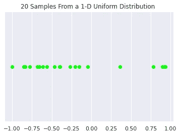
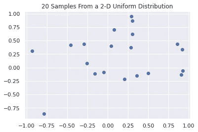
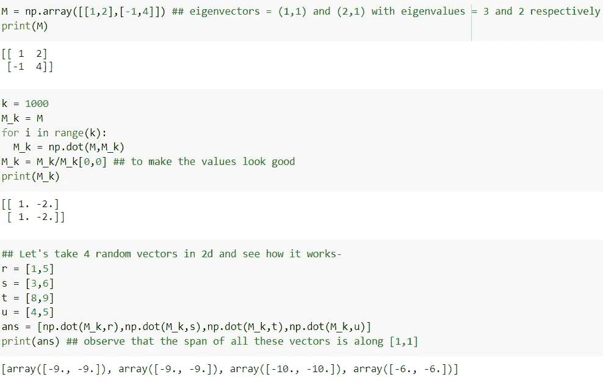
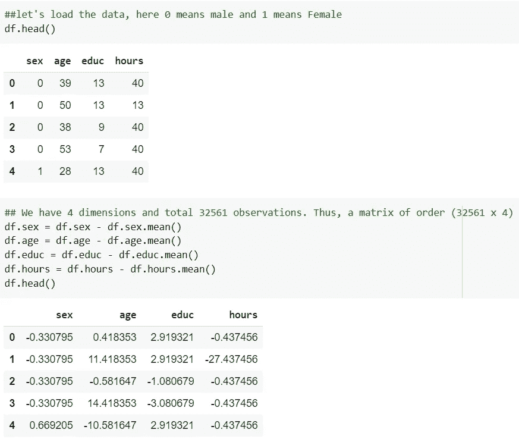
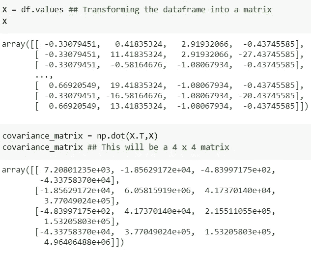
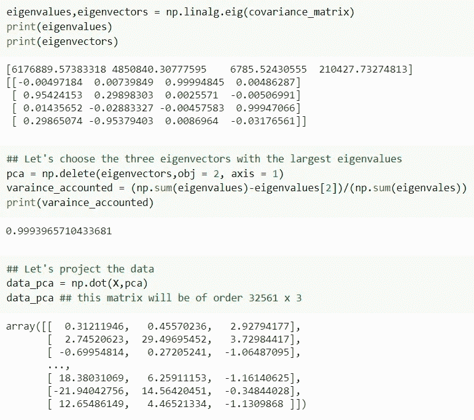
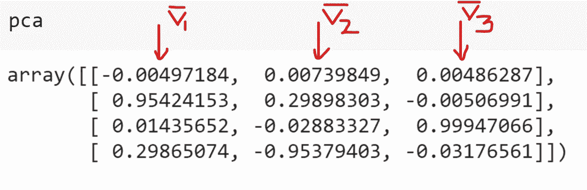
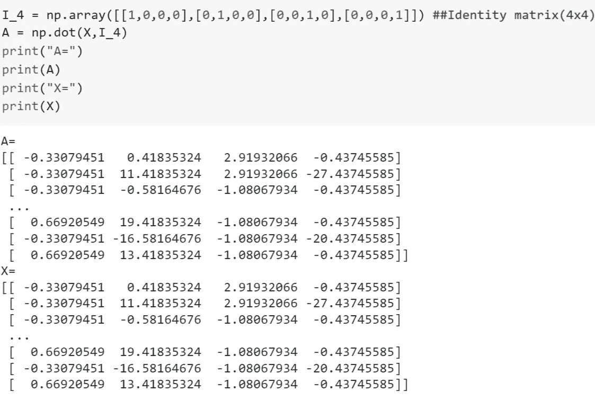

# 主成分分析的本质

> 原文：<https://towardsdatascience.com/the-essence-of-principal-component-analysis-pca-83eec584fd1c?source=collection_archive---------41----------------------->

## 深入探究 PCA 背后的直觉，完全涵盖数学和代码

西尔维·沙伦在 [Unsplash](https://unsplash.com?utm_source=medium&utm_medium=referral) 上拍摄的照片

# 概述:

*PCA 是最简单的基于真特征向量的多元分析。它最常用作一种降维技术，降低大型数据集的维数，同时仍能解释数据中的大部分差异。*看起来很可爱，不是吗？

通过这篇文章，我努力使 PCA 的思想变得直观。要理解这篇文章，你应该知道-初等线性代数和高中统计。那么，我们开始吧。

# 维度的诅咒:

维数灾难指的是处理多维研究的不利后果。让我们举一个简单的例子——考虑采样 N 个数据点，其中每个数据点是一个 d 维向量。现在，对于相同的 N，**数据变得稀疏，因为我们增加了维度**。想想看，在一条直线上随机分布 N 个点与在一个平面上随机分布 N 个点，两者中哪一个的密度更高？答案挺直观的，线(参考这些图)。

好吧，当我们向数据中添加维度时，我们使它变得稀疏，但是为什么这是一个问题呢？如果我们的数据缺乏足够的密度，我们永远无法确定我们的预测。对于我们来说，训练一个模型来预测相当准确的结果，数据必须得到很好的表示，否则我们就有过度拟合的风险。虽然我们生活在大数据领域，但密度的妥协只能通过数据(N)的指数级增长来解决，而这可能是不可用的。高维数据的另一个问题是，我们无法轻松地可视化 3 维以上的数据。**距离在更高维度中失去意义**。

因此，如果我们能够找到一种方法来减少数据的维数，同时保留大部分信息，我们将能够更有效地处理我们的数据。

# 特征向量:

这是线性代数中最吸引人的想法之一。通过将一个矩阵乘以一个向量，我们可以对该向量进行线性变换。如果你觉得你对基础线性代数的掌握有点松，我强烈建议你看 3b1b 关于[线性代数](https://www.youtube.com/watch?v=fNk_zzaMoSs&list=PLZHQObOWTQDPD3MizzM2xVFitgF8hE_ab)的系列。

一个非平凡向量的跨度在乘以一个矩阵后不变，这就是该矩阵的特征向量。现在，让我在这里澄清两件事，首先，跨度粗略地表示向量的方向，其次，虽然方向不变，但大小可以。本征向量被拉伸或压扁的程度，即相乘时幅度变化的因子，称为该本征向量的特征值。特征向量使线性变换易于理解。**它们是线性变换作用的轴**。现在，我们怎样才能为矩阵找到这样的向量呢？

考虑矩阵 m。设λ是矩阵 m 的特征值，v̅是矩阵 m 的特征向量

*因此，M v̅ = λ v̅*

*mv̅=(λI)v̅，其中 I 是单位矩阵*

*det(m—λI)v̅= 0*

*由于 v̅是非平凡矩阵*

*det(M—λI)= 0*

*对于满足此方程的所有特征值(λ)，求相应的特征向量(v̅)*

现在，我来告诉你一个离奇的事实——如果你把矩阵 M 乘以任意向量若干次，结果几乎是沿着特征值最大的特征向量的跨度！当我第一次遇到这个事实时，我大吃一惊，因为不管矢量是什么，答案的跨度都保持不变。

(M x M x M…x M) a̅ ≈ α v̅，其中α为常数，a̅为随机向量，v̅为最大| *λ|* (特征值)的特征向量。

(Mᵏ) a̅ ≈ α v̅，k 为大值

这里要注意的一件重要事情是，M^k 也是一个矩阵。因此，如果我们将一个矩阵乘以足够多的次数，我们最终会得到一个将每个向量变换到相同跨度的矩阵。

让我们来演示一下-

我建议您尝试自己编写这段代码，并观察改变 k 的值(保持它> 20)如何改变矩阵 M_k，但属性保留。

现在，让我们来看看这个看似荒谬的财产背后的原因。原因与下面的等式有关-

**mᵏ= s x(λᵏ)x 逆(S)** 即特征向量可以很容易地表示矩阵 m 的任意次幂。

λ是具有所有特征值的对角矩阵

S 是(M — λI)的零空间，对于所有λ，即矩阵 S，是所有特征向量的矩阵。

这个等式成立是因为-

m x S = S xλ；(根据特征值向量定义)

M x S x 逆= S xλx 逆

M = S xλx 逆(S)；(S x 逆(S) = I)

M x M = S xλx 逆 x S xλx 逆

M = S x(λ)x 逆(S)；(S x 逆(S) = I)

因此，这可以一次又一次地重复，以获得-

mᵏ= s x(λᵏ)x 逆(s)

然而，这个等式似乎并不能解释其中的神奇之处！是的……但是它藏在众目睽睽之下。

考虑一个向量 a̅ ∈ ℝ(n)，矩阵 m∈ℝ(n×n)。更新 a 的算法是-

a̅ = M x a̅

原来 a̅ = c1( v̅1 ) + c2 ( v̅2 ) + … cn ( v̅n)，其中 v̅i 为第 I 个最大特征值的特征向量，ci 为对应常数。特征向量跨越ℝ(n).

现在，在第 k 次迭代之后-

a̅=(mᵏ)x(C1(v̅1)+C2(v̅2)+…cn(v̅n))

=(s x(λᵏ)x 逆(S)) x (c1( v̅1 ) + c2 ( v̅2 ) + … cn ( v̅n))

= C1(λ₁ᵏ)( v̅1)+C2(λ₂ᵏ)( v̅2)+…cn(λₙᵏ)( v̅n)

将 RHS 除以λ₁ᵏ

对于 k→∞:**span(a̅)= v̅1**；(|λ1| > |λ2| > … > |λn|)

因此证明。

现在，我提出这个属性的目的(除了让你吃惊之外)是为了强调特征值-向量对的重要性。这么想吧，**每个特征向量对于解释矩阵中信息的重要性直接关系到它的特征值有多大**。

# 执行 PCA:

假设你对特征向量部分的最后一个语句没有意见，这里的大部分工作就完成了！剩下的就是几个基本公式了。

以下是执行 PCA 的步骤

1.  标准化您的数据。
2.  计算特征(维度)的协方差矩阵。
3.  计算特征值向量对，并按特征值降序排列。
4.  选择总数 n 的前 r 个特征值。

**方差计算=(第一个 r |λ|的和)/(所有|λ|的和)**

5.将数据投影到所选的特征向量上。

标准化数据集

计算协方差矩阵

找到特征值向量对并投影数据

关于特征向量，它们并不总是相互正交的。然而，如果矩阵是对称的，即矩阵的转置等于其自身，则这种矩阵的特征向量是正交的。注意协方差矩阵。对，是对称的！这意味着我们的特征向量相互正交。为什么这是一件好事？我把这个问题留给你去研究。请在评论区告诉我你的想法。

因此，使用主成分分析，我们将 4 维数据集转换为 3 维(正交的)，同时保留超过 99%的方差。

# 解读结果:

让我们来看看我们之前选择的 3 个特征向量-

现在，这些四维向量意味着什么？回想一下，我们之前有 4 个维度——性(a̅)、age(b̅、educ(c̅和 hours(d̅).所以，

v̅1=*-0.00497184***a̅**+*0.95424153***b̅**+*0.01435652***c̅**+*0.29865074***d̅**

因此，最终向量不沿着任何原始维度。它们是所有这些的线性组合。当我们投射数据时，这些向量成为我们的新维度(轴)。

让我们把我们的标准化数据矩阵(X)投影到一个单位矩阵(I_4)上，得到一个矩阵(A)，让这个想法更直观一些。

注意矩阵 A 和 X 是相同的。这是因为通过将 X 乘以一个单位矩阵，我们没有改变任何维度！

谢谢你能走到这一步。我希望这篇文章值得您花费时间，并且您现在已经直观地理解了 PCA。请在评论区告诉我你的建议和问题。

干杯！