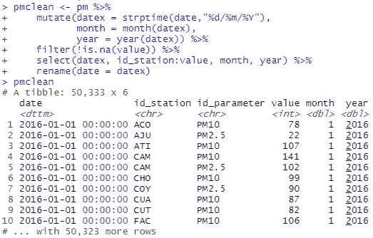

# 基本的 dplyr

> 原文：<https://towardsdatascience.com/the-essential-dplyr-cdf3057c1c6c?source=collection_archive---------41----------------------->


## 很多 R 班等着教这个包。幸运的是，你有互联网。

这个神秘命名的包是 R 中清理、组织和查看数据的救命稻草。许多教授等着教 dplyr，以支持教授基本的 R 方法作为基础，但这并不意味着您必须等着学习它。在本文中，我们将研究一些最省时的 dplyr 函数，并学习如何使用它们来操作数据集。

## 什么是 dplyr？

Dplyr 是由 Hadley Wickham 和 Romain Francois 编写的一个包，用于帮助您将原始表格数据处理成一个整洁的数据集，以便进行分析。在他 2014 年关于该包的前身 plyr 的论文中，Wickham 写道:

> 人们常说，80%的数据分析花费在清理和准备数据的过程中。

准备数据仍然需要时间，但是由于 dplyr 和其他 [tidyverse](https://www.tidyverse.org/) 软件包，我们可以比我们的前辈花费更少。在本文中，我将使用墨西哥城的空气质量数据集作为展示以下关键 dplyr 函数的基础:

*   **tible()**:产生一个[tible](https://cran.r-project.org/web/packages/tibble/vignettes/tibble.html#:~:text=Tibbles%20are%20a%20modern%20take,converting%20character%20vectors%20to%20factors).)而不是你的标准数据帧。
*   **mutate()** :使用其他函数创建新的计算字段。
*   **filter()** :通过指定要保留的行来过滤您的行。
*   **select()** :选择您希望保持其显示顺序的列。
*   % > %操作符允许管道。
*   **group_by()** 根据各个字段的值对数据进行分组。
*   **summary()**根据您建立的组汇总您的数据。
*   **inner_join()** 将返回第一个表中与第二个表中的值相匹配的所有行，以及两个表中的所有列。如果有多个匹配，将返回所有组合。这是 dplyr 包中包含的许多连接选项之一。
*   按特定字段对表格进行排序。它会自动按升序排序，除非使用了 **desc()** 。

## 展示墨西哥城的空气质量数据

我们将通过对墨西哥城的空气质量数据集执行一些初步的数据操作来查看 dplyr 包中的函数。下面的代码将从墨西哥城的空气质量监测网站下载 2016 年 1 月至 2020 年 4 月的[颗粒物](https://en.wikipedia.org/wiki/Particulates) (PM)浓度的数据。for 循环允许您通过编辑 z 向量来指定数据中包含的年份。

```
##getting the data
  data<- data.frame()
  z<-c(2016,2017,2018,2019,2020)
  for(i in z) {
    url <- paste("[http://www.aire.cdmx.gob.mx/opendata/promedios_diarios/promedios_](http://www.aire.cdmx.gob.mx/opendata/promedios_diarios/promedios_)",i,"_ps.csv", sep = "")
    data <- rbind(data, read.csv(url,header = T, skip = 8))
}
```


罕见晴朗天气下的墨西哥城，作者拍摄

**让我们从问题**开始。我想知道 2020 年 4 月的空气质量是否会因为冠状病毒的封锁而比往年好。这是一个相当复杂的问题，但为了快速了解这是否值得深入研究，我将 2020 年的月均值与前几年的月均值进行比较。

让我们通过将数据更改为 tibble 来查看数据的当前状态:

```
pm <- tibble(data)
pm
```


tibble 看起来比常规的数据框要好:输入它的名称，R 会给出维度、10 行数据预览以及每一列的类。关于数据集中的实际数据，我们可以看到，它包含了 PM10 和 PM2.5 的每日测量值，单位为[微克/立方米](http://www.aire.cdmx.gob.mx/opendata/catalogos/cat_unidades.csv)，分布在墨西哥城的多个站点。

为了回答我们的问题，我们需要做一些处理。

## 变异、过滤、选择、重命名和%>%

下面，我使用了 **mutate** 命令来创建一个日期时间(POSIXlt)格式的新日期字段，并为月份和年份创建单独的字段。我通过 **filter** 命令过滤数据，去掉所有 NAs，然后使用 **select** 重新排序字段。我使用 **rename** 将我的 datetime 字段 datex 重命名为“date”。

```
pmclean <- pm %>%
  mutate(datex = strptime(date,"%d/%m/%Y"), 
         month = month(datex), year = year(datex)) %>%
  filter(!is.na(value)) %>%
  select(datex, id_station:value, month, year) %>%
  rename(date = datex)
```



您可能已经注意到的另一点是 **% > %** 操作符。这个操作符是用 dplyr 包加载的，大致翻译为“then”。它允许我们将下一行的代码应用于 pm 数据集，而不是必须在每个函数中重写数据集名称，并将我们的更改分配给中间变量。这个过程被称为管道。

如果没有它，代码将如下所示:

```
##clean
pm2<- mutate(pm, datex = strptime(date,"%d/%m/%Y"), 
             month = month(datex), year = year(datex))
pm3 <- filter(pm2, !is.na(value))
pm4 <-  select(pm3, datex, id_station:value, month, year)
pmclean <- rename(pm4, date = datex)
```


结果是一样的，但是使用 **% > %** 操作符让我们用更少的击键次数就到达了那里，并且需要创建更少的中间变量，保持了我们工作空间的整洁。

## 分组依据和汇总

现在，我的数据集更整洁了，我想看看值字段的一些摘要信息。


这个总结没有告诉我太多，因为它包括 PM 10 和 PM 2.5 值。PM 10 和 PM 2.5 的行为、健康影响和监管阈值不同，放在一起分析没有太大意义。

幸运的是，dplyr 有一个简单的解决方案。要将我的数据分组，我可以使用 **group_by** 函数，按 id_parameter 字段分组。我还知道，我想将 2020 年每个月的平均值与过去几年相同月份的平均值进行比较，所以我也将按月份和年份分组。这对我的 pmclean 数据集不会有任何明显的影响，但是如果我使用**summary**创建一个新表，列出的函数将基于这些组进行计算。

这里我**用平均值、中值、最小值、最大值汇总**value 字段，并赋值给 pmsummary 数据表。请注意，该指定放置在管道的顶部。

```
pmsummary <- pmclean %>%  
      group_by(id_parameter, year, month) %>%
      summarize("mean" = mean(value), "median" = median(value), 
                  "min" = min(value), "max" = max(value))
```

结果是下面的表格。您可以看到，平均值、中值、最小值和最大值是针对月、年和参数的每个唯一组合计算的。


## 安排

**Arrange** 本质上与 Excel 中的 **sort** 一样。让我们用它来比较 2020 年前四个月的平均污染物浓度和前几年的相同月份。为此，我们将使用**过滤器**获得我们想要的参数和月份，然后我们将**按月份和平均值排列**结果。我在这里不这样做，但是你可以使用**排列**中的 **desc** 函数来按降序排列你的数据。

```
##PM10
  arrange(filter(pmsummary,id_parameter == "PM10" & 
                   month %in% 1:4),month, mean)
##PM2.5
  arrange(filter(pmsummary,id_parameter == "PM2.5" & 
                   month %in% 1:4),month, mean)
```


这里我们可以看到，2020 年 4 月确实有更低的 PM 10 和 PM 2.5 平均浓度，但在墨西哥城进入冠状病毒封锁之前，2020 年 1 月和 2 月也是如此。让我们从视觉上来看这些信息。


过去五年每月 PM 2.5(空心三角形)和 PM 10(实心圆圈)的平均浓度。2020 年是用珊瑚色绘制的，所以很醒目。

```
##Graph the summary data
    plot(pmsummary$month,pmsummary$mean, 
       col = ifelse(pmsummary$year == "2020", "coral1", "grey"),
      pch = ifelse(pmsummary$id_parameter == 'PM10', 19,2),
      xlab = "Month",
      ylab = "PM Mean Concentration (ug/m3)",
      cex = 2,
      type ="p" )
    legend("bottomright", c("PM10", "PM2.5", "2020"),
       col = c("grey","grey", "coral1"),
       pch = c(20, 2, 1))
```

这使得逐月观察趋势变得更加容易。有趣的是，与其他年份相比，2020 年 3 月的 PM 10 平均浓度相当平均，然后在 4 月急剧下降。对于 PM 2.5，我们看到从 2020 年 3 月到 2020 年 4 月略有增加。虽然远非确定，但我认为这个问题值得进一步分析。

## 与 dplyr 连接

dplyr 附带了许多 join 函数。它们包括标准的 inner、right 和 left 联接，以及允许您基于其他表过滤表的函数，如 anti_join()、semi_join()，甚至 nest_join，它允许您将一个表中的数据嵌套在另一个表的行中。


我们清洁的颗粒物质

比方说，我想查看我的车站级别的空气质量数据。我目前的数据是按电台分类的，但我不太了解这些电台标签的含义。幸运的是，墨西哥城也出版了他们的电台目录:

```
url <- "[http://www.aire.cdmx.gob.mx/opendata/catalogos/cat_estacion.csv](http://www.aire.cdmx.gob.mx/opendata/catalogos/cat_estacion.csv)"
datastations <- tibble(read.csv(url,header = T, skip = 1))
```


他们的台站数据为我们提供了每个台站的纬度、经度和海拔高度。让我们使用 **join** dplyr 函数之一将该信息添加到我们的主数据集。

pmclean 数据集中的每个值都应该有一个与之关联的站(测量该值的站),并且数据集中的每个站都应该在墨西哥城站目录中。这意味着我们可以做一个内部连接。我们希望加入站缩写，即 pmclean 数据集中的 id_station 和 stations 数据集中的 cve_estac。让我们解决这个问题，然后进行连接。

```
stations <- datastations %>%
   select(cve_estac:obs_estac)%>%
   rename(id_station = cve_estac)pmstations <- inner_join(pmclean,stations)
```


您可以看到，因为我在 stations 数据集中重命名了我的连接字段以匹配 pmclean 数据集中的字段，所以连接操作不需要我指定要连接的字段；它会自动选择匹配的字段。

## 多做数据科学

清理和操作数据并不是数据分析中最有趣的部分，但它是一个不一定很痛苦的关键过程。使用我们今天看到的数据集或使用 dplyr 附带的[数据集](https://dplyr.tidyverse.org/reference/)之一来熟悉这些函数。一旦你的工具包里有了它们，你就可以花更少的时间和眼泪去弄清楚如何操作你的数据，而有更多的时间去做数据科学。

本文中使用的所有代码都可以在[这里](https://github.com/jesselibra/dplyr/blob/master/dplyr_mexico_city.R)找到。