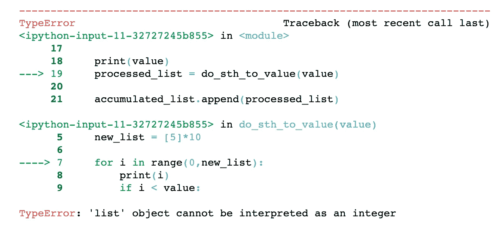
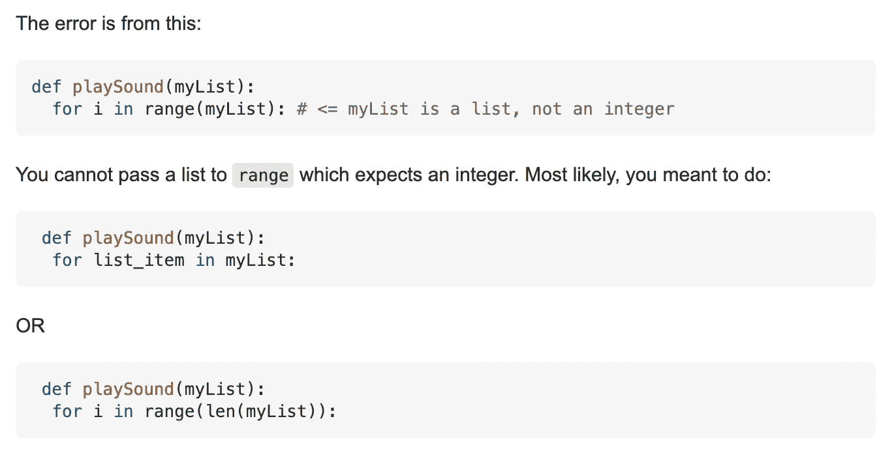
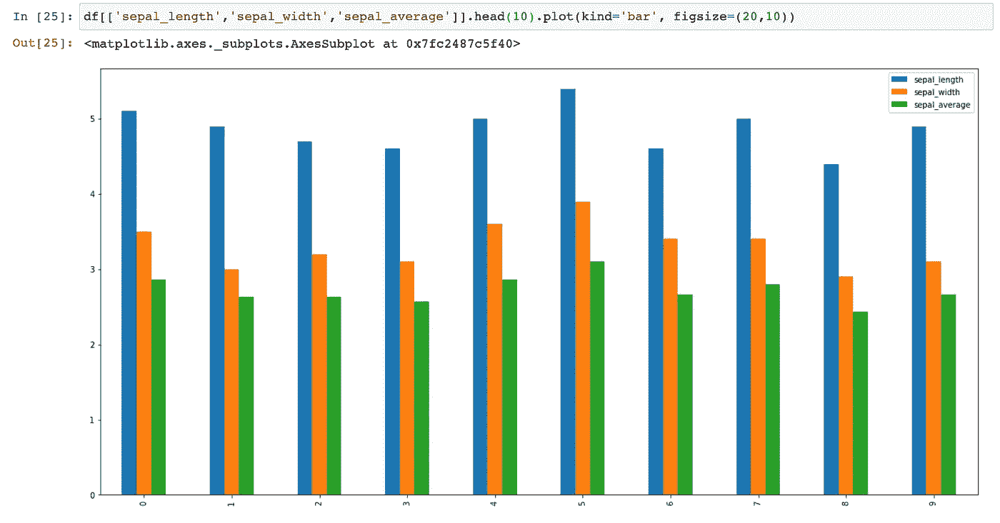
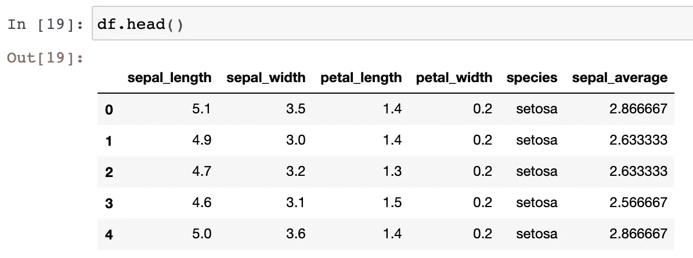
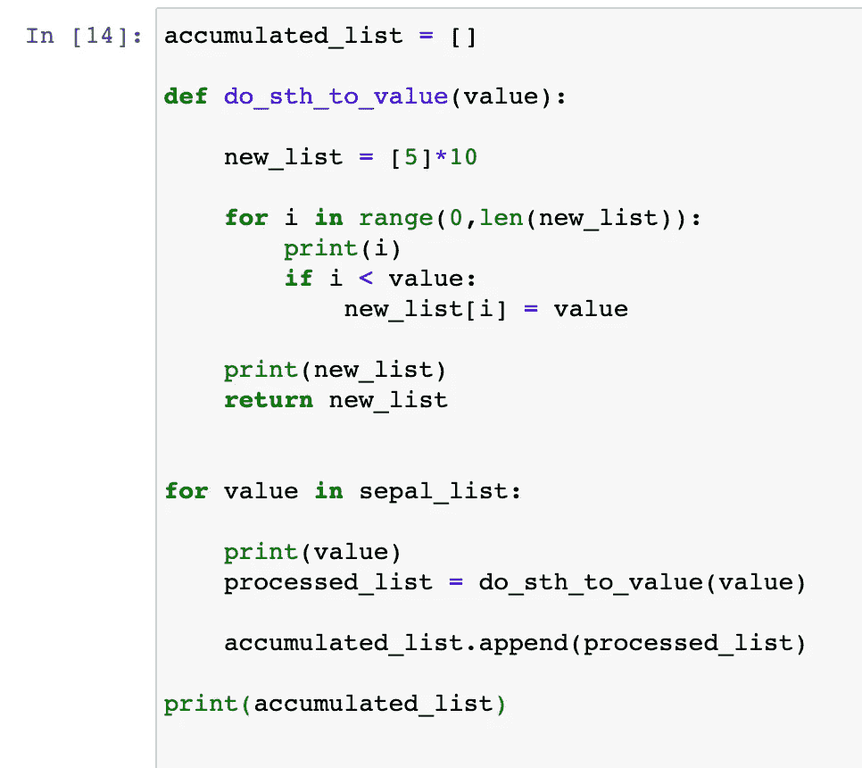

# 数据科学家调试和错误解决基本指南

> 原文：<https://towardsdatascience.com/the-essential-guide-to-debugging-and-error-resolving-for-data-scientists-4fd9bcc70810?source=collection_archive---------43----------------------->

## 更快地解决错误，有更多时间进行创造性工作

照片由 [**克里斯蒂娜·莫里洛**](https://www.pexels.com/@divinetechygirl?utm_content=attributionCopyText&utm_medium=referral&utm_source=pexels) 发自 [**像素**](https://www.pexels.com/photo/woman-programming-on-a-notebook-1181359/?utm_content=attributionCopyText&utm_medium=referral&utm_source=pexels)

调试是一个听起来很滑稽的词。这个词起源于最初的计算机时代，一个实际存在于计算机中的错误，它阻碍了计算机的功能。从那以后，它有了新的含义。现在，它意味着找到代码中问题的根源并解决它。

当您第一次开始编码时，调试代码或解决错误可能是最困难的事情之一。毕竟，教授如何编码的课程并没有为你提供找到问题根源并解决问题所需的工具。因此，当有抱负的数据科学家在代码中遇到问题时，他们会感到失落和困惑。

实际上一点也不复杂。您只需要确保遵循一些简单的程序来确定问题的根源。让我们看看它们是什么。

# 阅读错误

‍:我知道这听起来很明显，但是对于一个刚开始编程的人来说，把错误信息当成胡言乱语是很常见的。这导致他们没有利用这个错误消息的全部潜力，最终在试图找出问题时漫无目的地在代码中摸索。这就是为什么你应该做的第一件事，阅读，真正地阅读错误信息。很有可能，它会告诉你到底哪里出了问题。

让我们看一些例子:

在这种情况下，代码告诉我们，它找不到文件，因为它不存在。所以，我知道你的第一反应会是说，“不，文件在那里，我正在看”。不要慌张，重要的是理解这个信息意味着什么。不要担心，随着时间的推移，你会更好地认识到某些错误背后的含义，因为你会经常看到它们。

您的代码并没有说您是骗子，它只是说在您所说的位置找不到名为 iris-dataset.csv 的文件。这可能意味着:

*   您在文件名中输入了错误，或者
*   您的文件与笔记本不在同一个文件夹中。

因此，您可能需要:

*   确保名称书写正确(在本例中是 iris_dataset.csv，带有下划线而不是破折号),或者
*   添加该数据所在文件夹的名称。

另一个例子:

看起来很吓人，但是它告诉你的是在你的数据中没有这样一个名为“sepal_widt”的列。这可能意味着:

*   您忘记在数据框中包含所有需要的列，或者
*   你打错了。

我会在本文后面告诉你如何理解哪一种是这种情况。我选择了上面的两个例子，因为它们在数据科学工作中相当常见。但是阅读错误消息还有另一个技巧:跟踪错误。例如，在下面的例子中，我们得到一个 TypeError。

因此，TypeError 听起来非常抽象，但是我们可以通过回溯特性来跟踪错误，从而了解错误的原因。上面的箭头指向代码中导致这个错误的那一行。但是它并没有就此结束，因为它指向的错误发生在另一个函数内部。这段代码调用的函数。它用下面的箭头显示了函数内部出错的时间。这样，你就知道去哪里解决你的问题。

这里有一个小说明；此错误可能不是由回溯箭头指向的确切代码行引起的，而是由您在此代码的不同部分设置的值引起的。在本文中，我们将看到如何跟踪这一点。

# 谷歌一下这个错误，不管它看起来有多不寻常

当你第一次得到一个错误时，你可能会觉得你是地球上第一个得到这个错误的人。但是 99.999%的时候，除非你正在使用一个很少有人使用的框架或库，否则 Google 会给你一个答案。

你所要做的就是复制并粘贴你所看到的错误。例如，在前面的图像中，不要复制和粘贴整个消息，而只复制和粘贴“TypeError: 'list '对象不能被解释为整数”的部分。

这是我在谷歌上搜索这个错误时发现的。是的，这正是这段代码的问题所在。

谷歌错误有助于理解错误信息，有时也有助于找到解决方案。但是除了解决错误之外，通过阅读别人对这些错误的看法，你会学到很多东西。你编码得越多，得到的错误越多，修复得越多，你就越能理解他们通过阅读错误信息所表达的意思，最终你就越不需要咨询谷歌。

# 在 Jupyter 笔记本上，向后工作

在笔记本环境中工作意味着很容易运行部分代码并看到结果。我们不仅仅把我们的代码分成笔记本的不同单元，因为这很有趣。这是一种观察数据流并检查一切是否按预期顺利运行的方法。

因此，当您遇到错误时(或者一段代码没有输出您期望的结果)，您的下一步应该是追溯问题。

我所做的是打印我在某个单元格中使用的变量/数据帧，并将它们与我期望看到的进行比较。这包括用 df.head()检查值或用 df.dtypes 检查列的类型。

让我们看一个例子。假设我有一个包含花的萼片长度和萼片宽度的数据框。我创建了一个新的列，取这两个值的平均值。但是当我绘制它们时，我看到平均列的值意外地不在 sepal_length 和 sepal_width 值之间。很明显，出问题了。

蓝色条:萼片长度，橙色条:萼片宽度，绿色条:萼片值的平均值。

蓝色条:萼片长度，橙色条:萼片宽度，绿色条:萼片值的平均值。

然后我要做的是打印出我在这个图中使用的数据框，看看数据是什么样子的。查看数据，我发现萼片平均值并不反映萼片长度和萼片宽度的平均值。很可能这个新列的计算有问题。

是的，检查新的 average 列的计算，我看到我将总和除以 3，而不是 2。

当然，问题并不总是这么明显。同样的问题可能是由于我在设置 sepal_average 列的值后意外地更改了它的值而引起的。但是通过从问题中回溯并检查我在哪里修改了有问题的列的值，总是可以帮助我找到问题的根源。

# 为更复杂的代码编写打印件

有时你的代码可能有函数、循环和其他复杂的结构，让你很难手动追踪错误。在这种情况下，一种解决方法是使用 print 命令。让我们看一个例子:

比方说，当您运行这段代码时，accumulated_list 值看起来并不像您预期的那样，或者这段代码中的某个部分给了您一个错误，而您不理解它。在这种情况下，您可以将打印命令放在发生某种值转换的特定位置，以查看哪里出错了。

有了新增加的内容，您可以打印代码正在处理的值。您将能够观察到该值随着时间的推移发生了什么变化，以及中间列表(new_list)是什么样子的。它将帮助您确定事情开始变得出乎意料的确切原因，或者在触发错误之前变量的值是正确的。因此，给你更多关于如何解决问题的见解。

就是这样，仅仅通过使用这四种简单的方法来检查你的错误，你就可以更有效地调试你的代码。正如我在另一篇文章中所说，如果你需要一些时间来解决问题，或者在你习惯处理错误之前需要一些时间，不要担心。通过动手实践，你在训练你的大脑，每次都能越来越快地发现模式和解决问题。就我个人而言，我发现在网上调试和寻找答案是我目前知识的主要来源。所以不要让错误和问题让你气馁，坚持下去！

🐼想更多地了解熊猫吗？ [*获取我的免费熊猫小抄。*](https://www.soyouwanttobeadatascientist.com/pandas-cheat-sheet)