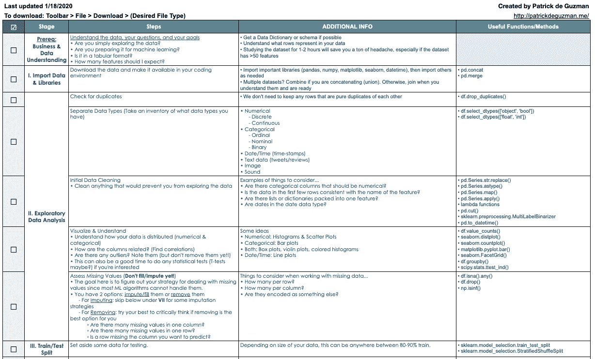
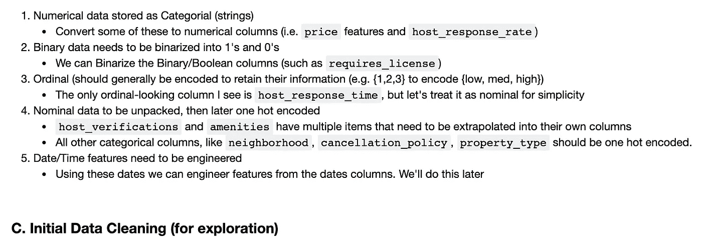
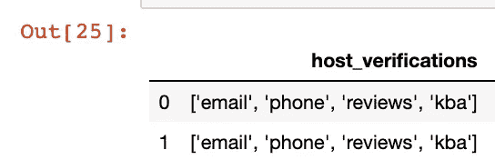
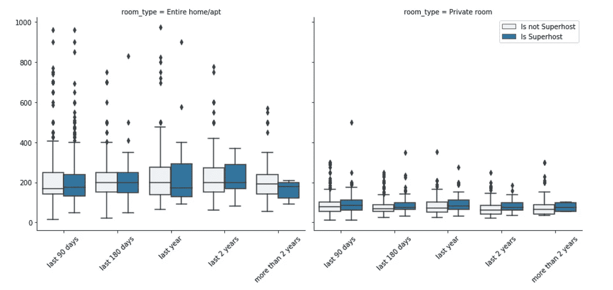
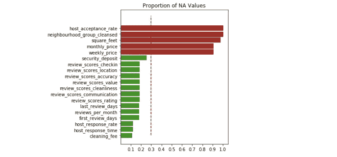
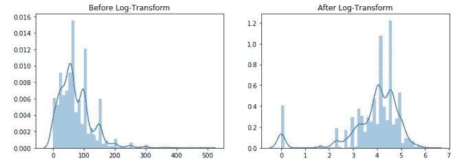

# 基本机器学习项目清单

> 原文：<https://towardsdatascience.com/the-essential-machine-learning-project-checklist-3ad6a7a49c37?source=collection_archive---------12----------------------->

## 引导你一步一步地从原始数据到工作的 ML 模型。

TL；博士？[点击此处](http://bit.ly/ml_proj_checklist)获取我的清单副本，以便在你的下一个 ML 项目中使用。[这个 Github 回购](https://github.com/pdeguzman96/data_cleaning_workshop)也包含一个。清单的 ipynb 模板和数据清理实验室，如果您想练习或了解如何使用模板，可提供解决方案。

# 为什么这很重要？

*你是否曾经尝试过真正的 Kaggle 竞赛(或其他 ML 副业)，并因为你仍在学习 ML、习惯 Python 库或对数据集的复杂性感到不知所措而感到失落？*

> 我当然有——很多很多次。

当我从事数据分析或 ML 项目时，最糟糕的感觉之一是陷入前 3-5 个小时的无方向编码，感觉自己进展缓慢，担心自己做出错误的决定。

这就是为什么我创建了这个清单！它应该放在你的办公桌附近或几下鼠标之外**作为参考**，以帮助你看到**全局**。

当您处理数据集时，可能会遇到很多挑战和障碍，如果您不习惯，很容易感到不知所措。如果你开始感到迷失，用这个清单作为你的北极星。

这是终极目标吗？ **绝对不是**。

你能以不同的顺序做事吗？ **是的，当然是**。

这张清单对你有帮助吗？是的，如果你喜欢把结构和秩序带入你的问题中。

# 这篇博文是写给谁的？

这是为任何人写的，要么是刚刚开始使用 Python 进行机器学习的人，要么是需要复习 ML 工作流的人。

在这篇博文中，我将解释在[清单](http://bit.ly/ml_proj_checklist)的每个阶段你应该做什么。

在[这个 Github Repo](https://github.com/pdeguzman96/data_cleaning_workshop) 中，我创建了一个*练习*。ipynb 和 a *解决方案*。ipynb 基于一个简单的 Airbnb 机器学习项目。我将给出几个来自*解决方案*文件的代码示例。如果您想继续学习，请下载。

## 让我们开始吧。

# 先决条件:业务和数据理解

我能听到你的眼睛在我身上转动。

*来吧，伙计。让我们进入编码部分*。

如果你坚持跳过这一步，那就继续吧，但是正确地做这件事会**节省你几个小时**和**头疼**、 ***我保证*** ！

## 第一:业务部分。

假设你的经理阿曼达给了你一个 Airbnb 数据集。它有 106 个功能，她告诉你，我们想更好地了解租赁清单。

**OK** 。首先，她想让我把它们分类吗？她想让我做一个仪表板吗？她想让我回答什么问题？目标是什么？

> 弄清楚你的目标是什么，并试着计划实现目标的不同方法。

## 第二:数据部分。

有没有可以打印或保存的数据字典或模式？利用这一点。

花 1-2 个小时了解这 106 个特性中的每一个。写下你打算删除的功能，名字没有直观意义的功能，以及看起来需要大量清理的功能。

这是事件级的吗？一个列表可以有多行，每一行都有一个时间戳和一个事件。或者这是单元级的，每行唯一地标识一个可出租的单元？

> 在你开始编码之前，先熟悉你正在做的事情。

理解并回答这样的问题会帮助你开始朝着正确的方向前进。就像踏入迷宫前先看地图一样。

# I .导入数据和库

将所有的导入放在分析的顶部是一个很好的做法。每当你需要一个还没有导入的库或函数时，回到顶部，在那里导入它。

现在导入数据集，如果您必须连接它们，请尝试等到完成探索性数据分析(EDA)后再进行连接。

# 二。探索性数据分析

由于篇幅较长，本节分为 5 小节。

你知道人们怎么说数据科学家花费高达 80%-90%的时间清理数据吗？**对，那主要是因为这部分。**

> 一定要慢慢来。这里要彻底。一旦你完成了这一部分，你就已经完成了 ML 算法的一半。

## A.检查重复项

请花点时间删除完全重复的行或调查数据集中的冲突 id。这很容易忘记，但这是你应该永远走的一步。

## B.分离您的数据类型

清点您的数据类型。通常，您可能会遇到 6 种数据类型，按频率降序排列。

1.  数字(可以是离散的或连续的)
2.  分类(序数、名词性和二进制)
3.  日期/时间
4.  文本
5.  图像
6.  声音

首先将数据分成数字数据类型和其他类型。这可以通过以下方式实现:

先浏览一下你的数字数据。最常见的情况是，这里唯一的问题是缺少值(我们将在后面处理)。

现在，看看你的分类数据。可能会有很多问题需要你去解决。其中一些是…

*   数字数据、二进制数据和日期/时间数据被输入为字符串
*   多个值被打包到一个要素中
*   功能的命名可能不正确
*   你认为听起来有用的功能似乎毫无意义

不要一看到问题就开始清理。我们不要操之过急。

> 把你现在能看到的问题列一个待办清单。你可能不会发现所有的问题，所以如果以后又有新的清洁问题出现，就把它加到这个列表中。

在我的*练习*笔记本里(如下图)，在我开始打扫之前，我花了一些时间写下这些。

Jupyter 笔记本截图。

## C.初始数据清理

***注意:*** *如果你把“填补缺失值”加到了你的清理待办事项中，现在就把它去掉吧。先别做。我将在后面的步骤中解释原因。*

一旦你有了一个全面的清洁待办事项清单，一次完成一个。下面是一个例子，说明我是如何解包一个具有多个值的特性的。

打包功能。

一旦你完成了清洁待办事项清单，是时候想象一下了。

## D.想象和理解

请注意，你在这一节中找到的事情能够并且将会发现你想要添加到清洁待办事项列表中的事情。

如果您确定了想要应用于数据的任何异常值或转换，您现在可以*应用它，但是最好在您将数据分成训练和测试之后再做。*

如果需要，可以用直方图、分布图或条形图检查数据的分布情况。也许探索特征之间的关系。

> 使用这一部分，看看您能否回答最初向您提出的业务问题。你还不能执行任何机器学习，但并不是所有的问题首先都需要机器学习。

利用像 Matplotlib 或 Seaborn 这样的数据库。也许可以使用散景或 Plotly 探索交互式可视化。世界是你的。

这里有一个例子，说明我是如何试图理解评论的新近性和 Airbnb 房源的定价之间是否存在某种关系的。

## E.评估缺失值

在我们离开 EDA 之前，我们必须解决另一个问题:缺少值。除非你使用像 [XGboost](https://xgboost.readthedocs.io/en/latest/) 这样的高级算法，否则你必须处理丢失的值，这样你的数据才是 ML 友好的。

简单地说，你有两个选择:删除或估算(又名填充)。

在这一部分中，如果你认为合适的话，删除缺失的值，然后制定策略来填充它们，**但不要估算它们**。

一般来说，将缺失值的插补视为您想要调整的另一个超参数是一种很好的做法。因此，在对数据进行训练/测试分割后，您需要运行插补策略。如果您愿意，也可以用同样的方式处理缺失值的删除(即，在训练/测试分割后删除缺失值)。

> 这样，当您在验证集上测试整个机器学习工作流时，您还可以看到更改插补或移除策略如何影响工作流的性能。

让我们回顾一下我们的选择:

## 1.移除它们

*   特定特征中是否有许多缺失值？选择一个阈值(比如说 70%)，如果你觉得这些特性没有价值，就去掉它们。
*   特定行中是否有许多缺失值？首先，调查它们可能丢失的原因，以防您能想到行丢失值的合理解释。如果你觉得它们没有价值，扔掉它们。
*   哪些行缺少您要预测的目标要素？监督学习方法需要一个标签，所以删除不包含目标变量的行。

红色的特征可能应该被移除。

**2。估算它们**(现在制定策略，以后估算)

*   根据你的知识从其他特征推断它们的值
*   数值？用平均值或中值填充很简单。
*   绝对的？填写最频繁的。
*   想要挑战吗？研究使用机器学习来*预测*你丢失的价值观。Scikit-learn 的[迭代输入器](https://scikit-learn.org/stable/auto_examples/impute/plot_iterative_imputer_variants_comparison.html)很有意思。

对于您使用的每个策略，记下您希望每个策略应用于哪些功能。这使得分割数据后的插补更加容易。

## 太棒了，现在我们完成了项目的 EDA 部分。

# 三。训练/测试分割

通常将 80%-90%的数据用于训练/验证，而将剩余的数据用于测试(取决于你有多少数据)。

如果您想要使用交叉验证或 K-Fold 交叉验证，请在以后选择模型或调整模型时将验证数据与训练数据分开。

> 从现在开始，你所做的一切都可以被评估和调整。调整并不仅限于模型超参数。

# 四。准备 ML

既然您已经将数据分成了训练和测试，我们需要将数据转换成 ML 友好的格式。这一部分分为 4 个部分，在它结束时，你已经为机器学习做好了准备。

## A.处理缺失数据

现在，我们执行插补策略，确保您的训练和测试数据中不再有缺失值。

提示:使用 scikit-learn 的 SimpleImputer()或其他估计器来填充您缺少的值。使用这些估算器/变形器可以让您将它们*****适合您的训练*** *数据* ***然后*** *使用它们将* ***变换*** *您的* ***训练和测试数据*** *。***

**这里有一个用零填充一组特征的例子…**

**请注意，在实践中，我们可以一次估算整组特征。在*练习* .ipynb 中，为了简单起见，一次只针对一个特性。**

## **B.特征工程**

**一旦您处理好了所有丢失的值，就可以利用这一部分来设计更多您认为对您的 ML 模型有用的特性。**

**同样，把它当作一个您可能决定要调整的超参数。**

> **与广泛的模型超参数调整相比，特征工程有时更能改善模型。**

**这里有一个简单的例子:**

**请注意，每当您设计自己的特征时(特别是，如果您执行除法或对数运算)，您就有可能创建无效的无穷大值或 NA 值。**

## **C.转换数据**

**一旦您对所拥有的特性感到满意，现在您必须调整/缩放/转换您的数字变量，或者将您的所有分类或文本特性转换为数字。**

**让我们一次看一个:**

## ****数值数据****

**如果您有非常倾斜的数据，对数变换或平方变换可能是一个好主意，使您的数据看起来更正态分布。**

****

**清理费的对数变换。**

**如果您怀疑离群值对模型的性能有负面影响，现在就删除离群值。**

**并非所有的 ML 算法都要求特征在相同的尺度上，但有些算法要求(线性回归、神经网络、K-Means 聚类等)。).如果你是这种情况，你必须缩放你的功能。一些选项包括标准化、规范化和最小-最大缩放。**

## **分类数据**

**通常有三种类型的分类数据，下面是您如何处理每一种数据:**

1.  **名义上的(如红色、绿色、蓝色):类别没有固有的顺序。我们可以使用 sklearn 的 MultiLabelBinarizer(如果值被压缩到一个特性中)或 OneHotEncoder(如果特定特性的每一行只有一个类别)这样的转换器对这些特性进行热编码。**
2.  **序数(例如，低、中、高):通过将这些特征编码为序数(例如，1、2、3)，尝试保持数据中的自然顺序。你可以自己创建一个[自定义转换器](/custom-transformers-and-ml-data-pipelines-with-python-20ea2a7adb65)来将这些值映射到一个期望的数字，或者使用 sklearn 的 OrdinalEncoder。**
3.  **二进制:如果你还没有处理过你的二进制特征，使用 sklearn 转换器，比如 LabelBinarizer 或者 MultiLabelBinarizer，将它们编码为 0 或者 1。**

## **文本数据**

**无需深入自然语言处理领域，在处理文本数据时，通常可以采取以下基本步骤:**

1.  **使用 nltk 的 word_tokenize 或 sentence_tokenize 对文本进行标记。将文本数据标记化就是将单词、表情符号等分解成它们自己的单独的字符串/对象，而不是一个大字符串。**
2.  **使用 nltk 的停用词语料库移除停用词。**
3.  **词干或词汇化你的词汇。词干是指去掉对单词没有太大意义的字母(例如，“-ing”、“ed”等)。).词汇化完成了词干提取，但是计算量更大。**
4.  **将令牌转换为包含令牌计数或令牌的 TF-IDF 值的矩阵。**

## **D.特征选择**

**最后，现在是我们执行一些降维的时候了。**

> **这不仅可以提高模型的预测性能，还可以减少计算时间。**

**以下是一些想法:**

*   **[方差阈值](https://chrisalbon.com/machine_learning/feature_selection/variance_thresholding_for_feature_selection/):忽略方差低的特征，因为方差高的特征通常包含模型的大部分信息。**
*   **移除高度相关的特征:识别具有高度相关的成对特征，并移除其中之一。**
*   **类别特征无关性？使用[卡方测试](/chi-square-test-for-feature-selection-in-machine-learning-206b1f0b8223)删除与目标特性不相关/无关的特性。**
*   **数字特征无关性？使用[ANOVA F-statistics](/anova-for-feature-selection-in-machine-learning-d9305e228476)来确定可能与目标特征无关的特征。**
*   **[递归消除特征](/feature-selection-in-python-recursive-feature-elimination-19f1c39b8d15)**

**以下是移除高相关性要素的示例:**

## **一旦你完成了特征选择，我们就正式准备好机器学习了！**

## **接下来的部分很简短，因为它们只描述了数据准备充分后要采取的基本步骤。**

# **动词 （verb 的缩写）挑选你的模特**

**根据您的问题，选择您认为有效的适当模型。**

****

**图信用:[此处](/which-machine-learning-model-to-use-db5fdf37f3dd)**

# **不及物动词型号选择**

**一旦你选择了一些候选模型，使用 K-Fold 交叉验证等方法来确定 2-3 个最有希望的模型！**

# **七。模型调整**

**使用标准技术，如网格搜索或随机搜索，以确定性能最佳的超参数。**

**如果你准备好了，探索像 [hyperopt](https://github.com/hyperopt/hyperopt) 这样的库，它们利用贝叶斯统计来调整你的模型。这基本上是一种“智能”随机搜索，也就是一种“更快”的网格搜索。**

# **八。挑选最好的模型**

**展开，就大功告成了！**

# **总结想法**

**注意这篇博文是如何 90%的数据清洗、探索和预处理，但只有 10%的机器学习。**

**当你开始一个机器学习项目时，可能会觉得需要*永远*才能达到一个简单的工作模型。尝试不同的模型、了解高级超参数调整等非常有趣。但是在你到达那个点之前，在数据集里磨来磨去会感觉*灵魂枯竭*。**

**清洁和预处理并没有被浪漫化为十年来最性感的技能。然而，我希望这已经向你展示了当你不得不这样做的时候，保持有条理和从容不迫是多么的重要和复杂。**

**如果你已经写了这么多博文，感谢你的阅读！我希望你喜欢这个并从中有所收获。**

**请记得查看此处的清单[或](http://bit.ly/ml_proj_checklist) [GitHub repo](https://github.com/pdeguzman96/data_cleaning_workshop) 中的练习实验室、解决方案文件和清单附件。ipynb 模板。**