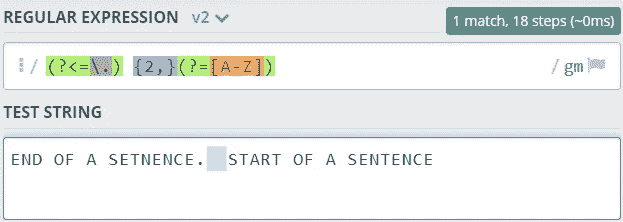
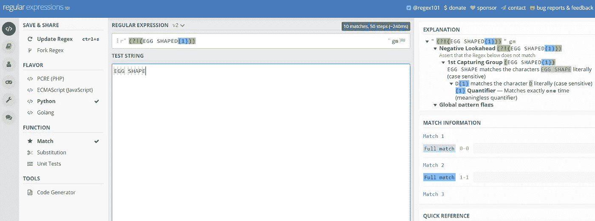
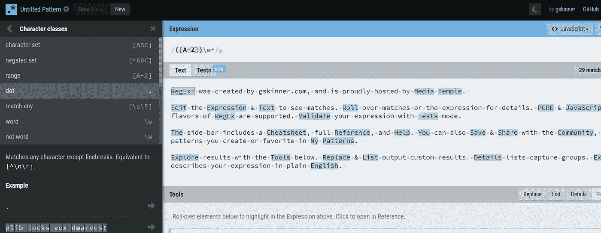
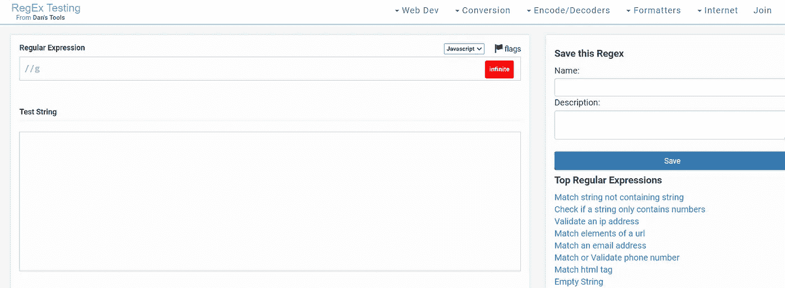

# 正则表达式的要点

> 原文：<https://towardsdatascience.com/the-essentials-of-regular-expressions-b52af8fe271a?source=collection_archive---------38----------------------->

## 它们是什么，你应该知道的特殊角色和帮助你建立它们的资源



它看起来有点像 Gobbly-glook，不是吗？来源:https://regex101.com/

不可避免地，一个人可以进入软件工程的各种方式导致我们许多人学习(在这种情况下不是学习)各种不同的概念。也许软件工程师能够理解和利用的最有用的概念之一是正则表达式。你可能之前遇到过它们，已经被你面前看到的字符完全迷惑了，或者你已经使用过它们，想要获得更全面的了解。本文旨在定义什么是正则表达式，正则表达式的基础以及如何使用它们，并为测试正则表达式和进一步学习提供有用的资源。

**定义正则表达式**

正则表达式(或简称为 regex)允许我们定义和设置规则来检查一个文本字符串中是否存在某个字符模式。正则表达式帮助我们匹配、定位和管理文本，提供了一种快速且相对简单的方法来操作数据，尤其是在大型复杂程序中。

正则表达式:用于检查文本字符串中模式存在与否的字符序列或模式

让我们以电子邮件地址为例。当你注册 Medium.com 时，你需要提供一个电子邮件和密码。在幕后，Medium.com 应该(你永远不知道)使用正则表达式来验证电子邮件地址的格式是有效的，或者密码是有效的。通常情况下，它会显示一条烦人的小消息，上面写着:“您的密码不包含下列特殊字符之一:？,!,.、"、'等。".举个简单的例子，我们可以使用下面的正则表达式来过滤以“@gmail.com”结尾的文本字符串中的电子邮件:

(@gmail。*\.com$)

实际上，这可能不是正则表达式的实际用途，但它展示了正则表达式测试字符串匹配特定字符的能力，在本例中，文本字符串以“@gmail.com”结尾。

# 正则表达式基础

正则表达式是由字母和字符组合而成的。简单来说，如果你想测试单词“苹果”或“梨”,你只需输入:

```
r" appler" pear
```

第一个测试中包含单词“apple”的字符串或第二个测试中包含单词“pear”的字符串都可以通过。从这个意义上说，大多数字母和字符都是匹配的，但是有些字符和特殊字符在正则表达式中有特定的含义，下面列出了这些字符，并将进一步详细讨论:

*   元字符
*   特殊序列
*   转义序列
*   字符类别
*   事件指示器
*   定位锚

我们还将讨论正则表达式中贪婪与非贪婪匹配的概念。这看起来确实涵盖了很多内容，但是不要担心，因为在本文的底部有一个摘要，其中包括关键的定义，以及各种帮助您创建和记住正则表达式的资源。

## 元字符

元字符是正则表达式中具有特殊含义的字符。下表显示了一些常见的正则表达式元字符以及每个元字符的定义:

```
**Metacharacter** | **Description**.               Finds any single character 
^               Start of string
$               End of string
*               Matches zero or more times   
+               Matches one or more times
?               Matches either 0 or 1times
{}              Matches all inside a set amount of times 
[]              Specifies a set of characters to match
\               Escapes metacharacters to match them in patterns
|               Specifies either a or b (a|b) 
()              Captures all enclosed
```

为了帮助您进一步理解每个元字符本身，下面是每个元字符的实例

```
.**Regular Expression**
 r” .**Test String**
 word
```

在本例中，元字符“.”将匹配测试字符串中的任何字符。因此，测试字符串“word”在所有情况下都会通过。

```
^**Regular Expression**
 r” ^word**Test String**
 word
```

元字符“^”匹配字符串的开头，不消耗任何字符。这意味着正则表达式在测试字符串的开头测试“word”。如果我们将测试字符串改为“aword”而不是“word ”,那么测试字符串将不匹配正则表达式，因为“word”不在字符串的开头。

```
$**Regular Expression**
 r” word$**Test String**
 word
```

在本例中，元字符测试测试字符串末尾的“word”。与上面相反，如果我们将测试字符串更改为“aword ”,那么测试字符串将会通过，因为“word”在字符串的末尾。

```
+**Regular Expression**
 r” a+**Test String**
 aa
```

当元字符“+”测试一个或多个连续字符时，测试字符串“aa”将通过，因为正则表达式已经识别了两个“a”字符。

```
?**Regular Expression**
 r” ba?**Test String**
 ba b a
```

元字符“？”将测试一个字符一次或多次。在这个上下文中，正则表达式测试字符“ba”或更多次，而不是字符“a”本身。在文本字符串“ba”中，当它与“ba？但是“b”也会通过，因为正则表达式测试的是后面没有特殊字符的字符“b”。

```
[]**Regular Expression**
 r” [abc]**Test String**
 aa bb ccc
```

方括号元字符也称为字符类，用于测试括号中的一组字符。因此，测试字符串将完全通过，因为“a”、“b”和“c”都被指定为方括号内的字符。

```
\**Regular Expression**
 r” \Ahello**Test String**
 hello
```

反斜杠元字符将在后面更详细地讨论，但它本质上表示一个特殊的序列。在本例中，“\A”指定了一行的开始，因此“hello”将通过测试。

```
|**Regular Expression**
 r” a|b**Test String**
 a hello b
```

“|”正则表达式表示或，该正则表达式指定字符“a”或“b”。因此，测试字符串将匹配测试字符串中的“a”和“b ”,但不匹配单词“hello”或空格字符。

```
{}**Regular Expression**
 r” a{3}**Test String**
 aaa
```

花括号元字符指定一个字符出现的次数。在这个例子中，正则表达式寻找测试字符串提供的 3 个连续“a”字符的模式。

```
(…)**Regular Expression**
 r” (abc)**Test String**
 a b abc
```

这与括号中的正则表达式相匹配，从字面上表示一个组的开始和结束。本例中的测试字符串不会匹配字符“a”或字符“b ”,但会匹配字符“abc”。

## 特殊序列

一个特殊的序列是反斜杠 **'\'** ，后跟下面列表中的一个字符，每个字符在正则表达式中都有特殊的含义:

```
**Special Sequences** | **Description**\A                  Matches character at beginning of string\b                  Matches character at beginning or end\B                  Matches character NOT at start or end\w                  Matches any word character\W                  Matches any non-word character\d                  Matches any digit, ie. 0-9\D                  Matches any non-digit character\s                  Matches any whitespace character\S                  Matches any non-whitespace character\0                  Matches any NULL character \n                  Matches any new line character\f                  Matches any form-feed character\t                  Matches any tab character\v                  Matches newlines and vertical tabs\Z                  Matches specified character at end of a string
```

## 转义序列

转义序列用于匹配正则表达式中的特殊字符。这意味着我们可以使用带有前缀“\”的特殊字符。比如说；

```
**Escape Sequence** | **Description**\.                Matches “.”
\+                Matches “+”
\(                Matches “(“
```

## 字符类别

字符类在正则表达式中指定要在方括号之间匹配的字符。它们允许我们在一个文本字符串中找到一系列字符。以下是一些常见的括号以及允许我们在正则表达式中指定的内容的描述:

```
**Brackets** |    **Description**[abc]           Finds any character within the brackets[^abc]          Finds any character NOT within the brackets[a-z]           Matches any characters between a and z[^a-z]          Matches any character excpet those in range a-z[a-\A-Z]        Matches any character in range a-z or A-Z[0-9]           Finds a digit within the brackets[^0-9]          Finds a digit NOT within the brackets[(]             Matches the literal '('
```

例如，如果您想要匹配“a”或“e”，请使用[ae]。如果我们将世界指定为“hello ”,那么“hello”或“hello”将匹配。字符类是正则表达式的一种非常常见的用法，在本文开头使用的电子邮件示例中，我们可以测试用户意外输入“@gmeil.com”而不是“@gmail.com”的情况。

## 出现指示符(或重复运算符)

上面提到的一些元字符也属于出现指示符的范畴。这些本质上是元字符，它们匹配字符串中一个字符、字符组或字符类的多个实例。一个正则表达式中允许有多个出现指示符。这些指标列举如下:

```
**Occurrence Indicators** |  **Description**+                         Matches one or more times?                         Matches zero or one time*                         Matches zero or more times{n}                       Matches exactly *n* number of times{n,}                      Matches at least *n* number of times{n,m}                     Matches from *n* to *m* times{,n}                      Matches up to *n* times
```

## 定位锚

锚点不匹配任何字符，而是匹配一个位置，通常在字符之前、之后或之间。

```
**Anchors** |    **Description**^               Start of string$               End of string\A              Start of string\Z              End of string\b              Matches between start/end of a word \B              Inverse (non-start or non-end of a word)
```

## **贪婪 vs 非贪婪匹配**

默认情况下，重复是*贪婪操作符*，意味着首先匹配尽可能多的字符。这意味着如果您测试了以下正则表达式:

```
**Regular Expression** {START}.*{END}
**Test String** {START} Hello world 2{END} and {START} hello world 2{END}
```

正则表达式将返回一个完全匹配:

```
**Full Match**: {START} Hello world 2{END} and {START} hello world 2{END}
```

然而，我们可以通过添加一个额外的“？”来解决这个问题经过重新分配，经营者限制其贪婪。现在，当我们用相同的测试字符串测试下面的正则表达式时，我们实际上返回了两个匹配。

```
**Regular Expression** {START}.*?{END}
**Test String** {START} Hello world 1{END} and {START} hello world 2{END}**Match 1**: {START} Hello world 1{END}
**Match 2**: {START} Hello world 2{END}
```

既然我们已经完成了正则表达式和所使用的不同元字符的 whistlestop 之旅，接下来要做的事情就是练习。下面是一些资源，希望能帮助你创建和测试你的正则表达式。

# 资源

## 正则表达式测试器

有各种各样的资源可以用来测试正则表达式，我在下面列出了其中的一些。它们对于快速编写和验证正则表达式非常有用，但是您应该通过将正则表达式合并到正在构建的解决方案的测试中来对表达式本身做进一步的测试。

*   regex 101—[https://regex101.com/r/22QfRq/2](https://regex101.com/r/22QfRq/2)



RegEx101

也许是我最喜欢的正则表达式编辑器，RegEx 提供了一个干净易用的用户界面。在左侧，您可以指定表达式将使用的语言，在中间，您可以构建和测试表达式，在右侧，您可以参考快速参考手册。

*   https://regexr.com/



regexr.com

regexr 对于 JavaScript 和 PCRE 正则表达式非常有用，它提供了一个简单的用户界面，左边是一个参考指南，右边允许您测试表达式。这个编辑器有些局限性，因为它只能测试 JavaScript 和 PCRE。

*   https://www.regextester.com/



regextester.com

另一个有用的编辑器 regextester 允许你编写和保存正则表达式，也可以点击有用的超链接来显示普通正则表达式的例子。

归根结底，选择正则表达式编辑器很可能取决于个人偏好。我最喜欢的是 regex101，这绝不是一个详尽的编辑器列表，所以值得一看。

## 正则表达式文档

同样，对于正则表达式测试器，也有各种参考指南可以帮助您构造正则表达式。

*   微软—[https://docs . Microsoft . com/en-us/dot net/standard/base-types/regular-expression-language-quick-reference](https://docs.microsoft.com/en-us/dotnet/standard/base-types/regular-expression-language-quick-reference)
*   w3Schools(Python)——[https://www.w3schools.com/python/python_regex.asp](https://www.w3schools.com/python/python_regex.asp)
*   w3Schools(JavaScript)——[https://www.w3schools.com/jsref/jsref_obj_regexp.asp](https://www.w3schools.com/jsref/jsref_obj_regexp.asp)
*   Python 正则表达式备忘单—[https://www.debuggex.com/cheatsheet/regex/python](https://www.debuggex.com/cheatsheet/regex/python)
*   JavaScript Regex cheat sheet—[https://www.debuggex.com/cheatsheet/regex/javascript](https://www.debuggex.com/cheatsheet/regex/javascript)
*   Regex 备忘单—[https://www.debuggex.com/cheatsheet/regex/](https://www.debuggex.com/cheatsheet/regex/javascript)PCRE

# 摘要

## 概观

*   正则表达式是描述正则表达式引擎试图匹配的字符模式的文本字符串
*   正则表达式允许我们检测、提取、替换和匹配字符串，以便从文本中提取关键信息
*   有各种各样的正则表达式参考指南和在线编辑器可供使用，它们允许您在将正则表达式合并到您的解决方案之前对其进行测试

## 特殊字符:

*   **元字符**:具有特殊含义的字符
*   **特殊序列**:反斜杠“\”后跟一个特定字符
*   **转义序列**:用于匹配正则表达式中的特殊字符
*   **字符类**:在方括号内指定要匹配的字符
*   **出现指示符**:匹配一个字符的多个实例的元字符
*   **定位符**:匹配一个位置，通常在字符之前、之后或之间。

如果你已经花时间阅读这篇文章，那么感谢你这样做。希望这对您有所帮助，参考资料部分可以指导您进一步的学习。