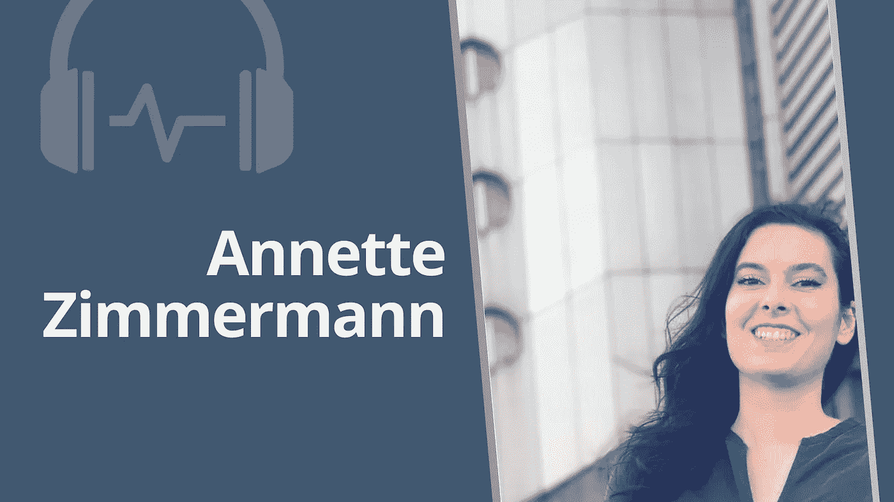

# 艾的伦理学

> 原文：<https://towardsdatascience.com/the-ethics-of-ai-a480544c7c7a?source=collection_archive---------45----------------------->

## [苹果](https://podcasts.apple.com/ca/podcast/towards-data-science/id1470952338?mt=2) | [谷歌](https://www.google.com/podcasts?feed=aHR0cHM6Ly9hbmNob3IuZm0vcy8zNmI0ODQ0L3BvZGNhc3QvcnNz) | [SPOTIFY](https://open.spotify.com/show/63diy2DtpHzQfeNVxAPZgU) | [其他](https://anchor.fm/towardsdatascience)

## 安妮特·齐默曼在 [TDS 播客](https://towardsdatascience.com/tagged/tds-podcast)上

要选择章节，请访问我们的 Youtube 视频[这里](https://www.youtube.com/watch?v=xFhycoHHTfU&feature=youtu.be)

*编者按:这一集是我们关于数据科学和机器学习新兴问题的播客系列的一部分*，*由 Jeremie Harris 主持。除了主持播客，Jeremie 还帮助运营一家名为*[*sharpes minds*](http://sharpestminds.com)*的数据科学导师初创公司。你可以听下面的播客:*

收听[苹果](https://podcasts.apple.com/ca/podcast/towards-data-science/id1470952338?mt=2)、[谷歌](https://www.google.com/podcasts?feed=aHR0cHM6Ly9hbmNob3IuZm0vcy8zNmI0ODQ0L3BvZGNhc3QvcnNz)、 [Spotify](https://open.spotify.com/show/63diy2DtpHzQfeNVxAPZgU)

随着人工智能系统变得越来越强大，它们被用来解决越来越多的问题。

以计算机视觉为例。不到十年前，计算机视觉算法最先进的应用之一是对邮件上的手写数字进行分类。然而今天，计算机视觉正被应用于从无人驾驶汽车到面部识别和癌症诊断的方方面面。

实际上有用的人工智能系统现在已经坚定地从“如果会怎样？”领土到“现在怎么办？”领土。随着越来越多的我们的生活由算法管理，越来越多来自计算机科学和工程以外领域的研究人员开始注意到这一点。其中最引人注目的是哲学家，他们中的许多人担心将我们的决策外包给机器所带来的伦理影响，我们常常无法理解甚至解释这些机器的推理。

人工智能伦理学领域最重要的声音之一来自 Annette Zimmermann 博士，她是哈佛大学卡尔人权政策中心的技术和人权研究员，也是约克大学 T2 分校的哲学讲师。Annette 的很多工作都专注于探索算法、社会和治理之间的重叠，我有机会与她坐下来讨论她对机器学习偏见、算法公平和人工智能伦理大局的看法。

以下是我们谈话中我最喜欢的一些带回家的东西:

*   机器学习问题经常被框定为工程问题，而不是哲学问题。因此，如果它们出错了，我们倾向于考虑技术解决方案(“我们应该增加数据集还是尝试不同的算法？”)而不是更基本的问题(“也许这不是自动化系统开始的合适用例？”).出于这个原因，*不部署*有争议系统的选择往往没有得到应有的重视。
*   工程师和数据科学家没有意识到，他们设计、选择并输入到模型中的功能成为了这些模型观察世界的镜头。一个应用于一组不同工程特征的模型确实会以不同的方式看待这个世界——以及这种新视角所带来的所有偏见。因此，与普遍持有的观点相反，机器学习中的偏见不仅仅来自数据集:我们选择标记为“相关”或“有用”的特征直接反映了我们的信念和价值观。
*   人工智能系统经常创造出近乎临床客观的假象。毕竟，我们倾向于认为，如果一个决策是自动化的，这难道不会从过程中消除人类的主观性——从而消除偏见——吗？当然，在现实中，机器学习模型的输出只是反映了训练该算法的程序员的决定，仅仅因为这些程序员没有直接参与生成模型的每个输出，并不意味着他们的世界观和假设没有隐含在模型本身中。
*   随着人工智能变得越来越强大，有一种自然的诱惑将它们应用于预测各种形式的人类行为，从工作表现到学术能力。但是这些应用经常挑战人类的能动性，消除我们对抗过去表现趋势的能力。如果一个超级精确的机器学习模型预测你会通不过下一次驾驶考试，你还会去学习吗？人工智能系统正在越来越多地破坏我们的自由意志，质疑这是否是一件好事，或者是否有某些事情我们可能不想预测自己或他人，即使我们的模型非常准确，这似乎很重要。\

你可以[在推特上关注安妮特](https://twitter.com/DrZimmermann)，你也可以[在推特上关注我](https://twitter.com/jeremiecharris)。

## 章节:

*   0:00 介绍
*   2:36 什么是 AI 伦理？
*   6:08 核心问题
*   10:31 我们希望如何失败？
*   12:00 有前途的策略
*   16:17 优化是实践，而不是目标
*   数据和利用
*   20:55 人类决策
*   24:32 权力和责任
*   26:34 民主决策
*   29: 33 民主化人工智能和算法正义
*   31:06 具有时域灵活性的系统
*   34:12 人工智能中的不可信
*   37:33 长期问题
*   40:33 结构效度
*   45:11 英国学校考试(COVID)
*   50:25 围绕自由意志的道德哲学
*   53:32 自动化偏差
*   55:44 总结

## 下面是第二季第三集的脚本:

杰瑞米·哈里斯(00:00):
嗨，大家好。我是杰里米。如你所知，我是播客的主持人，也是 SharpestMinds 数据科学导师项目团队的成员。我对今天的播客感到非常兴奋，因为这是我们第一次真正深入探讨人工智能伦理问题的机会。人工智能伦理显然是今天空气中弥漫的东西。很多人都在谈论这件事，当然比以前多了很多。随着机器开始越来越多地接管我们作为一个物种的集体认知，这变得越来越重要。我们将越来越多的思维外包给机器。当我们这样做的时候，开始反思我们如何做，以及我们是否应该在某些领域这样做，变得越来越重要。

Jeremie Harris (00:38):
人工智能伦理领域就是围绕这样的问题出现的。这一领域的主要声音之一是安妮特·齐默曼博士，我很兴奋地说，她是我们今天播客的嘉宾。现在从技术上来说，安妮特称自己为政治哲学家，但我实际上认为这个头衔隐藏了她思想的一些复杂性。实际上，她一部分是伦理学家，一部分是哲学家，一部分是技术专家。我的意思是，她实际上必须知道很多关于工程、数据科学和人工智能方面的知识，比如系统是如何部署的，以及它们是如何构建的，以便能够提供她的观点和她对整个领域的见解。

Jeremie Harris (01:16):
人工智能伦理学实际上是不同专业的结合，她真的把它们都锁定了。你会在对话中看到这一点。我还应该提到，安妮特在谈论和思考人工智能伦理及相关问题方面有着丰富的经验。她目前是哈佛大学卡尔人权中心的技术和人权研究员。除此之外，她还是约克大学的讲师。她确实看到了学术前沿的东西。她还做了应用研究，并在许多不同的流行出版物上写了许多关于这个主题的文章。你绝对可以去看看。我们将在视频描述以及播客附带的博客文章中链接这些内容。

Jeremie Harris (01:53):
我希望你喜欢听这一集，就像我喜欢录制它一样。这绝对是我未来想做更多的剧集之一。我们肯定会有更多的人来讨论像人工智能偏见和人工智能伦理这样的问题。与此同时，享受表演吧。

杰里米·哈里斯(02:06):
你好，安妮特。非常感谢你加入我们的播客。

安妮特·齐默曼博士(02:10):
你好，杰里米。非常感谢你邀请我。

杰瑞米·哈里斯(02:12):
你能来我真的很兴奋。我认为公平地说，你是我最兴奋与之交谈的客人之一，因为你的兴趣如此广泛，而且你对人工智能伦理的想法如此专注。我觉得 AI 伦理显然越来越重要了。我认为这已经非常重要了，但我也不认为很多人，包括我自己，对人工智能伦理到底是什么有完整的理解。所以也许这是个好的开始。什么是 AI 伦理？

安妮特·齐默曼博士(02:36):
我认为你对目前围绕这个话题的混乱状态和公众辩论的诊断是完全正确的。我认为很多人不同意人工智能伦理到底是什么，以及它在任何方面是否有用。从我的立场来看，这是一个受过训练的哲学家的观点，我认为伦理学是一种试图确定社会应该如何运作的学科。那么应该如何分配权力呢？我们应该如何安排我们的社会和政治制度？当我们与其他人交往时，我们应该如何行动？就道德而言，我们欠别人什么？

Annette Zimmermann 博士(03:18):
当然，这是一种非常特殊的构建伦理的方式。还有许多其他人研究人工智能伦理，但他们基本上将伦理视为一种法律合规框架，或者一种企业愿望，一种企业价值观的表达。因此，许多大型科技公司目前正在发布人工智能伦理原则，而且通常它们也采取声明的形式，说，你应该做 X，Y，z。例如，a 不伤害。这与一位哲学家可能会说的话非常相似，但它通常不太关注一种非商业动机。显然，大型科技公司有阐明这些原则的商业动机。

Annette Zimmermann 博士(04:09):
我确实认为这些原则经常是善意的，但我认为我们需要批判性地思考它们，因为它们经常是非约束性的原则。因此，很容易就能发表一种自愿声明，说明我们理想中想要做的事情。但是，如果没有适当的问责机制，如果你是一个可以设置议程的人，因为你背后有大量的计算能力和大量的资源，那么问题是，人工智能伦理到底意味着什么？我认为这真的解释了为什么很多人对人工智能伦理持怀疑态度，因为它看起来真的没有效力，有点唯意志论。

杰里米·哈里斯(04:46):
哦，对不起。

Annette Zimmermann 博士(04:48):
补充一下，我认为怀疑是正确的，但我不认为我们应该因此得出结论，我们应该把人工智能伦理学扔出窗外。我确实认为，人工智能伦理可以成为一个很好的工具，来思考我们不仅作为大型科技公司的成员，而且作为整个社会的成员应该做什么。因此，作为一名普通公民，我应该如何看待我们在许多不同领域的高风险决策中使用人工智能和人工智能的方式，例如，人工智能现在正在取代我们公共机构中的许多人类决策者。所以从道德和政治上思考这些问题，这是人工智能伦理学有益的，也是应该做的，我认为这真的很有价值。所以我们不应该放弃努力。

杰里米·哈里斯(05:39):
我觉得这很有趣，部分原因是它揭示了我的前科。当我想到人工智能伦理时，我想我可能和大多数人一样。我确实想到了这些，就像你说的，谷歌和脸书发布的这些大的道德声明等等。我想在某种程度上，这也反映了知识和资源的不对称，这些公司甚至不得不试验这些技术。我的意思是，感觉上好像有一种感觉，政府经常在玩追赶游戏-

安妮特·齐默曼博士(06:07):
当然。

Jeremie Harris (06:08):
…所有的尖端技术都是由大型科技公司内部开发的，因此可以宣称不仅处于技术的边缘，也处于伦理的边缘。你的研究重点是什么，或者你有没有思考过这样一个问题，即我们如何在更广的层面上，也许是更高的抽象层面上做出社会决策，而不仅仅局限于公司和企业？如果资源是一个限制，知识也是一个限制，我们如何把它融入到游戏中呢？

安妮特·齐默曼博士(06:39):
是的。我认为你对我们目前面临的核心问题的诊断是完全正确的。目前，对于真正有才华的 ML 程序员来说，没有太多的激励去公共部门工作或留在研究部门。显然，有很多激励因素有利于进入企业领域，因此，目前确实有很多人才在私营行业。问题是，这是否意味着大型科技公司可以在设定技术议程的基础上设定伦理议程？

Annette Zimmermann 博士(07:13):
议程设置当然是一个关键的民主问题，对吗？所以民主决策不仅仅是做出实际的选择。这也是关于共同决定我们首先应该考虑什么。那么，我们在做决策时会考虑哪种解决方案呢？这就是我认为人工智能的决策应该并且可能渗透到正常的民主讨论中的地方。

Annette Zimmermann 博士(07:42):
当然，政府中的许多人不太了解新兴技术，我认为这解释了为什么人们普遍不愿意将这些与人工智能相关的问题列入民主党的议程。但是到最后，如果你考虑使用这些工具的道德和政治空间，最终它们不是纯粹的技术，你可以用不依赖于应用数学或应用统计学学位的方式向普通公民解释它们。

Annette Zimmermann 博士(08:16):
例如，如果我们考虑一个像 COMPAS 这样的系统，一个刑事累犯风险评分工具，它显然吸引了很多争议，因为 ProPublica 的调查记者发现它有巨大的种族差异，这对黑人被告来说更糟。这似乎是一个明显的道德和政治问题。如果你向人们解释，你可能会说，“嗯，我们在这个领域的一个政策目标就是改进这个算法。所以我们可以尝试优化它，以消除这种种族差异。”因此，希望这将使该系统更加公平。

Annette Zimmermann 博士(08:53):
这是你可以向普通公民解释的事情，当然，他们可能会接着说，“嗯，计算机科学家实际上已经向我们展示了完美地优化这种算法是非常非常困难/不可能的。”许多计算机科学家已经阐明了不可能性定理，这些定理与优化许多不同种类的公平有关，而这些公平在同一时间都是各自看似合理的。所以我们在缓解和优化算法系统的时候不可能做到完美。

耶雷米·哈里斯(09:27):
对。我一直认为这是机器学习的一个特征，它开始迫使我们真正面对我们的哲学空白，我的意思是我们缺乏哲学的领域。从某种意义上说，机器学习真的迫使我们用方程式来编纂，用真正具体的术语来说，我们的道德哲学在我们确实不知道的情况下是什么。你刚刚提到了这些不可行定理，不可能定理。你不能在拥有一定水平的表现或其他什么的同时拥有隐私，这些事情是相互冲突的。我的意思是，似乎有类似的问题，甚至仅仅是在概念上，比如说，民主，我们不仅仅有像群众暴政之类的东西，还有其他更基本的约束，比如阿罗不可能定理。

Jeremie Harris (10:13):
关于如何将知识从个人归纳到集体中，有一些不可行的定理。你认为这些是同一个连续统一体吗？这真的是一个大问题吗，或者有没有一种感觉，我们实际上可以有意义地划分问题的机器学习部分和问题的社会部分？

Annette Zimmermann 博士(10:31):
我认为这些问题中的许多都是结构相似问题的一部分。所以我认为，当人们想到人工智能时，他们真的非常专注于识别人工智能的真正独特的功能，因为显然人们目前对人工智能和人工智能非常兴奋。但是正如你刚才提到的，很多集体决策场景实际上是以相似的方式构建的，很难完全优化。因此，作为民主公民，我们的问题是，如果我们知道我们会在某种程度上失败，我们希望如何失败？

Annette Zimmermann 博士(11:08):
我们是否希望这种失败给已经处于不利地位的人带来更大的负担，或者我们能否找到一种不同的方式来处理不完美、伤害和不确定性？我认为最糟糕的情况是，事实上，不完美、伤害和不公正对那些已经受到这些不公正和伤害的人来说是雪上加霜，不幸的是，这种情况最近在许多领域已经发生了。这似乎与民主价值观根本对立。因此，如果我们真的关心所有人的平等自由，那么这是我们绝对应该避免的情况。

Annette Zimmermann 博士(11:49):
正如你所说，我们发现在民主决策的许多其他领域，实际上与人工智能没有任何关系。一旦我们开始处理社会复杂性，我们就会发现自己处于那种问题空间。

Jeremie Harris (12:00):
我想在某种程度上，这几乎掩盖了人类本身在某种意义上是机器学习代理的事实。我的意思是我们有一个神经网络。我们有某种强化学习电路。是啊。我不想说更具体的方面，但是在处理这些问题的时候，你认为最有希望的策略是什么？我们开始在算法中巩固现有的规范，不管它们是什么？

Annette Zimmermann 博士(12:27):
有一个非常具体但非常有争议的策略，就是不在目标区域部署。最近很多人都特别关注面部识别技术的非部署，这也是因为该技术的种族差异影响。事实上，许多大型科技公司现在都说，“好吧。我们将在这里暂停。我们不会在固定的时间内部署这些工具。”因此，IBM、亚马逊以及许多其他公司已经对 Joy Buolamwini 等人的压力做出了回应。所以很明显，有一种公众意识，实际上有限的和有针对性的不部署可能是处理这类问题的最佳方式，直到我们有更好的技术解决方案来解决这些问题。

Annette Zimmermann 博士(13:21):
现在，是否总会有可行的技术解决方案，我认为这取决于部署的领域，也取决于我们的目标。回想一下我之前提到的另一个例子，COMPAS 的例子。如果你看到这个案例，你可能会想，“那么，为什么我们首先要预测人们的再犯风险率呢？这真的是确保我们的刑事司法系统最佳运作的最佳方式吗？这意味着什么？”我想我们可以在我们的议程或民主决策议程上提出的另一个选择是，“那么，我们不能改造监狱吗？难道我们不能进行制度、社会、结构和法律的变革，改变量刑指南，改变强制性最低量刑标准吗？”

Annette Zimmermann 博士(14:06):
所有这些都是可能的解决方案。不是所有的都是算法。其中一些可能是，但我认为我们需要对整个解决方案空间有一个非常非常清晰的认识，然后将人工智能方法融入其中。我认为这将帮助我们确定我们应该在哪里推迟部署某些东西，也许直到我们测试了技术并使其更加可靠，或者也许一旦我们部署了其他社会和体制机制，那么在那个领域部署可能会更安全。但我认为我们真的需要适应社会世界和技术世界之间的相互作用，因为它们必然会相互作用。因此，这应该指导我们在诸如不部署等问题上的决策。

耶雷米·哈里斯(14:55):
是的。当您遇到问题时，您真的会看到默认部署的诱惑，特别是当问题变得具体时，对吗？作为一名工程师，你可以看着这个问题，说，“哦，我可以定义一个损失函数。为什么我不把这当成一场比赛来训练，然后继续部署呢？”然而，这种认为你实际上是在处理一个非常复杂的系统的想法。不同的部分相互作用。你不可能在不引发其他问题的情况下真正解决一个子问题。是的，这真的很有趣，在这种情况下，不部署是它自己的选择。

Annette Zimmermann 博士(15:26):
对。我觉得不陷入优化陷阱真的很重要。哲学家在这个问题上与技术从业者交流常常很有趣，因为在哲学中有一个众所周知的口号，叫做应该意味着可以。所以这基本上意味着，如果你不可能履行道德义务，我就不能把道德义务强加给你。这要求过高，因此不符合道德。但是在技术从业者的空间里，许多人把它颠倒过来。所以他们可以说，“can 意味着应该。”所以如果我能做点什么，我就应该创新。我应该把它放在外面。

Annette Zimmermann 博士(16:05):
正如你所说，有一种倾向于把东西放在那里，看看它们是否有效，而不是思考，我们想要这个吗？首先，我们使用这个工具的目的是什么？

Jeremie Harris (16:17):
你也谈到过优化的想法，它本质上不是一个需要的，不是目标，而是实践。你能对此多说一点吗？你对此有什么想法？

安妮特·齐默曼博士(16:31):
对。我认为我们经常把优化看作是增量改进，这是一个非常合理的观点，对吗？所以，如果你想知道我如何改善我的日常习惯，那么，我会做五分钟，也许我会建立一个日常锻炼的习惯。随着时间的推移，我会逐步改进。总的来说，我认为这是一个很好的原则。问题是，在机器学习领域，当我们在没有询问我们是否应该首先在那个方向上优化的情况下进行增量改进时，它实际上可能会使我们离公正更远。

Annette Zimmermann 博士(17:13):
为了给你一个非常具体的例子，回想一下我们刚刚讨论的面部识别案例。在公司发布这些非部署禁令之前，他们实际上有一种不同的方法。他们说，“嗯，我们只是要改进这项技术。”你是怎么做到的？你需要更多的数据。特别是，为了解决这些技术带来的种族不公正问题，这些公司的人说，“我们需要更多关于黑人和棕色人种的数据。”不幸的是，获取更多数据的过程往往非常具有剥削性。

安妮特·齐默曼博士(17:51):
例如，谷歌的一个分包商走到洛杉矶的街道上，对无家可归的人说，“你知道，让我们玩个游戏。我们有自拍游戏。我们会记录下你的脸，你会得到一张 5 美元的代金券。”他们没有告诉这些人，他们的脸被用作面部识别工具的生物数据。因此，这个已经相当脆弱的群体，一旦这个工具得到扩大，很可能会成为进一步不公正的受害者，这正是被用来优化的群体。

Annette Zimmermann 博士(18:26):
我认为这是一个很好的指标，表明我们的优化努力使我们走上了一条并非真正面向更大公正的道路。因为如果那些必须为优化付费的人，或者必须为优化提供某种服务的人，如果他们没有真正拥有这个过程，如果他们没有被告知发生了什么，那么我认为我们真的走错了路。这是一种渐进的改进最终会给人们带来更大负担的方式。

杰里米·哈里斯(18:59):
我认为这是整个对话中最吸引人的一个方面，是这场辩论与渐进主义和某种几乎是基本原则的辩论，是对我们采取的社会结构等整个方法的反思。在某种程度上，我是说，在我这个政治哲学家身上，这让我想到了两位著名的美国政治哲学家之间的区别。埃德蒙·伯克和托马斯·潘恩。伯克是一个典型的保守主义者，他说，“渐进主义是真正的解决方案。我们有体面的结构，随着时间的推移，通过进化和经济学的结合而进化。我们现在处于一个很好的位置，我们应该尊重这一点，不要冒险。”

耶雷米·哈里斯(19:37):
托马斯·潘恩说，“嗯，我们……”我想他的话是，“我们有能力重新开始这个世界，”或者类似的话，从基本原则开始重新思考整个结构。也许伯克的想法更像一个优化引擎。托马斯·潘恩的思维更像一个物理学家，从零开始想出这个方程。让我们重做这个，做一个漂亮的系统。有没有可能采取伯克的立场，进一步采取渐进主义的立场，说，看，如果他们去帮助无家可归的人，他们这样做，显然是一个巨大的错误。

耶雷米·哈理斯(20:08):
如果他们得到这些信息，重复，再试一次呢？有没有可能是我们尝试的时间还不够长？这是对这个观点的一种合理的反驳吗？

Annette Zimmermann 博士(20:19):
我认为这也取决于领域。我是迭代决策和评论方法的忠实粉丝。我认为这通常是非常非常有用和必要的，主要是因为许多技术问题实际上只是随着时间的推移才浮出水面。因此，在许多不同的领域，我可以从一个实际上没有偏见的机器学习系统开始，这在偏见方面完全没有异议，但随着时间的推移，微小的增量变化会复合，最终仍然会给我们带来巨大的差异。

Annette Zimmermann 博士(20:55):
实际上，我们从人类决策中了解到类似的现象。思考信仰极化的社会学现象。你可以给两个人完全相同数量的数据，相同数量的证据，根据他们的前科，他们最终会有非常不同的观点。这有点类似于机器学习系统。社会世界中的偶发事件，仅仅是随机的偶发事件，可能会影响一个系统中的路径依赖，这个系统是不完全可预见的，我们必须依次减轻。这就是为什么顺序干预可以成为一个非常非常有用的工具，以一种动态的方式改善系统。这将再次支持反对纯粹的第一原理方法的观点。

Annette Zimmermann 博士(21:45):
话虽如此，我认为我们确实需要对我们的总体目标进行一些思考。这可能是一种灵活的表达方式，但我认为如果我们只是说，“我们将一直是渐进主义者”，那么我们可能会忘记为什么我们一开始就试图优化一些东西。

杰里米·哈里斯(22:08):
对。

Annette Zimmermann 博士(22:09):
我认为这种路径依赖是我们应该担心的。需要有一种方法来协调这两个极端，我认为这样做的方法是首先进行基于原则的对话，讨论目标定义应该是什么，然后依次迭代，如果事实证明有必要，随时准备改变我们的目标。

杰里米·哈里斯(22:34):
说得好。这是一个在这一点上甚至没有真正发生的对话，或者至少我想它不会特别发生在 OpenAI 和 GovAI policy 等非常狭窄的领域之外，这些政策智库正在思考这些优化流程是什么。当人们退后一步问自己，我们应该建造什么时，在那个生态系统中有哪些大的讨论点？这是你看过的东西吗？

安妮特·齐默曼博士(23:00):
是的。我的意思是，我认为许多技术从业者对个人责任问题非常感兴趣。我最近关注的一个问题是这位脸书员工发布了一份 6000 字的备忘录。我不知道你是否关注了这个故事，但实际上，脸书雇佣的一个人越来越担心她有巨大的职业责任。据她说，她会看到地缘政治对她在脸书工作期间所做的微小决定的反应。这让她非常不安，她试图在公司内部提出这个问题，但遭到了强烈反对。

安妮特·齐默曼博士(23:47):
她似乎面临的问题是，她无法调整自己的行为以防止这些不良后果，所以她作为一个个体无法防止伤害，对，只是因为权力过剩。即使她拒绝了这种权力，她仍然是一个非常非常糟糕的过程的一部分，这就是为什么她当时批评公司，并最终因此被解雇。这是一个在从业者中发生的不太令人鼓舞的伦理审议的例子，但是我发现看到有人明确表达这种非常具体的担心，一个人可能有太多的权力，这很有趣，对吗？

耶雷米·哈里斯(24:32):
是的。

安妮特·齐默曼博士(24:32):
因为我们经常认为责任的增加是一种荣誉，或者是做一些真正有益的事情的机会，但是我认为这个人在辩论中提出的真正必要和真正有用的观点是，嗯，有没有一种足够程度的责任是一个人不应该超越的？同样，我认为这可能最终是一个民主的关注，对不对？

Annette Zimmermann 博士(24:58):
显然，如果我们选举某人担任一个拥有巨大权力的职位，那么这个人必须向我们汇报，至少在技术上，如果事情进展顺利，以及他们为什么要做某些事情。所以他们必须让自己经历向我们证明、解释、合理化和争论的过程，这是脸书工程师绝不会对整个社会做的事情。我的意思是，即使他们试图让这个过程在公司内部进行，也不会以同样的民主规模进行。所以我直觉地认为，这让那些想把工作做好的人感到担忧。

耶雷米·哈里斯(25:34):
对，是的。我的意思是，在某种程度上，这又回到了我们之前的对话，关于民主制度以及它们与一些科技的互动。我想在某种程度上，问题之一是民主进程实在是太慢了。随着技术发展速度的加快，实际上可能没有足够的时间让有意义的反馈，民主地说，反馈给决策者。会越积越多，离我们越来越远。

Annette Zimmermann 博士(26:03):
对，是的。我确实认为这是人工智能政策的一个巨大障碍，特别是民主制度有充分的理由被设计得强大，这减慢了它们的速度。所以这里有一个明显的交易。一方面，我们希望有牢固的制衡，但另一方面，我们希望我们的民主机构有反应能力。在我们面临快速变化的决策环境的领域中，这些可能会完全分开。

Annette Zimmermann 博士(26:34):
我想在这里补充一点，民主决策并不总是意味着涉及整个民主党选区的选举政治。我认为这可能是民主决策最明显的形式，但可能不是最重要的形式。例如，很多人关注人工智能领域的专家。我认为选择什么构成这个领域的专业知识可能真的是有争议的。

耶雷米哈里斯(27:04):
是啊，是啊。

Annette Zimmermann 博士(27:05):
很多时候，当我们想到医学创新时，我们可能会问医生，但我们也可以问慢性病患者，对吗？

耶雷米·哈里斯(27:13):
是的。

Annette Zimmermann 博士(27:14):
这些选择中哪一个可能更好，或者组合是否会产生更有见地的结果，这并不一定是显而易见的。同样，当我们谈论在刑事司法和警务环境或移民执法环境中部署的人工智能时，我们只有在警察部队中服务的人，我认为我们将错过一个非常重要的视角。我认为我们需要重新考虑谁可以成为这些讨论中的专家，以及当我们试图做出真正快速的决策时，我们应该重视谁的意见。它不必是全面的，但它必须是一种理性和平等的思维，帮助我们选择这些人。

Jeremie Harris (27:59):
只是为了在民主方面唱反调，所以至少有一件事已经浮现在脑海中，特别是当我们开始看到越来越复杂的语言模型、GPT-3 等方面的一些发展时，当你看到目前在人工智能伦理、人工智能联盟特别是广泛的人工智能安全、人工智能政策生态系统中的人时，我总是在我的谈话中被这些人近乎荒谬的素质水平以及他们的正直和思想深度所震惊。在这种情况下，从某种程度上说，这是真的，它激发了我的想法，可能不是立即可取的，实际上把它开放给完整的阵列，让我们说，说得好听点，我们在 Twitter 这样的东西上看到的人类行为和病理，人们在那里进入它。

耶雷米·哈里斯(28:53):
我的意思是，我无法想象如果这些争论与一个决定一个人是否获得银行贷款或其他东西的算法的性能有关，会是什么样子。我是说，一想到这个我就有点害怕。我不知道。这是你一直在思考的事情吗，高度信任和高度专业化的封闭系统可能会在多大程度上与民主开放系统有所取舍？

安妮特·齐默曼博士(29:16):
是的，当然。这是政治哲学中非常非常核心的问题，也是道德哲学中的问题。我认为你在这里得到的问题是，正义和民主可能是相互正交的，对吗？

耶雷米·哈理斯(29:33):
对。

安妮特·齐默曼博士(29:33):
我可能会有一个非常反平等主义或非常分裂、非常敌对或彼此不再真诚合作的民主党选区。所以这可能会玷污民主决策，以一种实际上根本不关心公正和平等的方式，也可能根本不关心决策的质量。它可能会以不再基于任何事实的非常糟糕的决策而告终，因此对许多人来说，这可能是非常不公平和非常有害的。

Annette Zimmermann 博士(30:11):
我不认为我们应该得出这样的结论，即民主化的人工智能一定会消除算法不公正等问题。我当然不认为那是真的。我认为，要建立人工智能和机器学习的公正形式，或者人工智能和机器学习的道德辩护形式，还需要更多的东西。

耶雷米·哈里斯(30:32):
多么易变……哦，对不起。

安妮特·齐默曼博士(30:34):
哦，没关系。

Jeremie Harris (30:35):
对不起，我只是想问你对这些道德框架可变性的看法。在某种意义上，我们设计算法，通过设计它们，当然也通过部署它们，我们确实开始了，正如你所说的，将一些社会规范奉为神圣，无论我们是意识到这是正在发生的事情，还是只是含蓄地这样做。但是随着时间的推移，很明显，我们希望我们的道德观改变。我的意思是 50 年前跨种族婚姻是有争议的。当然，我们对待同性恋等等的方式已经彻底改变了。

Jeremie Harris (31:06):
那种认为我们今天已经建立了一套令人满意的道德规范，而这种道德规范将永远保持不变的观点可能是站不住脚的。对于我们如何设计具有这种时域灵活性的系统，有什么想法吗？

安妮特·齐默曼博士(31:21):
是的。我的意思是，我认为这样做的第一步是承认我们所做的任何选择都在某种程度上受到道德和政治的影响。很多时候，我认为我们希望自己做一个完全道德中立的决定，一个纯粹的技术决定。举个例子，当我们设计一个系统时，当我们决定选择和衡量哪些特性时，表面上看起来是非常中立和客观的，因为我们只是试图代表事实，我们试图从这些事实中抽象出来，以得出一个通用的决策规则。

Annette Zimmermann 博士(31:57):
在一天结束的时候，我可以做出许多不同的选择来决定到底看什么。所以根据我想让我的模型讲述什么样的故事，我会从中获得一种强化效果。如果我决定测量逮捕率之类的东西，但实际上我感兴趣的是提出一个模型，告诉我一个关于犯罪的故事，我将有一个真正不完美的故事。我越不承认我实际上是在用一个不完美的近似数据工作，这个故事可能会越来越脱离现实。

Annette Zimmermann 博士(32:32):
我认为解决这个问题的办法是始终意识到我们在设计过程中所面临的不确定性程度以及对选择的依赖程度。我认为我们不应该说，“这是我们的静态原理。让我们尽可能地接近它。有一次我们要测量某样东西一次，然后我们只是要看看会发生什么。”不，我们必须回到这一点，我们必须问，等等，我们真的测量了正确的东西吗？我们真的想出了正确的决策规则吗？为什么我们一开始就采用这种价值观？

Annette Zimmermann 博士(33:06):
在我们试图通过做出这些表面上客观的设计决策来达到的价值观中建立一个购物清单并不好。我认为我们必须始终保持灵活性，这种灵活性包括质疑我们之前的假设和选择。尽管它们在当时看起来是可以辩护的，但如果事实证明它们大错特错，我们需要准备好彻底改变它们。

耶雷米·哈里斯(33:32):
是的。至少对我来说，看了你的一些作品，你的写作和你的 YouTube 视频后，有一件事变得很清楚，那就是我还没有完全意识到特征选择和特征工程在多大程度上真的等于选择了你的算法用来看世界的镜头。我们知道让某人在一年中阅读《纽约时报》与让某人在一年中只阅读福克斯新闻频道的影响。你最终会得到两个非常不同的世界模型，因为降维，本质上是特征选择，他们在这个世界上所做的，给你呈现名义上相同的事件，但从不同的角度来看，通常只是，我的意思是，完全改变了你解释事物的方式。

Jeremie Harris (34:12):
将这些映射到这些算法上很有意思，如果你真的选择给这个算法提供类似 MSNBC 对 CNN 的信息，你会得到不同的算法和不同的结论。

安妮特·齐默曼博士(34:24):
是的。我认为这是绝对正确的，我认为这是人工智能中不可信的一个真正被低估的方面。我认为当你问某人，什么会让人工智能值得信任，他们的本能反应会是这样的，“嗯，我们想确保人工智能不会犯任何严重的错误，”所以我们已经讨论过的错误。所以没有严重的伤害，没有严重的不公正。但是想想这种反事实。想想一个实际上还没有真正失败的人工智能系统。它还没有真正背叛我们的信任。

Annette Zimmermann 博士(35:04):
我们喜欢委托给这个系统，因为我们不确定它是否会表现良好，或者因为我们有一些关于它的信息，让我们有理由相信这个系统不会以某种方式失败。但是我们仍然没有排除这种可能性，那就是这个系统的本体可能并不是我们想要表现的世界的忠实表现，对吗？这个系统可能会理想化，我们会觉得疏远、怪异，而且不太合适。这可能是不可信人工智能的一个完全不同的方面，它实际上不依赖于结果。这是我们对人工智能更基于过程的关注。

Annette Zimmermann 博士(35:48):
我之所以说它是基于过程的，是因为我认为我们不仅仅关心做正确的事情。我们也关心为了正确的理由做正确的事情。这也是我们对人类的评价。如果你有一个朋友，他通常只是做好事，并没有给你任何理由怀疑他们对你的忠诚，但假设你在某个时候发现他们只是买了一个非常非常奇怪的推理结构。他们作为朋友对你这么好的全部原因是因为他们同情你。他们认为你真的需要帮助，而且你自己也应付不了，但是他们对你没有友谊。如果你发现了这一点，你会说，“哦，上帝，你为我做这些好事的所有理由都是糟糕的理由，它们不符合友谊的精神。”所以你真的错过了这里发生的一切。

安妮特·齐默曼博士(36:39):
我认为，当人工智能建立在一个怪异和疏远的本体上，而这个本体没有以正确的方式连接正确的点时，人工智能也会出现类似的问题。在我看来，这将使人工智能变得不可信，因为你无法保证它会继续做正确的事情，因为它不会出于正确的原因去做这些事情。

杰里米·哈里斯(37:03):
因为我想有一种相反的哲学观点认为，系统的目的是它做什么，所以如果一个系统对你做了好事，那么它就是一个好系统，与它的耳朵之间发生的事情无关。我想你在这里真正得到的是，最终可能会出现短期内不明显的行为，但你会突然意识到，“哦，该死，这东西只是想看起来很好，以获得我的信任，这样它就可以做一些绝对毁灭性的事情。”这种评价公平吗？

安妮特·齐默曼博士(37:33):
是的。没错，我现在的主要担忧是一种长期担忧。我不认为我们必须假设一个真正二年级形式的人工智能是恶意的，所以我认为将人工智能拟人化是非常危险的。我甚至没有在这里想象一种恶意的 AGI 案件。我认为这种长期问题甚至可能出现在狭窄的人工智能应用中，这些应用本身具有怪异的本体，但显然不会追求自己的议程，因为它们不是有意识的代理。

杰里米·哈里斯(38:11):
好的，是的。很有意思。好吧。让我尽我所能，为人工智能问题的某种客观主义框架做出最好的钢铁侠论证。假设我想摆脱特征选择问题，因为我知道选择特征和设计我自己的特征是有偏见的。它将反映我认为重要的东西，而不是真实的东西。

杰瑞米·哈理斯(38:33):
我能把这推到真实的极限吗？我能不能开发一个系统，它知道最小的行星地球或太阳系或其他什么的每个原子的位置和动量，那会更令人满意吗？这至少能让我越过特性选择和特性工程的障碍吗？或者，即使做了这样的事情，我还是会错过一些东西吗？

Annette Zimmermann 博士(38:59):
这可能会让你避开特征选择的问题，但我认为你会处理一个不同的问题，哲学家会称之为仁慈的独裁者问题。再一次，这是一种政治哲学的思想实验，你可以想象如果你有一个经常做令人惊讶的事情的独裁者，就像一个统治良好的独裁者。他确保每个人都被平等对待，只是比他们不平等。所以问题是，如果事情以那种方式对每个人都很好，你有什么可抱怨的？

安妮特·齐默曼博士(39:35):
我们没有理由相信独裁者会改变他们方式。我们不需要担心它们会变坏。但是直觉上，我们仍然非常担心我们完全失去控制。我经常想，作为人类，我们确实需要能够说，“嗯，我在这种互动中有代理。”所以我认为，如果我们有这个非常非常非常非常复杂的细粒度人工智能，我们可能会有更多的结构有效性。所以我们可以更好地近似忠实抽象的问题。我们在这方面做得更好，但我们也在处理仁慈的独裁者问题。那么这可能会削弱我们的机构。

哈利斯(40:24):
对。我想回到道德易变性的观点，我们希望能够改变我们的道德思维，这在某种意义上锁定了我们。

安妮特·齐默曼博士(40:33):
正是如此。所以事实上在这两种不同的元目标之间有一个权衡，我认为这是我们在人工智能伦理中应该追求的。一方面，我们想要高的结构效度，但这可能再次与大量的代理和顺序缓解不可调和，所以这是一个主要问题。

Jeremie Harris (40:54):
实际上，你能详细阐述一下结构效度概念吗？因为这对我来说是新的，所以…

安妮特·齐默曼博士(41:00):
好的。结构效度更多的是计算机科学术语。哲学家可能会说忠实的抽象或忠实的表现。这个想法就是，当我们制作模型，当我们阐明基本定律和理论时，我们总是要以某种方式从社会世界中抽象出来。所以很多人对此感到担心，因为我直觉地认为，我们都知道，一旦你建立了一个普遍的理论，你将会失去它对现实生活中个别实例的适用性。但这可能没问题，因为我们希望理论和模型是通用的。统计学家对此有一个简洁的口号。大多数统计学家认为所有的模型都是错的，这没什么。它们仍然有用。

Annette Zimmermann 博士(41:51):
我的问题是，当一个模型不再有用时，我们如何进行分类？我们与社会现实差异如此之大，以至于模型实际上失去解释力的界限在哪里？我还想在这里补充一点，当人们考虑像结构有效性这样的事情时，就像获得真实世界的一个非常精细的图片一样，人们经常会忘记观察真实世界也可能重现不公正。这是另一个重要的权衡。

安妮特·齐默曼博士(42:25):
计算机科学家已经就此谈了很多。如果我有一个真正校准良好的算法系统，它只会准确地反刍我们已经有的社会阶层。这也是为什么我们的介入如此重要，因为我们可以选择我们想要表现的现实，对吗？我们想要抽象和理想化哪些结构，从而复制它们？我意识到，关于一个人、一个团体或一个社会，我可以讲述很多故事，并选择合适的故事来讲述，我认为这非常重要。

安妮特·齐默曼博士(43:07):
柏拉图有一个标准的哲学例子。柏拉图思考了很多关于理想化和理想化是否符合现实的问题。他举了一个希腊雕像的例子。在古希腊，雕像被建造得有点头重脚轻，所以有更大的头和更大的肩膀等等，因为你从下面看它们。所以你作为一个观众的普通视角要求我们实际上扭曲雕像，以便它给我们一个现实的图像。这是一种理想化，但不是我们能想到的唯一的理想化，因为，当然，我们可以完全按照人类的比例复制雕像。但那会让观众觉得疏远和扭曲。我认为这是一个很好的例子，可以思考不同的方式来表现现实，以及做出这些决定的意义。

Jeremie Harris (44:07):
这真的很有趣，我想这也引发了一些关于自由意志和决定论的想法。你之前提到过，你说，“我们可以选择决定我们的抽象是什么，决定世界对我们的模型来说是什么样子。”如果这些模型变得非常好，在某一点上它们将能够，事实上，在许多情况下它们确实比我们更好地预测我们的行为。我知道我有过 Duolingo 每隔一段时间就会给我打电话，告诉我，“该上课了。”我说，“是啊，你知道吗？该是上一课的时候了。”在某种程度上，我想这是一场游戏…当你的行为被预测得比你所能预测的更好时，肯定会很不舒服。

杰瑞米·哈里斯(44:47):
有没有一种方法可以将现实拼接在一起，决定在哪里说“好吧，让我们把这个系统视为确定性的，但让我们明确地为自由意志腾出空间”是有意义的？也许你也想谈谈，有一个你从最近在英国举行的一次考试中引用的例子。也许我会把想法放在那里，让你从那里开始。

Annette Zimmermann 博士(45:11):
对。你提到的英国案例非常非常有趣。由于新冠肺炎事件，一些英国政府决定取消高中生的期末考试。相反，他们要做的只是预测高中生最终会得到多少分数。在英国，这真的决定了你的一生，包括你去哪所大学。他们的系统是你在高中毕业前申请，然后你从老师那里得到一个关于你成绩的初步预测。如果你在期末考试中符合这些预测，那么你实际上就能在大学里占有一席之地。

安妮特·齐默曼博士(45:52):
不幸的是，在这种情况下，英国决定使用一种非常粗糙的统计模型，这种模型可以很好地预测上私立学校的人的成绩，这些私立学校有着非常好的历史记录和很高的教育成就。我们有关于这些私立学校的可靠的长期数据，所以这个模型在那里运行得很好。但是对于那些成绩差距很大的中等学生来说，这种方法真的不太管用。对于那些曾经成绩很差，但在最近几年迅速改善的学校里的人来说，这种方法也非常有效。所以事实上，这个模式最终不利于工人阶级的学生，有色人种的学生。

安妮特·齐默曼博士(46:43):
所以会有这些非常不公平的结果，因为模型的不同特质，一些本可以得到 B 的人突然没有通过 A 级考试。该模型没有真正考虑到不确定性，因此做出了生硬的预测，考虑到灵活性会更合适，也更好地反映了教育程度。在这种情况下，使用这种预测似乎真的被误导了。

Annette Zimmermann 博士(47:13):
即使这个模型实际上非常准确，但它并不准确，但假设我们可以有一个非常好的模型。你可能会想，“嗯，也许你想有机会让自己经历期末考试的过程。”是的，这将是非常紧张的，但是许多学生表达了这种感觉，你知道，我真的为此而努力，这是我向人们证明我能做到的机会。我投入了所有的时间和精力，最重要的是克服压力，尽我最大的努力。我的意思是，在新冠肺炎疫情爆发期间，你的孩子在街上举着标语说，“让我们抛弃这种算法。我想实际做这个考试。”

Annette Zimmermann 博士(47:59):
我认为这确实告诉我们，通常仅仅是预测并不是我们想要得到的。我们想要体验。每当我们需要经验和艰苦的人的过程时，我认为这就是我们不能真正取代这种过程的地方。问题是，我认为很难预测它将应用于生活的哪些领域。我也认为人们会对此有很大的分歧。所以我不认为这个问题有一个很好的原则性解决方案。

安妮特·齐默曼博士(48:31):
我认为我们需要一个持续的政治辩论过程，因为否则我们最终会将一项政策强加给人们，基本上就是说，在你生活的这个领域，你可以拥有代理权。在你生活的这个领域，我们并不关心你的自由意志。我们会给你一个预测，猜猜看，它非常准确。那将是不令人满意的。

耶雷米·哈里斯(48:57):
是的。你肯定也能理解这种怨恨，即使，就像你说的，即使算法基本上是 100%准确的，或者有一个很好的 F1 分数或其他值，如果有人告诉你，“嘿，你知道吗？我们算了一下数字。基于所有这些数据，其中大部分与你个人通常会联想到的特征无关。它是关于你所在社区的特写，关于你的家庭生活、你的成长经历以及诸如此类的特写。”

哈利斯(49:25):
然后我们告诉你，“好的。有 99%的把握，我们可以告诉你，你会在这里得到 B 到 B+之间的分数。”这是一颗难以下咽的药丸，在某些方面，系统越精确，情况就越糟糕。我的意思是，你可以看到人们变得更加愤恨，因为他们被告知他们对社会的价值在某种意义上是由这些系统决定的。

安妮特·齐默曼博士(49:45):
是的。有时候量化的过程本身在某些方面是令人不快的，对吗？有时候，我们对成为一个人意味着什么的评估越来越细，这实际上并不是我们想要的。有时候我觉得我们应该退一步，不要在意某些细微的细节。我的意思是人与人之间可以有微小的差异。同样，显然哲学家对此有一个概念，因为我想我们会给每个微小的想法贴上标签。在这种情况下，我想到的概念是不透明尊重的概念。

Annette Zimmermann 博士(50:25):
不透明的尊重基本上意味着，在某些问题上，我们不想过于关注人与人之间的差异，因为我们只是认为这些差异可能与我们对这种人的贡献或我们应该如何在社会上分配某些利益和负担的决定无关。有时候，我们实际上并不需要了解某人的一切才能尊重他们。因此，如果我们问太多问题，可能会损害尊重。你到底有多擅长这个，或者你真的考虑过这个问题吗？这类问题，尤其是当涉及到给人们分配责任和权利的时候，往往是有害的。

耶雷米·哈里斯(51:08):
是的。这真的让我想到，显然，有一整套道德哲学围绕着自由意志和这个问题，如果你有一个绝对的精神病患者，他们四处杀人，你觉得有权对他们非常愤怒。但是后来你发现他们有脑瘤，脑瘤完全解释了他们所做的一切。突然间，他们的态度发生了 180 度的转变，从一个绝对的怪物变成了一个真正值得同情的人，你只会为这个人感到难过。

Jeremie Harris (51:39):
有时候发现越来越多……我想发现癌症或类似的东西，肿瘤，是我们想知道的事情，但是然后有一个连续体，你开始进一步深入，你开始说，“哦，好吧。嗯，Jeremie 刚刚说了那件非常讨厌的事情，因为第 25 号神经元以这种方式连接到第 47 号神经元，所以它真的是完全确定的。这不是他的错。他的大脑就是这样。”但是在某一点上，这些事情开始变得非常不舒服。

安妮特·齐默曼博士(52:10):
没错。我想那是对的。我的意思是一个问题是在这个领域的侵扰，侵扰可能是不尊重。但我也认为，寻找更多关于某人的信息往往是无益的，因为我们往往只对该不该受到指责和责任感兴趣。我们可以回答关于责任和责备的问题，而不需要非常详细地解释为什么这个人会说这种非常讨厌的话。

安妮特·齐默曼博士(52:45):
所以在许多领域，我们只想说，“看，你做了这件事。我们不在乎为什么，但你能道歉吗？造成了一些伤害，我们要让你为此负责。”我认为这是我们对人的一种普遍看法，我认为我们在人工智能环境中也会有这种看法。这样的信息并不能告诉我们太多。更重要的是我们在处理什么类型的信息，以及我们用这些信息做什么。

Jeremie Harris (53:16):
正如你过去指出的那样，我想用算法来做这件事也会导致我们有时对这些系统的输出过于自信。我们开始想，“哦，如果算法说这个人在道德上有责任，那么毫无疑问。我们不需要陪审团审判，对吗？

安妮特·齐默曼博士(53:32):
是的。我的意思是，有一种被充分研究过的心理现象叫做自动化偏见，这绝对是我们必须努力解决的问题。作为人类，我们有这样的偏见，当我们处理一个量化的故事时，我们更有可能相信这个量化的故事，因为我们认为，嗯，一旦某个东西是可测量的，它就会变得更有形，更客观，甚至可能是公正的。因为我们会想，“好吧，如果只是数字，那它背后不可能有什么议程。背后不能有偏见。”

安妮特·齐默曼博士(54:07):
这种想法很危险。我的意思是，很明显，我们应该接受这样的观点，一些量化的方式确实是不偏不倚的，但是不用说所有形式的量化都是不偏不倚的。这是我们必须时刻牢记的事情，我认为这对于技术从业者来说尤其重要，因为他们必须每天判断应该对一个系统给予多大的信任。

耶雷米·哈里斯(54:33):
是的。是啊。这几乎就像机器学习工程师开始…正如你提到的，他们通过选择架构，通过选择工程特性中的抽象级别来做出这些元决策。他们做出这些选择。然后他们就离开了，这就造成了一种从未做出选择的错觉，因为这个系统只是在某种程度上自行运转。然而，如果你让人类来做，就好像不，每个人都在重新设计特征，重新部署他们的判断。是啊，我们要去的是一个有趣的世界。

安妮特·齐默曼博士(55:03):
是的。我认为主要的事情是没有一个简单的解决方案适用于所有形式的技术和所有领域，所以我认为我们应该对全面的技术乐观主义持极度怀疑的态度。但我们同样应该对全面的技术悲观主义或技术敌意持怀疑态度，因为我不认为任何道德和政治观点会适用于所有不同的应用。

杰瑞米·哈里斯(55:35):
不幸的是，作为一个不能同时有一个以上想法的人，我必须找出其中一个，但是我真的很感激-

安妮特·齐默曼博士(55:43):
很抱歉。

耶雷米·哈里斯(55:44):
就是这样，就像现在所有的事情一样。非常感谢你的时间，安妮特。这是一次很棒的谈话。我确实想确定，如果人们想在各种社交媒体上关注你，关注你的最佳方式是什么？

Annette Zimmermann 博士(55:56):
最好的方式可能是在 Twitter 上，所以是@DrZimmermann，末尾有两个 N。是啊。我一直在推特上。

杰瑞米·哈里斯(56:06):
完美，耶。很不幸，我也是。改天的话题。太好了。我们会确保链接到那个。我们要写一篇博客文章来配合播客。人们也可以阅读，我们会提供一些你作品的链接，这也很有趣。非常感谢你抽出时间。真的很感激。

安妮特·齐默曼博士(56:21):
非常感谢。谢谢你邀请我。这是一次令人着迷的谈话。

哈利斯(56:26):
牛逼。