# AlphaGo 向 MuZero 的进化

> 原文：<https://towardsdatascience.com/the-evolution-of-alphago-to-muzero-c2c37306bf9?source=collection_archive---------8----------------------->

## DeepMind 的 MuZero 算法在 57 款不同的 Atari 游戏中达到了超人的能力。这篇文章将解释导致它的背景！

DeepMind 最近发布了他们的 MuZero 算法，在 57 款不同的 Atari 游戏中以超人的能力为标题。

可以玩雅达利游戏的强化学习代理很有趣，因为除了视觉上复杂的状态空间，玩雅达利游戏的代理没有一个**完美的模拟器**，它们可以像在国际象棋、日本象棋和围棋中那样用于规划。

这种“**完美模拟器**的想法是限制 AlphaGo 及其后续改进(如 AlphaGo Zero 和 AlphaZero)的关键之一，仅限于国际象棋、Shogi 和 Go，而**对某些现实世界应用(如机器人控制)毫无用处**。

强化学习问题包含在下面描述的马尔可夫决策过程(MDP)中:

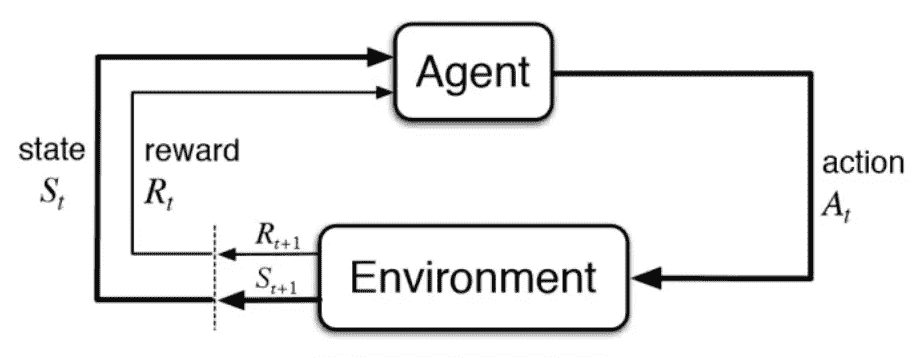

国际象棋、围棋和松木带有一个知道如何操作的模拟器

AlphaGo、AlphaGo Zero、AlphaZero 和 MuZero 的算法家族通过使用**规划**扩展了这一框架，如下图所示:

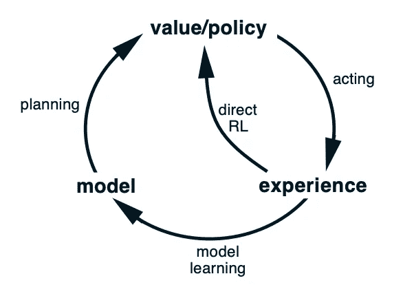

整合规划扩展了强化学习问题的框架

DeepMind 的 AlphaGo、AlphaGo Zero 和 AlphaZero 利用了(动作、状态)→下一个状态的完美模型，以**蒙特卡罗树搜索(MCTS)** 的形式进行前瞻规划。MCTS 是使用深度神经网络进行策略映射和价值估计的完美补充，因为它平均了这些函数近似的误差。MCTS 为 AlphaZero 在国际象棋、围棋和围棋方面提供了巨大的推动力，在那里你可以做**完美的规划**，因为你有一个完美的环境模型。

穆泽罗通过学习下面描述的动力学模型，提供了一种挽救 MCTS 计划的方法:

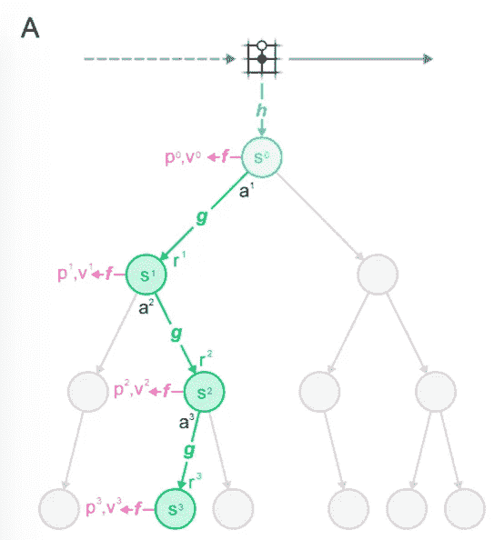

穆泽罗的蒙特卡洛树搜索

MuZero 的基于模型的强化学习方法，具有从(s，a)→(s’，r)的参数模型图，在于它**没有精确地重建 s’**处的像素空间。与 Ha 和 Schmidhuber 的“世界模型”中的图片形成对比:

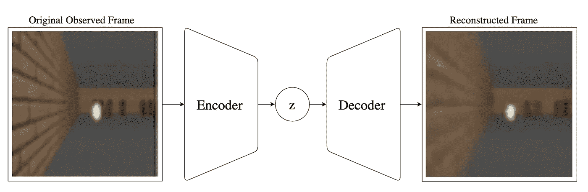

基于模型的 RL 在模型中重建像素空间的例子。图片来自:[https://worldmodels.github.io/](https://worldmodels.github.io/)

MuZero 的这种规划算法在 Atari 领域非常成功，在强化学习问题上有巨大的应用潜力。本文将解释 AlphaGo、AlphaGoZero、AlphaZero 和 MuZero 的发展，以便更好地理解 MuZero 的工作方式。如果你感兴趣，我还制作了一个视频来解释这一点:

# AlphaGo

AlphaGo 是该系列的第一篇论文，表明深度神经网络可以通过预测**策略**(从状态到行动的映射)和**价值估计**(从给定状态获胜的概率)来玩围棋。这些策略和值网络用于通过选择从给定状态采取哪些动作以及哪些状态值得进一步探索来增强基于树的前瞻搜索。

AlphaGo 使用 4 个深度卷积神经网络，3 个策略网络和一个价值网络。策略网络中的 2 个使用专家移动的**监督学习**进行训练。

监督学习描述了由某种 L(y '，y)组成的损失函数。在这种情况下，y’是策略网络从给定状态预测的动作，而 y 是专家玩家在该状态下已经采取的动作。

首次展示策略是一个较小的神经网络，它也接受较小的输入状态表示。因此，与高容量网络相比，首次展示策略具有明显较低的专家移动建模准确度。然而，首次展示策略网络的推理时间(对给定状态的动作进行预测的时间)是 2 微秒，相比之下，大型网络的推理时间是 3 毫秒，这使得它对于蒙特卡罗树搜索模拟非常有用。

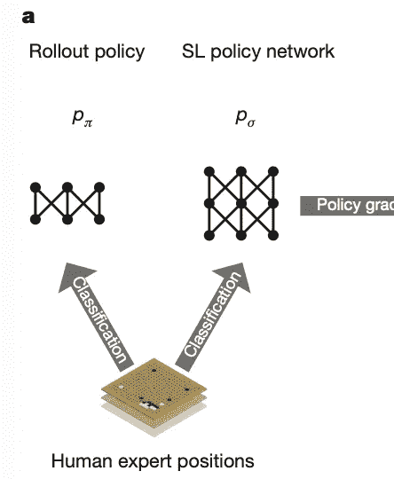

S1 策略网络用于初始化第三策略网络，该第三策略网络通过自播放和策略梯度来训练。与学习价值函数然后使策略相对于价值函数贪婪的其他 RL 算法相比，策略梯度描述了直接相对于结果奖励优化策略的思想。策略梯度训练的策略网络与其自身参数的先前迭代进行对抗，优化其参数以选择导致胜利的移动。**自玩数据集**随后用于训练价值网络，以从给定状态预测游戏的赢家。

AlphaGo 最后的主力是 MCTS 政策和价值网络的结合，如下图所示:

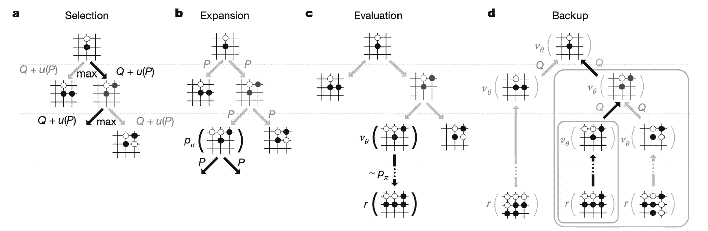

MCTS 的想法是执行前瞻搜索，以更好地估计要立即采取的行动。这是通过从一个根节点(棋盘的当前状态)开始，通过选择一个动作来扩展该节点，并对状态“动作转换”产生的后续状态重复这一操作来完成的。MCTS 基于这个 **Q + u(P)** 项来选择沿着树的哪个边，这个项是价值网络对状态的估计、策略网络给予该状态的原始概率密度、以及该节点被访问过多少次的负加权的加权组合，因为这被一次又一次地重复。AlphaGo 的独特之处在于使用首次展示策略模拟来平均价值网络的贡献。首次展示策略将一直模拟，直到导致成功或失败的情节与带有额外参数 lambda 的该状态的价值函数估计相混合。

# AlphaGo Zero

AlphaGo Zero 通过使 AlphaGo 算法更加通用，并从**“零”人类知识**出发，显著改进了 AlphaGo 算法。AlphaGo Zero 避免了专家走法初始化的监督学习，并将值和策略网络结合到单个神经网络中。与 AlphaGo 中更简单的卷积网络相比，这个神经网络也是按比例放大的，以利用一个 **ResNet** 。执行值和策略映射的 ResNet 的贡献在下图中是显而易见的，该图比较了双重任务 ResNet 和独立任务 CNN:

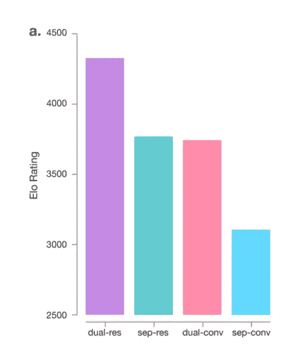

AlphaGo Zero 最有趣的特征之一是它使用 MCTS 发现的动作分布来训练其策略网络的方式，如下所示:

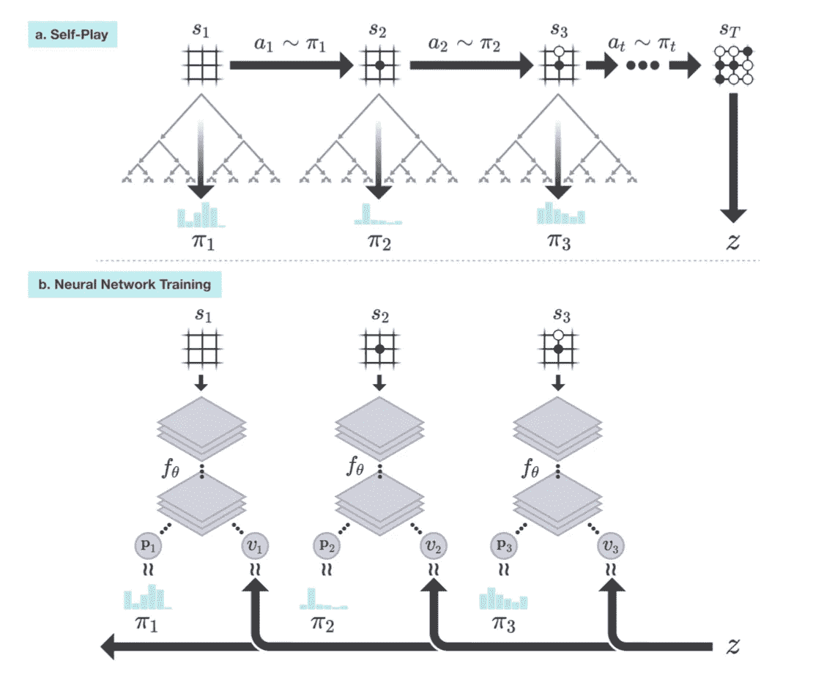

MCTS 通过将其用作监督来训练策略网络，以更新策略网络。这是一个聪明的想法，因为与政策网络从状态到行动的即时映射相比，MCTS 通过前瞻搜索产生了更好的行动分布。

# 阿尔法零

AlphaZero 是将 AlphaGo 家族推广到围棋之外的第一步，着眼于下棋和下日本象棋所需的变化。这需要公式化残差神经网络的**输入状态和输出动作**表示。

在 AlphaGo 中，状态表示使用一些手工制作的特征平面，如下所示:

AlphaGo Zero 使用一种更通用的表示法，简单地传入两个玩家的前 8 个棋子位置和一个二元特征平面，告诉代理它正在控制哪个玩家，如下所示:

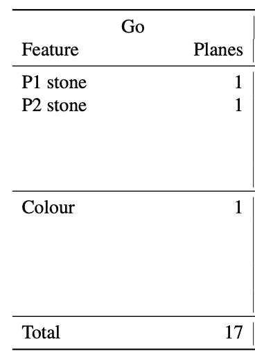

AlphaZero 使用类似的思想对 Chess 和 Shogi 的输入状态表示进行编码，如下所示:

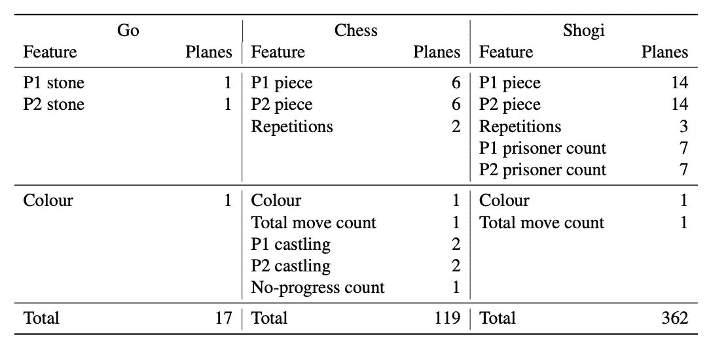

AlphaZero 还对算法进行了一些更微妙的改变，例如自玩冠军的加冕方式，以及取消围棋棋盘游戏中的数据增强，如反射和旋转。

# 穆泽罗

这就把我们带到了这个系列目前最先进的，MuZero。MuZero 对算法提出了一个非常强大的概括，允许它在没有完美模拟器的情况下学习**。国际象棋、象棋和围棋都是带有完美模拟器的游戏，如果你将你的棋子向前移动 2 个位置，你就能确切地知道棋盘的最终状态。在 OpenAI 的魔方手这种复杂灵巧的操控任务中，对给定关节施加 30 N 的力就不能说是一回事了。**

下图说明了 MuZero 的主要观点:

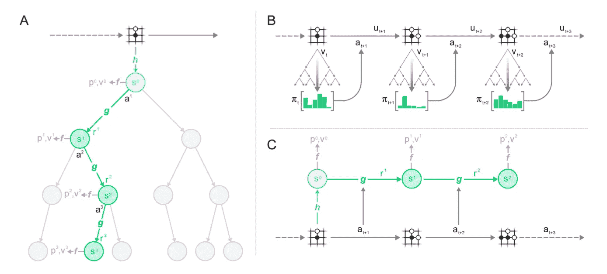

图 A 示出了使用**表示函数 h** 将原始观察值映射到用于基于树的规划的隐藏状态 s0 的流水线。在 MuZero 中，组合的价值/政策网络在这个**隐藏状态空间**中推理，因此不是将原始观察映射到行动或价值估计，而是将这些隐藏状态作为输入。**动态函数 g** 学习从隐藏状态和动作映射到未来的隐藏状态。

图表 B 示出了如何通过模仿由 MCTS 产生的动作分布来类似地训练策略网络，该动作分布首先在 AlphaGo Zero 中引入。

图表 C 显示了这个系统是如何被训练的。三个神经网络中的每一个都在价值网络和实际回报之间的差异、动态模型经历和预测的中间回报之间的差异以及 MCTS 行动分布和政策映射之间的差异的**联合优化**中被训练。

**如何在这个优化循环中训练表示函数 h？**

表示函数 h 通过**随时间的反向传播**在该联合优化方程中发挥作用。比方说，您正在计算 MCTS 行动分布 pi(s1)和策略分布 p(s1)之间的差值。p(s1)的输出是 p(g(s0，a1))的一个结果，p(g(h(raw_input)，a1))的一个结果。这也是时间反向传播将更新信号一路发送回隐藏表示函数的方式。

# alpha go→alpha go Zero→alpha Zero→MuZero

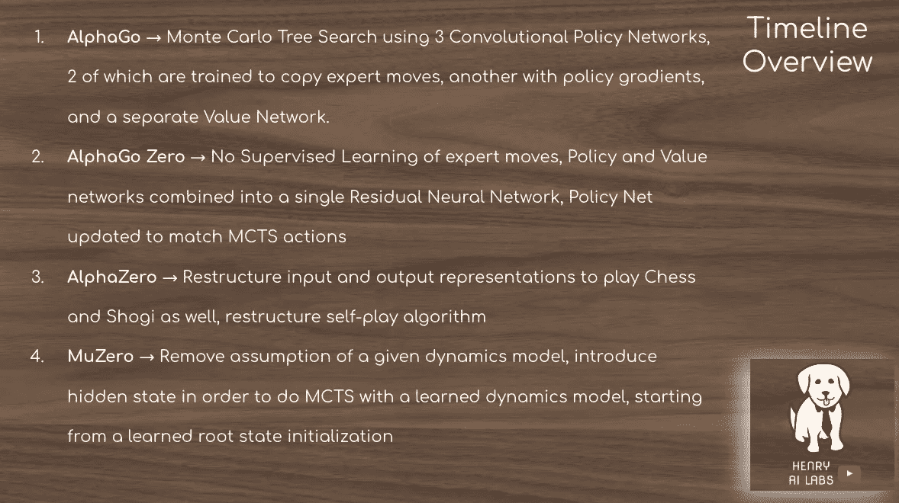

我希望这篇文章有助于澄清 MuZero 如何在以前的算法 AlphaGo、AlphaGo Zero 和 AlphaZero 的上下文中工作！感谢阅读！

# 纸质链接

alpha go:[https://www.nature.com/articles/natur...](https://www.youtube.com/redirect?q=https%3A%2F%2Fwww.nature.com%2Farticles%2Fnature16961&v=A0HX8BgckFI&event=video_description&redir_token=xWFupkVllJha70MV9mB5IiYg3Gt8MTU3OTM3NDk0NEAxNTc5Mjg4NTQ0)

AlphaGo 零分:[https://www.nature.com/articles/natur...](https://www.youtube.com/redirect?q=https%3A%2F%2Fwww.nature.com%2Farticles%2Fnature16961&v=A0HX8BgckFI&event=video_description&redir_token=xWFupkVllJha70MV9mB5IiYg3Gt8MTU3OTM3NDk0NEAxNTc5Mjg4NTQ0)

阿尔法零:https://arxiv.org/abs/1712.01815

穆泽罗:https://arxiv.org/abs/1911.08265

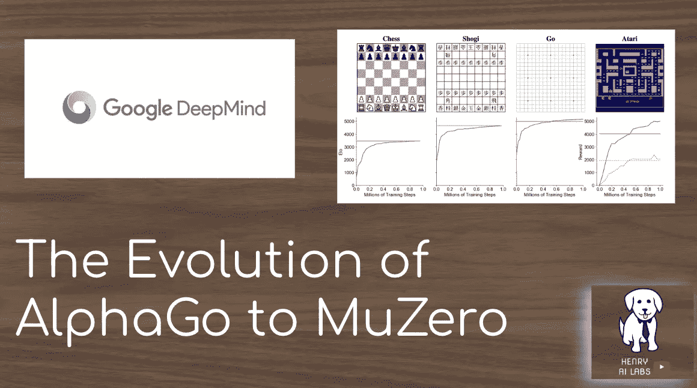