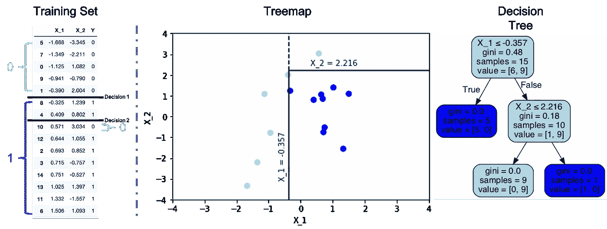
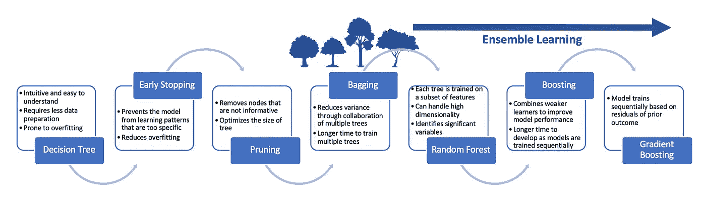
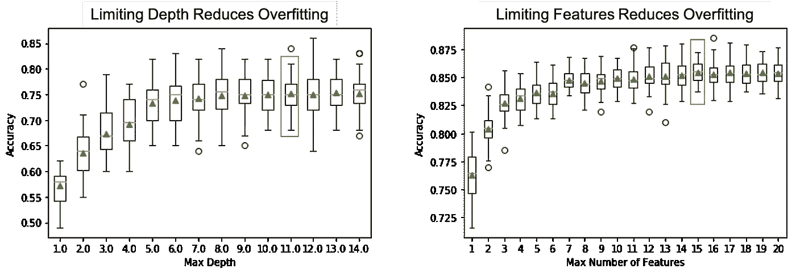
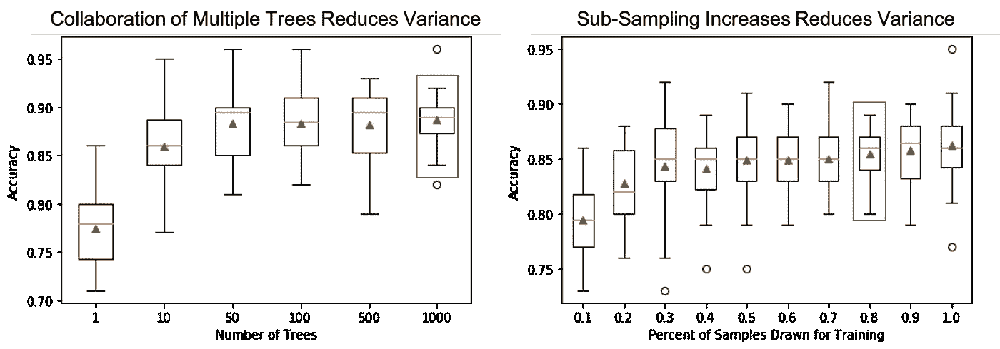
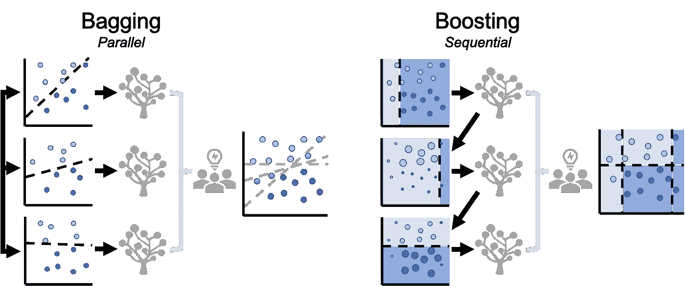

# 基于树的分类模型的演变

> 原文：<https://towardsdatascience.com/the-evolution-of-trees-based-classification-models-cb40912c8b35?source=collection_archive---------25----------------------->

充分利用决策树

*<你可以在这里找到用于演示***>*的代码*

***基于树的分类模型**是一种**监督的**机器学习算法，它使用一系列条件语句将训练数据划分为子集。每一次连续的分裂都会增加模型的复杂性，这可以用来进行预测。最终结果模型可以被视为描述数据集的逻辑测试路线图。决策树对于中小型数据集很流行，因为它们易于实现，甚至更易于解释。然而，它们并非没有挑战。在本文中，我们将强调基于树的分类模型的优点和缺点，以及克服它们的进展。*

**

*照片由 [chrilejarazu](https://unsplash.com/@chrislejarazu) 在[上拍摄](https://unsplash.com/photos/08wxrVv5rp8)*

## *决策树的构造*

*以下示例描述了一个只有两个要素和两个类的样本数据集(左)。决策树算法从**根**节点中的所有 15 个数据点开始。该节点被称为**不纯的**，因为它包含异构数据的混合。在每个决策节点，该算法在杂质减少最多的**目标特征**上分割数据集，最终产生具有同质数据的**叶节点** / **终端节点**(右图)。有几个比较流行的衡量杂质的指标——[**基尼杂质**](https://en.wikipedia.org/wiki/Decision_tree_learning#Gini_impurity) 和 [**熵**](https://en.wikipedia.org/wiki/Entropy_(information_theory)) 。虽然不同的决策树实现在计算中使用的杂质度量会有所不同，但总的概念是相同的，并且结果在实践中很少发生实质性变化。划分过程继续进行，直到不能再进行进一步的分离，例如，模型希望达到每个叶节点尽可能快地变成纯的状态。在进行预测时，新的数据点会遍历一系列决策节点以得出决定。*

**

*简单决策树的可视化*

## *强项*

*   *它们是直观的和容易理解的的**，甚至对于非分析背景的人来说也是如此。***
*   *决策树是一种**非参数**方法，不要求数据集遵循正态分布。*
*   *它们能够容忍数据质量问题和异常值，例如，它们**需要较少的数据准备**，如实施前的缩放和标准化。此外，它适用于分类变量和连续变量。*
*   *它们可以在数据探索阶段用于快速**识别重要变量**。*

## ***挑战***

*   *决策树容易出现**过拟合**，当函数过于接近训练数据时就会出现这种情况(参见 [**偏差-方差权衡**](https://en.wikipedia.org/wiki/Bias%E2%80%93variance_tradeoff) )。当决策树模型学习到训练数据中的粒度细节和噪声，以至于削弱了它对新数据进行预测的能力时，就会出现这种情况。创建一个过于复杂的模型**有可能**对以前没有见过的数据做出糟糕的预测。*
*   *决策树遭受高**方差**。如果数据集很小，根据训练和测试样本的拆分方式，结果可能会有很大不同。*

# *进化*

*最近，为了进一步挖掘基于树的模型的潜力，已经进行了大量的改进和验证。以下流程记录了进度:*

**

*基于树的模型的演变*

## *提前停止(预修剪)*

*有几种方法可以减少过度拟合，防止模型学习过于具体和复杂的模式。*

*   *节点分割的最小样本*
*   *树的最大深度*
*   *分割时要考虑的最大特征数*

*因为很难提前知道什么时候停止种树。可能需要一些迭代来微调这些**超参数**。建议在训练时可视化树，从较低的 max_depth 开始，迭代增加。*

**

*使用 CV 对包含 20 个特征的样本数据集进行测试*

## *修剪(修剪后)*

*修剪通过删除对模型的预测能力没有好处的叶节点来进行。这是简化模型和防止过度拟合的另一种方法。在现实中，一个完全成长的决策树可能有太多的分支，最终成为冗余的。剪枝通常是在模型建立后，通过检查模型在验证或测试数据集上的性能来完成的。通过删除对性能产生最小负面影响的节点，这一过程被称为**成本复杂性修剪，** it **降低了复杂性**，并允许模型**更好地概括**。*

## *引导聚集*

*Bagging 是一种**集成**技术，用于**通过考虑来自多个决策树模型的结果来减少预测的方差**，这些决策树模型是在同一数据集的不同**子样本**上训练的。当数据大小有限制时，这尤其有用。根据问题，使用平均值、中值或众数组合所有模型的预测。*

**

*使用 CV 对包含 20 个特征的样本数据集进行测试*

## *随机森林*

*随机森林是一种集成学习方法，使用不同的**特征子集**构建多个树模型，有或没有采样(即引导)。它可以有效地处理具有许多变量的**高维**数据集，因为只有一个子集用于构建单独的树。限制每个树模型的特征数量的直觉是去除它们之间的**相关性**，这发生在强预测器被决策节点一致使用时。高度相关模型的协作并不能有效减少结果的差异。随机森林很受欢迎，因为它是通用的，并且可以以高精度快速训练。*

> *值得注意的是，这种方法通常用于理解数据集和确定变量的重要性，因为它与解决问题有关——排除有价值的特征会导致错误增加。*

## ***助推***

*Boosting 是另一种类型的集成学习，**组合弱学习器**以实现改进的模型性能。弱学习者是预测相对较差的简单模型。boosting 的概念是按顺序训练模型，每次都试图比以前更好地拟合。一种被称为**自适应增强** (AdaBoost)的方法基于先前的结果修改数据点的权重。对于模型构建的每个后续实例，正确分类的数据点被给予较低的权重，而错误分类的数据点被给予较高的权重。较高的权重指导模型学习这些数据点的细节。最终，所有的模型都有助于做出预测。*

**

*装袋与增压*

## *梯度增强(和 XGBoost)*

*梯度增压方法更加复杂。梯度增强不是在每次模型构建迭代中调整权重，而是将后续模型与前一个模型的**残差**相匹配。这种方法有助于树木在表现不好的地方逐渐得到改善。换句话说，它迭代地提高了单棵树的精度，从而提高了整体模型的性能。梯度提升受众多**调谐参数**的影响，必须仔细考虑这些参数。当数据集中的关系**高度复杂**和**非线性**时有效。*

*e**x**treme**G**radient**Boost**ing，或简称为 XGBoost，是标准梯度增强方法的一种实现，只是增加了一些内容。首先，它使 [**正则化**](https://en.wikipedia.org/wiki/Regularization_(mathematics)#Regularization_in_statistics_and_machine_learning) 成为可能，这进一步有助于减少过度拟合。XGBoost 的开发目标是优化计算性能。由于梯度推进按顺序训练模型，因此实施起来可能会很慢。XGBoost 的一些显著特性包括**并行化**、**分布式计算**、**核外计算**和**缓存优化**。*

## *摘要*

*在本文中，我们回顾了一些宽泛的术语和技术，以改进基于树的模型。基于树的模型因其直观性而广受欢迎。理解这些机制将有助于创建基线模型。也就是说，没有免费的午餐——即使使用这些技术，调整模型仍然是一个迭代过程，以便充分优化模型性能。*