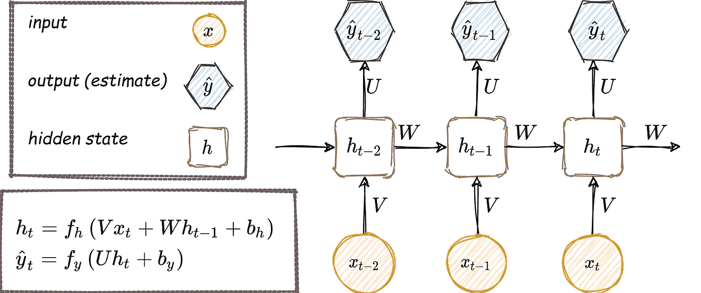
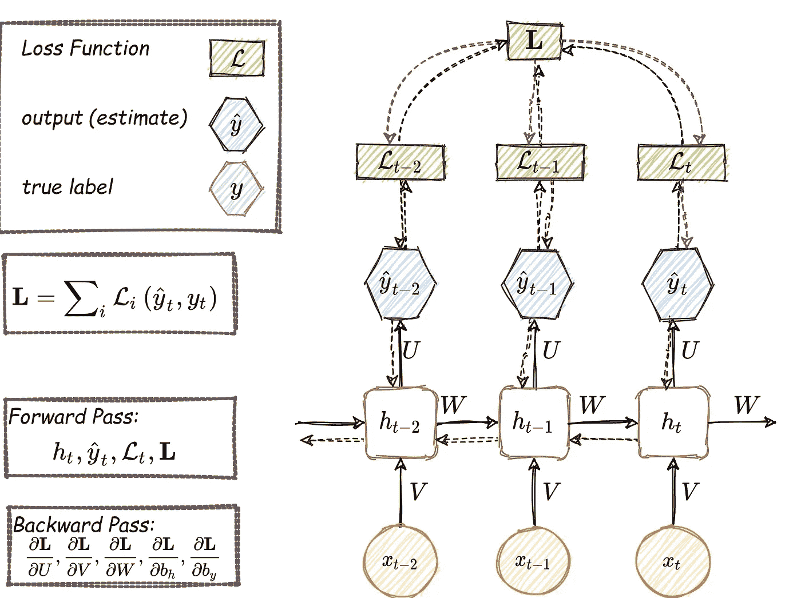
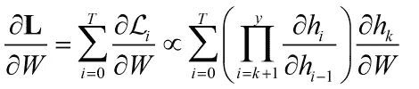
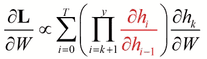
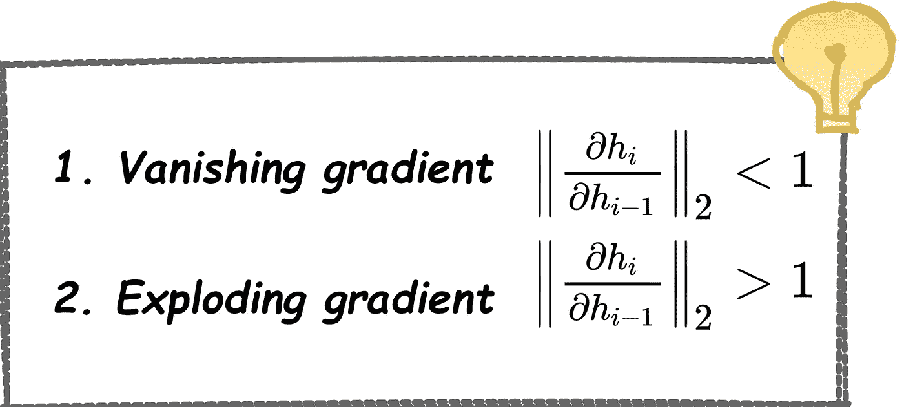
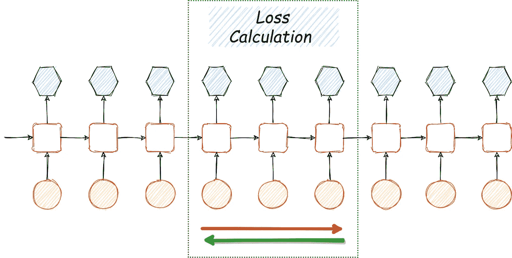
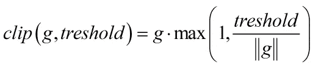
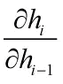
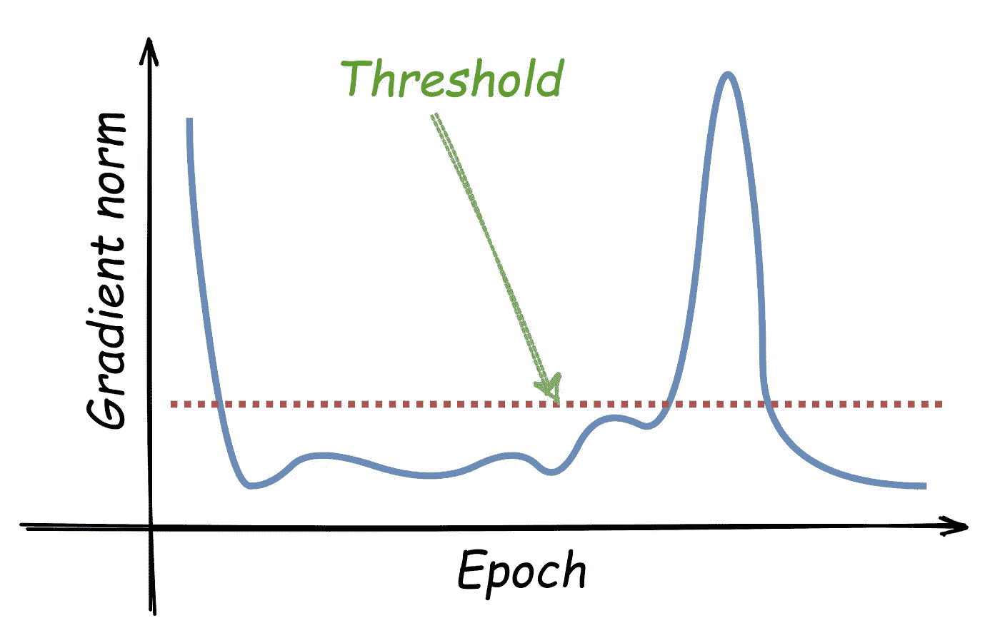

# 时间序列中的爆炸梯度和消失梯度问题

> 原文：<https://towardsdatascience.com/the-exploding-and-vanishing-gradients-problem-in-time-series-6b87d558d22?source=collection_archive---------2----------------------->

## [实践教程](https://towardsdatascience.com/tagged/hands-on-tutorials)

## 在这篇文章中，我们处理时间序列中的爆炸和消失梯度，特别是在递归神经网络(RNN)中，通过时间和梯度裁剪截断反向传播。

# 介绍

在这篇文章中，我们将重点关注顺序数据技术的深度学习。我们都熟悉这类数据。例如，文本是单词序列，视频是图像序列。更具挑战性的例子是来自时间序列数据的分支，具有诸如心率、血压等医学信息。、或金融，提供股票价格信息。深度学习时间序列任务最常见的 *AI* 方法是递归神经网络(RNNs)。使用 RNN 的动机在于解决方案对时间的概括。由于序列具有不同的长度(大多数情况下)，经典的深度学习架构(如多层感知器(MLP))不加修改就无法应用。而且，MLP 的砝码数量绝对庞大！因此，通常使用 RNN，在整个架构中共享权重。下面显示了一个简单的 RNN 架构，其中 V、W 和 U 是权重矩阵，b 是偏置向量。

作者图片

如果你不熟悉 RNN、反向传播或 MLP，请随意阅读本文末尾的参考文献[1]-[3]来填补空白。

# 穿越时间的反向传播(BPTT)

通过定义损失函数( *L* )来训练 RNN，该损失函数测量真实标签和输出之间的误差，并通过使用向前传递和向后传递来最小化该误差。下面简单的 RNN 架构总结了整个通过时间反向传播的想法。

对于单个时间步长，执行以下程序:首先，输入到达，然后通过隐藏层/状态进行处理，并计算估计的标签。在这个阶段，计算损失函数以评估真实标签和估计标签之间的差异。计算总损失函数 **L** ，并由此完成正向传递。第二部分是向后传递，在这里计算各种导数。

作者图片

RNN 的训练并不简单，因为我们通过层和时间反向传播梯度**。因此，在每个时间步中，我们必须将所有之前的贡献相加，直到当前贡献，如下式所示:**

作者图片

在该等式中，计算时间步长 **k** 处的状态对时间步长 T = T**T5 处的整个损失函数 **L、**的梯度的贡献。训练期间的挑战在于隐藏状态的比率:**

# 消失和爆炸梯度问题

时间序列数据反向传播过程中出现的两个常见问题是梯度的消失和爆炸。上面的等式有两个问题:

作者图片

在第一种情况下，这一项以指数形式快速趋向于零，这使得学习一些长周期相关性变得困难。这个问题叫做*消失渐变*。在第二种情况下，这一项以指数方式快速趋近于无穷大，由于过程不稳定，它们的值变成了 NaN。这个问题叫做*爆炸梯度*。在接下来的两节中，我们将回顾处理这些问题的两种方法。

# 随时间截断反向传播(截断 BPTT)。

下面的“技巧”试图通过在训练过程中考虑移动窗口来克服消失梯度问题。众所周知，在反向传播训练方案中，通过**整个序列**有一个正向传递和一个反向传递来计算损失和梯度。通过采用一个窗口，我们还从训练持续时间方面提高了训练性能——我们简化了它。

这个窗口被称为“*块*”。在反向传播过程中，我们向前和向后运行这个特定大小的块，而不是整个序列。

作者图片

截断的 BPTT 比简单的 BPTT 要快得多，也不太复杂，因为我们不需要从远处的步骤做梯度的贡献。这种方法的缺点是，在训练过程中不会教授大于组块长度的依赖性。另一个缺点是消失梯度的检测。通过观察学习曲线，人们可以假设梯度消失，但是，也许任务本身是困难的。

对于消失梯度问题，已经提出了许多其他方法，仅举几个例子:

1.  使用 ReLU 激活功能。
2.  长短期记忆(LSTM)架构，其中遗忘门可能有所帮助。

3.用正交矩阵初始化权重矩阵， **W** ，，并在整个训练中使用它(正交矩阵的乘法不会爆炸或消失)。

# 渐变剪辑

将 **g** 视为损失函数相对于所有网络参数的梯度。现在，定义一些**阈值**，并在训练过程的后台运行以下剪辑条件。这是一个非常简单且非常有效的条件。

通过应用渐变裁剪，我们不会改变渐变的方向，而只是改变它的大小。由于隐藏状态( **h)** 导数是引起爆炸渐变的部分，它足以剪辑下面的实体:

***阈值*** 是设计者需要手动定义的关键参数。我们的目标是通过查看梯度范数的曲线来选择解决爆炸梯度问题的最高阈值:

作者图片

# 摘要

在这篇文章中，我们探讨了简单的 RNN 建筑中渐变的消失和爆炸问题。这两个问题属于机器学习中的开放问题，这方面的研究非常活跃。讨论了截断 BPTT 和梯度裁剪方法，并给出了一些实现技巧。

# 关于作者

Barak 获得了以色列理工学院的航空工程学士学位(2016 年)、硕士学位(2018 年)以及经济和管理学士学位(2016 年，成绩优异)。他曾在高通工作(2019-2020)，在那里他主要研究机器学习和信号处理算法。巴拉克目前正在海法大学攻读博士学位。他的研究兴趣包括传感器融合、导航、深度学习和估计理论。

[www.barakor.com](http://www.barakor.com/)

[https://www.linkedin.com/in/barakor/](https://www.linkedin.com/in/barakor/)

# 参考资料和进一步阅读

[1] [对多层感知器的理解(MLP)](https://medium.com/@AI_with_Kain/understanding-of-multilayer-perceptron-mlp-8f179c4a135f) 。[尼廷·库马尔·凯恩](https://medium.com/@AI_with_Kain?source=post_page-----8f179c4a135f--------------------------------)，中等。2018.

[2] [了解神经网络。从神经元到 RNN、CNN 和深度学习](https://medium.com/@AI_with_Kain/understanding-of-multilayer-perceptron-mlp-8f179c4a135f)。维博·尼甘，中等。2018.

反向传播非常简单。谁让它变得复杂了？ [普拉卡什杰伊](https://medium.com/@14prakash?source=post_page-----97b794c97e5c--------------------------------)，中等。2017.

[4]张，京兆，等.“为什么梯度裁剪加速训练:适应性的理论辩护” *arXiv 预印本 arXiv:1905.11881* (2019)。

[5]陈，向毅，志伟，洪."理解私人 SGD 中的渐变剪辑:几何透视."arXiv 预印本 arXiv:2006.15429 (2020)。

**[6]帕斯卡努，拉兹万，托马斯·米科洛夫，约舒阿·本吉奥。"关于训练递归神经网络的难度."*机器学习国际会议*。2013.**

[7] Ribeiro，António H .等人，“超越爆炸和消失梯度:使用吸引子和平滑度分析 RNN 训练”人工智能与统计国际会议。2020.