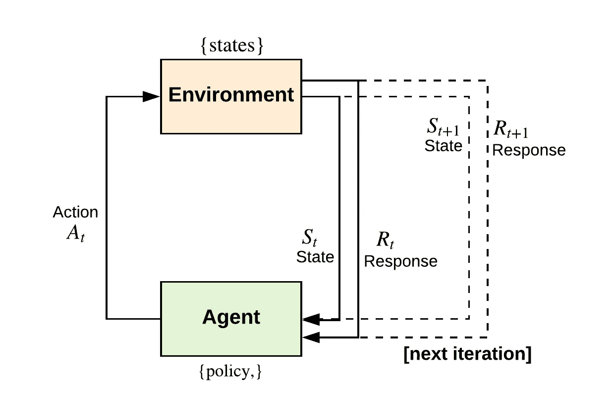
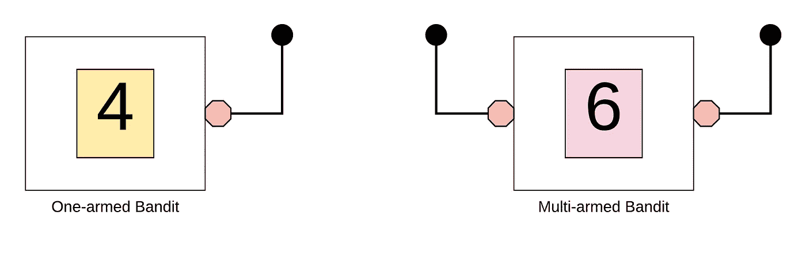

# 勘探-开发权衡

> 原文：<https://towardsdatascience.com/the-exploration-exploitation-trade-off-7bc369027ba1?source=collection_archive---------35----------------------->

## 强化学习导论

探索和开发的思想是设计一个**便利的**强化学习系统的核心。“权宜”一词是一个从学习自动机理论改编的术语，指的是一个系统，其中代理(或自动机)学习随机环境的动力学。换句话说，代理人学习了一个在随机环境中制定行动的策略，这个策略比纯粹的机会要好。

在训练代理人在随机环境中学习时，探索和开发的挑战会立即出现。当代理在反馈框架中与环境交互时，它接收奖励。为了最大化其回报，代理人通常会重复过去尝试过的产生“有利”回报的行为。但是，为了找到这些导致奖励的行为，代理必须从一组行为中进行抽样，并尝试以前没有选择的不同行为。请注意这个想法是如何从行为心理学的“效果法则”中很好地发展而来的，在行为心理学中，一个代理人加强了对产生回报的行为的心理联系。这样做时，代理还必须尝试以前未选择的动作；否则，它将无法发现更好的行动。

**强化学习反馈框架。**一个智能体反复地与环境交互，并学习一个从环境中获取最大长期回报的策略。

探索是指代理人为了获得更好的回报，不得不从一组行为中抽取行为样本。另一方面，剥削是指一个代理人利用他已经知道的东西重复行动，从而获得“有利的”长期回报。设计强化学习系统的关键挑战是平衡探索和利用之间的平衡。在一个随机的环境中，行为必须被足够好地采样以获得一个期望的回报估计。一个专门从事勘探或开发的代理人注定不会是权宜之计。它变得比纯粹的偶然性(即随机化的代理)更糟糕。

# 多武装匪徒

在多武装匪徒问题(MAB)(或 n 武装匪徒)中，代理从一组动作中做出选择。这种选择导致基于所选动作的来自环境的数字奖励。在这种特定情况下，环境的性质是一种平稳的概率分布。所谓稳定，我们是指概率分布在环境的所有状态下都是恒定的(或独立的)。换句话说，概率分布不会随着环境状态的改变而改变。在 MAB 问题中，代理人的目标是在特定时期内从环境中获得最大的回报。

MAB 问题是“独臂强盗”问题的延伸，它被表示为赌场中的老虎机。在 MAB 的设置中，我们有多杆的，而不是单杆的老虎机。每个杠杆对应于代理可以执行的一个动作。代理的目标是从机器中进行最大化其赢得物(即奖励)的游戏。代理人必须找出最佳杠杆(探索)，然后专注于能使其回报(即回报总和)最大化的杠杆(开发)。

**左:独臂强盗。**吃角子老虎机有一个控制杆，玩的时候会返回一个数字奖励。
**右:多臂土匪。**吃角子老虎机有多个(n)分支，每个分支在玩时返回一个数字奖励。在 MAB 问题中，强化代理人必须平衡勘探和开采，以使回报最大化。

机器上的每一个动作(即杠杆)，都有一个预期的回报。如果代理人知道这个期望报酬，那么问题就变成了一个无关紧要的问题，它仅仅涉及到选择具有最高期望报酬的行动。但是，由于杠杆的预期回报是未知的，我们必须核对估计，以了解每个行动的可取性。为此，代理将不得不**探索**以获得每个动作的平均奖励。之后，它可以**利用**它的知识，选择一个预期回报最高的行动(这也称为选择贪婪行动)。正如我们所看到的，代理人必须平衡探索和开发行为，以最大化整体长期回报。

# 文献学

*   纳伦德拉，K. S .，& Thathachar，硕士(2012)。学习自动机:导论。快递公司。
*   萨顿和巴尔托(1998 年)。强化学习:导论。麻省理工出版社。

*最初发表于*[*https://ekababisong.org*](https://ekababisong.org/the-exploration-exploitation-trade-off/)*。*